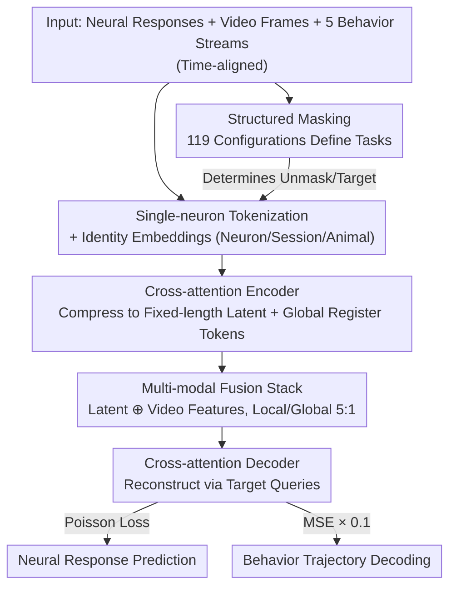

# OmniMouse: Scaling properties of multi-modal, multi-task Brain Models on 150B Neural Tokens

**Conference**: ICLR 2026  
**OpenReview**: [https://openreview.net/forum?id=mEw4lhAn0F](https://openreview.net/forum?id=mEw4lhAn0F)  
**Code**: https://github.com/enigma-brain/omnimouse  
**Area**: Computational Neuroscience / Brain Activity Modeling / Multi-modal Multi-task  
**Keywords**: Brain Foundation Models, Single-neuron tokenization, Multi-task Masking, Scaling Laws, Mouse Visual Cortex

## TL;DR
OmniMouse adopts a unified architecture with single-neuron tokens and flexible masking, jointly performing neural prediction/forecasting, behavior decoding, and stimulus encoding on over 150 billion neural tokens from 73 mouse visual cortices, achieving new SOTA results. It yields a counter-intuitive scaling conclusion: brain activity modeling is currently **data-limited** rather than parameter-limited—increasing data yields continuous gains, while model scale saturates quickly.

## Background & Motivation

**Background**: In language and vision, scaling data and parameters is the primary path to foundation models, with scaling laws (Kaplan, Chinchilla) reliably predicting performance improvements. Recently, the neuroscience community has attempted to build "foundation models" for EEG, fMRI, MEG, and single-neuron activity.

**Limitations of Prior Work**: Existing brain activity models are mostly restricted to specific interfaces—they either handle a single modality (only neural history or only stimulus), support only a single task, cannot scale across sessions/animals, or discard visual stimulus and behavioral information entirely. For instance, the NDT series (is response-to-response) lacks visual stimuli, "digital twin" systems include stimuli but lack flexibility, and POYO+ performs behavior decoding without predicting responses. No single model has unified neural activity, video stimuli, and behavior within a single architecture.

**Key Challenge**: Compared to internet-scale corpora, neural data is **small, fragmented, and lacking in diversity**—the number of neurons per session is not fixed, stimuli vary across sessions, and sampling rates differ. This raises a disputed question: whether scaling laws apply to single-neuron data. Some (Jiang et al. 2025, Ye et al. 2025) argue that gains are bottlenecked by data heterogeneity, while others (Antonello et al. 2023) believe they will not saturate. Answering this requires a unified model capable of ingesting large-scale heterogeneous data and facilitating fair multi-task comparisons.

**Goal**: (1) Develop a multi-modal multi-task architecture capable of flexibly combining neural forecasting, sub-population prediction, stimulus encoding, and behavior decoding at inference time; (2) Systematically characterize scaling behavior on one of the largest single-neuron datasets to date to determine whether data or model size is the bottleneck.

**Key Insight**: The authors bet on **single-neuron tokenization + flexible masking**. By treating each segment of activity for every neuron as an independent token (following the tokenization of POYO+/POCO), the model accommodates arbitrary neuron counts and allows for neuron-wise and time-wise masking. Tasks then reduce to different configurations of "what to mask and what to reconstruct," allowing a single model to naturally support any task combination.

**Core Idea**: Use "unified tokenization + structured masking" to consolidate multi-modal multi-task brain modeling into a scalable architecture, then use it for rigorous scaling experiments. The results show that the scaling story for brain modeling is the **opposite** of LLMs—data is the current bottleneck.

## Method

### Overall Architecture

OmniMouse takes time-aligned multi-modal data as input: neural responses (calcium imaging extracted spikes), video stimulus frames, five behavioral variables (running speed + four pupil variables), and a **masking configuration** that specifies which samples in each modality are encoded (unmasked as context) or masked (as reconstruction targets). The pipeline consists of four steps: first, tokenize the three modalities separately, removing masked tokens and constructing queries for targets; second, use a cross-attention encoder to compress variable-length neural and behavioral tokens into fixed-length latents; third, concatenate latents with video features through a multi-modal fusion transformer stack for cross-modal long-range interaction; finally, use a cross-attention decoder to reconstruct target neural responses and behavioral trajectories from the fused representation. "Tasks" are defined entirely by the masking configuration—119 structured masking configurations were used during training to cover various context combinations, enabling the model to switch flexibly to any task during testing.

### Key Designs

**1. Single-neuron Tokenization with Identity Embeddings: Enabling Arbitrary Neuron Counts and Per-neuron Masking**

The most difficult problem is that neuron counts vary across sessions, and the model must support "providing some neurons to predict others." Rather than using a global linear projection for the entire population (as in NDT), OmniMouse tokenizes segments of activity for each neuron individually. For session $i$ with $P_i$ neurons, a 1D convolution with stride is applied to calcium traces $f_{conv}: \mathbb{R}^{P_i \times S_R} \to \mathbb{R}^{P_i \times T \times D_{model}}$, yielding $T = \lfloor (S-w_R)/s_R \rfloor + 1$ tokens per neuron. Each token is then superimposed with learnable **identity embeddings** representing Neuron ID, Session ID, and Animal ID, combined after linear projection from separate embedding tables (fixed dimension $D_{embed}=128$): $ID = W_u E_u(N_i) + W_s E_s(i) + W_a E_a(i)$, resulting in $Z_R = \text{Flatten}(X_R + ID)$. Consequently, each token carries metadata about which neuron, mouse, and session it belongs to. Masking simply involves removing tokens from the sequence and using the identity embeddings of target tokens as queries for reconstruction. The fixed embedding dimension of 128 is intentional: it decouples the per-neuron parameter count from the model backbone dimension, preventing parameter explosion as the model scales.

**2. Dual-axis Structured Masking: Unifying "Tasks" into Reconstruction Targets**

OmniMouse expresses all tasks through a common language: masking. For neural responses, it defines a shared prediction target (the last 1 second of 3072 random neurons) and varies the visible context along two axes: **population context** (activity of other non-target neurons at the same time) and **causal context** (historical activity of all neurons). These axes can overlap, forcing the model to interpolate along both the population and temporal dimensions. For video, a visible frame interval is defined, supporting forecasting or stimulus encoding. For behavior, it is either provided entirely as context or masked entirely as a decoding target. With 119 such configurations during training, tasks like "forecasting," "sub-population prediction," "stimulus encoding," and "behavior decoding" are essentially just the same model running under different masks, ready for plug-and-play at test time. A detailed gap of 5 samples is left between causal context and targets to prevent labels leaking through upsampling.

**3. Multi-modal Fusion with Local Window Attention and Global Register Tokens: Efficiency without Losing Global Context**

With many neural tokens, sequences become extremely long, making full attention computationally prohibitive. However, brain modeling requires cross-modal, long-range temporal interaction. OmniMouse uses local sliding window attention in three stages—assigning each query and token a local temporal window based on its modality and masking attention between non-overlapping windows. The encoder uses cross-attention to compress variable-length inputs into $M \times N$ fixed-length latents ($M$ unique queries repeated at $N$ uniform timestamps). To avoid information bottlenecks in large populations, $M$ is larger than in previous works. To preserve global information and avoid attention sinks, $G$ **global register tokens** are appended to attend to the entire key sequence. In the fusion stack, "local window layers" and "global unmasked layers" are interleaved at a **5:1** ratio—most layers favor local computation efficiency, while periodic fully-connected layers enable cross-modal long-range interaction. All transformer layers use 1D-RoPE based on token timestamps to encode relative timing.

**4. Dual-objective Weighted Training + Warmup-stable-decay for Dense Checkpoints: Mapping the Scaling Curve in One Run**

The model simultaneously predicts neural responses (Poisson loss, averaged across neurons) and behavioral trajectories (MSE). The latter is scaled by 0.1 to keep its magnitude comparable to the Poisson loss, preventing objective dominance. Training follows a warmup-stable strategy (warmup followed by a long constant learning rate for at least 250k steps, with checkpoints every 20k steps). This approach serves two purposes: training to convergence while producing a series of intermediate checkpoints across different compute budgets. To plot scaling curves, each checkpoint is fine-tuned for 10k additional steps using an inverse-square-root learning rate decay to near zero. This avoids retraining from scratch for every compute budget, allowing for a dense mapping of the compute axis—the engineering foundation for systematic scaling analysis.

### Loss & Training
Neural encoding uses Poisson loss (averaged across neurons), and behavior decoding uses MSE with a weight of 0.1. Scaling experiments were conducted with end-to-end training on the full 323-session set or nested subsets (8/16/32/64 sessions). The learning rate followed a warmup $\to$ long stable $\to$ terminal inverse-sqrt decay schedule.

## Key Experimental Results

### Main Results

Using seven evaluation mice (from the SENSORIUM 2022/2023 public sets), single-trial correlation (Pearson correlation between prediction and ground truth) served as the primary metric, targeting 3072 neurons over the final 1 second. Baselines were compared across data-matched (8 sessions) and full (323 sessions) settings.

| Task | MtM | Latent(Schmidt) | CEBRA | POYO+ | OmniMouse-5M(8sess) | OmniMouse-80M(323) |
|------|-----|-----|-----|-----|-----|-----|
| Forecasting | 0.12 | — | — | — | 0.18 | **0.25** |
| Fcst + Stimulus | — | 0.18 | — | — | 0.25 | **0.34** |
| Population(n=256) | 0.07 | — | — | — | 0.25 | **0.29** |
| Pop + Stimulus | — | 0.16 | — | — | 0.27 | **0.37** |
| Behavior Decoding Avg | — | — | 0.53 | 0.55 | 0.59 | **0.77** |
| Behavior Running | — | — | 0.51 | 0.47 | 0.44 | **0.75** |

Even under data-matched conditions (5M model using 8 sessions), OmniMouse outperformed specialized baselines in nearly all tasks, demonstrating that structural advantages are independent of data scale.

| Benchmark | Track | Competition Winner | OmniMouse-80M |
|------|------|------|------|
| Sensorium 2022 | Main | 0.33 | **0.37** |
| Sensorium 2022 | Bonus | 0.45 | 0.45 |
| Sensorium 2023 | Main | 0.29 | **0.33** |
| Sensorium 2023 | Bonus | 0.22 | **0.30** |

### Ablation Study / Scaling Analysis

| Scaling Axis | Phenomenon | Interpretation |
|------|------|------|
| Model Scale (1M→300M, 323 sessions) | Neural prediction performance stalls after ~80M; loss saturates or overfits | Currently **not** parameter/compute limited |
| Data Scale (8→323 sessions) | Consistent improvement across all tasks as session count increases | Currently **data-limited** |
| Behavior Decoding | Scales smoothly with compute, slight saturation only at max scale | Scaling dynamics most resemble classic scaling laws |
| Video-conditioned Tasks | 80M model continues to improve beyond 100 sessions | Still data-limited; likely bottlenecked by stimulus diversity |

### Key Findings
- **The Core Inversion**: While large data makes parameter scaling the primary driver in NLP/CV, in the relatively simple system of the mouse visual cortex (even with 150B tokens), the model remains data-limited—scaling the model saturates quickly, while scaling data continues to help.
- **Behavior Decoding Scales Best**: It does not saturate even at the largest scale and has not fully converged, suggesting that larger capacity and longer training could yield further gains.
- **Sparse Sampling is Powerful**: High-precision models can be trained with just 60,000 neurons from 8 mice, which authors attribute to the redundancy of neural coding; further gains from data slow down, resembling the "eve of a phase change" in LLMs.
- The authors hypothesize that richer neural data might unlock qualitative shifts in brain model capabilities, similar to emergence in LLMs.

## Highlights & Insights
- **Reducing "Tasks" to "Masking Configurations"**: 119 structured masks allow a single model to combine forecasting, population prediction, stimulus encoding, and behavior decoding during inference. This unified language is the elegant core of the work.
- **Fixed Identity Embedding Dimension + Decoupled Projection**: Decoupling per-neuron parameters from the backbone dimension is the key engineering choice that allows scaling to 3 million neurons without being weighed down by per-neuron parameters—a method transferable to any scenario where entity count grows with data.
- **Warmup-stable-decay for Dense Checkpoints**: Mapping the scaling curve compute axis with a single training run via multi-point annealing is a highly practical trick for scaling research.
- Most strikingly, the study uses the largest experimental scale to date to provide an answer opposite to the mainstream AI narrative, moving the needle toward "invest in data" for brain modeling.

## Limitations & Future Work
- **Linear Parameter Growth with Neurons**: Because per-neuron embeddings are learned, training becomes expensive as the neuron count increases, potentially limiting expansion to even larger datasets.
- **Poor Interpretability**: Large transformers are difficult to interpret and prone to over-parameterization, limiting the biological insights that can be extracted.
- **Behavioral Data Limitations**: The data only covers spontaneous activity; generalizability to complex behaviors remains unknown.
- **Insufficient Stimulus Diversity**: The fact that video tasks remain unsaturated at large data scales suggests that stimulus "quality" (diversity) might be as much of a bottleneck as "quantity."
- **Outlook**: Scaling to stimulus decoding, electrophysiology, cross-species data, and more modalities, while refined study of multi-modal multi-task training dynamics to optimize masking recipes.

## Related Work & Insights
- **vs. NDT / MtM (response-to-response)**: These predict neural history without visual stimuli; OmniMouse unifies stimuli and behavior and supports arbitrary masking, leading in forecasting/population tasks (e.g., 0.12→0.25 in Forecasting).
- **vs. POYO+ / POCO**: This work adopts their tokenization but POYO+ only does behavior decoding and POCO works at a smaller scale (<90k neurons); OmniMouse scales to 3M neurons and integrates neural prediction with behavior decoding.
- **vs. NEDS (Zhang 2025)**: NEDS is multi-task but uses ~30k neurons and lacks visual stimuli; OmniMouse is an order of magnitude larger in data and modal coverage.
- **vs. Schmidt et al. 2025 (latent brain state)**: Similarly conditioned on neural + video, but OmniMouse can train across video boundaries and combine contexts flexibly, performing stronger on stimulus-related tasks.
- **vs. Scaling Law Works**: This paper provides stronger evidence for the "data-limited" side of the single-neuron scaling debate through the largest experiments to date.

## Rating
- Novelty: ⭐⭐⭐⭐⭐ Unified masking architecture + counter-intuitive scaling conclusions are substantial advancements.
- Experimental Thoroughness: ⭐⭐⭐⭐⭐ Dual scaling (model/data) + 6-task comparison + double Sensorium championships.
- Writing Quality: ⭐⭐⭐⭐ Architecture and masking are clear; scaling conclusions are compelling; some hyperparameter details are in appendices.
- Value: ⭐⭐⭐⭐⭐ Provides a directional answer to the "data vs. compute" investment in brain modeling and open-sources code and data.

<!-- RELATED:START -->

## Related Papers

- [\[ICLR 2026\] PoinnCARE: Hyperbolic Multi-Modal Learning for Enzyme Classification](poinncare_hyperbolic_multi-modal_learning_for_enzyme_classification.md)
- [\[ICLR 2026\] Coupled Transformer Autoencoder for Disentangling Multi-Region Neural Latent Dynamics](coupled_transformer_autoencoder_for_disentangling_multi-region_neural_latent_dyn.md)
- [\[ICLR 2026\] Riemannian High-Order Pooling for Brain Foundation Models](riemannian_high-order_pooling_for_brain_foundation_models.md)
- [\[ICLR 2026\] Hierarchical Multi-Scale Molecular Conformer Generation](hierarchical_multi-scale_molecular_conformer_generation.md)
- [\[ICLR 2026\] DriftLite: Lightweight Drift Control for Inference-Time Scaling of Diffusion Models](driftlite_lightweight_drift_control_for_inference-time_scaling_of_diffusion_mode.md)

<!-- RELATED:END -->
