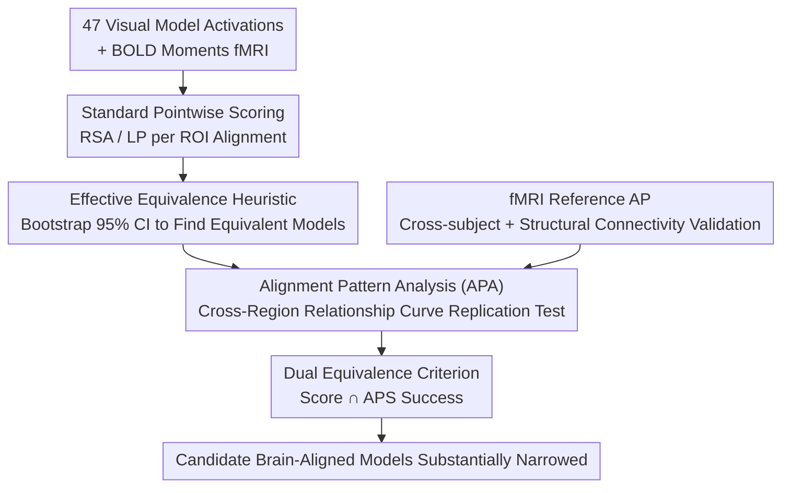

# Only Brains Align with Brains: Cross-Region Alignment Patterns Expose Limits of Normative Models

**Conference**: ICLR 2026  
**OpenReview**: [https://openreview.net/forum?id=cMGJcHHI7d](https://openreview.net/forum?id=cMGJcHHI7d)  
**Code**: https://github.com/bethgelab/alignment-pattern-analysis  
**Area**: Computational Neuroscience / NeuroAI / Model-Brain Alignment  
**Keywords**: Brain alignment benchmarks, Visual cortex, fMRI, Representational similarity, Discriminability  

## TL;DR
The authors point out that existing "model-brain alignment" benchmarks only perform pointwise (ROI-layer) scoring and suffer from extremely low discriminability (where many architecturally diverse visual models have indistinguishable scores). They propose **Alignment Pattern Analysis (APA)**—mapping the alignment of each brain region relative to all other brain regions as a "fingerprint" curve. This requires models not only to achieve high scores on individual ROIs but also to replicate this cross-regional relationship curve. Results reveal that even top-ranked models like V-JEPA 2 fail to match these patterns, highlighting that "high alignment scores $\neq$ truly brain-like."

## Background & Motivation
**Background**: Over the past decade, the neuroscience and computer vision communities have popularized using "alignment benchmarks" to compare artificial and biological visual systems. The standard practice involves comparing intermediate layer activations of various visual models (ResNet, CLIP, video Transformers, etc.) with visual cortex fMRI data using metrics like RSA (Representational Similarity Analysis) or LP (Linear Predictability) to rank models. This is used to infer which "training data/objectives/architectures" are "biologically relevant," as exemplified by Brain-Score and Algonauts.

**Limitations of Prior Work**: The credibility of these rankings relies on an implicit assumption: that differences in alignment scores truly reflect differences in "brain-likeness." However, recent work has found that: (1) different alignment metrics yield contradictory rankings; (2) models with vastly different architectures, objectives, and modalities achieve nearly identical alignment scores, suggesting existing benchmarks **lack discriminability**; and (3) these inferences are mostly correlational rather than causal.

**Key Challenge**: The root cause is that existing alignment relies on **pointwise comparison**—asking "how similar is a model layer to a specific ROI?" This is a highly underdetermined constraint. A model can be an excellent **prediction tool** (capable of linearly predicting responses) without possessing the underlying **computational mechanism** of that brain region. Pointwise scores fail to distinguish between "useful tools" and "computationally brain-like models."

**Goal**: To provide a stricter, quantifiable criterion for whether a model is "brain-aligned," specifically designed to differentiate between models that appear indistinguishable by pointwise scores.

**Key Insight**: The authors build upon the NeuroAI Turing Test (which considers a model brain-aligned if it matches the degree to which one brain aligns with another) but upgrade it from "pointwise scores" to "**relational structure**." The intuition is that each brain region possesses a stable and specific functional relationship relative to all other regions (e.g., V1 should not linearly predict high-level visual areas well because features become increasingly complex along the hierarchy). This set of relationships is stable across subjects and serves as an ideal reference.

**Core Idea**: Define the vector of "alignment scores of a single ROI relative to all other ROIs" as that region's **alignment pattern (AP)**. A model is only considered truly aligned if it not only meets the score threshold for the target ROI but also **replicates this cross-regional relationship curve**—representing a "second-order structural consistency" test.

## Method

### Overall Architecture
The method utilizes the BOLD Moments video fMRI dataset (10 subjects viewing 1000+ 3-second clips), focusing on ROIs from the Glasser HCP-MMP atlas, including early visual areas (V1/V2/V3), dorsal stream/MT+, and ventral stream. The pipeline consists of three stages: first, using a **standard benchmark pipeline** to score 47 pretrained visual models and verify the "lack of discriminability"; second, using an **effective equivalence heuristic** to identify models with scores statistically indistinguishable from the top model; and finally, using **APA** as a relational criterion to re-examine these "apparently equivalent" models. The core shift is from "one score for a model layer vs. one ROI" to "one score curve for a model layer relative to all ROIs vs. a reference curve for the brain region."

### Key Designs

**1. Alignment Pattern (AP): Upgrading "One Score" to a "Cross-Region Relationship Curve"**

Addressing the underdetermination and low discriminability of pointwise alignment, the authors represent alignment not as a scalar but as a vector. An alignment pattern $\alpha(\phi_p,\Psi_t)$ for a predictive feature space $\phi_p$ (brain activity or model activation) relative to $N$ target brain regions $\Psi_t=[\psi_t^1,\dots,\psi_t^N]$ is defined as:

$$\alpha(\phi_p,\Psi_t)=[M(\phi_p,\psi_t^1),\,M(\phi_p,\psi_t^2),\,\dots,\,M(\phi_p,\psi_t^N)]$$

where $M$ is any alignment metric (RSA or LP). When $\phi_p$ is derived from brain activity, it yields an **fMRI-derived AP**; when derived from model layer $\phi_m^l$, it yields a **model-derived AP**. This curve characterizes the "relational profile of a region/layer relative to the entire visual cortex," capturing significantly more structural information than pointwise scores.

**2. fMRI Reference AP and Structural Connectivity Validation: Proving the Curve as a "Fingerprint"**

For the AP to serve as a reference, it must be stable across subjects and distinct across regions. The authors use a leave-one-subject-out approach to estimate the reference. To further prove this is not an artifact of fMRI noise, they use an **entirely independent modality**—white matter structural connectivity matrices $C=(c_{r,t})$ from 1065 subjects—to construct structural connectivity-derived APs. The high similarity between the two (especially in early visual areas like V1/V2/V3) anchors the AP to real anatomical relationships.

**3. Effective Equivalence Heuristic: Objectively Identifying "Apparent" Ties**

To demonstrate that APA has higher discriminability, the authors first establish that models are indeed indistinguishable pointwise. They use bootstrapping over 10 subjects to generate a distribution of mean alignment scores and 95% confidence intervals. If a model's empirical mean falls within the 95% CI of the top-ranked model, it is deemed **effectively equivalent**. Most ROIs show a cluster of such equivalent models (V-JEPA 2, CLIP, VGG-Transformer), quantifying the lack of discriminability in standard benchmarks.

**4. APA Dual Equivalence Criterion: Differentiating Equivalent Models via Relationship Curves**

The equivalence heuristic is applied across two dimensions: for a model to be "truly aligned" to an ROI, it must fall within the top model's 95% CI for both the **alignment score** and the **APS** (Alignment Pattern Similarity, the correlation between the model AP and fMRI reference AP). Key findings include: (i) no model matches the human-to-human APS level; (ii) the highest-scoring models often do not have the highest APS—V-JEPA, for instance, ranks high in scores but low in APS. Applying this dual criterion significantly narrows the pool of candidate models.

### Loss & Training
This is an evaluation/methodological study and does not involve training new models. For the 47 pretrained models, activations from up to 15 blocks were extracted. Image models were processed frame-by-frame, while video models/VGGT were processed over 3s intervals and time-averaged. Dimensions were reduced to 5919 using sparse random projection (Johnson-Lindenstrauss lemma, $\epsilon=0.1$). Alignment used RSA (Pearson correlation of RDMs) and LP (RidgeCV, 5-fold, $R^2$ on test sets).

## Key Experimental Results

### Main Results
Evaluation of 47 SOTA visual models (26 Taskonomy models, supervised/self-supervised image models, CLIP, supervised/unsupervised video models, VGGT) on human visual cortex alignment in BOLD Moments:

| Setting | Phenomenon | Implication |
|------|------|------|
| RSA / LP Pointwise Ranking | V-JEPA 2 family generally highest, followed by CLIP and VGG-Transformer | Diverse architectures/objectives cluster at the top |
| Effective Equivalence (95% CI) | Most ROIs have a group of models equivalent to the top model | Standard benchmarks **lack discriminability** |
| NeuroAI Turing Test Reference | Top models reach or exceed brain-to-brain alignment in LP | LP is **saturated** in nearly all ROIs (shifting focus to RSA) |

### Ablation Study

| Analysis | Key Metric | Description |
|------|---------|------|
| fMRI AP Cross-Subject Consistency | APS high for same ROI, low across ROIs | AP is a stable "fingerprint" of brain regions |
| AP vs. Structural Connectivity | V1/V2/V3/V3B/V7/IPS1 significantly higher than null (FDR corrected) | AP is anchored to independent anatomical evidence |
| AP of Pointwise Equivalent Models | Equivalent models show significantly divergent APs | Relational criteria can differentiate "tied" models |
| Dual APS Criterion | Drastic reduction in candidate models; V-JEPA largely excluded | Second-order added value of APA |

### Key Findings
- **High Pointwise Scores $\neq$ High APS**: The best predictive models are often not the most relationally brain-like. V-JEPA is the prime example—it excels at prediction but fails the cross-region relationship profile.
- **No Model Passes the Relational Turing Test**: No model reaches human-level APS, indicating current models are far from true "computational mechanism" similarity.
- **Normalization Choice is Critical**: Using the "inter-subject consistency lower bound" as a reference increases discriminability, though the authors caution whether differences detected in low-alignment areas are scientifically meaningful.

## Highlights & Insights
- **Paradigm Shift from "Points" to "Relations"**: The core insight is that a brain region's identity lies in its relationship with other regions, not a single score. Upgrading alignment to "curve vs. reference curve" exposes the underdetermination of pointwise methods.
- **Cross-Modal Validation**: Using structural connectivity from 1065 subjects to validate fMRI APs grounds a functional statistic in anatomical evidence, enhancing the credibility of the AP as a "fingerprint."
- **Distinguishing "Tools" from "Models"**: The intuition that "a good V1 model shouldn't linearly predict higher visual areas" is operationalized. This can be adapted to any evaluation where predictive power is high but mechanism similarity is questionable.
- **Connection to Contravariance**: APA is interpreted as imposing additional constraints independent of task difficulty to shrink the feasible solution space, echoing the theory that more constraints lead to more brain-like implementations.

## Limitations & Future Work
- Data is limited to the BOLD Moments video fMRI dataset and one set of ROI definitions; generalizability across datasets and atlases remains to be verified.
- The choice of normalization reference (lower vs. upper bound) is debatable, and the authors acknowledge that discriminability in low-alignment regions may not always be scientifically relevant.
- APA remains a correlational relational criterion rather than a causal test; passing APA is a "stricter necessary condition" but does not equate to identical mechanisms.
- The work focuses on diagnostic tools rather than proposing how to train models to replicate APs; using APS as a training objective is a logical next step.

## Related Work & Insights
- **vs. NeuroAI Turing Test (Feather et al., 2025)**: While the original test compares **pointwise scores**, APA extends this to **relational patterns (AP)**.
- **vs. Brain Hierarchy Score (Nonaka et al., 2021)**: That work evaluates global hierarchy correspondence; APA provides finer granularity by checking the relational profile of individual layers vs. individual ROIs.
- **vs. IACT (Thobani et al., 2025)**: IACT evaluates alignment metrics themselves; APA is metric-agnostic and can be layered on top of any metric.
- **vs. Conwell et al. (2024)**: While others suggest stricter or aggregated pointwise metrics, APA provides discriminability through the new dimension of "second-order structural consistency."

## Rating
- Novelty: ⭐⭐⭐⭐⭐ Upgrading alignment from points to cross-region relationships is a clean, quantifiable, and novel criterion.
- Experimental Thoroughness: ⭐⭐⭐⭐ Solid validation across 47 models and structural connectivity, though limited to one fMRI dataset.
- Writing Quality: ⭐⭐⭐⭐⭐ Clear progression of motivation, excellent distinction between tools and models, and well-integrated formulas.
- Value: ⭐⭐⭐⭐⭐ Directly addresses a major methodological weakness in the NeuroAI community.

<!-- RELATED:START -->

## Related Papers

- [\[ICLR 2026\] Pretraining with Re-parametrized Self-Attention: Unlocking Generalization in SNN-Based Neural Decoding Across Time, Brains, and Tasks](pretraining_with_re-parametrized_self-attention_unlocking_generalizationin_snn-b.md)
- [\[ICLR 2026\] Align Your Structures: Generating Trajectories with Structure Pretraining for Molecular Dynamics](align_your_structures_generating_trajectories_with_structure_pretraining_for_mol.md)
- [\[ICLR 2026\] Coupled Transformer Autoencoder for Disentangling Multi-Region Neural Latent Dynamics](coupled_transformer_autoencoder_for_disentangling_multi-region_neural_latent_dyn.md)
- [\[ICLR 2026\] Diffusion Alignment as Variational Expectation-Maximization](diffusion_alignment_as_variational_expectation-maximization.md)
- [\[ICLR 2026\] Fast and Interpretable Protein Substructure Alignment via Optimal Transport](fast_and_interpretable_protein_substructure_alignment_via_optimal_transport.md)

<!-- RELATED:END -->
