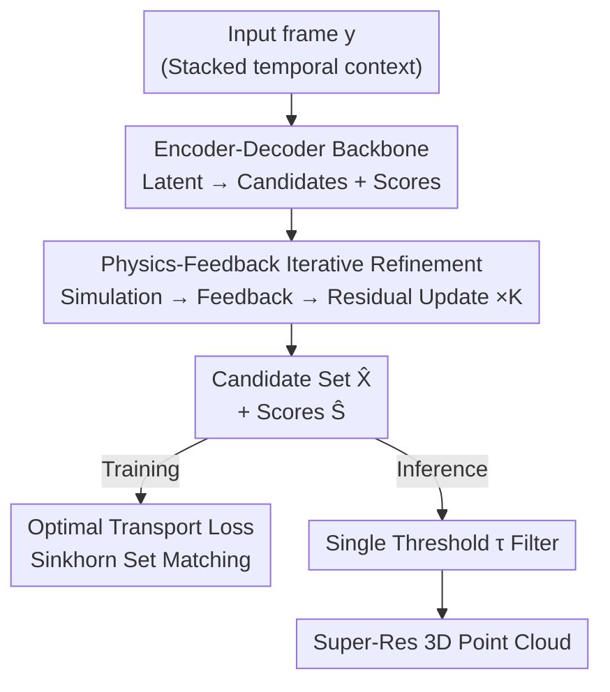

# Optimal Transport Unlocks End-to-End Learning for Single-Molecule Localization

**Conference**: ICLR 2026  
**OpenReview**: [https://openreview.net/forum?id=V1i58pZmp3](https://openreview.net/forum?id=V1i58pZmp3)  
**Code**: https://github.com/RSLLES/SHOT  
**Area**: Computational Biology / Super-resolution Microscopy / Optimal Transport  
**Keywords**: Single-Molecule Localization Microscopy (SMLM), Optimal Transport, Set Matching, Iterative Refinement, End-to-End Learning

## TL;DR
To address the dependency of deep learning-based Single-Molecule Localization Microscopy (SMLM) on non-differentiable NMS in high-density scenarios, this paper reformulates the training objective as a set matching problem between "predicted emitters" and "ground truth." By utilizing entropy-regularized Optimal Transport (Sinkhorn) to construct a differentiable loss, the authors completely replace NMS. Coupled with an iterative refinement network that incorporates microscope imaging physics as feedback, the method achieves new SOTA performance on both synthetic benchmarks and real biological data in medium-to-high density regions.

## Background & Motivation

**Background**: Fluorescence microscopy is limited by the optical diffraction limit, restricting resolution to approximately half the wavelength of light ($\approx 200$ nm). SMLM breaks this diffraction limit by exploiting the stochastic blinking of fluorophores—where only a sparse subset emits light in each frame—to detect and locate individual molecules with sub-pixel precision and accumulate thousands of frames into a super-resolved 3D point cloud.

**Limitations of Prior Work**: SMLM typically requires at most one emitting molecule within a diffraction-limited region. This forces extremely low activation densities, requiring thousands of frames for a single structure—making live-cell dynamic imaging difficult. Increasing density leads to overlapping emitters, introducing numerical ambiguity and resolution degradation. Existing deep learning methods (e.g., DECODE, LiteLoc) can handle higher densities but predict pixel-wise detection maps that rely on NMS variants for binarization, which use thresholds to suppress noise and avoid merging adjacent emitters.

**Key Challenge**: The authors identify three fundamental issues with this framework. First, pixel-wise losses cannot represent "multiple emitters within one pixel." Second, the two goals of NMS (suppressing false peaks vs. separating adjacent points) are inherently in conflict, especially as higher densities increase co-activation probability. Third, the two manual thresholds make the precision-recall trade-off difficult to tune. Most critically, NMS is non-differentiable, preventing end-to-end optimization of the model for detection.

**Goal**: Remove NMS, make detection decisions differentiable and end-to-end trainable, and maintain precision under high-density conditions.

**Key Insight**: Supervised learning in SMLM is essentially a one-to-one matching problem between the predicted set of points and the ground truth set—a problem solved in object detection by the DETR family using bipartite matching. By treating fluorophores as "objects," Optimal Transport (OT) theory becomes a naturally fitting tool.

**Core Idea**: Replace pixel-wise losses and NMS with an entropy-regularized OT loss, formulating training as differentiable set matching. Only a single threshold is used at inference to filter candidates, supported by a backbone featuring an iterative refinement network embedded with microscope imaging physics.

## Method

### Overall Architecture
The network $f_\theta$ receives an observed image frame $y$ (typically stacked with adjacent frames as $3\times H\times W$ for context) and outputs a fixed number of candidate emitters $\hat{X}=\{\hat{x}_i\}$ (where $d=HW/4$) and their respective detection scores $\hat{S}=\{\hat{s}_i\in(0,1)\}$. Each emitter is a 4D vector $x=(x,y,z,n)$ representing spatial coordinates and photon counts. The backbone is an encoder-decoder with $K$ iterative refinement steps: at each step, an expected frame $\hat{y}$ is reconstructed from the current candidates using a known imaging physics model. This $\hat{y}$ is encoded and fed back to a refinement module $R$ to update latent representations for error correction. During training, an OT loss is computed between the final output $(\hat{X}^{(K)},\hat{S}^{(K)})$ and ground truth $X$. During inference, candidates with scores exceeding a single threshold $\tau$ are retained.

### Key Designs

**1. Physics-Feedback Iterative Refinement: Imaging Model as Visual Feedback**

Predicting all emitters in one forward pass lacks a verification signal. Drawing from iterative refinement in optical flow estimation, the authors utilize the known imaging physics of SMLM (PSF convolution + noise model). Specifically, the encoder $E$ maps $y$ to $z^{(0)}$, and decoder $D$ outputs $(\hat{X}, \hat{S})$. At each step $k$, an imaging model $P(\cdot)$ reconstructs $\hat{y}^{(k)}=E[P(\hat{X}^{(k)},\hat{S}^{(k)})]$. This is compared with the input to update the latent representation: $z^{(k+1)}=z^{(k)}+R(z^{(k)},\hat{z}^{(k)},z^{(0)})$. This allows the model to "see" what it has already explained and fix errors. $K=2$ is used in practice.

**2. Optimal Transport Loss: Differentiable Set Matching via Sinkhorn**

To enable training against a "set vs. set" objective, the authors construct a $d\times d$ cost matrix $C=L+D$. The localization term $L_{i,j}=(\hat{x}_i-x_j)^T\Sigma^{-1}(\hat{x}_i-x_j)+\log\det(\Sigma)$ uses a learnable diagonal weight $\Sigma=\mathrm{diag}(\sigma_x^2,\sigma_y^2,\sigma_z^2,\sigma_n^2)$ to automatically balance prediction difficulty across dimensions. The detection term $D_{i,j}$ uses binary cross-entropy ($-\log(s_i)$ for matches, $-\log(1-s_i)$ for non-matches). The OT cost is:

$$\min_{\Gamma\in B}\ \langle\Gamma\,|\,C\rangle_F,\qquad B=\{\Gamma\in\mathbb{R}_+^{d\times d}\mid \Gamma\mathbf{1}_d=\Gamma^\top\mathbf{1}_d=\mathbf{1}_d\}.$$

To keep this differentiable, entropy regularization is added: $\Gamma^*=\arg\min_\Gamma \langle\Gamma|C\rangle_F-\epsilon H(\Gamma)$. This $\Gamma^*$ is solved efficiently via Sinkhorn iterations, making the entire pipeline differentiable and removing the need for pixel-wise assignments or NMS.

**3. Single-Threshold Inference: Simplifying Precision-Recall Tuning**

After removing NMS, inference simply involves retaining candidates $\hat{X}^{(K)}$ whose scores $\hat{s}_i$ exceed $\tau \in [0,1]$. This collapses the precision-recall trade-off into a single interpretable scalar, which is more robust to dynamic imaging conditions than multi-threshold NMS.

### Loss & Training
The OT loss is computed on the final refinement step. Synthetic data uses 10–30 emitters per frame with uniformly distributed coordinates to avoid specific spatial priors. The encoders and refinement modules are 2-layer U-Nets (48 channels, SiLU + LayerNorm); the decoder is a lightweight CNN. Models are trained with AdamW for 100k steps (batch 128) on a single H100 for approximately 20 hours.

## Key Experimental Results

### Main Results (EPFL 2016 Synthetic Benchmark, density in activations/µm/frame)
Compared against 3D-DAOSTORM, DECODE, and LiteLoc across 4 densities and multiple SNR levels. Ours achieves slightly lower recall but significantly higher precision and the lowest RMSE across spatial dimensions, leading in E3D scores.

| Density / SNR | Method | Jaccard ↑ | RMSElat ↓ | RMSEax ↓ | E3D ↑ |
|--------|------|------|------|------|------|
| 2.0 / High | DECODE | 0.876 | 32.2 | 33.0 | 0.706 |
| 2.0 / High | LiteLoc | 0.858 | 30.7 | 36.0 | 0.699 |
| 2.0 / High | **Ours** | **0.883** | **24.8** | **28.4** | **0.750** |
| 8.0 / Low | LiteLoc | 0.338 | 76.1 | 110.1 | 0.055 |
| 8.0 / Low | **Ours** | **0.374** | **74.3** | **99.4** | **0.103** |

$E_{3D}=(E_{ax}+E_{lat})/2$ evaluates overall detection and localization quality.

### Main Results (Real Data: FRC lower is better / RSP higher is better)
Time-binning was used to simulate high density on Tubulin and NPC datasets. Ours consistently leads as density increases.

| Dataset | Binning | Method | FRC (nm) ↓ | RSP ↑ |
|--------|------|------|------|------|
| NPC-Nup96 | ×32 | LiteLoc | 71.5 | 0.671 |
| NPC-Nup96 | ×32 | **Ours** | **44.2** | **0.689** |
| NPC-Nup107 | ×16 | LiteLoc | 25.9 | 0.682 |
| NPC-Nup107 | ×16 | **Ours** | **22.1** | **0.684** |

### Ablation Study (EPFL Synthetic, High SNR, Density 2.0)

| Iterative Arch | OT Loss | Jaccard ↑ | RMSEvol ↓ | E3D ↑ |
|------|------|------|------|------|
| ✗ | ✗ | 0.876 | 47.9 | 0.705 |
| ✗ | ✓ | 0.867 | 39.6 | 0.740 |
| ✓ | ✗ | 0.854 | 45.4 | 0.703 |
| ✓ | ✓ | **0.883** | **39.2** | **0.750** |

### Key Findings
- **OT Loss is the primary contributor**: Adding OT loss alone improves E3D from 0.705 to 0.740 and significantly reduces RMSE. The iterative architecture provides a smaller, additive gain.
- **Learnable $\Sigma$**: After training, $\sigma_z^2 \approx 2\sigma_{x,y}^2$, which aligns with optical theory regarding the anisotropy of the PSF in confocal/fluorescence microscopy.
- The relative advantage of this method grows with activation density, confirming the benefit of replacing NMS.

## Highlights & Insights
- **Formulating SMLM as Set Matching**: This links SMLM directly to mature bipartite matching techniques (DETR/OT), naturally enabling end-to-end learning and removing NMS.
- **Physics as Feedback**: Incorporating the acquisition model into the iteration loop provides domain priors without sacrificing differentiability.
- **Explainable Parameter**: The single threshold $\tau$ offers a direct, interpretable knob for precision-recall balance, which is highly practical for researchers dealing with drifting experimental conditions.

## Limitations & Future Work
- **Computational Overhead**: Iterative designs and Sinkhorn iterations make training and inference slower (though inference still reaches ~200 fps).
- **PSF Calibration**: The method depends on accurate PSF calibration (e.g., using fluorescent beads), a common limitation among top-tier methods.
- **Recall Bias**: The method tends to favor precision over recall; while this leads to "cleaner" reconstructions, it may not be ideal for all biological downstream tasks.

## Related Work & Insights
- **vs. DECODE / LiteLoc**: These use pixel-wise maps and dual-threshold NMS; Ours uses OT set matching and single-threshold filtering for better high-density performance.
- **vs. DeepLoco**: While DeepLoco uses sets, it relies on Maximum Mean Discrepancy (MMD). This work adopts the more statistically grounded OT framework with learnable weights.
- **vs. DETR**: Shares the concept of bipartite matching but replaces Transformers with CNNs and handles thousands of "objects" (molecules) per frame.

## Rating
- Novelty: ⭐⭐⭐⭐⭐ An elegant reformulation of SMLM as an OT set matching problem.
- Experimental Thoroughness: ⭐⭐⭐⭐ Extensive synthetic and real data tests, though real high-density tests use time-binning as a proxy.
- Writing Quality: ⭐⭐⭐⭐ Clear mapping between identified challenges and proposed solutions.
- Value: ⭐⭐⭐⭐ High potential for advancing live-cell super-resolution imaging; code is open-source.

<!-- RELATED:START -->

## Related Papers

- [\[ICLR 2026\] KGOT: Unified Knowledge Graph and Optimal Transport Pseudo-Labeling for Molecule-Protein Interaction Prediction](kgot_unified_knowledge_graph_and_optimal_transport_pseudo-labeling_for_molecule-.md)
- [\[ICLR 2026\] Fast and Interpretable Protein Substructure Alignment via Optimal Transport](fast_and_interpretable_protein_substructure_alignment_via_optimal_transport.md)
- [\[ICCV 2025\] MolParser: End-to-end Visual Recognition of Molecule Structures in the Wild](../../ICCV2025/computational_biology/molparser_end-to-end_visual_recognition_of_molecule_structures_in_the_wild.md)
- [\[ICLR 2026\] WFR-FM: Simulation-Free Dynamic Unbalanced Optimal Transport](wfr-fm_simulation-free_dynamic_unbalanced_optimal_transport.md)
- [\[ICML 2025\] Protriever: End-to-End Differentiable Protein Homology Search for Fitness Prediction](../../ICML2025/computational_biology/protriever_end-to-end_differentiable_protein_homology_search_for_fitness_predict.md)

<!-- RELATED:END -->
