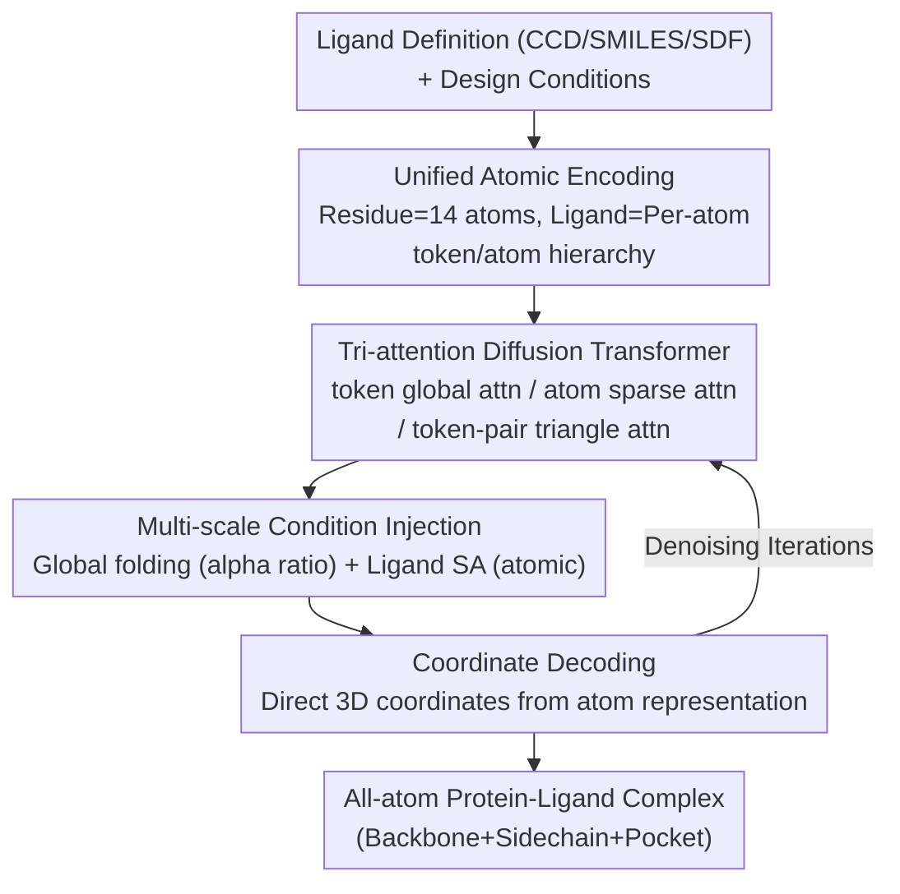

# Pallatom-Ligand: an All-Atom Diffusion Model for Designing Ligand-Binding Proteins

**Conference**: ICLR 2026  
**OpenReview**: [https://openreview.net/forum?id=uMD75SDTTA](https://openreview.net/forum?id=uMD75SDTTA)  
**Code**: https://github.com/levinthal/Pallatom-Ligand  
**Area**: Computational Biology / Protein Design / Diffusion Models  
**Keywords**: Ligand-binding proteins, all-atom diffusion, de novo protein design, conditional generation, AlphaFold3 evaluation

## TL;DR
Pallatom-Ligand utilizes an all-atom diffusion transformer to directly learn the joint distribution of all atoms in "protein + small molecule ligand" complexes. It simultaneously generates the protein backbone, side chains, and ligand pockets end-to-end, supporting programmable control over global protein folding ($\alpha/\beta$ ratio) and ligand solvent accessibility, achieving the highest in silico success rate across a comprehensive benchmark of eight ligands.

## Background & Motivation

**Background**: Enabling proteins to possess high affinity and selectivity for a specific small molecule ligand is a critical capability for biosensors, diagnostic reagents, and protein drugs. Traditional methods rely on laboratory directed evolution (random mutation + multiple rounds of screening) or physics-based computational design like Rosetta, both of which require expert biochemical intuition and are inefficient. Recently, deep learning models (RFdiffusionAA, CA RFdiffusion, RFdiffusion2) have designed functional enzymes by treating the protein backbone and ligands as SE(3) rigid-body frames.

**Limitations of Prior Work**: These three SOTA models are "backbone-only" generators—the diffusion process does not involve protein side chains, and the ligand is treated as a rigid frame. They fail to explicitly model fine-grained atom-level interactions (hydrogen bonds, electrostatics, steric complementarity) at the protein-ligand interface. Consequently, they depend on user-provided constraints (motifs, ligand orientation, relative solvent accessibility) to position the spatial configuration, and the sequence must be filled in later by an independent inverse folding model (e.g., LigandMPNN). This reliance on "expert manual priors" introduces case-by-case bias and limits generalizability, with experimental success rates significantly lower than those of ligand-free protein design.

**Key Challenge**: There is a lack of information exchange between backbone generation and interfacial atomic details. Atomic details of ligand and protein side chains should ideally refine the generation of the backbone, but the "backbone-only" paradigm architecturally severs this multi-level information flow.

**Goal**: To develop a truly end-to-end all-atom model that directly learns the joint distribution of all atoms in a complex, allowing atom-level interfacial interactions and token-level backbone generation to provide mutual feedback.

**Key Insight**: The authors' hypothesis is supported by two observations: first, atoms are the unified basic units of all molecules, and AlphaFold3 has demonstrated the power of "direct atom modeling" in biomolecular structure prediction; second, a unified architecture + end-to-end training can improve modeling precision and data efficiency under conditions of data scarcity (high-quality protein-ligand complex structures are inherently scarce).

**Core Idea**: Small molecules are represented directly by their atoms, and each amino acid residue is treated as a 14-atom "universal molecule." A ligand-aware all-atom diffusion transformer is used to perform global information exchange at both the token and atom levels, jointly generating structure and sequence in a single step.

## Method

### Overall Architecture

Pallatom-Ligand receives two types of input: the chemical definition of the small molecule ligand (CCD code, SMILES, or SDF) and design conditions (protein $\alpha/\beta$ ratio + ligand solvent accessibility). It encodes the entire complex into a "token-atom" hierarchical representation, fed into a diffusion transformer composed of three attention modules. Through iterative denoising, it directly decodes 3D coordinates from the atomic representation, resulting in an all-atom protein-ligand complex.

The key lies in its use of **two complementary representations**: the atom-level representation learns the fine-grained heterogeneity unique to each atom (treating ligand and protein atoms equally), while the token-level representation aggregates every 14 protein atoms into 1 token—while keeping each ligand atom as an individual token (deliberately amplifying interfacial interactions)—to learn coarse-grained structural features sensitive to ligand conformational changes. The three attention modules transport information between these levels: token-level global attention handles overall folding, atom-level sparse attention manages local interfaces, and the two refine each other via token $\leftrightarrow$ atom transformations.

### Key Designs

**1. Unified Atomic Representation: Residues as 14-atom Universal Molecules**

Addressing the fundamental pain point that "backbone-only models cannot express ligand and side-chain atomic details," this work abandons the hybrid representation of "protein as residue frames + ligand as rigid bodies" in favor of a unified pure-atom encoding. The $l$ atoms of the small molecule ligand directly encode chemical complexity and connectivity at the atomic level; each amino acid residue is modeled as a universal chemical entity containing 14 atoms following the Pallatom atom14 scheme. Thus, a complex with $L$ residues and $l$ ligand atoms is unified into a chemical system of $14L + l$ atoms. Atomic features are initialized with element types and partial charges. In this representation, ligands and proteins are treated as equal entities, allowing the model to learn atomic complementarity at the interface directly without relying on user-provided spatial constraints. At the token level, every 14 protein atoms are aggregated into 1 token, while each ligand atom occupies its own token, concentrating attention on the protein-ligand interface.

**2. Tri-attention Diffusion Transformer: Dual-level Information Exchange**

To allow atom-level interfacial interactions to inform token-level backbone generation, a unified representation is insufficient; an architecture that facilitates dialogue between levels is required. Built upon Pallatom and restructured according to DiT philosophy, the transformer block consists of three core modules: **token-level global attention** updates token representations $a$ and secondary structure conditions, using token pair features $z$ as attention bias and AdaLN controlled by time embedding $t$ for normalization, then injects information into atom representations $q$ ($q = q + \text{Layernorm}(a_{tok\to atom})$); **atom-level block-sparse attention** operates directly on atom representations $q$, using atom pair features $p$ as bias and ligand SA/time embeddings as conditions, then aggregates features back to the token level via SegmentMean ($a = a + \text{Layernorm}(\text{SegmentMean}(q))$); **token-pair triangle attention** injects distance information between residue center atoms (encoded via RBF $z_{rbf} = \text{Linear}(\text{dist}(r_{center}))$) into pair representations. Finally, 3D coordinates $r$ are decoded directly from the updated atom representation $q$. This bidirectional "token $\to$ atom $\to$ token" loop allows global folding and local interfaces to refine each other—ablation studies show all three components are indispensable.

**3. Multi-scale Conditional Control: $\alpha$ Ratio for Global Folding, Ligand SA for Atomic Accessibility**

Traditional generative models often favor all-$\alpha$ helical structures, lacking fold diversity, whereas real protein function depends on varied $\alpha/\beta$ compositions. Leveraging the modular architecture, conditions are injected at two scales. Globally, an **$\alpha$ ratio** is introduced—defined as the number of $\alpha$-helical residues divided by the total $(\alpha + \beta)$ residues. Values from 0–1 are discretized into "mainly $\beta$ (0–0.2) / mixed $\alpha/\beta$ (0.2–0.8) / mainly $\alpha$ (0.8–1)" and injected via token-level concatenated self-attention, enabling controllable exploration of fold space. At the atomic scale, **Ligand Solvent Accessibility (SA)** is introduced—using relative solvent accessibility (RSA) to discretize each ligand atom into "fully buried (0–0.1) / partially buried (0.1–1.0) / fully exposed (1.0)" categories. These are used as learnable embeddings concatenated to ligand atom representations, allowing control over which ligand atoms are buried in the pocket or exposed, which is vital for biosensors and drug applications.

**4. Dual-Objective Sampling Strength: Learning Folding and Interfaces Simultaneously**

High-quality protein-ligand structural data is not only scarce but also extremely imbalanced: some ligands only co-occur with specific folds, while some folds bind various ligands. Standard sampling exacerbates this—clustering only by protein structure causes ligand frequency imbalance, while clustering only by interface leads to model collapse and homogeneous generated structures. This work uses **dual-objective training**: Mode (i) learns folding by sampling from structural clusters with sequence/spatial cropping to preserve global context; Mode (ii) learns interaction by sampling from ligand clusters and cropping only the local region around the ligand. The two modes are mixed at a **1:1** ratio to ensure every ligand is sampled equally without oversampling specific folds. Hierarchical dropout is applied: $\alpha$ conditions are provided with $p=0.5$; Ligand SA uses two levels—$p=0.5$ for total dropout, $p=0.25$ for providing all ligand labels, and $p=0.25$ for a random subset (each atom independently included at $p=0.5$).

### Loss & Training

The model employs a diffusion framework where training involves denoising corrupted all-atom coordinates. The core strategy includes dual-objective data sampling (fold vs. interface, 1:1 ratio) and hierarchical conditional dropout. The former addresses data sparsity and distribution imbalance, allowing generalization to rare ligands; the latter enables $\alpha$ ratio and Ligand SA conditions to be combined arbitrarily or omitted, achieving controllable yet non-mandatory conditional generation.

## Key Experimental Results

### Main Results

Benchmarks were conducted on eight chemically diverse small molecules (covering different sizes, opposite charges, and hydrophobic groups). 100 structures were generated per method/target, sequences designed via LigandMPNN, and evaluated using AlphaFold3 metrics. The authors defined three progressive success criteria: Protein-Fold Success ($C\alpha$-RMSD < 2 Å and protein-pLDDT > 80), Ligand-Pocket Success (adds ligand-Dcenter < 4 Å and ligand-pLDDT > 80), and Ligand-Pose Success (adds ligand-RMSD < 2 Å).

| Method | $C\alpha$-RMSD (↓) | protein-pLDDT (↑) | ligand-RMSD (↓) | ligand-pLDDT (↑) | ipAE (↓) |
|--------|------|------|------|------|------|
| RFdiffusionAA (mpnn1) | 4.72 | 81.52 | 10.44 | 63.06 | 7.67 |
| RFdiffusion2 (mpnn1) | 3.94 | 87.02 | 7.12 | 70.35 | 7.98 |
| Ours w/out SA (mpnn1) | 1.39 | 91.55 | 10.78 | 73.40 | **4.07** |
| Ours w/ SA (mpnn1) | **1.36** | 90.41 | **7.04** | 72.78 | 4.35 |

Pallatom-Ligand leads across almost all metrics for backbone quality ($C\alpha$-RMSD, protein-pLDDT) and interface quality (highest ligand-pLDDT, lowest ipAE), validating the advantages of joint all-atom modeling.

### Ablation Study

| Configuration | Fold Success | Pocket Success | Pose Success | $\alpha$% / $\beta$% |
|---------------|--------------|----------------|---------------|--------------|
| w/out cond. | 71.5% | 4.4% | 1.0% | 79.4 / 3.5 |
| $\alpha \in [0, 0.2]$ | 56.2% | 2.8% | 0.8% | 9.4 / 57.2 |
| $\alpha \in [0.2, 0.8]$ | 60.8% | 6.3% | 0.9% | 61.7 / 19.4 |
| $\alpha \in [0.8, 1.0]$ | 66.8% | 11.0% | 1.5% | 82.4 / 0.5 |
| RFdiffusion2 (mpnn1) | 58.5% | 17.5% | 3.5% | 64.5 / 14.6 |

Without conditions, the model favors all-$\alpha$ (79.4%). Given $\alpha$ conditions, it follows accurately ($\beta$ percentage rises to 57.2% for the $\beta$ setting), proving global fold control. The $\alpha \in [0.2, 0.8]$ range offers the highest diversity (0.26) and novelty (0.85).

### Key Findings

- **Tri-attention is Indispensable**: Ablation (Appendix A.16.1) shows that removing any attention module hurts generation performance, confirming that the dual-level information exchange is critical.
- **Stability-Function Trade-off Recaptured**: Forcing all ligand atoms to be buried decreases fold success but slightly improves pocket/pose success. This inverse relationship between protein stability and function is a recognized principle in protein science, which the model learned from data.
- **Balanced Generalization**: Pallatom-Ligand + LigandMPNN successfully generated in silico binders for all eight targets, whereas RFdiffusion2 failed on FAD and SAM, and RFdiffusionAA succeeded on only three.
- **Ligand SA Control is Effective**: For FMN/DOG/LDP, proteins generated with pre-defined per-atom SA labels showed SASA distributions highly consistent with design targets, indicating atomic-level accessibility control is achieved.

## Highlights & Insights

- **Unified Representation ("Residue = 14-atom molecule")**: Placing proteins and ligands in the same atomic coordinate system unifies chemical space and enables end-to-end joint generation of structure and sequence—a key step beyond the "backbone + independent inverse folding" paradigm.
- **Dual-level Bidirectional Loop**: The token $\leftrightarrow$ atom conversion allows global folding and local interfaces to refine each other, directly addressing the information severance in backbone-only models. This is transferable to any task requiring synergy between global geometry and local detail.
- **Data-driven Physical Laws**: The model's spontaneous capture of the "stability-function trade-off" suggests all-atom joint modeling grasps the physical essence of proteins rather than just fitting surface statistics.
- **Component-wise Evaluation**: Decomposing AlphaFold3 confidence into scaffold, pose, and interface allows precise identification of method strengths and weaknesses, providing clear directions for future improvement.

## Limitations & Future Work

- **Limited to Protein-Small Molecule**: The authors acknowledge the current lack of support for nucleic acid complexes, covalent binding, and non-canonical amino acids. Future work will expand naar these macromolecular assemblies.
- **Data Scale Bottleneck**: High-quality structural data remains scarce; plans involve using larger distilled datasets to push performance limits.
- **In Silico Only**: Success rates represent "consistency with AlphaFold3 predicted structures," a necessary but insufficient condition for biological activity. Wet-lab validation is pending.
- **Low Absolute Pose Success**: Even with SOTA performance, the most stringent ligand-pose success rate is around 1%, indicating that precise ligand positioning remains an open challenge. Future focus will be on refining the learning of atomic-level ligand-protein interactions.

## Related Work & Insights

- **vs RFdiffusion series**: These treat backbones and ligands as SE(3) frames, generate backbone only, rely on independent inverse folding for sequences, and need user constraints for positioning. Ours is an end-to-end all-atom generator for structure and sequence, explicitly modeling interface interactions with superior generalization.
- **vs Pallatom**: This work uses Pallatom's atom14 representation as a foundation but replaces the original traversing mechanism with a modern transformer and extends it with tri-attention and multi-scale conditions for ligand design.
- **vs All-atom methods (LaProteina, etc.)**: Other methods use "sequence-centric" or "structure-centric" approaches for ligand-free co-generation. This work focuses on the joint distribution of complexes and treats ligands as atomic entities equal to proteins.

## Rating
- Novelty: ⭐⭐⭐⭐⭐ First truly end-to-end ligand-aware all-atom diffusion model; unified representation + dual-level exchange is a paradigm shift.
- Experimental Thoroughness: ⭐⭐⭐⭐ Comprehensive 8-target benchmark + dual-condition validation + component-wise metrics, though lacking wet-lab data and absolute pose success is low.
- Writing Quality: ⭐⭐⭐⭐⭐ Clear derivation of motivation, specific architecture and condition strategies, and rigorous evaluation protocols.
- Value: ⭐⭐⭐⭐⭐ Directly serves design of biosensors and drugs; unified framework can extrapolate to broader biomolecular systems.

<!-- RELATED:START -->

## Related Papers

- [\[ICLR 2026\] Towards All-atom Foundation Models for Biomolecular Binding Affinity Prediction](towards_all-atom_foundation_models_for_biomolecular_binding_affinity_prediction.md)
- [\[ICLR 2026\] h-MINT: Modeling Pocket-Ligand Binding with Hierarchical Molecular Interaction Network](h-mint_modeling_pocket-ligand_binding_with_hierarchical_molecular_interaction_ne.md)
- [\[ICLR 2026\] PepTri: Physical, Evolutionary, and Mutual Information Tri-guided All-atom Diffusion Peptide Design](peptri_tri-guided_all-atom_diffusion_for_peptide_design_via_physics_evolution_an.md)
- [\[ICLR 2026\] BioMD: All-atom Generative Model for Biomolecular Dynamics Simulation](biomd_all-atom_generative_model_for_biomolecular_dynamics_simulation.md)
- [\[ICLR 2026\] A Diffusion Model to Shrink Proteins While Maintaining Their Function](a_diffusion_model_to_shrink_proteins_while_maintaining_their_function.md)

<!-- RELATED:END -->
