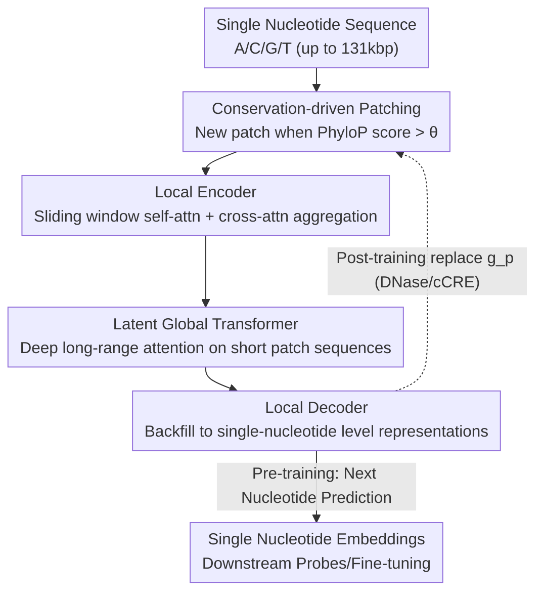

# PatchDNA: A Flexible and Biologically-Informed Alternative to Tokenization for DNA

**Conference**: ICLR 2026  
**OpenReview**: [https://openreview.net/forum?id=AFZeojzjoG](https://openreview.net/forum?id=AFZeojzjoG)  
**Code**: To be confirmed  
**Area**: Computational Biology / DNA Language Models  
**Keywords**: DNA Language Models, dynamic patching, evolutionary conservation, re-patching, long-sequence modeling

## TL;DR
PatchDNA adapts the "patching" mechanism of the Byte Latent Transformer from NLP to DNA. It uses evolutionary conservation scores (PhyloP) instead of a fixed vocabulary to determine variable-length patch boundaries and supports "re-patching" post-training. This allows models with an order of magnitude fewer parameters to outperform existing SOTA on multiple genomic benchmarks and adjust slicing strategies by downstream task or cell type without retraining.

## Background & Motivation

**Background**: DNA language models treat genomes as "four-letter languages" (A/C/G/T), using self-supervision on raw nucleotide sequences for pre-training before transferring to downstream tasks like regulatory element identification, splice site prediction, and variant effect prediction. As in NLP, the first step is to "tokenize" the sequence into input units for the model.

**Limitations of Prior Work**: DNA tokenization faces an unavoidable resolution-efficiency tradeoff, and existing methods **fix** the tokenization strategy before training:
- **Single-nucleotide level** (HyenaDNA, Caduceus, Evo2) retains maximum resolution, crucial for tasks like variant effect prediction where every base matters, but sequences are extremely long (regulatory elements can be >100kbp from target genes), creating a computational disaster for Transformers.
- **Fixed polynucleotide schemes**: k-mer (Nucleotide Transformer) cuts equal-length substrings, but small input changes drastically alter the token sequence, making it hard for models to align similar sequences; BPE (DNABERT2) merges high-frequency nucleotides, which is efficient but performs poorly on character-level tasks—yet single-nucleotide variants (SNVs) are the most critical character-level signals in DNA.
- **Learnable tokenization** (VQDNA, MxDNA) is adaptive but introduces additional training/inference overhead, does not shorten input length, and results in uninterpretable vocabularies.

**Key Challenge**: DNA simultaneously encodes fine-grained information (SNVs) and coarse-grained information (regulatory elements) **within the same region**. No fixed vocabulary can satisfy both ends of this spectrum; once the vocabulary is fixed, the flexibility to adjust granularity for different tasks or tissues is lost.

**Key Insight**: The authors noted that the Byte Latent Transformer (BLT) in NLP discards fixed vocabularies in favor of "predictive entropy" to dynamically merge bytes into variable-length patches. The authors' core insight is that **the lack of dependence on a fixed vocabulary is particularly valuable for DNA**. It allows for the retention of resolution like single nucleotides while compressing low-information regions like coarse tokens, all while enabling the integration of domain knowledge into the partitioning criteria.

**Core Idea**: Replace "tokenization" with "patching" and swap the linguistic "entropy" basis for partitioning boundaries with biological "evolutionary conservation," while allowing the partitioning strategy to remain replaceable (re-patching) post-pre-training.

## Method

### Overall Architecture

PatchDNA follows the three-stage autoregressive backbone of BLT—**a small local encoder + a deep latent global transformer + a small local decoder**—but replaces the "how to patch" step with a biologically-driven pluggable module. The input is a nucleotide sequence $x=(x_1,\dots,x_n)$; a patching function $f_p$ determines whether each position starts a new patch based on whether a scoring function $g_p$ exceeds a threshold $\theta_p$ ($b_i=1$ indicates position $i$ starts a new patch), thereby partitioning the sequence into $m$ variable-length patches. The local encoder aggregates nucleotide representations within each patch into patch representations; the global transformer performs long-range attention on the significantly shortened patch sequence (allowing for a deeper model); the local decoder then projects patch-level information back to the single-nucleotide level, outputting representations for each base and next-nucleotide prediction logits. For downstream tasks, the penultimate layer of the decoder is used as the single-nucleotide level embedding.

The three innovations of this framework are: using **conservation scores as the patching criterion**, enabling **post-training re-patching**, and expanding BLT from "short-sequence generation" to "**>100k base long-sequence representation**."

### Key Designs

**1. Conservation-driven Patching: Allocating capital to evolutionarily important regions**

BLT uses "predictive entropy" for patching, assuming that "parts of language that are harder to predict deserve more compute." The authors argue that a more reasonable signal in genomes is **evolutionary conservation**—regions preserved by natural selection tend to be functionally critical. Thus, the scoring function $g_p$ in the general patching framework is set to the **PhyloP conservation score** (from multi-species alignment, quantifying evolutionary constraints on each nucleotide), with the partitioning criterion:

$$f_p(x_{i+1}) = \begin{cases} 1 & g_p(x_i) > \theta_p \\ 0 & \text{otherwise} \end{cases}$$

During pre-training, the threshold $\theta_p$ is set to the 95th percentile of the scoring function, resulting in an average patch size of approximately 20 nucleotides. Intuitively, conserved (high-score) regions are frequently sliced to preserve fine-grained detail, while non-conserved low-information regions are merged into large patches for compression. This maintains single-base resolution while focusing Transformer attention on functionally relevant segments. In experiments, conservation-driven patching consistently outperformed entropy-based and fixed-size patching.

**2. Re-patching: Changing partitioning strategies post-training to break tokenization limits**

Once a fixed-vocabulary model is trained, its partitioning method is locked. PatchDNA's patching function depends only on $g_p$ and $\theta_p$, which are decoupled from model weights. Therefore, $g_p$ can be **directly replaced** during inference or fine-tuning without changing the architecture or retraining from scratch. This enables two use cases: when task- or tissue-specific epigenetic signals (such as DNase-seq chromatin accessibility or cCRE regulatory annotations) are available, they can serve as the new $g_p$, allowing the model to refocus its attention on the regulatory regions active in that cell type. When no biological signal is available, it can fall back to general strategies like fixed partitioning. Biological priors are thus an optional enhancement—"use them if available, but don't depend on them." This is the core of the "flexibility" mentioned in the title.

**3. Genomic Adaptation of the BLT Backbone: Single-nucleotide resolution + ultra-long sequences**

BLT was originally designed for NLP generation with a sequence limit of ~16k bytes. The authors made three adaptations for DNA: first, while BLT focuses on generation, genomic analysis requires **representation**, so they proved the decoder's single-nucleotide embeddings are effective for fine-grained tasks (e.g., base-by-base gene finding, variant effects). Second, they extended sequence length to >100k nucleotides (max 131kbp context) by using larger average patch sizes to keep FLOPs much lower than concurrent DNA models—noting that achieving similar efficiency with tokenization would require a 20-mer, resulting in an unfeasible vocabulary size of $4^{20}$. Third, they used Perceiver-style cross-attention to limit patch representations to attending only to nucleotides within their own patch, with a maximum patch size to prevent over-compression of non-conserved regions. They released two models: PatchDNA (19.2M parameters, 16kbp context) and PatchDNA-7M (7.7M parameters, 131kbp context, for fair comparison with Caduceus/HyenaDNA).

### Loss & Training
Autoregressive pre-training is performed on the human reference genome using the **next nucleotide prediction** objective, with training/validation splits following Caduceus and HyenaDNA. The pre-training threshold $\theta_p$ is set to the 95th percentile of the score function (average patch ≈ 20 nt), with a defined maximum patch size. Downstream tasks use the penultimate decoder layer embeddings for frozen linear probing or fine-tuning.

## Key Experimental Results

### Main Results

On DART-Eval (five regulatory genomics tasks), PatchDNA achieved the best overall performance (average rank 2.0). PatchDNA-Entropy ranked second, indicating that the patching/BLT architecture itself provides gains, which conservation-driven patching further amplifies:

| Model | Task1 Acc | Task2 Acc | Task3 Acc | Task4 Spearman | Task5 AUROC | Avg Rank |
|------|------|------|------|------|------|------|
| **PatchDNA** | 0.966 | **0.725** | 0.457 | 0.440 | 0.555 | **2.0** |
| PatchDNA-Entropy | 0.965 | 0.650 | 0.465 | 0.400 | 0.523 | 3.0 |
| HyenaDNA | 0.891 | 0.645 | **0.587** | 0.384 | 0.515 | 3.8 |
| GENA-LM-Large | 0.947 | 0.620 | 0.383 | **0.472** | 0.505 | 4.2 |
| NT-MS-500M | 0.745 | 0.565 | 0.420 | 0.422 | **0.566** | 4.8 |

On long-sequence CAGE gene expression prediction (114kbp context), PatchDNA-7M (7.7M parameters) significantly outperformed models of similar scale, with fine-tuning speeds over 3x faster than HyenaDNA:

| Model | Gene Pearson | Cell Pearson | Full Pearson |
|------|------|------|------|
| **PatchDNA-7M** | **0.369** | 0.771 | **0.471** |
| PatchDNA-7M + cCRE Re-patching | **0.373** | **0.792** | 0.408 |
| HyenaDNA | 0.362 | 0.745 | 0.290 |
| Caduceus-ps | 0.365 | 0.766 | 0.420 |

Furthermore, on the NT benchmark (18 classification tasks), PatchDNA achieved the highest average MCC in regulatory element and splicing categories, rivaling the NT-MS-500M model which is 25x larger. On BEND, it won 3 out of 4 tasks, and on the Genomics Long Range Benchmark, it won 6 out of 7 tasks.

### Ablation Study

| Configuration | Key Phenomenon | Explanation |
|------|---------|------|
| Conservation-driven (Full) | Systematically the best | Evolutionary signals provide the most robust general partitioning criteria |
| Entropy Patching | Second best | Validates the effectiveness of the patching architecture itself |
| Fixed-PS20 Patching | Moderately weaker | Fixed granularity sacrifices the advantage of adaptivity |
| PhyloP as input features | Weaker than "PhyloP as criteria" | Conservation should guide partitioning, not just act as a raw input feature |

Cell-type specific re-patching further validates flexibility: In CAGE prediction across K562, hepatocytes, and neurons, adding **DNase-aware re-patching** increased K562 performance from 0.754 to 0.828 and neurons from 0.799 to 0.831. Gains were maximized only when the DNase signal **matched the target tissue** (diagonal), while mismatched signals led to performance drops.

### Key Findings
- The most significant design contribution is using "conservation as the patching criterion": it consistently outperforms entropy, fixed partitioning, and using PhyloP as a feature—showing value lies in "using biological signals to guide compute allocation."
- Re-patching is an almost zero-cost source of gain: without retraining or architecture changes, simply swapping the scoring function yields significant improvements on cell-specific tasks.
- Small models beating large ones: The 7.7M / 19.2M PatchDNA models match or exceed the 500M NT on multiple benchmarks, with fine-tuning over 3x faster than HyenaDNA.

## Highlights & Insights
- **Making the "partitioning criterion" a pluggable interface** is the most ingenious aspect: traditional models have "pre-training-locked" vocabularies, whereas PatchDNA makes partitioning dependent on an external scoring function, turning architecture-level inflexibility into a single line of configuration.
- **Domain knowledge is injected at the right point**: instead of modifying losses or adding extra networks, evolutionary conservation/chromatization accessibility is used to decide "where to spend compute." This point of entry uses almost zero extra parameters while directly aligning with the functional structure of the genome.
- The idea of "using external scores to guide token/patch boundaries" could transition to other long-sequence modalities with non-uniform information density (e.g., proteins, time-series signals), provided a scalar signal exists to label "what is important."

## Limitations & Future Work
- Conservation-driven patching relies on **PhyloP-style multi-species alignment scores**, which may not be available for species lacking alignment resources or for de novo discovered sequences. 
- The gains from re-patching are highly dependent on the "signal-target tissue match," meaning deployment to new cell types still requires corresponding epigenetic data like DNase-seq.
- The paper focuses on human reference genome pre-training; multi-species generalization has not been compared at equal data scales.
- The threshold $\theta_p$ and maximum patch size are critical hyperparameters; the risk of over-compressing non-conserved regions requires manual upper limits.

## Related Work & Insights
- **vs BLT (Byte Latent Transformer)**: BLT uses predictive entropy on NLP bytes for generation (seq ≤16k); PatchDNA uses evolutionary conservation for genomic representation (seq >100k) and introduces post-training re-patching—it is the "domain-specific + specialized" evolution of BLT ideas.
- **vs k-mer / BPE (Nucleotide Transformer, DNABERT2)**: These use fixed vocabularies, sacrificing single-base resolution or character-level capabilities; PatchDNA has no fixed vocabulary and allows post-pre-training adjustments.
- **vs HyenaDNA / Caduceus (Single-nucleotide long-sequence models)**: These also handle long sequences, but PatchDNA concentrates compute on functional regions via patch compression, resulting in better efficiency (3x faster fine-tuning) and multi-task performance.
- **vs EPInformer / Seq2Exp (Custom architectures for epigenetic fusion)**: These rely on specialized architectures to fuse sequence and epigenetic inputs; PatchDNA achieves "context-specific" effects with less engineering by simply using DNase signals for re-patching without architectural changes.

## Rating
- Novelty: ⭐⭐⭐⭐⭐ Introducing "fixed-vocab-free patching" to DNA and using evolutionary conservation as a criterion with re-patching is a new path beyond the tokenization paradigm.
- Experimental Thoroughness: ⭐⭐⭐⭐⭐ Covers NT / DART-Eval / BEND / CAGE / Long Range benchmarks, plus systemic ablations on slicing strategies and tissue matching.
- Writing Quality: ⭐⭐⭐⭐ Clear motivation and complete charts; some implementation details on the patching framework require checking the appendix.
- Value: ⭐⭐⭐⭐⭐ Surpasses SOTA with models an order of magnitude smaller and offers zero-cost downstream adaptation.

<!-- RELATED:START -->

## Related Papers

- [\[ICML 2026\] DNAChunker: Learnable Tokenization for DNA Language Models](../../ICML2026/computational_biology/dnachunker_learnable_tokenization_for_dna_language_models.md)
- [\[ICLR 2026\] AntigenLM: Structure-Aware DNA Language Modeling for Influenza](antigenlm_structure-aware_dna_language_modeling_for_influenza.md)
- [\[ICLR 2026\] Learning Flexible Forward Trajectories for Masked Molecular Diffusion](learning_flexible_forward_trajectories_for_masked_molecular_diffusion.md)
- [\[ICLR 2026\] Protein Structure Tokenization via Geometric Byte Pair Encoding](protein_structure_tokenization_via_geometric_byte_pair_encoding.md)
- [\[ICLR 2026\] BioBO: Biology-informed Bayesian Optimization for Perturbation Design](biobo_biology-informed_bayesian_optimization_for_perturbation_design.md)

<!-- RELATED:END -->
