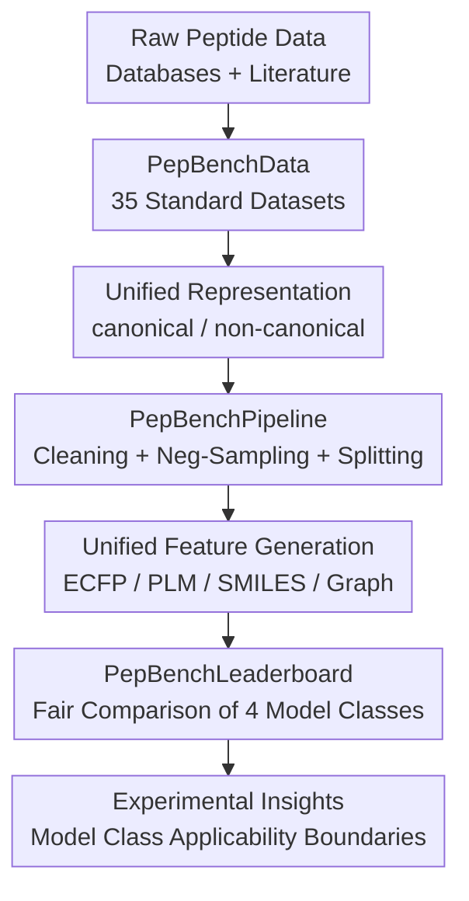

# PepBenchmark: A Standardized Benchmark for Peptide Machine Learning

**Conference**: ICLR2026  
**OpenReview**: [https://openreview.net/forum?id=NskQgtSdll](https://openreview.net/forum?id=NskQgtSdll)  
**Code**: https://github.com/ZGCI-AI4S-Pep/PepBenchmark/  
**Area**: Computational Biology / Peptide Machine Learning / Datasets & Benchmarks  
**Keywords**: Peptide machine learning, peptide drug discovery, standardized benchmark, negative sampling, data splitting  

## TL;DR
PepBenchmark integrates 35 canonical/non-canonical peptide datasets, a unified cleaning-sampling-splitting pipeline, and a leaderboard for four categories of models into a single reproducible experimental framework, revealing the true performance boundaries of PLM, fingerprint, GNN, and SMILES models across different peptide tasks.

## Background & Motivation
**Background**: Peptide drugs are considered the "third generation" of therapeutic molecules after small molecules and monoclonal antibodies, offering synthetic feasibility, biological specificity, and high safety. As data on antimicrobial, anticancer, cell-penetrating peptides, and peptide-protein interactions accumulate, machine learning is increasingly applied to peptide activity prediction, ADME property evaluation, and safety screening.

**Limitations of Prior Work**: The primary issue is the difficulty in assessing model progress. Research groups often compile data from disparate databases and literature; canonical and non-canonical peptide representations are not unified. Experimental protocols vary wildly: some employ random negative sampling while others use bioactive peptides as negatives. Data splitting ranges from random to sequence-similarity-based, leading to incomparable evaluation metrics.

**Key Challenge**: Peptide data is riddled with "shortcuts." Near-duplicate sequences allow models to memorize local mutation families. Disparities in length, charge, and hydrophobicity between positive and negative samples introduce dataset artifacts. Representative k-mers frequently appearing in positive samples cause leakage across training and test sets even when global sequence similarity is low. Without addressing these, stronger models may simply excel at exploiting these shortcuts.

**Goal**: To establish a standardized peptide ML benchmark spanning key drug discovery tasks. It aims to support both natural and non-natural peptides, provide a unified pipeline for cleaning, negative sampling, splitting, and feature transformation, and facilitate fair comparisons between fingerprints, GNNs, protein language models (PLMs), and SMILES-based models under a consistent protocol.

**Key Insight**: Instead of releasing a static data package, the benchmark is structured into three layers: PepBenchData (data resources), PepBenchPipeline (transforming raw data into comparable datasets), and PepBenchLeaderboard (unified training and evaluation). This allows new models to be integrated into the existing pipeline without reinventing data processing logic.

**Core Idea**: Replace ad hoc experimental setups with "unified data sources + biologically constrained processing + leakage-aware splitting + multi-model leaderboard" to ensure peptide property prediction results are reproducible and robust against shortcut exploitation.

## Method
### Overall Architecture
The PepBenchmark framework operates as a production line: raw peptide data is sourced from databases and literature, processed via the PepBenchPipeline (cleaning, negative sampling, splitting, and feature transformation), and finally evaluated on the PepBenchLeaderboard under a unified protocol.

PepBenchData organizes 35 datasets into 7 groups corresponding to three stages of peptide drug development. Activity Modeling includes AMP, oncology, metabolic, other bioactivities, and PepPI. Pharmacokinetics Profiling covers ADME. Safety Assessment includes toxicity-related tasks. The collection features 32 single-input peptide datasets and 3 peptide-protein interaction datasets, comprising 29 canonical and 6 non-canonical datasets, with 27 classification and 8 regression tasks.

### Key Designs
**1. PepBenchData: Standardizing Dispersed Peptide Tasks**
Canonical peptide data is aggregated from existing benchmarks, task-specific papers, and Peptipedia, while non-canonical data is curated from CycPeptMPDB and Hemolytik 2.0. The data scale includes 68,588 sequences across 29 canonical datasets and 9,512 sequences across 6 non-canonical datasets. For non-canonical peptides, a translation tool for 613 unique monomers facilitates conversion between BILN, HELM, and SMILES, enabling structured modeling of cyclic, modified, or unnatural peptides.

**2. PepBenchPipeline: Reducing Artifacts via Biological and Distribution Constraints**
For regression data, the pipeline uses the Interquartile Range (IQR) to remove outliers from multiple experimental measurements. For classification, MMseqs2 removes near-duplicate positive samples (90% similarity).
**Mechanism (BDNegSamp)**: Biologically-informed and Distribution-controlled Negative Sampling. Negative samples are drawn from a bioactive peptide pool. Tasks highly correlated with the target task are excluded based on expert knowledge and sequence overlap statistics. Sequence composition (length, net charge, hydrophobicity, 1-mer, and 2-mer) is matched using Jensen-Shannon ($JS$) divergence to ensure models cannot rely on shallow statistical differences.

**3. Hybrid-split: Preventing k-mer Leakage and Global Homology**
While MMseqs2 splits handle global sequence similarity, they often fail to block local motif leakage. The authors identify "representative k-mers" enriched in positive samples via Fisher's exact test.
**Ours (Hybrid-split)**: First, k-mer-aware clustering ensures sequences sharing enriched motifs are assigned to the same split. Then, MMseqs2 is applied at 30% identity to remaining samples. For PepPI, a protein-based cold-start split is used. For non-canonical peptides, ECFP fingerprint-based connectivity components are used for splitting.

**4. PepBenchLeaderboard: Comparing Model Families**
The leaderboard evaluates four categories:
*   **Fingerprint-based**: ECFP6/ECFP4 + RF/XGBoost/LightGBM.
*   **GNN-based**: Atom-level molecular graphs + GCN/GAT/GIN/Pepland.
*   **SMILES-based**: ChemBERTa, PeptideCLM, PepDoRA.
*   **PLM-based**: ESM2, DPLM, ProtBERT.
**Novelty (ESM2-150M-F)**: To address the scarcity of short sequences in standard PLM pre-training, the authors performed continued pre-training of ESM2 on ~1.9M short peptides ($L \le 50$) from UniRef50, resulting in lower pseudo-perplexity and improved classification performance on peptide tasks.

### Loss & Training
Classification tasks utilize ROC-AUC, while regression tasks use MAE, reported over five independent splits. SCPP uses hybrid-split, SNCPP uses ECFP-split, and PepPI uses protein cold-start split (default 8:1:1 ratio).

PLM and SMILES models are trained for up to 50 epochs with a learning rate of $5 \times 10^{-5}$ and weight decay of 0. GNN models utilize 3 layers with a hidden dimension of 300 and a learning rate of 0.001. ESM2-150M-F pre-training employed DeepSpeed and BF16 on 8 A800 GPUs with an effective batch size of 4096 and a learning rate of $4 \times 10^{-4}$ over 500 epochs.

## Key Experimental Results

### Main Results
| Task Setting | Best Model / Family | Key Result | Conclusion |
| :--- | :--- | :--- | :--- |
| SCPP Classification (22 Canonical) | ESM2-150M-F / PLM | Avg ROC-AUC 81.5% | PLMs are the strongest for single-peptide classification. |
| SCPP Regression (4 Canonical) | ESM2-650M / PLM | Avg MAE 0.469 | Larger PLMs provide substantial gains in regression. |
| SNCPP Classification (4 Non-canonical) | Fingerprint-based | Avg ROC-AUC ~96.0% | Fingerprints are most reliable when FASTA is unavailable. |
| PepPI Tasks | GNN / SMILES / FP | Varying performance | PPI tasks benefit from fine-grained molecular features. |

### Ablation Study
| Analysis | Contrast | Result |
| :--- | :--- | :--- |
| Redundancy | Raw vs. 90% De-redundancy | Removing duplicates dropped RF ROC-AUC by 17.39% in hemolysis. |
| Split Protocol | Random vs. Hybrid-split | Random split results are over-optimistic; Hybrid-split is significantly harder. |
| Negative Sampling | Standard vs. BDNegSamp | $JS$ divergence control makes tasks more realistic and challenging. |
| Continued Pre-training | ESM2-150M vs. 150M-F | 150M-F improved classification but showed diminishing returns on regression. |

### Key Findings
- **PLMs** are dominant for canonical single-peptide tasks but lose applicability for non-canonical peptides where FASTA sequences are unavailable.
- **Fingerprint-based** methods are significantly undervalued; RF + ECFP6 often ranks in the top tier for small datasets.
- **GNNs and SMILES** models are generally weaker for single-peptide property prediction but are highly competitive for PPI tasks.
- **k-mer leakage** is a major overlooked issue; global similarity splits (MMseqs2) are insufficient to stop motif-based leakage.

## Highlights & Insights
- Standardizing the data processing pipeline is as critical as the model architecture itself for fair evaluation.
- **BDNegSamp** provides a pragmatic solution for negative sampling by balancing biological relevance and statistical distribution.
- The **Hybrid-split** insight is valuable: in short sequences like peptides, functional motifs are dense, and local k-mer leakage is more pervasive than global homology.
- The benefit of **peptide-aware continued pre-training** is task-dependent; while it aids short-peptide classification, it can lead to catastrophic forgetting of general protein features in longer sequences.

## Limitations & Future Work
- The benchmark currently lacks 3D structural evaluation due to the scarcity of peptide-PDB data, particularly for non-canonical peptides.
- **Fake negatives** remain a risk; even with BDNegSamp, the poly-functionality of peptides means some negatives may possess latent activity.
- The **PepPI protocol** requires further refinement, specifically regarding the optimal strategy for freezing/unfreezing protein encoders.
- Non-canonical data scales remain small; future work requires expansion through reliable experimental data rather than synthetic negative samples.

## Related Work & Insights
- **Comparison**: Processes more data than **UniDL4BioPep** and offers more rigorous standardization than **Peptipedia** or **AutoPeptideML**.
- **Context**: Positions itself as the peptide equivalent to **MoleculeNet** (small molecules) and **ProteinGym** (proteins), filling the gap for therapeutic peptides.
- **Insight**: Future peptide generation models should be evaluated using this benchmark’s hybrid-split and ADME/Tox multi-task evaluators to ensure they are not merely replicating known motif shortcuts.

## Rating
- **Novelty**: ⭐⭐⭐⭐☆
- **Experimental Thoroughness**: ⭐⭐⭐⭐⭐
- **Writing Quality**: ⭐⭐⭐⭐☆
- **Value**: ⭐⭐⭐⭐⭐

<!-- RELATED:START -->

## Related Papers

- [\[NeurIPS 2025\] A Standardized Benchmark for Multilabel Antimicrobial Peptide Classification](../../NeurIPS2025/computational_biology/a_standardized_benchmark_for_multilabel_antimicrobial_peptide_classification.md)
- [\[ICLR 2026\] CAPSUL: A Comprehensive Human Protein Benchmark for Subcellular Localization](capsul_a_comprehensive_human_protein_benchmark_for_subcellular_localization.md)
- [\[ICLR 2026\] Representing Local Protein Environments with Machine Learning Force Fields](representing_local_protein_environments_with_machine_learning_force_fields.md)
- [\[ICLR 2026\] DistMLIP: A Distributed Inference Platform for Machine Learning Interatomic Potentials](distmlip_a_distributed_inference_platform_for_machine_learning_interatomic_poten.md)
- [\[ICLR 2026\] 3DCS: Datasets and Benchmark for Evaluating Conformational Sensitivity in Molecular Representations](3dcs_datasets_and_benchmark_for_evaluating_conformational_sensitivity_in_molecul.md)

<!-- RELATED:END -->
