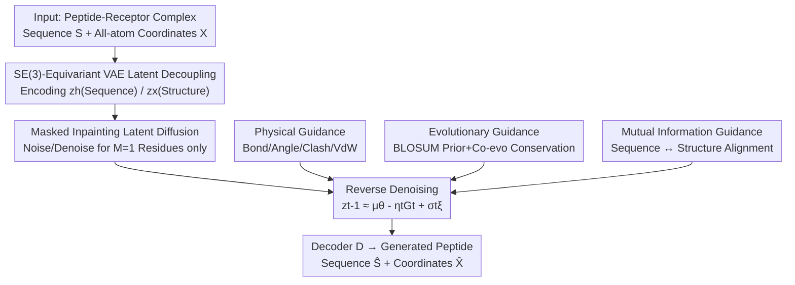

# PepTri: Physical, Evolutionary, and Mutual Information Tri-guided All-atom Diffusion Peptide Design

**Conference**: ICLR 2026  
**OpenReview**: [https://openreview.net/forum?id=yQlTgHo1um](https://openreview.net/forum?id=yQlTgHo1um)  
**Code**: https://github.com/aigensciences/PepTri  
**Area**: Computational Biology / Diffusion Models / Peptide Design  
**Keywords**: Peptide Design, All-atom Diffusion, SE(3) Equivariance, Physics-guided, Mutual Information

## TL;DR
PepTri performs joint diffusion generation of peptide sequences and 3D structures within an SE(3)-equivariant latent space. By injecting physical, evolutionary, and mutual information tri-guidance during the denoising process, it ensures the generated peptides are physically stable, evolutionarily plausible, and sequence-structure consistent, achieving SOTA performance across multiple peptide-protein design benchmarks.

## Background & Motivation
**Background**: Peptides (short amino acid chains) are becoming a critical class of therapeutics due to their high specificity, low toxicity, and ability to target "undruggable" proteins. Deep generative models (diffusion, flow matching) have become the mainstream for peptide design by learning backbone distributions and generating diverse structures.

**Limitations of Prior Work**: Existing methods are mostly "structure-centric"—they decouple sequence and structure generation. Structure generators produce plausible geometries but neglect evolutionary constraints; evolutionary sequence models (Potts/MSA) capture conservation but ignore 3D stability; physical validation (bond lengths, angles, steric clashes) is typically performed via post hoc processing. Consequently, generated geometries may appear stable while the corresponding sequences remain unrealistic or infeasible.

**Key Challenge**: Physical validity, evolutionary plausibility, and sequence-structure consistency are mutually dependent constraints. However, existing frameworks treat them as independent modules or retroactive patches. No single method ensures that generated designs **simultaneously** satisfy all three. Treating any component as an auxiliary term rather than part of the denoising dynamics leads to suboptimal trade-offs.

**Goal**: To enable joint sequence and structure generation in a unified loop where physical, evolutionary, and sequence-structure alignment signals **directly shape the denoising trajectory** instead of being corrected afterward.

**Key Insight**: Since nature has already performed vast combinatorial searches in protein space, leaving patterns of conservation and co-evolution, and physical laws impose hard constraints on geometry, injecting these priors alongside information-theoretic alignment into every diffusion step compresses the search into a "stable and realistic" subspace.

**Core Idea**: Jointly diffuse sequence and structure within an SE(3)-equivariant latent space, employing "Physical + Evolutionary + Mutual Information" tri-guidance to guide denoising during both training and sampling.

## Method

### Overall Architecture
PepTri utilizes a two-stage framework. The first stage is an SE(3)-equivariant VAE that compresses "sequence + structure" inputs into a latent space preserving full geometric symmetry, **decoupling** latent variables into a sequence component $z_h$ and a structural component $z_x$. The second stage is a latent diffusion model performing masked inpainting within this space. The forward process corrupts the residues to be designed ($M=1$), while the reverse process denoises from pure noise $z_T$ to $z_0$, adding a tri-guidance term $G_t$ at each step for correction. After denoising, the decoder $D$ reconstructs the peptide sequence $\hat{S}$ and all-atom coordinates $\hat{X}$. The process occurs within the geometric/energetic context of the receptor pocket (treated as a rigid framework) to ensure evaluations reflect realistic binding environments.

The tri-guidance components are distributed as follows: physical guidance acts on the structural component $z_x$ (managing bond lengths, angles, clashes, and Van der Waals forces); evolutionary guidance acts on the sequence component $z_h$ (biasing toward conserved motifs); and mutual information guidance aligns $z_x$ and $z_h$. The reverse update is formulated as $z_{t-1} \approx \mu_\theta(z_t,t) - \eta_t G_t + \sigma_t \xi$, where $-\eta_t G_t$ represents the guidance-induced shift.

### Key Designs

**1. SE(3)-Equivariant VAE with Sequence/Structure Latent Decoupling: Embedding Geometric Symmetry into Latent Space**  
Direct diffusion on atomic coordinates is unstable and struggles to balance sequence and structure. PepTri first employs a VAE to compress inputs. The encoder uses an SE(3)-equivariant GNN (enhanced from adaptive multi-channel EGNN), utilizing only relative vectors and invariant edge features (pairwise distance $d_{ij}$, mean triplet angles $\psi_{ij}$) for message passing: $x'_i = x_i + \sum_{j\in N(i)} \phi(d_{ij},\psi_{ij},h_i,h_j)(x_i-x_j)$, and $h'_i = \psi_h(h_i, \sum_j \psi_m(\cdot))$. Since updates depend only on relative geometry, the encoding/decoding is strictly equivariant to rotations and translations. The encoder outputs decoupled latent variables—sequence $z_h \in \mathbb{R}^{L\times d_h}$ and structure $z_x \in \mathbb{R}^{L\times n_{lat}\times 3}$ (with $n_{lat}$ 3D anchor points per residue)—allowing tri-guidance to target specific modalities. The VAE training objective reconstructs both sequence and structure while constraining geometric consistency:

$$L_{VAE} = CE(S,\hat{S}) + \|X-\hat{X}\|_2^2 + \beta L_{KL} + \lambda_{geom}\|D(\hat{X})-D(X)\|_F^2$$

The final term uses a pairwise distance matrix $D(X)$ to enforce SE(3)-invariant structural consistency. Using VAE instead of direct coordinate diffusion provides better training stability and a compact, controllable latent space.

**2. Physical Guidance: Injecting Differentiable Molecular Mechanics Gradients into the Denoiser**  
Coordinates learned solely from data often exhibit broken bonds, unrealistic angles, and atomic overlaps. PepTri treats physics as a training-time regularizer: a composite energy $E_{phys}(\hat{X},S;M) = \sum_j w_j E_j$ is defined over the design region ($C\alpha$ trace for numerical stability), covering bond lengths/angles, Van der Waals, electrostatics, anti-clash, secondary structure proxies, and diffusion smoothing. After predicting $\hat{X}$ at each step, $E_{phys}$ is evaluated, and the masked gradient $\nabla_{\hat{X}} E_{phys}$ is used to update parameters. Since the energy depends on internal coordinates (distances/angles), the gradient remains SE(3)-invariant. Additionally, a differentiable force field term $L_{OpenMM}$ (using OpenMM + Amber14) is coupled at the final step. The total physical loss is $L_{phys}=\lambda_{phys}E_{phys}+\lambda_{OpenMM}L_{OpenMM}$. Sampling also offers an optional energy-guided sampler that corrects predicted noise: $\varepsilon_t \leftarrow \varepsilon_t - \gamma(\nabla_{x_t} E_{OpenMM})\odot M$. In reverse diffusion, this is written as $\tilde\varepsilon_{X,t}=\varepsilon_{X,\theta^\star}-\sqrt{1-\bar\alpha_t}\,G^{phys}_t$, with $\lambda_{phys}$ annealed to strengthen constraints in later stages.

**3. Evolutionary Guidance: Pulling Sequences Toward Conserved, Feasible Motifs via BLOSUM Priors + Co-evolutionary Attention**  
Conservation and co-evolution patterns in nature encode "what works." PepTri injects this signal into the clean residue embeddings $H_0$. It learns a BLOSUM-style matrix $B\in\mathbb{R}^{20\times20}$ to generate features $\tilde H = H_0 + \omega\,\phi(YBF_1+b_1)F_2+b_2$ ($Y$ is residue one-hot); then uses residual multi-head self-attention to capture inter-site dependencies $H_{coevo}=\tilde H + \alpha\,\text{MHA}(\tilde H)$. Two auxiliary heads are attached: site-wise conservation preference $P_{cons,i}=\text{Softmax}(V_c\phi(F_c H_{coevo,i}))\in\Delta^{19}$ and a self-supervised fitness score $F(H_{coevo})\in(0,1)$. The training objective combines fitness regression $L_{fit}=\text{SmoothL1}(F,\tau_{fit})$, entropy regularization $L_{ent}$ on $P_{cons}$ (minimizing this **maximizes** entropy to encourage diversity), and a local KL term $L_{KL\text{-}local}$ to align with decoder logits and prevent posterior collapse: $L_{evo}=\lambda_{fit}L_{fit}+\lambda_{ent}L_{ent}+\lambda_{KL}L_{KL\text{-}local}$. Notably, this does **not** rely on external MSA/PLM priors; evolutionary signals are learned via self-supervision and act implicitly via the trained denoiser $\theta^\star$ during sampling.

**4. Mutual Information Regularization: Explicitly Aligning Sequence Semantics and Structural Intent via MINE**  
A functional peptide requires sequence-structure consistency. PepTri adopts MINE by pooling sequence embeddings $H_{coevo}$ and structural embeddings $z_{struct}$ into summaries $s,z$. A critic $T_\theta$ is trained to lower-bound and maximize their mutual information: $\hat I_\theta = \mathbb{E}[T_\theta(s,z)] - \log\mathbb{E}[e^{T_\theta(s,z')}]$, with $L_{MI}=-\hat I_\theta$. An auxiliary head $p_{phys}$ also predicts structure validity from latent embeddings to reinforce physical plausibility: $L_{MI\text{-}total}=\lambda_{MI}L_{MI}+\lambda_{MI\text{-}phys}\text{MSE}(p_{phys},1)$. This explicitly pulls sequence semantics toward structural intent, reducing incoherent designs.

### Loss & Training
The total training objective: diffusion noise prediction loss $L_{diff}(t)$ plus three time-independent regularizers (Physical, Evolutionary, Mutual Information). Training uses mixed precision + EMA. A dynamic guidance schedule balances stability and diversity, with physical terms annealed during reverse diffusion.

## Key Experimental Results

### Main Results
Datasets: Cross-domain evaluation on PepBench (6,105 non-redundant complexes) trained and evaluated on LNR (93 expert-curated); In-domain evaluation on PepBDB (7,014 complexes, MMseqs2 clustered). Metrics include Success Rate ($\Delta G<-5$ REU), $\Delta G$, DockQ, GDT TS, Contact F1, local RMSD, clash rates, and sequence/structure diversity. Results are reported pre- and post-relaxation.

Binding Quality and Interface (w/o relaxation / w/ relaxation):

| Dataset | Method | Success Rate↑ | $\Delta G$ (REU)↓ | DockQ↑ |
|--------|------|---------|---------|--------|
| PepBench | PepGLAD | 0.29 / 0.79 | -15.63 / -34.48 | 0.60 / 0.59 |
| PepBench | PepFlow | 0.31 / 0.74 | -17.05 / -35.98 | 0.53 / 0.42 |
| PepBench | UniMoMo | 0.34 / 0.79 | -19.04 / -30.19 | 0.57 / 0.54 |
| PepBench | **PepTri** | **0.40 / 0.83** | **-19.39 / -36.36** | **0.63 / 0.62** |
| PepBDB | UniMoMo | 0.30 / 0.74 | -18.89 / -34.05 | 0.44 / 0.43 |
| PepBDB | **PepTri** | **0.31 / 0.74** | -18.15 / -34.82 | **0.49 / 0.49** |

In terms of structural precision, PepTri achieves the highest Contact F1 and GDT TS across both datasets. While PepFlow is slightly better in local RMSD before relaxation, PepTri is optimal after relaxation, indicating its conformations are exceptionally robust for refinement. Regarding clash and geometric quality, PepTri achieves or approaches the best results in internal/interface clashes and bond outlier rates post-relaxation.

### Ablation Study
Removing the four components (Physics / Evolution / Mutual Info / All-atom modeling):

| Configuration | Success Rate | $\Delta G$↓ | DockQ | Contact F1 | Consistency |
|------|--------|------|-------|-----------|--------|
| No phys | 0.401 | -15.485 | 0.621 | 0.750 | 0.783 |
| No evo | 0.443 | -16.501 | 0.618 | 0.769 | 0.771 |
| No mi | 0.545 | -18.949 | 0.633 | 0.804 | 0.779 |
| PepTri-backbone (Only backbone) | 0.397 | -16.961 | 0.578 | 0.760 | 0.744 |
| **PepTri (Full)** | **0.583** | **-19.387** | **0.633** | **0.829** | **0.799** |

### Key Findings
- **Physical Guidance contributes the most**: Removing it (No phys) causes Success Rate to drop from 0.583 to 0.401, making it the most critical factor for binding stability.
- **All-atom modeling is indispensable**: PepTri-backbone performs significantly worse in success rate and DockQ, proving side-chain information is vital for interface quality.
- **Evolution and MI target sequence quality and coherence**: Removing these components primarily degrades Contact F1 and sequence consistency. The tri-guidance components are complementary.
- Relaxation improves energy but does not necessarily improve nativeness; PepTri's guided denoising maintains native-like poses after refinement, suggesting it generates physically coherent structures natively rather than relying on post-hoc fixes.

## Highlights & Insights
- **"Tri-guidance inside denoising dynamics"** is the core insight: physics, evolution, and alignment are not post-hoc filters but forces shaping the denoising direction. This addresses the "stable structure but fake sequence" decoupling pathology.
- **Sequence/Structure latent decoupling + SE(3) equivariance** allows tri-guidance to precisely target specific modalities ($z_x$ for physics, $z_h$ for evolution, and MI for bridging), representing a clean architectural design.
- **Self-supervised evolutionary signals without MSA**: The use of BLOSUM-style matrices and co-evolutionary attention avoids dependency on external homologous sequences, making it friendlier for peptides where homologs are scarce.
- Using physical gradients based only on internal coordinates ensures SE(3) invariance naturally, avoiding a common pitfall where guidance breaks equivariance.

## Limitations & Future Work
- Data is predominantly short peptides (<30 residues); advantages for long peptides or complex systems haven't been fully validated.
- The receptor is treated as a rigid framework; receptor flexibility or induced-fit effects are not modeled.
- Tri-guidance introduces several hyperparameter weights and scheduling complexities, leading to high tuning costs.

## Related Work & Insights
- **vs PepGLAD**: Also uses latent diffusion, but treats energy as post hoc; PepTri injects physical gradients into denoising, yielding better binding stability.
- **vs PepFlow**: Uses flow matching, but stability is checked after generation; PepTri performs joint constraints during the loop, resulting in superior post-relaxation RMSD.
- **vs UniMoMo**: Unifies binder and pocket but relies on distance-threshold heuristics; PepTri uses MI to explicitly align latents, providing stronger coherence.

## Rating
- Novelty: ⭐⭐⭐⭐⭐ Integrating physics, evolution, and MI **directly** into equivariant latent diffusion denoising is a unified and unique approach.
- Experimental Thoroughness: ⭐⭐⭐⭐ Solid cross-domain and in-domain benchmarks with ten+ metrics and ablation; lacks validation for long peptides and receptor flexibility.
- Writing Quality: ⭐⭐⭐⭐ Clear equations and diagrams; modular separation is distinct.
- Value: ⭐⭐⭐⭐⭐ Peptide drug design is a high-value area; the paradigm of "physically and evolutionarily plausible by design" is highly significant for practical applications.

<!-- RELATED:START -->

## Related Papers

- [\[ICLR 2026\] Uncovering Semantic Selectivity of Latent Groups in Higher Visual Cortex with Mutual Information-Guided Diffusion](uncovering_semantic_selectivity_of_latent_groups_in_higher_visual_cortex_with_mu.md)
- [\[ICLR 2026\] Pallatom-Ligand: an All-Atom Diffusion Model for Designing Ligand-Binding Proteins](pallatom-ligand_an_all-atom_diffusion_model_for_designing_ligand-binding_protein.md)
- [\[ICLR 2026\] Towards All-atom Foundation Models for Biomolecular Binding Affinity Prediction](towards_all-atom_foundation_models_for_biomolecular_binding_affinity_prediction.md)
- [\[ICML 2026\] Neural Estimation of Pairwise Mutual Information in Masked Discrete Sequence Models](../../ICML2026/computational_biology/neural_estimation_of_pairwise_mutual_information_in_masked_discrete_sequence_mod.md)
- [\[ICLR 2026\] Iterative Distillation for Reward-Guided Fine-Tuning of Diffusion Models in Biomolecular Design](iterative_distillation_for_reward-guided_fine-tuning_of_diffusion_models_in_biom.md)

<!-- RELATED:END -->
