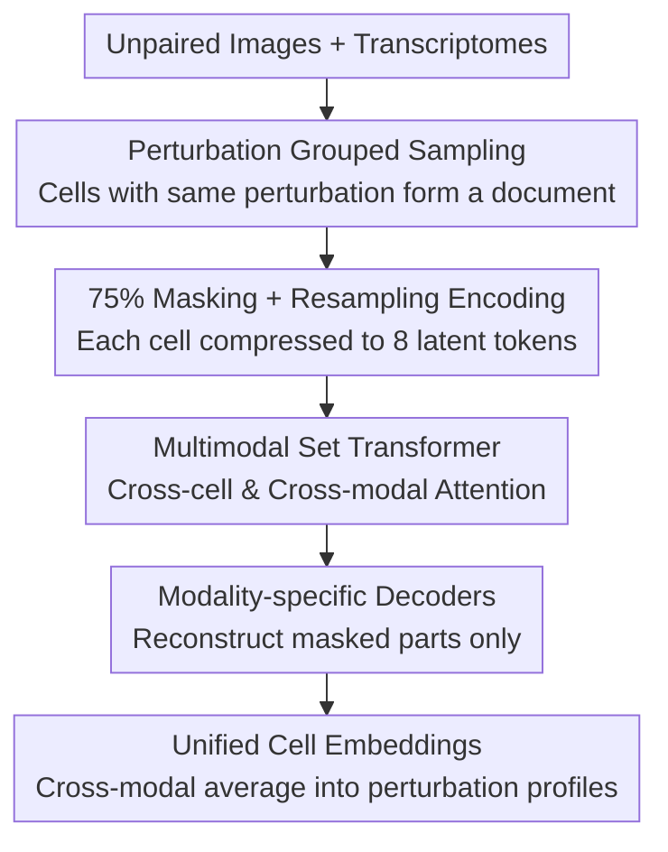

# PETRI: Learning Unified Cell Embeddings from Unpaired Modalities via Early-Fusion Joint Reconstruction

**Conference**: ICLR 2026  
**OpenReview**: [https://openreview.net/forum?id=Vu8YXDooG5](https://openreview.net/forum?id=Vu8YXDooG5)  
**Code**: TBD (Authors promise to release code and anonymized HepG2 dataset)  
**Area**: Computational Biology / Single-cell Multimodal Representation Learning  
**Keywords**: Single-cell, Multimodal, Early-fusion, Masked Joint Reconstruction, Perturbation Screening

## TL;DR
PETRI treats a batch of cells with the same perturbation as a "multimodal document," using an early-fusion Transformer to perform joint reconstruction of masked images and transcriptomes. It learns unified cell embeddings without requiring cell-level pairing and significantly outperforms unimodal and late-fusion baselines in recovering known gene relationships.

## Background & Motivation
**Background**: High-throughput perturbation screening follows two complementary technical routes: Perturb-seq uses CRISPR perturbation combined with single-cell RNA sequencing to read out whole-transcriptome effects, while Optical Pooled Screening (OPS) uses cost-effective fluorescence microscopy to read out morphological phenotypes. Integrating both aims to separate true biological signals from their respective technical noise by characterizing "how perturbations reshape cell states" from different perspectives.

**Limitations of Prior Work**: Existing multimodal embedding methods either require cell-level modality alignment or fail to simultaneously preserve "shared information" and "modality-specific information" within an end-to-end framework. However, since single-cell assays are mostly destructive, the same cell cannot have both its morphology and expression measured; thus, **cell-level pairing is physically unattainable**. Furthermore, morphological and expression signals only partially overlap, requiring models to remain robust even when signals from the two modalities are inconsistent or contradictory.

**Key Challenge**: Contrastive methods like CLIP, while seemingly natural, are unsuitable for this scenario. They rely on distinguishing strong positive pairs from a large number of negative samples. However, this dataset uniquely contains only about 2,200 perturbations, and the two modalities share no explicitly overlapping features, making it difficult for contrastive learning to initiate.

**Goal**: To learn a unified cell latent space that integrates shared signals while retaining specific phenotypic clues, under the premise that no pairing exists and cross-modal mutual information may be weak.

**Key Insight**: The authors draw inspiration from Vision-Language Models (VLM) handling "mixed-modal documents." In documents like webpages, images and text are aligned only by a common theme; this "theme" as context increases the chance of discovering cross-modal associations. PETRI treats "perturbation" as the theme and groups cells under the same perturbation into a document.

**Core Idea**: The core hypothesis is that "cell phenotypes enriched under a certain perturbation and visible in both modalities provide mutual information to improve the reconstruction of corrupted data." Consequently, context-grouped masked joint reconstruction is used, allowing cross-modal attention to emerge spontaneously when beneficial for reconstruction, thus completing alignment without any explicit cross-modal loss.

## Method

### Overall Architecture
PETRI is an early-fusion self-supervised Transformer that takes **unpaired** cell images and transcriptomes as input and outputs unified cell embeddings in a latent space. The pipeline consists of four steps: first, cells are grouped by perturbation and sampled into sets (documents); second, modality-specific encoders mask 75% of image patches or gene tokens and resample/compress them into a fixed, small number of latent tokens; third, all latent tokens from both modalities of all cells in the same document are concatenated into a unified sequence and fed into a Multimodal Set Transformer (MST) for cross-cell and cross-modal attention; finally, the tokens are separated by modality, and respective decoders reconstruct only the masked portions.

A significant technical hurdle is that a single cell can have hundreds of image patch tokens or thousands of gene tokens, causing the sequence length of a document to explode. PETRI’s solution is **aggressive token resampling**—distilling each cell into a fixed, small number of latent tokens ($8$ per cell in experiments), allowing for flexible scaling of the number of cells per document.

### Key Designs

**1. Perturbation Documents: Using Shared Experimental Context Instead of Cell-level Pairing**

Addressing the pain point that "cell-level pairing is physically unattainable," PETRI no longer treats each modality instance as a pair member. Instead, it stratifies cells into groups based on experimental context (primarily perturbations, such as a specific sgRNA or a combination of perturbation and chemical background). From each group, $S$ cells are sampled with replacement for each modality to form a "multimodal document." Alignment thus occurs between **themes (perturbations)** rather than cells—phenotypes enriched by the same perturbation appear in both modalities, providing mutual information for the model. This is the foundation of the method: if there is no mutual information or if modalities contradict each other, the model simply learns to ignore the other modality and degrades to unimodal performance without being penalized.

**2. Per-cell Resampling Encoder: Compressing Long Sequences into a Few Latent Tokens**

While the document approach is effective, it causes sequence length explosion. PETRI employs modality-specific resampling encoders: during training, 75% of tokens (image patches or genes) per cell are randomly masked and removed. The image side follows ViT, where $L$ learnable latent tokens ($L \ll N$) are concatenated to $N$ patch tokens; after passing through Transformer blocks, only the $L$ latent tokens are kept as the cell representation. On the transcriptome side, since the input involves thousands of genes and standard Transformers are computationally expensive, **Perceiver** is used. It naturally fits the need for "aggressive resampling" by alternating between cross-attention for resampling and self-attention on latent tokens alone. Gene expressions are fused into tokens via a two-layer MLP using learnable gene embeddings and their log counts, also resulting in $L$ latent tokens. Both modalities are compressed into a fixed $(L, D)$ representation, keeping document length controllable.

**3. Multimodal Set Transformer (MST): Where Early Fusion Happens**

The encoder output is a tensor of shape $(G \times S, L, D)$ ($G$ groups, $S$ cells per group, $L$ latent tokens, dimension $D$). MST reshapes this into $(G, S \times L, D)$ and concatenates the two modalities along the token dimension into a unified sequence of $(G, 2 \times S \times L, D)$. Standard Transformer blocks allow **cross-modal and cross-cell** attention to occur freely, after which it is split back into $(G \times S, L, D)$ for decoding. This is the core of early fusion: information sharing is centralized in the MST. An anti-intuitive but critical finding is that the downstream cell embeddings are **taken from the encoder output before MST**. MST's cross-modal attention forces the upstream encoders to produce aligned and compatible tokens, but as tokens get closer to the decoder, they become more specialized for the reconstruction task; thus, the best downstream embeddings are found before the MST. This also implies that trained image and expression encoders can be used **independently** during inference to embed unpaired screening data.

**4. Modality-specific Decoders and Masked Reconstruction Loss: Loss Only on Masked Portions**

The final step reconstructs original inputs from processed latent tokens, forcing latent tokens to encode complete cell information. The image decoder is adapted from MAE: since latent tokens are not bound to specific patch locations, they are concatenated with a full set of $N$ learnable mask tokens, and the decoder reconstructs masked patches. The loss is MSE calculated **only on masked patch pixels**. The transcriptome decoder mean-pools the latent tokens of each cell and passes them through a three-layer MLP to output values for each gene: when raw counts are present, a softmax is applied along the gene dimension with a Negative Binomial Negative Log-Likelihood loss; if reconstructing log-normalized counts, MSE is used. Similarly, loss is calculated only for **masked genes**. "Reconstructing only the masked parts" is key to the learning signal provided by this joint reconstruction—the model only utilizes cross-modal information when it reduces the reconstruction error of corrupted data.

### Evaluation Metrics
PETRI evaluates aggregated embeddings using two metrics based on genetic metadata:

- **Guide Consistency (GC)**: In CRISPR screens, multiple sgRNAs targeting the same gene should induce similar phenotypes. Cosine similarity is calculated for average guide embeddings within each target gene and compared against an empirical null distribution of unrelated sgRNAs. The "proportion of target genes with significant guide similarity ($p < 0.05$) after multi-test correction" is reported.
- **StringDB Edge Classification**: Zero-shot classification using physically interacting gene pairs in StringDB as ground truth. Pairwise cosine similarity of aggregated target gene embeddings is used as a pseudo-classification probability, reporting the TPR at 5% FPR on the ROC curve. The authors expect this metric to be difficult as StringDB is not cell or phenotype-specific, and many single-gene perturbation effects are weak.

Before aggregation, robust center scaling is performed relative to each replicate control, followed by non-dimensionality-reducing PCA and whitening. Multimodal perturbation profiles are obtained by "averaging cell embeddings within modality first, then averaging across modalities."

## Key Experimental Results

### Main Results
Evaluations were performed on two datasets: **HepG2** (matched perturbations, OPS + Perturb-seq, 569 CRISPR knockouts, 4 chemical backgrounds, ~2 million cells) and **Perturb-Multi** (matched cells, mouse liver MERFISH + protein stain images, 203 knockouts). Comparisons included strong unimodal pretrained models (scGPT, DINOv2), modality-specific MAEs, various late-fusion methods, and a CLIP early-fusion baseline.

| Dataset | Metric | PETRI | Strongest Uni/Late-fusion Baseline | Note |
|:--- |:--- |:--- |:--- |:--- |
| Perturb-Multi | GC | **0.208** | 0.059 (TrP MAE / scGPT) | Large lead |
| Perturb-Multi | StringDB | **0.260** | 0.109 (TrP MAE) | Large lead |
| HepG2 | GC | **0.278** | 0.304 (PCA on Expression) | Exception: PCA GC is higher, but StringDB is much lower |
| HepG2 | StringDB | 0.242 | 0.219 (Max Cos. Late-fusion) | Close; PETRI is best overall |

ROC curves for StringDB show that PETRI detects StringDB edges better than unimodal MAE at all FPRs (HepG2: PETRI AUC=0.628 vs ViT MAE 0.549 / TrP MAE 0.556). The CLIP early-fusion baseline performed worse than late-fusion; the authors trained ViT to regress mRNA directly from protein images and found that 80% of mRNA predictions had $r^2 < 0.20$ (mean 0.117), indicating that the correlation between modalities is too weak for contrastive learning to hold.

### Ablation Study

| Configuration | Key Finding | Description |
|:--- |:--- |:--- |
| PETRI vs. Permuted Data | Results largely comparable | Permutation disrupts perturbation grouping and inhibits cross-modal learning; PETRI's robustness is a positive result. |
| Embedding Position (Pre vs. Post MST) | Pre-MST encoder output is better for downstream | MST handles alignment, but tokens closer to the decoder become task-specialized. |
| BODIPY Reconstruction Ablation | Image reconstruction MSE decreases when expression tokens of same perturbation are provided | Direct proof that PETRI performs cross-modal prediction internally. |
| SAE Multimodal Dimensions | PETRI has 298 vs. Permuted 0, CLIP 1 | Early fusion truly aligns modalities in the latent space. |

### Key Findings
- **Joint reconstruction utilizes cross-modal information internally**: Selecting the BODIPY channel (lipid droplet stain) and specifically masking patches containing lipid droplets via intensity thresholds, giving expression tokens of the same control perturbation leads to increased predicted BODIPY intensity and decreased reconstruction MSE. Switching to expression tokens of a control known to decrease lipid droplets results in decreased intensity—matching biological expectations, whereas this does not occur in permuted models.
- **Early fusion generates true multimodal concepts**: Using a BatchTopK Sparse Autoencoder (15,360 dimensions, $K=500$) to decompose embeddings, "multimodal dimensions" are defined as those activated by 10–90% of cells in both images and transcriptomes. PETRI yielded 298 such dimensions, the permuted model 0, and CLIP 1. These 298 dimensions were significantly worse at predicting OPS well identity ($p < 0.001$), suggesting they encode fewer well-specific technical artifacts.
- **Concepts are interpretable and biologically relevant**: Among the 298 dimensions, 127 are significant for at least one image feature and one GO term. Dimensions retrieved via keywords related to the cell cycle, lipid metabolism, and mitochondrial activity correspond to interpretable phenotypes such as DNA replication, cholesterol homeostasis, and aerobic respiration in images.

## Highlights & Insights
- **"Perturbation as theme, cells as document" is a clever reframing of pairing into contextual alignment**: It bypasses the hard constraint that destructive assays cannot have cell-level pairing, leaving the discovery of cross-modal associations to shared context. This is transferable to any scenario where two modalities are loosely aligned only by common experimental conditions.
- **Alignment emerges without explicit cross-modal loss**: The core insight is that "context-grouped joint reconstruction" itself forces meaningful multimodal alignment, which is simpler and more robust than stacking contrastive/alignment regularizations, especially for weak or variable alignment.
- **Fuse during training, split during inference**: MST allows encoders to learn aligned tokens, but downstream use of pre-MST embeddings allows encoders to be deployed independently for unpaired data. This "fusion for training only" design is a valuable takeaway.
- **Robustness to permuted data as a positive result**: When modalities lack mutual information, the model automatically learns not to attend to each other and degrades to unimodal status. This property makes the method immune to the reality that modalities may be unrelated.

## Limitations & Future Work
- The authors note that existing proxy metrics (guide consistency, protein interaction prediction) serve as benchmarks but are insufficient to characterize biological structures revealed by downstream analysis. They call for task-based evaluation frameworks directly assessing biological utility for multimodal phenotypic screening and therapeutic discovery.
- The depth to which experimental contexts must match for cross-modal learning remains an open question. Whether more biological priors (e.g., grouping documents by protein complexes or pathways instead of single perturbations) can be introduced is unresolved.
- Although designed for image + expression, the authors believe the core of joint reconstruction + context documentation can generalize to other -omics modalities, though this was not verified. StringDB results on HepG2 are not fully reproducible due to data reasons.
- Personal observation: The effect of cross-modal information on reducing reconstruction loss is "sporadic across cells." The quantitative boundary of what proportion of cells truly undergo fusion and how much this contributes to final embedding quality is limited in the text.

## Related Work & Insights
- **vs. CLIP / CellCLIP (Contrastive Early-fusion)**: These rely on strong positive/negative pairs for contrast; PETRI uses context-grouped joint reconstruction. When modalities are not tightly correlated (e.g., mRNA is hard to regress from protein images), contrastive learning fails while PETRI remains stable.
- **vs. Late-fusion (Concatenation / Cosine Aggregation / Cross-modal AE)**: Late-fusion post-processes separately trained embeddings; PETRI performs early fusion in a shared space. PETRI aggregates unimodal profiles into multimodal profiles better than complex late-fusion methods using simple averaging.
- **vs. scVI / scGPT / DINOv2 unimodal representations**: These learn within a single modality; PETRI unifies latent spaces. PETRI generally outperforms these strong unimodal SOTA baselines in GC and StringDB metrics.
- **vs. MoCa / LLaVA etc. (VLMs)**: Borrowed the concepts of "mixed-modal documents + unified sequence self-attention + denoising reconstruction," but redefined "documents" as cell sets grouped by perturbation, migrating the idea to the single-cell biology domain.

## Rating
- Novelty: ⭐⭐⭐⭐⭐ Rebranding unpaired single-cell multimodal learning as "perturbation documents + joint reconstruction" to avoid explicit loss is a thorough reframing.
- Experimental Thoroughness: ⭐⭐⭐⭐ Complete chain of evidence with two datasets, multiple baselines, permutation controls, BODIPY ablation, and SAE interpretation, though limited to two datasets and some results are not fully reproducible.
- Writing Quality: ⭐⭐⭐⭐ Clear logic from hypothesis to method to verification with sufficient visual support.
- Value: ⭐⭐⭐⭐⭐ Solves the real "unpairable" constraint and releases an anonymized dataset, offering high value to the multimodal screening community.

<!-- RELATED:START -->

## Related Papers

- [\[ICLR 2026\] Learning Brain Representation with Hierarchical Visual Embeddings](learning_brain_representation_with_hierarchical_visual_embeddings.md)
- [\[ICLR 2026\] Clustering by Denoising: Latent Plug-and-Play Diffusion for Single-Cell Embeddings](clustering_by_denoising_latent_plug-and-play_diffusion_for_single-cell_embedding.md)
- [\[ICLR 2026\] Learning Explicit Single-Cell Dynamics Using ODE Representations](learning_explicit_single-cell_dynamics_using_ode_representations.md)
- [\[ICLR 2026\] Doloris: Dual Conditional Diffusion Implicit Bridges with Sparsity Masking Strategy for Unpaired Single-Cell Perturbation Estimation](doloris_dual_conditional_diffusion_implicit_bridges_with_sparsity_masking_strate.md)
- [\[ICLR 2026\] FlexRibbon: Joint Sequence and Structure Pretraining for Protein Modeling](flexribbon_joint_sequence_and_structure_pretraining_for_protein_modeling.md)

<!-- RELATED:END -->
