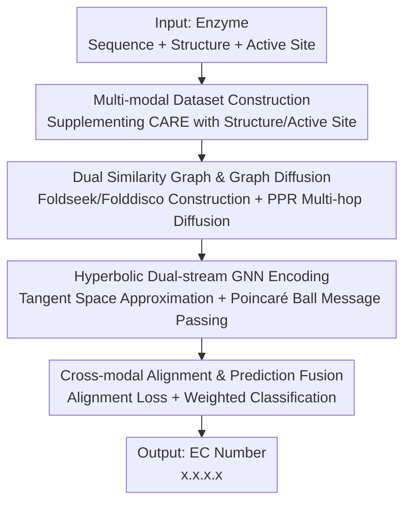

# PoinnCARE: Hyperbolic Multi-Modal Learning for Enzyme Classification

**Conference**: ICLR2026  
**OpenReview**: [https://openreview.net/forum?id=dGxAYNK6JU](https://openreview.net/forum?id=dGxAYNK6JU)  
**Code**: https://github.com/kkkkk001/PoinnCARE  
**Area**: Computational Biology / Enzyme Function Prediction  
**Keywords**: Enzyme Classification, EC number, Hyperbolic Space, Multi-modal Learning, Graph Diffusion

## TL;DR
PoinnCARE projects enzyme sequences, structures, and active site modalities into hyperbolic (Poincaré ball) space for joint encoding and alignment. It utilizes graph diffusion to complete sparse active site annotations and leverages hyperbolic geometry to faithfully preserve the tree-like hierarchy of the EC numbering system. It outperforms 12 SOTA methods across four test sets of the CARE benchmark, leading CLEAN by up to 10.4% in level-4 EC number prediction accuracy.

## Background & Motivation
**Background**: Enzyme functions are characterized by EC numbers (Enzyme Commission, a four-digit code `x.x.x.x`), which refine from 7 major categories at the first digit to over 4,900 specific reactions at the fourth, essentially forming a tree structure. Mainstream EC number prediction methods rely either on sequence alignment (BLASTp) or on contrastive learning to embed enzymes into Euclidean space for nearest neighbor retrieval (e.g., CLEAN using a triplet margin loss).

**Limitations of Prior Work**: There are two critical flaws. First, the EC system is a hierarchical tree, yet almost all methods embed enzymes in **Euclidean space**. The number of tree nodes grows exponentially with depth, while Euclidean volume only grows polynomially with the radius. This mismatch in growth rates means that high dimensions are required to embed trees with low distortion; in low dimensions, severe distortion occurs, directly degrading fine-grained (level-4) accuracy. Second, existing methods rely almost exclusively on sequence information, **neglecting structure and active sites**. However, the 3D arrangement of active site residues determines substrate binding and catalytic specificity; these residues are often scattered along the sequence and cannot be captured by sequence alone.

**Key Challenge**: The mismatch between hierarchical geometry and the representation space (tree vs. Euclidean), compounded by the scarcity of critical functional modalities (active sites). Experimentally verified active site annotations in UniProt cover only a small fraction of enzymes, leading to a severe modal imbalance between structure and active sites.

**Goal**: (1) Supplement the sequence-only CARE benchmark with structure and active site annotations; (2) Alleviate the sparsity of active site annotations; (3) Identify a representation space that faithfully carries the EC tree hierarchy.

**Key Insight**: The authors quantified the "tree-likeness" of the EC system using Gromov’s $\delta$-hyperbolicity—finding $\delta=0.01$ for the training set and $\delta=0.00$ for the test set (compared to 0.92 / 0.73 for random topologies). A $\delta$ closer to 0 indicates a stronger tree structure. This demonstrates that the EC system is naturally suited for negative-curvature hyperbolic space, where volume grows exponentially with radius, matching the expansion of tree nodes.

**Core Idea**: Sequence, structure, and active site modalities are projected into hyperbolic space after completing sparse data via graph diffusion. A dual-stream GNN encodes and aligns these modalities, utilizing the "correct geometry" to accommodate the "correct hierarchy" while supplementing the "correct modalities."

## Method

### Overall Architecture
PoinnCARE takes a multi-modal tuple $(q_x, s_x, a_x)$ (sequence, structure, active site) of an enzyme as input and outputs its EC number (multi-class multi-label). The pipeline consists of three stages: **Data Supplementation** (adding structure and active site annotations to the CARE benchmark) → **Topology Supplementation** (building similarity graphs for structure and active site modalities and using graph diffusion to complete sparse connections into multi-hop weighted graphs) → **Geometric Supplementation** (feeding the two enhanced graphs into independent hyperbolic GNNs, encoding in the Poincaré ball to preserve EC tree hierarchy, and using an alignment loss to bring representations of the same enzyme together).

### Key Designs

**1. Multi-modal Dataset Construction: Supplementing CARE with Three Modalities**

To address the limitation that existing methods ignore structure and active sites, the authors first expanded the data. The original CARE benchmark (from Swiss-Prot) only contains sequences. PoinnCARE supplements each enzyme with **structure** (from PDB experiments or AlphaFold2/ESMFold predictions) and **active sites** (from residues marked as "directly involved in catalysis" in UniProt). A key insight is that two enzymes can share the same EC number and active site but have entirely different sequences and global structures, making active sites a complementary signal.

**2. Dual Similarity Graph & Graph Diffusion: Recovering Sparse Connections**

To address the sparsity of active site annotations, two enzyme-enzyme similarity graphs are constructed for the structure and active site modalities, followed by graph diffusion. The structure graph uses **Foldseek** to measure structural similarity $\text{sim}^s(x_i,x_j)$, and the active site graph uses **Folddisco** to retrieve local motif similarity $\text{sim}^a(x_i,x_j)$. **Graph diffusion** is then applied to aggregate multi-hop neighbors:

$$A'_s = \sum_{k=0}^{\infty} w^s_k P_s^k, \qquad A'_a = \sum_{k=0}^{\infty} w^a_k P_a^k$$

Using personalized PageRank (PPR) weights $w^a_k = \alpha_a(1-\alpha_a)^k$, the diffusion creates weighted directed graphs $A'_s, A'_a$. This allows isolated enzymes under sparse annotation to receive information from functionally similar neighbors via multi-hop paths.

**3. Hyperbolic Dual-stream GNN Encoding: Preserving Hierarchy in Poincaré Ball**

To solve the distortion of EC trees in Euclidean space, enhanced graphs are processed by independent hyperbolic GNNs. Standard GNN operations are adapted via **tangent space approximation**: operations are performed in the tangent space $T_x\mathcal{B}^n_\kappa$ (isomorphic to Euclidean space) and mapped back via exponential $\exp_x$ and logarithmic $\log_x$ maps. Specifically, matrix multiplication and bias translation are defined as $W\otimes x = \exp_o(W\log_o(x))$ and $x\oplus b = \exp_x(PT_{o\to x}(b))$. The $(l+1)$-th layer aggregation is:

$$h^{(l+1)}_i = \delta\!\left(\exp_o\Big(\sum_{j\in N(i)} a_{ij}\,\log_o\big(h^{(l)'}_j\big)\Big)\right)$$

Hyperbolic GNNs faithfully preserve tree hierarchies with only $O(1+\epsilon)$ distortion in low dimensions (Theorem 1), whereas Euclidean space requires $O(\log n)$ dimensions.

**4. Cross-modal Alignment & Prediction Fusion: Fusing Complementary Information**

 Representations of the same enzyme across different modalities are aligned using an alignment loss:

$$\mathcal{L}_{align} = \|H^{(s)} - H^{(a)}\|_F^2 + w_d\big(\|I - H_{(s)}^\top H_{(s)}\|_F^2 + \|I - H_{(a)}^\top H_{(a)}\|_F^2\big)$$

The first term maximizes correlation, while the latter two are decorrelation regularizers to prevent representation collapse. The final prediction is a weighted sum of modality-specific classifiers: $\hat{Y} = \beta_s f^{(s)}_{clf}(H^{(s)}) + \beta_a f^{(a)}_{clf}(H^{(a)})$.

### Loss & Training
The total loss is $\mathcal{L} = \mathcal{L}_{align} + \gamma\mathcal{L}_{ce}$, where $\mathcal{L}_{align}$ ensures cross-modal consistency and $\mathcal{L}_{ce}$ handles EC classification. Training follows an inductive paradigm, using initial features from protein language models (PLMs) like ESM and 50% sequence clustering to enhance diversity as recommended by CARE.

## Key Experimental Results

### Main Results
PoinnCARE was compared against 12 SOTA methods (similarity retrieval, contrastive learning, PLMs, and LLMs) across four CARE benchmark test sets.

| Test Set / level-4 Accuracy | Ours (PoinnCARE) | Prev. SOTA | Gain |
|--------|------|------|------|
| <30% Identity (level-4) | **0.648** | CLEAN 0.535 | +10.4% |
| 30-50% Identity (level-4) | **0.822** | CLEAN 0.798 | +2.4% |
| Promiscuous (level-4) | **0.785** | CLEAN 0.691 | +9.4% |
| Price (level-1/2/3) | 0.955/0.909/0.827 | — | +1.7/3.1/3.0% |

The most significant lead in the low-homology set (<30% identity) confirms the value of structure, active sites, and hyperbolic hierarchy when sequence information fails.

### Ablation Study
Evaluation on the <30% identity test set for level-4 accuracy:

| Configuration | Key Variation (level-4) | Description |
|------|---------|------|
| MLP | Baseline | Primal classifier |
| +Hyperbolic | +9.3% | Transition to hyperbolic space (largest single contribution) |
| +Active site | Further gain | Addition of active site similarity graph |
| +Structure | Further gain | Addition of structure similarity graph |
| PoinnCARE (full) | +2.6% vs. structure-only | Addition of cross-modal alignment and fusion |

### Key Findings
- **Hyperbolic geometry is the primary contributor**: Moving from MLP to hyperbolic space yielded a 9.3% gain in level-4 accuracy, proving that "choosing the right geometry" is more critical than simply adding modalities.
- **Low-dimensional robustness**: When dimensions were reduced from 512 to 32, CLEAN's accuracy dropped by 18.1%, while PoinnCARE maintained 0.597 accuracy, validating hyperbolic low-distortion theory.
- **Modal Complementarity**: Active sites and structural information provide distinct benefits, and cross-modal alignment successfully fuses these complementary signals.

## Highlights & Insights
- **Verifying "tree-ness" via $\delta$-hyperbolicity**: By quantifying the hierarchy before applying hyperbolic models, the authors turned "geometric choice" into a measurable inductive bias.
- **Active site as an independent modality**: The motivation highlights how active sites provide orthogonal signals that sequence and global structure might miss.
- **Graph diffusion for sparse labels**: Transforming a data scarcity problem into a topological completion problem is an effective strategy for unbalanced multi-modal biological data.

## Limitations & Future Work
- **Active site annotation bottleneck**: Diffusion mitigates but does not solve the underlying lack of experimental ground truth.
- **Performance on Price test set**: Level-4 accuracy on the Price set remains challenging, indicating difficulties with mislabeled or extremely difficult samples.
- **Hyperparameter sensitivity**: The framework involves several parameters (thresholds, diffusion coefficients, modality weights) that require tuning for new datasets.
- **Future Directions**: Integrating end-to-end active site prediction or exploring more modalities like protein surfaces.

## Related Work & Insights
- **vs. CLEAN / CLEAN-Concat**: Unlike CLEAN's Euclidean contrastive retrieval, PoinnCARE preserves hierarchy via hyperbolic space and explicitly integrates the active site modality.
- **vs. Foldseek / Folddisco**: PoinnCARE reuses these as tools to build similarity graphs, upgrading "retrieval scores" into "learnable, hierarchy-aware embeddings."
- **vs. Top-EC / ProteinF3S**: These also use multi-modal fusion but remain in Euclidean space. PoinnCARE's core differentiator is its use of hyperbolic geometry for low-distortion embedding.

## Rating
- **Novelty**: ⭐⭐⭐⭐ Combines hyperbolic geometry, triple modalities (with active sites), and graph diffusion.
- **Experimental Thoroughness**: ⭐⭐⭐⭐⭐ Extensive benchmarks across four test sets and 12 baselines.
- **Writing Quality**: ⭐⭐⭐⭐ Clear motivation and robust mathematical justification.
- **Value**: ⭐⭐⭐⭐ Provides a plug-and-play, low-dimensional, and efficient framework for enzyme function prediction.

<!-- RELATED:START -->

## Related Papers

- [\[ICLR 2026\] OmniMouse: Scaling properties of multi-modal, multi-task Brain Models on 150B Neural Tokens](omnimouse_scaling_properties_of_multi-modal_multi-task_brain_models_on_150b_neur.md)
- [\[ACL 2025\] Align-Pro: Align Protein Representations Through Multi-Modal Learning](../../ACL2025/computational_biology/align-pro_align_protein_representations_through_multi-modal_learning.md)
- [\[CVPR 2026\] Deciphering Genotype-Phenotype Mechanisms from High-Content Profiling via Knowledge-Guided Multi-modal Graph Learning](../../CVPR2026/computational_biology/deciphering_genotype-phenotype_mechanisms_from_high-content_profiling_via_knowle.md)
- [\[CVPR 2026\] HyperST: Hierarchical Hyperbolic Learning for Spatial Transcriptomics Prediction](../../CVPR2026/computational_biology/hyperst_hierarchical_hyperbolic_learning_for_spatial_transcriptomics_prediction.md)
- [\[CVPR 2026\] Cross-Slice Knowledge Transfer via Masked Multi-Modal Heterogeneous Graph Contrastive Learning for Spatial Gene Expression Inference](../../CVPR2026/computational_biology/cross-slice_knowledge_transfer_via_masked_multi-modal_heterogeneous_graph_contra.md)

<!-- RELATED:END -->
