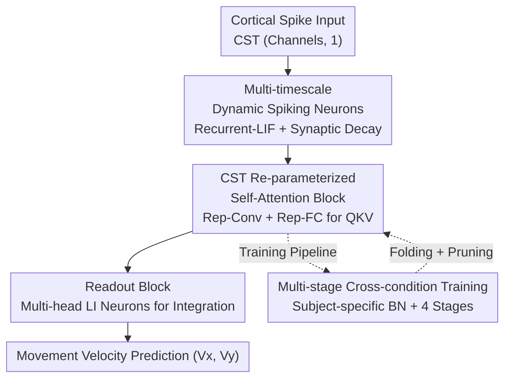

# Pretraining with Re-parametrized Self-Attention: Unlocking Generalization in SNN-Based Neural Decoding Across Time, Brains, and Tasks

**Conference**: ICLR 2026  
**OpenReview**: [https://openreview.net/forum?id=ZsvGCzpaVD](https://openreview.net/forum?id=ZsvGCzpaVD)  
**Code**: https://github.com (The paper refers to "RAT SNN GitHub", specific URL TBD ⚠️ subject to the original text)  
**Area**: Computational Neuroscience / Spiking Neural Networks / BCI Neural Decoding  
**Keywords**: Spiking Neural Networks (SNN), Re-parameterized Self-Attention, Brain-Computer Interface (BCI), Cross-condition Pre-training, Low-power Decoding

## TL;DR
This paper proposes RAT SNN—a lightweight spiking neural network that integrates "re-parameterized spiking self-attention + multi-timescale spiking neurons + multi-stage cross-condition pre-training." Designed to decode motor intent from cortical spike trains, it achieves accuracy comparable to mainstream ANN decoders with only 600,000 parameters and pure addition (AC) operations during inference. It enables rapid generalization across time, subjects, and tasks, targeting the strict power constraints of fully implantable brain-computer interfaces (fully iBMI).

## Background & Motivation
**Background**: Implantable brain-computer interfaces (iBMI) capture high-fidelity neural signals through cortical microelectrode arrays, enabling applications like robotic arm control and text generation. The recent emergence of large-scale neural activity datasets has spurred the development of "neural decoding foundation models" (e.g., POYO, NDT3) that follow the "data scaling + Transformer" paradigm.

**Limitations of Prior Work**: These ANN-based foundation models rely on large models and significant computational power, which conflicts with the reality of "fully implantable iBMI." Fully implantable interfaces remove transcutaneous pedestals to reduce infection risk, protect privacy, and support long-term adaptation, but at the cost of extremely strict constraints on decoder energy consumption, model size, and latency. Meanwhile, although Spiking Neural Networks (SNNs) are inherently low-power (using accumulate-only AC operations instead of multiply-accumulate MAC) and naturally fit discrete cortical spike trains (CST), existing SNN decoder architectures are either too simple to reach sufficient accuracy or introduce MAC operations to incorporate attention mechanisms (e.g., SNN3d, Spikachu using ANN harmonizers), deviating from the low-power essence of SNNs.

**Key Challenge**: High accuracy, strong generalization, and low computational cost are difficult to satisfy simultaneously. ANNs provide accuracy and generalization but at high computational costs; pure SNNs save power but lack accuracy and generalization. The root cause is the intrinsic variability of neural activity (inter-subject differences, inter-task differences, and temporal drift within the same subject), making it difficult for a single model to transfer across these distributions; compensating for this variability often requires increasing model complexity.

**Goal**: To build a CST decoder that is simultaneously "accurate, generalizable, and power-efficient," while establishing it as a prototype for an SNN foundation model capable of cross-time/subject/task generalization.

**Key Insight**: The authors found that structural re-parameterization (derived from RepVGG) is particularly useful for SNNs—using BatchNorm and multi-branch structures during training to improve performance and convergence, and collapsing these structures into a single linear connection during inference to maintain pure AC operations between neurons. This allows for "rich expression during training + pure addition during inference," resolving the conflict between accuracy and power consumption.

**Core Idea**: Replace heavy tokenizers and deep Transformers with "re-parameterized spiking self-attention," combined with multi-timescale spiking neurons and a multi-stage cross-condition pre-training pipeline that gradually narrows down from coarse to fine data granularity. This achieves ANN-level accuracy and cross-condition generalization within a pure SNN framework (AC-only inference).

## Method

### Overall Architecture
RAT SNN is a compact decoder with only 4 layers of LIF neurons. Each time step receives cortical spike inputs of dimension (CST channels, 1) and outputs 2D forelimb movement velocities $(V_x, V_y)$. It consists of two sequential modules: the **CST Re-parameterized Attention Block** extracts spatiotemporal features, and the **Readout Block** converts discrete spikes into continuous velocities. Three key contributions are embedded in this backbone: ① Dynamic spiking neurons with recurrent connections (capturing multi-timescale dynamics); ② CST re-parameterized self-attention (efficient training, pure AC inference); ③ Subject-specific BN + multi-stage cross-condition training framework (improving generalization).

The overall data flow is: Spike input → Re-parameterized Attention Block (internal Recurrent-LIF neurons + Rep-Conv/Rep-FC to calculate Q/K/V with linear attention) → Readout Block (Multi-head LI neurons for smooth integration) → Velocity prediction. The "growth" of the model relies on an external four-stage training pipeline: narrowing from the broadest cross-condition pre-training down to cross-session retraining, single-session fine-tuning, and finally optional lightweight fine-tuning (re-parameterization folding + pruning).

### Key Designs

**1. Multi-timescale Dynamic Spiking Neurons: Capturing rhythms via Recurrent-LIF + Synaptic Decay**

Neural activity spans multiple timescales, yet standard feedforward LIF neurons only have a single membrane potential leakage, failing to capture long-range rhythms. This work upgrades the basic unit to **Recurrent-LIF**: building on standard LIF discrete dynamics (membrane potential $H[t]=\alpha V_{mem}[t-1]+V_{syn}[t-1]$, firing spike $S[t]$ via Heaviside function after exceeding threshold $V_{th}$ and resetting), it introduces recurrent connections and independent decay to the synaptic potential:

$$V^l_{syn}[t]=\sum_{i} f^l_{op_i}(S^u_i[t]) + f^l_{Rec}(S^l[t-1]) + \beta^l V^l_{syn}[t-1]$$

where $f^l_{op}$ is the feedforward connection from upstream spikes $S^u$ ($i$ denotes different branches), $f^l_{Rec}$ is the intra-layer recurrent connection (implemented via re-parameterized fully connected layers), and $\beta<1$ is the synaptic decay factor. Recurrent FC creates self-looping dynamics within the layer, which, combined with inter-layer connections, simulates the "long-range projection paths + local micro-circuits" coexisting in biological neural systems. Intra-layer heterogeneity allows different neurons to naturally cover different time constants. The readout block uses 5 heads, each with 2 LI (Leaky Integrator, LIF without firing) neurons to smoothly integrate discrete spikes $S[t]$ into continuous velocities, mimicking the smooth movement of muscle groups.

**2. CST Re-parameterized Self-Attention: Linear Attention + Dual Conv/FC + Surrogate Shortcut**

Directly adopting Spiking Transformers brings two problems: high attention complexity and deep networks that harm CST decoding accuracy and real-time performance. This paper introduces three modifications. First, it utilizes the binary nature of SNNs to reduce attention complexity from $O(n^2 d)$ to $O(nd^2)$ via linear attention: $\text{Attention}_{si}=\text{RLIF}((Q_{si}K_{si}^T)V_{si})=\text{RLIF}(Q_{si}(K_{si}^T V_{si}))$, integrating the output into the temporal dynamics of Recurrent-LIF. Second, considering discontinuous electrode channel indices and inter-subject differences, Q/K/V are obtained by summing parallel Conv and FC paths—FC captures global features, while Conv captures local features between CST channels: $Q_s/K_s/V_s=\text{RLIF}(\text{Rep-Conv}(X_{CST})+\text{Rep-FC}(X_{CST}))$. Third, it collapses the classic 5-layer MLP + output layer into 3 layers and replaces the membrane potential shortcut with a "surrogate shortcut": $U_s=\text{RLIF}(\text{Attention}_s+\text{Rep-FC}(X_{CST}))$. The surrogate shortcut also allows the attention output dimension to exceed $n \times d$ (adjustable MLP size), enhancing expressiveness without increasing depth.

**3. Structural Re-parameterization (Rep-Conv / Rep-FC): The key switch for rich training structure and pure AC inference**

This is the core mechanism enabling both "training performance" and "inference efficiency." During training, **Rep-Conv** uses multiple parallel branches ($1\times1$, $3\times1$, optional larger kernels, and an identity mapping treated as a $0$-kernel convolution), with each branch followed by BN: $\text{Rep-Conv}(X_c)=\sum_{i\in K}\text{BN}_i(W_i * X_c + b_i)$. **Rep-FC** is implemented as $\text{Rep-FC}(X_f)=\text{BN}(WX_f)$. These BNs and multi-branch structures stabilize training and accelerate convergence. During inference, BN statistics $\mu_i,\sigma_i,\gamma_i,\beta_i$ are absorbed into weights and biases ($W_i^{Rep}=\frac{W_i}{\sqrt{\sigma_i^2+\epsilon}}\gamma_i$, $b_i^{Rep}=\frac{b_i-\mu_i}{\sqrt{\sigma_i^2+\epsilon}}\gamma_i+\beta_i$, with branches padded to the maximum kernel), and branches are collapsed into single linear connections. After folding, only linear operations remain between neurons, which, combined with binary spike inputs, requires only AC (Addition) and no MAC (Multiply-Accumulate), strictly preserving the low-power nature of SNNs.

**4. Subject-specific BN + Multi-stage Training Framework: Absorbing drift via lightweight BN layers**

Neural variability often leads to poor generalization when a model trained across conditions is directly transferred to a specific session. Leveraging re-parameterization, the authors assign an independent set of BNs to each condition (replacing heavy tokenizers like those in POYO). These BNs can be seamlessly fused into the linear operations between spiking neurons, adding zero inference overhead. Training follows four stages: (a) **Cross-condition pre-training**—training on multiple subjects/tasks, dynamically switching BNs based on the subject ID in the current batch to absorb distribution drift; (b) **Cross-session re-training**—training on multiple sessions of a target condition with fixed BN sets; (c) **Single-session fine-tuning**—fine-tuning on the target session (can be skipped if only cross-session/task generalization is studied); (d) **Lightweight fine-tuning (optional)**—applying an activity upper bound (AUB) to LIF neurons to reduce firing rates, followed by iterative pruning (masking the smallest $p$ ratio of weights) and retraining to further compress model size and computation.

### Loss & Training
The decoding target is the regression of 2D movement velocities, using $R^2$ as the primary evaluation metric. The core training strategy follows the four-stage pipeline. During the lightweight stage, AUB regularizes firing rates, and iterative pruning compresses RAT SNN-CC into RAT SNN-CC-P (reducing parameters from ~600K to ~150K).

## Key Experimental Results

The dataset integrates electrophysiological recordings from 6 monkeys across 103 sessions (M1/PMd/S1), covering three task types: Random Target Task (RTT), Maze reaching (MAZE), and Center-Out (CO).

### Main Results

On the NHP datasets ($R^2\times100$), RAT SNN leads the SNN field and matches or exceeds mainstream ANNs:

| Model | Monkey I | Monkey L | Average |
|------|----------|----------|------|
| AEGRU (ANN) | 72.00 | 67.00 | 69.50 |
| POYO-CS (ANN) | 70.99 | 69.63 | 70.31 |
| bigRSNN-CS (SNN, Prev. Best) | 70.89 | 68.70 | 69.79 |
| RAT SNN-SS (Single Session) | 72.22 | 66.30 | 69.26 |
| RAT SNN-CS (Cross Session) | 74.26 | 68.63 | 71.45 |
| **RAT SNN-CC (Cross Condition)** | 74.06 | **70.40** | **72.23** |

On NLB RTT (Monkey I), RAT SNN-SS achieved 76.34, significantly outperforming POYO-1 (73.78) which was pre-trained on 11.8M parameters; RAT SNN-CC further improved to 78.70. These results were achieved with ~600K parameters, far fewer than bigRSNN (1.2M) and POYO-SS (1.9M).

### Ablation Study

Attention block architecture ablation (Monkey C05, $R^2\times100$):

| Configuration | C05 2022 | C05 2025 | Note |
|------|----------|----------|------|
| SDT SNN (Classic Spiking Transformer) | 80.09 | 65.21 | Baseline |
| RAT SNN-192 (Output dim = Input dim) | 80.49 | 66.61 | No dim expansion |
| RepFC SNN-H1 / H3 | 81.09 / 79.47 | 66.26 / 65.74 | Pure recurrent FC baseline |
| **RAT SNN-SS (MLP size=512)** | **81.58** | **66.71** | Expanded output dim via surrogate shortcut |

Re-parameterization ablation (Monkey C05):

| Configuration | $R^2\times100$ | Convergence Epoch |
|------|----------------|------------|
| w/o re-param | 67.58 | 545 |
| **RAT SNN-SS** | **81.58** | **179** |

Synaptic operation comparison (Energy proxy):

| Model | Effective MAC | Effective AC |
|------|----------|---------|
| POYO | 1,730,507 | 810,339 |
| bigRSNN | 0 | 42,003 |
| RAT SNN-CC | 0 | 65,307 |
| **RAT SNN-CC-P (Pruned)** | **0** | **21,020** |

### Key Findings
- **Re-parameterization drives both performance and convergence**: Removing it causes $R^2$ to drop by 17.16% and triples convergence epochs, highlighting the importance of rich training structures (multi-branch + BN) for SNN stability.
- **Surrogate shortcuts for dimension expansion provide clear gains**: RAT SNN-192 → RAT SNN-512 shows monotonic improvement, validating the design of "adjusting width instead of depth."
- **Pure AC inference is power-efficient**: RAT SNN consumes zero MACs during inference. The pruned RAT SNN-CC-P uses only ~21K ACs with ~150K parameters, with no significant drop in performance (Wilcoxon test, p=0.3828). Given a MAC is ~31x more energy-intensive than an AC, the performance-to-power ratio far exceeds ANNs like POYO or AEGRU.
- **Cross-condition pre-training enables generalization**: Even when transferred to completely unseen subjects performing unseen tasks (RTT-joystick), RAT SNN-CC converges faster and performs better than training from scratch.

## Highlights & Insights
- **Decoupling "Rich Training" from "Slim Inference"**: Using structural re-parameterization to fold training-time BN and multi-branches into inference-time linear layers allows SNNs to benefit from modern training techniques while adhering to pure AC low-power requirements.
- **Replacing heavy tokenizers with subject-specific BN**: While POYO relies on UnitEmbed/tokenizers for cross-subject differences, this work demonstrates that collapsible condition-specific BNs can absorb distribution drift with nearly zero additional inference cost.
- **Multi-stage training from coarse to fine**: The hierarchy of cross-condition → cross-session → single-session → pruning provides a clear paradigm for adapting foundation models to specific individuals in resource-constrained scenarios.

## Limitations & Future Work
- The experiments were conducted on monkey motor cortex (M1/PMd/S1) for 2D velocity decoding; generalization to humans, other brain regions, or complex targets (e.g., speech) remains unverified.
- Although described as a "foundation model prototype," the data scale (6 monkeys, 103 sessions) is small compared to NLP/CV foundation models; "scaling laws" were not fully tested.
- Evaluation relies on $R^2$ and offline synaptic operation counts (NeuroBench); actual power consumption, latency, and long-term stability on implantable hardware haven't been measured.
- The code link is a placeholder ("RAT SNN GitHub"); reproducibility depends on actual availability (⚠️ per original text).

## Related Work & Insights
- **vs POYO / NDT3**: These follow the ANN foundation model path ("scaling Transformer"), using tokenizers/UnitEmbed for cross-subject variability, resulting in high params and MACs. RAT SNN achieves comparable or better accuracy with pure SNNs + re-parameterization + condition-specific BN at ~1/3 the parameters and zero MACs.
- **vs bigRSNN**: The previous SNN CST decoder baseline used cross-session pre-training but had a simpler architecture and lacked a cross-condition foundation model design. RAT SNN achieves higher accuracy with fewer parameters (150K vs 1.2M) using spiking self-attention and dynamic neurons.
- **vs SNN3d / Spikachu**: SNN3d introduces MACs for performance, and Spikachu uses ANN harmonizers for variability, both deviating from pure SNN principles. RAT SNN remains "orthodox" with pure AC inference.

## Rating
- Novelty: ⭐⭐⭐⭐ Systematically integrates re-parameterization, spiking attention, and multi-stage pre-training for iBMI; solid combination of innovations.
- Experimental Thoroughness: ⭐⭐⭐⭐ Covers multiple datasets, subjects, and generalization types with architectural/power ablations; comprehensive but lacks hardware testing.
- Writing Quality: ⭐⭐⭐⭐ Clear logic in motivation and methods; well-supported by formulas and diagrams.
- Value: ⭐⭐⭐⭐ Provides a "precise + generalizable + efficient" prototype for fully implantable iBMI, offering practical significance for low-power neural decoding.

<!-- RELATED:START -->

## Related Papers

- [\[ICLR 2026\] Animal behavioral analysis and neural encoding with transformer-based self-supervised pretraining](animal_behavioral_analysis_and_neural_encoding_with_transformer-based_self-super.md)
- [\[ICLR 2026\] Continuous Multinomial Logistic Regression for Neural Decoding](continuous_multinomial_logistic_regression_for_neural_decoding.md)
- [\[ICLR 2026\] CellDuality: Unlocking Biological Reasoning in LLMs with Self-Supervised RLVR](cellduality_unlocking_biological_reasoning_in_llms_with_self-supervised_rlvr.md)
- [\[ICLR 2026\] Only Brains Align with Brains: Cross-Region Alignment Patterns Expose Limits of Normative Models](only_brains_align_with_brains_cross-region_alignment_patterns_expose_limits_of_n.md)
- [\[ICLR 2026\] Decoding Dynamic Visual Experience from Calcium Imaging via Cell-Pattern-Aware Pretraining](decoding_dynamic_visual_experience_from_calcium_imaging_via_cell-pattern-aware_p.md)

<!-- RELATED:END -->
