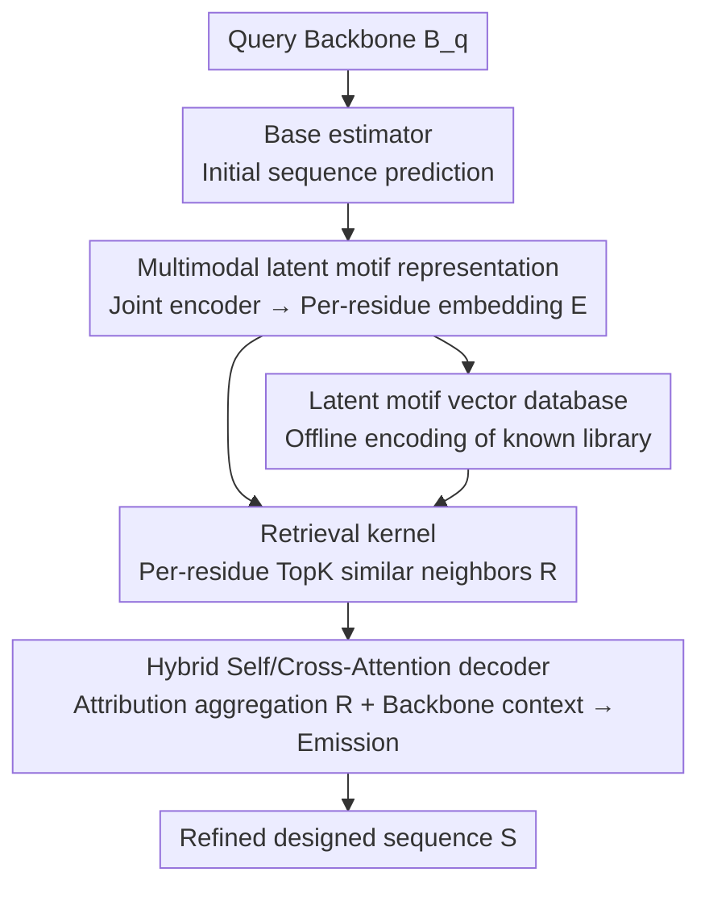

# PRISM: Enhancing Protein Inverse Folding through Fine-Grained Retrieval on Structure-Sequence Multimodal Representations

**Conference**: ICLR 2026  
**OpenReview**: [https://openreview.net/forum?id=qsthLLlCtl](https://openreview.net/forum?id=qsthLLlCtl)  
**Code**: None  
**Area**: Computational Biology / Protein Design / Retrieval-Augmented Generation  
**Keywords**: Inverse Folding, Retrieval Augmentation, Latent Variable Model, Multimodal Representation, Protein motif

## TL;DR
PRISM introduces "Retrieval-Augmented Generation (RAG)" into protein inverse folding: it retrieves fine-grained structure-sequence motif representations for each residue from a database of known proteins, then utilizes a hybrid self/cross-attention decoder to integrate these local fragments into the backbone context. This pushes SoTA perplexity and amino acid recovery rates higher with minimal additional inference overhead (+14%).

## Background & Motivation
**Background**: Inverse folding aims to solve the inverse problem of AlphaFold—designing an amino acid sequence $S$ that folds into a given 3D backbone $B$. Mainstream approaches model the backbone as a residue-level graph $G$, using Graph Neural Networks (GNNs) or Transformers to predict the probability $P(S\mid B)=\prod_j P(S_j\mid B)$. Representative works include ProteinMPNN and PiFold (efficient encoder-decoders), as well as LM-Design, DPLM, and AIDO.Protein, which leverage pre-trained protein language models with up to billions of parameters.

**Limitations of Prior Work**: Existing models are "monolithic" encoders where all knowledge is compressed into network weights. They lack an **explicit mechanism to reuse fine-grained structure-sequence patterns (motifs)** that appear repeatedly and are evolutionarily conserved in natural proteins. Similar local 3D conformations often correspond to similar local sequences across different proteins. Such transferable "local folding rules" are vital for stability and function, but end-to-end generative models can only utilize them implicitly and uncontrollably.

**Key Challenge**: Inverse folding is essentially an underdetermined problem—many different sequences can fold into the same structure, and success often hinges on local details. Storing all "local experience" within fixed weights makes it difficult to learn comprehensively and prevents the explicit utilization of diverse known proteins during inference.

**Goal**: To equip inverse folding with an "external memory," allowing each residue's prediction to be explicitly guided by retrieved local fragments while maintaining theoretical consistency and computational efficiency.

**Key Insight**: The authors define "each residue + its local 3D neighborhood" as a **potential motif**, serving as a retrievable and reusable basic unit. This transforms inverse folding from "pure generation" to "generation + memory-based retrieval."

**Core Idea**: Residue-level (fine-grained) multimodal RAG—retrieve embeddings of potential motifs, aggregate them with the global backbone context using a hybrid decoder, and emit refined sequences.

## Method

### Overall Architecture
PRISM is a **residue-level multimodal retrieval-augmented generation framework**. It first uses a joint encoder to map "structure + sequence" into per-residue embeddings (which summarize local motifs around those residues); this encoder is used to offline encode a database of known proteins into a **latent motif vector database**. During inference, a base estimator is used to predict an initial sequence for the query backbone to generate query embeddings, followed by per-residue retrieval of Top-K similar neighbors. Finally, a hybrid self/cross-attention decoder aggregates the retrieved fragments with the backbone encoding to emit the refined sequence.

The methodology is organized as a **latent variable probabilistic model**, where the joint distribution is factorized into four steps: representation → retrieval → attribution → emission:
$$p(S,E,R,Z\mid B,D)=p(E\mid B)\,p(R\mid E,D)\,p(Z\mid R,E,B)\,p(S\mid Z,R,E,B)$$
where $E$ is the latent motif representation, $R$ is the retrieval hypothesis, and $Z$ is the attention variable representing how retrieved neighbors are attributed to sites. By applying a deterministic approximation (Top-K for retrieval and attention weights for attribution), the objective collapses into standard per-residue cross-entropy.

### Key Designs

**1. Multimodal Potential Motif Representation: Enabling local motif semantics in embeddings**

To address the limitation that monolithic encoders cannot explicitly reuse conserved local patterns, PRISM prepares a **self-contained fine-grained unit** for retrieval. It defines each residue along with its local 3D neighborhood as a potential motif, using a joint encoder $G$ that processes both structure and sequence: $E=G(P)=G(B,S)\in\mathbb{R}^{L\times d}$. Importantly, $E_i$ is not just a representation of the $i$-th amino acid; it contextualizes the local 3D neighborhood of residue $i$ and its position within the global protein. Thus, **the same embedding serves as a query/key for retrieval and directly participates in sequence emission**. The paper uses AIDO.Protein-IF as the joint encoder and also provides a structure-only variant, PRISM (str. enc.), using ProteinMPNN-CMLM to isolate the contributions of "retrieval" versus "multimodality."

**2. Latent Motif Vector Database: Externalizing local experience as retrievable prior memory**

Inverse folding models implicitly store local folding rules in weights, which is neither comprehensive nor controllable. PRISM externalizes this knowledge as a **fixed prior memory**: given $M$ known structure-sequence pairs $\{(B_p,S_p)\}$, each is encoded using $E=G(P)$ to create a database $D=\{(E^p_r,r,p)\}$, where each $E^p_r$ summarizes the local motif around residue $r$ in protein $p$. Implementation-wise, the database is built using the CATH-4.2 training set, and retrieval runs on the GPU, making the search time negligible. A key design insight is that once the database achieves near-complete coverage of the motif space (measured by ε-coverage), **adding new PDB entries leads to diminishing returns** (AAR remains ~64.6% on CAMEO 2022), justifying the use of a fixed prior library.

**3. Retrieval Kernel: Efficient approximation with deterministic Top-K**

In the latent variable formulation, the retrieval kernel is $p(R\mid E,D)=\prod_i p(R_i\mid E_i,D)$. PRISM provides two instantiations: a **trainable stochastic kernel**, which defines a distribution over residue-level neighbors (including a KL regularization term), and the default **deterministic Top-K operator** $p(R_i\mid E_i,D)=\delta\!\big(R_i-\mathrm{TopK}(E_i;D)\big)$, which fixes retrieval to the Top-K neighbors using a Dirac distribution. The deterministic version requires minimal computation (average retrieval takes ~ $1.2\times10^{-3}$ seconds per protein) while achieving SoTA results. Ablations show that PPL decreases as $K$ increases but saturates quickly; $K=35$ is chosen as the default.

**4. Hybrid Self/Cross-Attention Decoder (MHSCA): Fragment "absorption" and "mutual refinement"**

Retrieval provides candidates but not how to use them. PRISM implements **attribution** via an aggregation-generation module $F_{\theta_Z}$ consisting of $T$ hybrid Transformer blocks. Each head calculates attention weights $\alpha^{(t,h)}_{ik}=\mathrm{softmax}_k\big(\langle q^{(t,h)}_i,k^{(t,h)}_{ik}\rangle/\sqrt{d_h}\big)$. The key to the "Hybrid" approach is that **cross-attention** allows each site to "absorb" its retrieved fragments, while **self-attention** allows these absorbed fragments to propagate between residues for joint refinement. Ablations show that using only cross-attention (removing self-attention) leads to performance drops across all benchmarks (e.g., CATH-4.2 test AAR 60.43 → 59.26).

### Loss & Training
Under the deterministic approximation (Top-K retrieval and attention-based attribution), the objective collapses into standard Maximum Likelihood Estimation (MLE)—per-residue cross-entropy: $\hat\theta=\arg\max_\theta \mathbb{E}_p[\log p_\theta(S\mid\cdot)]$, where $\theta=\{\theta_Z,\theta_B\}$ are the parameters of the decoder and structure encoder. If the trainable stochastic retrieval kernel is used, an additional KL regularization term is added. Inference uses deterministic decoding (deterministic retrieval + argmax on output logits).

## Key Experimental Results

### Main Results
On five benchmarks—CATH-4.2, TS50, TS500, CAMEO 2022, and PDB date split—PRISM (using AIDO.Protein-IF as the base estimator and joint encoder, denoted as PRISM$_{aido}$) achieves new SoTA results in both sequence metrics (PPL↓ / AAR↑) and foldability metrics (RMSD↓ / sc-TM↑ / pLDDT↑).

| Dataset | Metric | PRISM$_{aido}$ (Ours) | AIDO.Protein-IF (Prev. SOTA) | Gain |
|--------|------|------|----------|------|
| CATH-4.2 (All) | PPL ↓ | 2.71 | 2.94 | -0.23 |
| CATH-4.2 (All) | AAR % ↑ | 60.43 | 58.60 | +1.83 |
| TS50 | AAR % ↑ | 67.92 | 66.19 | +1.73 |
| TS500 | AAR % ↑ | 70.53 | 69.66 | +0.87 |
| CAMEO 2022 | AAR % ↑ | 64.63 | 63.52 | +1.11 |
| PDB date split | AAR % ↑ | 67.47 | 66.27 | +1.20 |

On average, PRISM reduces PPL from 2.68 to 2.43 (~9.3%) and increases AAR from 63.0% to 66.9% (+3.9 absolute points). Total inference time is 1.05s/protein vs 0.92s for the base model, representing only a 14.3% increase in overhead.

### Ablation Study

| Configuration | CATH-4.2 test AAR % | Description |
|------|---------|------|
| PRISM (full, MHSCA) | 60.43 | Full hybrid self/cross-attention |
| w/o MHSA (Cross-attention only) | 59.26 | Removing self-attention drops performance |
| base est. (No retrieval/decoding) | 58.60 | AIDO.Protein-IF only |
| MHSCA blocks = 1 / 2 / 3 | 60.23 / 60.43 / 60.35 | Saturates at 2 blocks |

### Key Findings
- **Retrieval is the core contribution**: In a structure-only restricted setting (PRISM str. enc.), retrieval alone consistently outperforms ProteinMPNN-CMLM, proving it provides complementary local context.
- **Self-attention is indispensable**: Removing MHSA causes performance drops across all benchmarks, indicating that retrieved fragments must be propagated and aligned across residues.
- **Saturation of retrieval database**: Performance gains plateaus once the database covers the motif space, supporting the "fixed prior library" design.
- **Greatest gain on short proteins**: AAR improvements are most significant for proteins with <200 residues, typically the most challenging range for inverse folding.
- **Generalization to orphan proteins**: Improve foldability even on orphan proteins with no homologous sequences, suggesting the model utilizes structural context rather than just memorizing sequences.

## Highlights & Insights
- **Clean translation of RAG to inverse folding**: This is the first fine-grained RAG framework for inverse folding. The "per-residue + local neighborhood = potential motif" definition makes the retrieval unit naturally self-contained—an abstraction likely transferable to other tasks like RNA or ligand pocket design.
- **Bridge between theory and engineering**: Formalizing the process as a latent variable model allows for future trainable stochastic kernels while maintaining a high-performance deterministic implementation with nearly zero extra overhead.
- **Efficiency**: A 14% increase in inference time for a +3.9 AAR gain is highly practical for protein engineering.
- **The "Saturated Library" Insight**: The ε-coverage argument provides a rigorous justification for using a fixed database rather than an infinitely expanding index.

## Limitations & Future Work
- The joint learning of the amortized posterior for $E$ and $Z$ is left for future work; the current deterministic approximation might not fully exploit the capacity of the latent variable model.
- Performance remains constrained by the coverage of the database, particularly for entirely novel folds (orphan proteins) where RMSD improvements are more limited.
- The framework relies on a strong base estimator (e.g., the billion-parameter AIDO.Protein-IF), so its utility in resource-constrained scenarios needs further evaluation.

## Related Work & Insights
- **vs ProteinMPNN / PiFold**: These are monolithic encoders that store local rules implicitly; PRISM externalizes these rules as retrievable memory. 
- **vs LM-Design / DPLM / AIDO.Protein**: These rely on massive pre-trained language models for implicit memory; PRISM builds on top of them with explicit retrieval, pushing PPL and AAR further.
- **vs Text RAG**: While conceptually similar, PRISM’s retrieval units are multimodal per-residue motifs, and the integration is handled by a specialized transition from latent variables to hybrid attention rather than simple concatenation.

## Rating
- Novelty: ⭐⭐⭐⭐⭐ First residue-level RAG for inverse folding with a clean formalization.
- Experimental Thoroughness: ⭐⭐⭐⭐⭐ Comprehensive coverage across benchmarks, orphan proteins, and multiple ablation axes.
- Writing Quality: ⭐⭐⭐⭐ Clear theoretical framework, though some derivation details are moved to the appendix.
- Value: ⭐⭐⭐⭐⭐ Efficient SoTA performance boost that is highly practical for the field.

<!-- RELATED:START -->

## Related Papers

- [\[ICLR 2026\] Property-Driven Protein Inverse Folding with Multi-Objective Preference Alignment](property-driven_protein_inverse_folding_with_multi-objective_preference_alignmen.md)
- [\[ICLR 2026\] VenusX: Unlocking Fine-Grained Functional Understanding of Proteins](venusx_unlocking_fine-grained_functional_understanding_of_proteins.md)
- [\[AAAI 2026\] BeeRNA: Tertiary Structure-Based RNA Inverse Folding Using Artificial Bee Colony](../../AAAI2026/computational_biology/beerna_tertiary_structure-based_rna_inverse_folding_using_artificial_bee_colony.md)
- [\[ICLR 2026\] FlexRibbon: Joint Sequence and Structure Pretraining for Protein Modeling](flexribbon_joint_sequence_and_structure_pretraining_for_protein_modeling.md)
- [\[ICLR 2026\] Multi-state Protein Sequence Design with DynamicMPNN](multi-state_protein_sequence_design_with_dynamicmpnn.md)

<!-- RELATED:END -->
