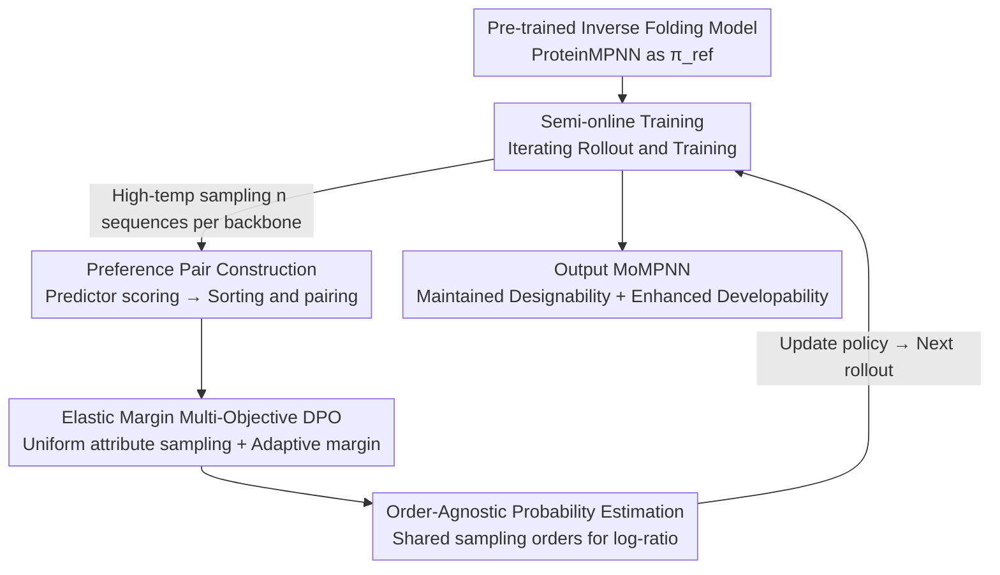

# Property-Driven Protein Inverse Folding with Multi-Objective Preference Alignment

**Conference**: ICLR 2026  
**OpenReview**: [https://openreview.net/forum?id=m826DekCpp](https://openreview.net/forum?id=m826DekCpp)  
**Code**: https://github.com/Qivon7/MoMPNN  
**Area**: Computational Biology / Protein Design / Preference Alignment  
**Keywords**: Inverse folding, protein sequence design, multi-objective preference alignment, semi-online DPO, developability

## TL;DR
Ours proposes ProtAlign, a semi-online DPO framework with "elastic preference margins" to fine-tune pre-trained inverse folding models. It optimizes multiple conflicting "developability" attributes (solubility, thermal stability) while maintaining "designability" (sequence-to-structure fidelity). MoMPNN, implemented on ProteinMPNN, outperforms baselines specialized for single attributes across crystal structures, de novo backbones, and real binder design tasks.

## Background & Motivation

**Background**: Inverse folding is a core task in protein design—generating a compatible amino acid sequence $y$ given a backbone structure $x$. Models like ProteinMPNN, ESM-IF, and PiFold achieve high sequence recovery. Recently, post-training via preference optimization (DPO/GRPO) has further improved sequence quality (e.g., ProteinDPO, ResiDPO, ProteinZero).

**Limitations of Prior Work**: Real-world design pipelines require more than just "recovering a sequence." Proteins must be both **designable** (folding into the target backbone) and **developable** (meeting downstream indicators like solubility, thermal stability, and expression). Existing methods to include developability have flaws: ① **Post-hoc mutation**—searching for beneficial mutations after generation is sparse and difficult; ② **Inference-time biasing**—adjusting sampling probabilities or using reward guidance is unstable and sensitive to hyperparameters; ③ **Subset retraining**—retraining on filtered data with specific attributes (e.g., SolubleMPNN, HyperMPNN) lacks generalization to diverse goals and is often "target-dependent."

**Key Challenge**: Developability metrics (solubility, stability) **do not directly measure sequence-structure consistency**. Optimizing solely for them often destroys designability—typical in HyperMPNN, where thermal stability improves but designability drops significantly. Furthermore, multiple developability goals often conflict (e.g., increasing solubility may decrease stability). The key difficulty lies in **simultaneously** optimizing conflicting attributes while preserving structural fidelity.

**Goal**: Align inverse folding models with "designability + arbitrary developability attributes" without curating specialized datasets or fine-tuning hyperparameters for every attribute.

**Key Insight**: Treat the task as a **multi-objective preference alignment** problem. Use existing in silico property predictors as "cheap annotators" to score candidate sequences and construct preference pairs. Learned implicit rewards via DPO-style loss bypass explicit reward modeling and dataset curation.

**Core Idea**: Use a **semi-online DPO with elastic preference margins**. The margin automatically narrows when a sample winning in one attribute is worse in others, reconciling objective conflicts. The semi-online approach decouples rollout/annotation from training, avoiding repeated predictor calls and significantly saving computation.

## Method

### Overall Architecture

ProtAlign treats a pre-trained inverse folding model (ProteinMPNN) as the initial policy $\pi_\text{ref}$ and iterates between "rollout (sampling+annotation)" and "training (updating)" phases. In one iteration: the current policy $\pi_\theta^t$ generates multiple candidates at high temperature $\tau$ for sampled backbones → $K$ property predictors $\{M_k\}$ score each sequence → separate preference datasets $D_k$ are constructed for each attribute $k$ → the policy is updated using the "elastic margin DPO loss" on these offline preference pairs to produce $\pi_\theta^{t+1}$. This cycle combines the benefits of online exploration with offline stability, ensuring predictors are **not run during training**, only in batch during rollout.

### Key Designs

**1. Multi-Objective DPO with Elastic Preference Margins: Allowing concessions between conflicting attributes**

This is the core innovation. A major issue in multi-objective alignment is that a preference pair $(y_w, y_l)$ for attribute $k$ (where $y_w$ is better) might see $y_w$ performing worse in attribute $k'$. Pushing such a pair blindly sacrifices other attributes. Starting from the multi-objective objective $\arg\max_\theta \mathbb{E}[\sum_k w_k r_k(x,y)] - \beta D_{KL}(\pi_\theta\|\pi_\text{ref})$ and the Bradley-Terry model, Ours derives a DPO loss with adaptive margins:

$$\mathcal{L}_{MO}(\theta; D_k) = -\mathbb{E}_{(x,y_w,y_l)\sim D_k}\Big[\log\sigma\big(w_k(\beta\log\tfrac{\pi_\theta(y_w|x)}{\pi_\text{ref}(y_w|x)} - \beta\log\tfrac{\pi_\theta(y_l|x)}{\pi_\text{ref}(y_l|x)}) - m_k(y_w,y_l)\big)\Big]$$

The key is the margin $m_k(y_w,y_l) = \lambda\sum_{k'\neq k} w_r\big(r_{k'}(x,y_w) - r_{k'}(x,y_l)\big)$. If $y_w$ is worse than $y_l$ in other attributes $k'$, this term becomes negative, **decreasing** the required preference margin. This prevents the model from forced separation of pairs that cause optimization conflicts. Margins are pre-calculated using predictors, adding no training overhead.

**2. Order-Agnostic Log-Likelihood Estimation: Adapting DPO for non-autoregressive ProteinMPNN**

DPO loss requires calculating $\pi_\theta(y|x)$ and $\pi_\ref(y|x)$. While trivial for LLMs, ProteinMPNN is an **order-agnostic autoregressive model** decomposing probability under a random residue permutation $\sigma$ as $\pi_\theta(y|x,\sigma)=\prod_i\pi_\theta(y_{\sigma(i)}|x,y_{\sigma(<i)})$. Exact marginal probability requires sampling many decoding orders, which has high variance. Ours borrows from discrete diffusion LLMs by using a **shared** set of sampling permutations $\{\sigma_k\}_{k=1}^K$ to estimate both models: $\hat p_\theta(y|x)=\frac1K\sum_k\pi_\theta(y|x,\sigma_k)$ and $\hat p_{ref}(y|x)=\frac1K\sum_k\pi_\text{ref}(y|x,\sigma_k)$. Evaluating $\pi_\theta$ and $\pi_\text{ref}$ on the **same set of permutations** significantly reduces log-ratio variance.

**3. Semi-online Training: Decoupling rollout from training**

Pure online RL (PPO/GRPO) provides good alignment but is computationally expensive and potentially unstable due to real-time rollout and evaluation. Ours structures semi-online DPO (Algorithm 1): each iteration $t$ uses the current policy at a high rollout temperature $\tau$ (to encourage diversity) to generate sequences in batches, runs $K$ predictors for scoring, and updates the model via DPO on these offline pairs. Inter-iteration is online (self-evolution via new data), while intra-iteration is offline (stable DPO optimization).

**4. Preference Dataset Construction: In silico predictors as proxies**

Developability indicators are expensive to measure wet-lab. Ours uses existing predictors as proxy annotators. For $N$ candidate sequences of a backbone, $M_k$ scores are used to sort them; the $i$-th rank is paired with the $(N/2+i)$-th rank to form $(y_w, y_l)$. Pairs are only included if the score difference $M_k(y_w)-M_k(y_l)>\delta_k$ to ensure consistent labeling. Attributes categorized into **designability** (e.g., TM-score of ESMFold predicted structure vs. target, AlphaFold2 pTM) and **developability** (e.g., Evolutionary Perplexity from ESM, solubility via Protein-Sol, Thermal stability via TemBERTure).

### Loss & Training
The total training objective is the weighted sum of elastic margin DPO losses across $D_k$, with uniform attribute sampling: $\theta^t \leftarrow \theta^{t-1} - \alpha\nabla_\theta\big(\sum_{k=1}^K w_k\mathcal{L}_{MO}(\theta; D_k)\big)$. Training is performed on CATH 4.3; 8 sequences per structure are sampled at temperature 1.0. Evaluation is performed at temperature 0.1. The resulting MoMPNN primarily optimizes solubility and thermal stability.

## Key Experimental Results

### Main Results: Sequence Redesign on CATH 4.3 Crystal Structures (Table 1)

| Method | TM score ↑ | EP ↓ | Sol ↑ | Thermo ↑ | Description |
|------|-----------|------|-------|----------|------|
| ProteinMPNN | 0.740 | 6.70 | 0.769 | 0.389 | Base model, high designability, medium developability |
| SolubleMPNN | 0.733 | 5.80→0.794* | 0.815 | 0.382 | Subset retrained for solubility; strong solubility |
| HyperMPNN | 0.706 | — | 0.929 | 0.359 | Subset retrained for thermal; designability drop |
| Guidance [Sol] | 0.740 | — | 0.805 | 0.393 | Inference-time guidance; trade-off |
| **MoMPNN [Sol+IG+EP]** | **0.793** | 5.99 | **0.789** | 0.384 | Maintains designability, high solubility gain |
| **MoMPNN [Thermo+IG]** | 0.734 | 5.85 | — | **0.963** | Thermal stability matches HyperMPNN without structural loss |

MoMPNN maintains the designability level of ProteinMPNN while significantly enhancing developability. Higher amino acid recovery (AAR) does not necessarily correlate with better designability or developability.

### de novo Backbone Sequence Design (Table 2)

| Method | TM score ↑ | RMSD ↓ | Sol ↑ | Thermo ↑ |
|------|-----------|--------|-------|----------|
| ProteinMPNN | 0.718 | 6.86 | 0.731 | 0.978 |
| SolubleMPNN | 0.733 | 6.61 | 0.799 | 0.992 |
| **MoMPNN [Sol+IG+EP]** | **0.751** | **6.17** | 0.843 | 0.993 |
| **MoMPNN [Thermo+IG]** | 0.748 | 6.14 | 0.684 | **0.998** |

On de novo backbones generated by RFDiffusion, MoMPNN demonstrates the strongest performance, even exceeding ProteinMPNN in structural consistency.

### Key Findings
- **Different objectives shape different behaviors**: TM targets yield higher TM-scores; IG (AF2 Initial Guess pTM) consistently yields lower evolutionary perplexity (EP).
- **IG > TM in de novo settings**: For de novo targets, IG-based optimization yields higher structural consistency than TM.
- **Real Binder Design (Figure 2)**: On 5 challenging targets (PD-1, BHRF1, etc.), MoMPNN [Sol+IG+EP] (trained only on monomers) achieves slightly higher success rates than ProteinMPNN and significant leads in evolutionary plausibility and solubility.

## Highlights & Insights
- **Elastic margins turn multi-objective conflict into an analytical term**: The margin $m_k$ uses score differences in other attributes to adjust how much the current attribute should be pushed. This is a reusable trick for any multi-objective DPO scenario.
- **Shared sampling order reduces variance**: Evaluating $\pi_\theta$ and $\pi_\text{ref}$ under the same permutations is critical for stable DPO on order-agnostic/non-autoregressive models.
- **Semi-online efficiency**: Decoupling rollout from updates allows expensive property predictors to run in optimized batches, fitting scientific scenarios where rewards come from external black-box predictors.
- **Redefining Evaluation**: Introducing de novo benchmarks and developability metrics to inverse folding shows that high AAR $\neq$ good design, providing a framework for evaluation beyond recovery.

## Limitations & Future Work
- **Lack of wet-lab validation**: All conclusions are based on in silico indicators.
- **Monomer focus**: While tested on binders, complex-specific attributes like binding affinity were not explored.
- **Proxy Predictor Dependence**: Preference signals depend on predictor quality; biases in predictors could be amplified.

## Related Work & Insights
- **vs. SolubleMPNN / HyperMPNN**: These models retrain on fixed subsets, which is target-dependent; Ours uses a unified framework to optimize multiple attributes without specific dataset curation.
- **vs. ProteinDPO / ResiDPO / ProteinZero**: Previous works focus on designability; Ours handles the conflict between designability and developability via elastic margins.
- **vs. MODPO / MORLHF**: Ours adapts multi-objective DPO specifically for protein inverse folding with shared order estimation and semi-online rollout.

## Rating
- Novelty: ⭐⭐⭐⭐ Combines multi-objective preference alignment with elastic margins and shared order estimation for inverse folding.
- Experimental Thoroughness: ⭐⭐⭐⭐ Covers crystal/de novo/binder tasks but lacks wet-lab verification.
- Writing Quality: ⭐⭐⭐⭐ Thorough derivation and clear framework diagrams.
- Value: ⭐⭐⭐⭐ Provides a scalable alignment framework for practical protein sequence design.

<!-- RELATED:START -->

## Related Papers

- [\[ICLR 2026\] PRISM: Enhancing Protein Inverse Folding through Fine-Grained Retrieval on Structure-Sequence Multimodal Representations](prism_enhancing_protein_inverse_folding_through_fine-_grained_retrieval_on_struc.md)
- [\[ICLR 2026\] RankFlow: Property-aware Transport for Protein Optimization](rankflow_property-aware_transport_for_protein_optimization.md)
- [\[AAAI 2026\] BeeRNA: Tertiary Structure-Based RNA Inverse Folding Using Artificial Bee Colony](../../AAAI2026/computational_biology/beerna_tertiary_structure-based_rna_inverse_folding_using_artificial_bee_colony.md)
- [\[ICLR 2026\] Multi-state Protein Sequence Design with DynamicMPNN](multi-state_protein_sequence_design_with_dynamicmpnn.md)
- [\[ICLR 2026\] Fast and Interpretable Protein Substructure Alignment via Optimal Transport](fast_and_interpretable_protein_substructure_alignment_via_optimal_transport.md)

<!-- RELATED:END -->
