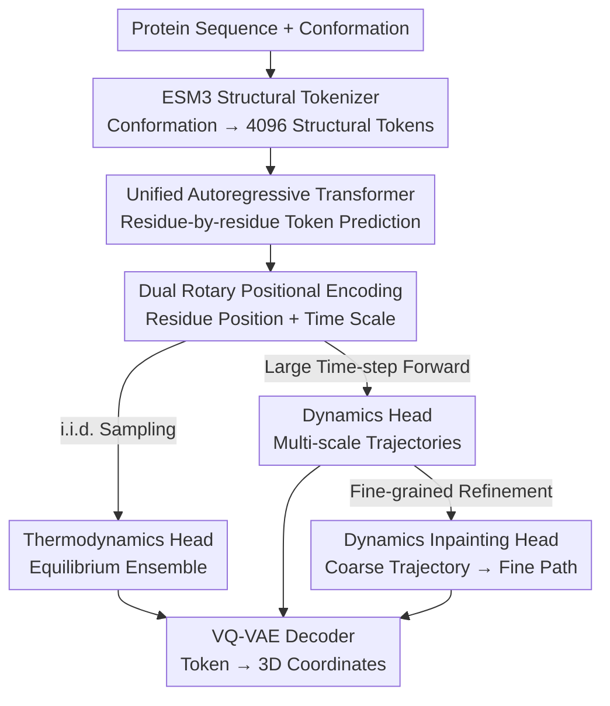

# ProTDyn: A Foundation Protein Language Model for Thermodynamics and Dynamics Generation

**Conference**: ICLR 2026  
**OpenReview**: [https://openreview.net/forum?id=fvCHkWbdgX](https://openreview.net/forum?id=fvCHkWbdgX)  
**Code**: https://github.com/Harrydirk41/ProTDyn  
**Area**: Computational Biology / Protein Language Models / Generative Molecular Dynamics  
**Keywords**: Protein Language Models, Conformational Ensembles, Molecular Dynamics, Autoregressive Generation, Multi-time scales

## TL;DR
ProTDyn discretizes protein conformations into structural tokens and utilizes a 1.4-billion-parameter autoregressive Transformer to simultaneously learn "thermodynamics" (sampling equilibrium conformational ensembles) and "dynamics" (generating multi-time-scale trajectories) within a single framework. By employing inpainting to refine coarse-grained trajectories into fine-grained ones, it serves as a surrogate for expensive molecular dynamics (MD) simulations and demonstrates generalization to proteins outside the training set.

## Background & Motivation

**Background**: Understanding protein function necessitates comprehension of its conformational flexibility and dynamic behavior. Molecular dynamics (MD) simulation has been the primary tool for decades—evolving the system over time by integrating Newton's equations of motion $M_i\ddot{x}_i = -\nabla_{x_i} U(x)$. At a fixed temperature, the system converges to the Boltzmann distribution $P(x) \propto e^{-U(x)/k_B T}$. Recently, deep generative models have emerged as fast alternatives to MD: one category specializes in learning equilibrium ensembles (thermodynamics) by fitting the steady-state distribution $P(x\mid s)$, while another specializes in learning transition densities $P(x_{t+\Delta t}\mid x_t, s)$ to accelerate dynamics.

**Limitations of Prior Work**: MD is inherently slow—to maintain numerical stability, the time step must be several orders of magnitude smaller than the time scales of biologically relevant processes, making long-term dynamics often computationally intractable. Existing generative models treat thermodynamics and dynamics as **separate tasks**: thermodynamic models provide equilibrium ensembles without dynamic information, while dynamic models are often trained on limited short-term MD data. The latter still rely on small time steps for propagation, failing to generalize to rare events or long-term transitions and exhibiting poor transferability across different proteins.

**Key Challenge**: Thermodynamics and dynamics are essentially two sides of the same coin in statistical mechanics (equilibrium distributions and transition dynamics are governed by the same physical laws). However, existing models artificially decouple them, losing complementary information. This prevents the construction of a unified foundation model capable of understanding both equilibrium ensembles and cross-scale transitions, which is a critical missing piece for accurately modeling protein biophysics (interactions, allosteric regulation, phase separation, and conformational heterogeneity).

**Goal**: To build a unified, scalable, and transferable protein simulator that provides (i) equilibrium conformational ensembles, (ii) multi-time-scale dynamic trajectories, and (iii) restoration of fine-grained transition paths from coarse trajectories using a single model.

**Key Insight**: The authors leverage recent advances in representing protein conformations as discrete token sequences. By using a pre-trained ESM3 structural tokenizer to map the local structural neighborhood of each residue to one of 4096 structural tokens, modeling protein conformations is transformed into modeling a **discrete sequence**, allowing for the direct application of powerful autoregressive language model mechanisms.

**Core Idea**: Unify thermodynamic sampling, dynamic propagation, and dynamic inpainting into the single task of "autoregressive structural token prediction." These are trained together in a multi-task Transformer using three heads. Additionally, an "temporal positional encoding" is introduced to inject transition information across different time scales, enabling a single model to span nanoseconds to microseconds.

## Method

### Overall Architecture
ProTDyn is a protein language model operating on discrete representations of "sequence tokens + structural tokens." It first uses a frozen ESM3 structural tokenizer (VQ-VAE encoder) to discretize protein conformations into a structural token sequence $c \in \mathbb{Z}^N$. A 24-layer, 1.4-billion-parameter autoregressive Transformer backbone then predicts the next structural token **residue-by-residue**. Three complementary heads are attached to the backbone: a thermodynamics head for equilibrium distributions, a dynamics head for multi-scale trajectory evolution, and a dynamics inpainting head to recover fine-grained paths from coarse (large time-step) trajectories. These heads share parameters and are jointly trained to reinforce each other—accurate thermodynamic ensembles provide a stable baseline for dynamics, while realistic dynamics improve the diversity and fidelity of equilibrium ensembles. During inference, the generated token sequences are reconstructed into 3D coordinates by the VQ-VAE decoder.

### Key Designs

**1. Unified Modeling with Three Heads: Formulating Thermodynamics, Dynamics, and Inpainting as a Single Autoregressive Objective**

This design directly addresses the core contradiction of decoupled thermodynamics and dynamics. All three tasks are formulated as conditional autoregressive generation of discrete structural tokens, sharing a single backbone. The thermodynamics head factorizes the equilibrium distribution as $P_\theta(c\mid s)=\prod_{i=0}^{N-1}P_\theta(c_i\mid c_{<i},s)$, fitting observed ensembles via cross-entropy $L_{\text{thermo}}=-\mathbb{E}_{(s,c)\sim D}\sum_i \log P_\theta(c_i\mid c_{<i},s)$. The dynamics head factorizes a trajectory $C=(c^0,\dots,c^{M\delta t})$ of length $M$ and step $\delta t$ over time and residues: $P_\theta(C\mid s)=\prod_j P_\theta(c^{j\delta t}\mid C_{<t},s)$, with each frame expanded residue-by-residue. The losses are combined via weighted hyperparameters:

$$L_{\text{ProTDyn}} = \omega_1 L_{\text{thermo}} + \omega_2 L_{\text{dyn}} + \omega_3 L_{\text{dynI}}.$$

This is effective because the underlying task for all heads is "predicting structural tokens." The unified thermodynamic signal provides a safety net for dynamics—experiments show that a dynamics-only model without thermodynamic supervision quickly deviates from the ground truth and fails to maintain folded structures.

**2. Multi-time-scale Dynamics + Temporal Positional Encoding: Spanning Nanoseconds to Microseconds**

Existing dynamic models are often limited by small time steps. ProTDyn enables the dynamics head to learn three temporal resolutions ($\delta t = 1$ ns, 10 ns, 100 ns) simultaneously. Combined with a memory kernel $M=10$, this corresponds to effective time scales of 10 ns, 100 ns, and 1000 ns, bridging short-term and long-term dynamics. The key implementation is the introduction of **Dual Rotary Positional Encoding** on the ESM3 backbone (Pre-LN, RoPE, SwiGLU): residue embeddings are encoded by their integer position in the sequence (1, 2, 3...), affecting both sequence and structural tokens. Temporal embeddings use 1 ns as the base unit (the first segment is 0, the second is $\delta t$, the third is $2\delta t$, etc.) and are applied only to structural tokens before residue embedding. While trained on 1/10/100 ns, the model can generalize to any integer step between 1–100 ns during inference.

**3. Dynamics Inpainting: Combining Coarse Generation and Detail Refinement for Stable, High-Resolution Trajectories**

The dynamics head uses large time steps to robustly explore long-term transitions at the cost of temporal resolution. The inpainting head fills this gap: given two states $c^0$ and $c^{M\delta t}$, it recovers a physically plausible fine-grained transition sequence, modeled as $P_\theta(C\mid c^0,c^{M\delta t},s)=\prod_{j=1}^{M-1}P_\theta(c^{j\delta t}\mid C_{<t},c^0,c^{M\delta t},s)$. This explains a counter-intuitive finding: "Dynamics (100 ns)" often produces higher quality results than "Dynamics (10 ns)" because the 10 ns head accumulates error over many steps, while the 100 ns head explores robustly and uses inpainting to refine segments.

### Loss & Training Strategy
The backbone is a 24-layer Transformer with 1.4 billion parameters, leveraging frozen ESM3 sequence/structural embedding heads. Thermodynamic training follows the BioEmu recipe, mixing single-structure datasets (AlphaFold Database Swiss-Prot subset, 542,378 pairs) with equilibrium MD data (5,398 proteins from mdCath, alongside Octapeptides, CATH1, CATH2, and MEGAsim subsets from BioEmu). Dynamics and inpainting training utilize mdCath (1 ns) and Octapeptides/CATH2/MEGAsim (10, 100 ns). Optimization is performed via AdamW with a learning rate of $4\times10^{-4}$ and weight decay of $1\times10^{-5}$.

## Key Experimental Results

### Main Results
On the CATH1 test set, Jensen–Shannon Divergence (JSD) was used to measure the similarity between generated ensembles and a 100 µs MD reference across Radius of Gyration (Rg), RMSD relative to the native structure, and the first two slow modes of TICA (lower is better):

| Model | Rg ↓ | RMSD ↓ | TICA ↓ |
|------|------|--------|--------|
| ProTDyn-Thermodynamics | **0.023** | **0.012** | **0.155** |
| ProTDyn-Dynamics (100 ns) | 0.030 | 0.018 | 0.206 |
| ProTDyn-Dynamics (10 ns) | 0.052 | 0.032 | 0.278 |
| ProTDyn-dynamics-only (100 ns) | 0.077 | 0.142 | 0.315 |
| BioEmu (baseline) | 0.082 | 0.137 | 0.293 |

All three heads reproduce major metastable states and energy barriers. The thermodynamics head (sampling i.i.d. directly) achieves the highest quality and outperforms the state-of-the-art BioEmu baseline. On 10 out-of-distribution octapeptides, the thermodynamics head achieves JSD values (Rg 0.034 / RMSD 0.020 / TICA 0.207) close to BioEmu (0.031 / 0.020 / 0.134), despite these proteins being in BioEmu's training set but not ProTDyn's.

### Dynamics Fidelity (MSM Evaluation)
Markov State Models (MSM) were used to evaluate steady-state JSD, transition probability JSD, and the average Negative Log-Likelihood (NLL) of 200 ns transition paths:

| Model | Steady-state JSD ↓ | Transition JSD ↓ | NLL ↓ |
|------|-----------|-----------|-------|
| ProTDyn-Dynamics (10 ns) | 0.042 | 0.105 | 0.806 |
| ProTDyn-Dynamics (100 ns) | **0.021** | **0.055** | **0.656** |
| ProTDyn-dynamics-only (100 ns) | 0.088 | 0.167 | 1.013 |
| 25 µs MD | 0.040 | 0.117 | 0.815 |
| 50 µs MD | 0.018 | 0.049 | 0.682 |
| 75 µs MD | 0.007 | 0.019 | 0.639 |

A 50 µs "Dynamics (10 ns)" trajectory is roughly equivalent in quality to 25 µs of MD, while "Dynamics (100 ns)" is comparable to 50 µs of MD—demonstrating that generative simulation achieves comparable quality with significantly less sampling.

### Key Findings
- **Unification over Specialization**: The dynamics-only model performs significantly worse (Steady-state JSD 0.088, NLL 1.013), producing unrealistic trajectories that fail to maintain folded structures. This proves that thermodynamic signals provide indispensable complementary information for dynamics inference.
- **Large Step + Inpainting > Small Step Propagation**: The 100 ns head outperforms the 10 ns head because small steps suffer from rapid error accumulation. TICA autocorrelation curves show the 10 ns head decaying much faster than the reference, while the 100 ns head closely matches it.
- **Cross-dataset Generalization**: The model maintains performance on unseen octapeptides. In CATH1 dynamics evaluations, although these proteins were in the thermodynamic training set, they were excluded from dynamics/inpainting training, verifying the generalization of dynamic generation.

## Highlights & Insights
- **Fitting "Two Sides of Statistical Mechanics" into one AR Model**: Using discrete structural tokens and multi-head learning allows thermodynamics and dynamics to share representations, reducing model overhead while capturing mutual gains.
- **Dual Rotary Positional Encoding for Spatio-temporal Decoupling**: Separate positional encodings for residue and time scales cleanly decouple "which residue" from "which moment," allowing for temporal extrapolation to unseen integer steps.
- **Exact Likelihood as a Hidden Benefit**: Unlike diffusion or flow models where likelihood estimation is approximate and expensive, ProTDyn provides exact likelihoods for both ensembles and trajectories. This opens doors for integrating physical energy functions or developing top-down protein force fields.

## Limitations & Future Work
- **Bottlenecked by MD Training Data**: Performance is currently limited by the availability and scale of equilibrium MD data.
- **Handicapped Memory Kernels**: Memory kernels for different time scales are manually specified rather than learned or optimized.
- **Transition Path Sampling restricted to Inpainting**: Currently, inpainting only restores short-term details in long-term trajectories; it does not yet perform rigorous transition path sampling (e.g., transition interface sampling).
- **Lack of Explicit Physical Constraints**: The model does not explicitly enforce statistical mechanics principles like detailed balance. Exact likelihoods could be used in the future to enforce such physical laws.

## Related Work & Insights
- **vs BioEmu**: BioEmu is a state-of-the-art equilibrium ensemble generator but lacks dynamic capabilities. ProTDyn outperforms it on CATH1 and adds multi-scale dynamics.
- **vs Specialized Dynamics Models**: Previous models learning transition densities $P(x_{t+\Delta t}\mid x_t,s)$ often struggle to generalize beyond short-term MD. ProTDyn bridges time scales through multi-scale training and inpainting.
- **vs Diffusion/Flow Generators**: ProTDyn's discrete autoregressive approach provides exact likelihoods, making it easier to combine with physical energy functions.

## Rating
- Novelty: ⭐⭐⭐⭐⭐ First to unify thermodynamics, dynamics, and inpainting into a single autoregressive protein language model.
- Experimental Thoroughness: ⭐⭐⭐⭐ Extensive evaluation across multiple datasets and metrics, though the baseline comparison is primarily focused on BioEmu.
- Writing Quality: ⭐⭐⭐⭐ Clear presentation of the three tasks and objectives.
- Value: ⭐⭐⭐⭐⭐ Potential to replace expensive MD with a generalized, likelihood-aware surrogate model.

<!-- RELATED:START -->

## Related Papers

- [\[ICLR 2026\] Reverse Distillation: Consistently Scaling Protein Language Model Representations](reverse_distillation_consistently_scaling_protein_language_model_representations.md)
- [\[ICLR 2026\] Towards Understanding the Shape of Representations in Protein Language Models](towards_understanding_the_shape_of_representations_in_protein_language_models.md)
- [\[ICLR 2026\] BioMD: All-atom Generative Model for Biomolecular Dynamics Simulation](biomd_all-atom_generative_model_for_biomolecular_dynamics_simulation.md)
- [\[CVPR 2026\] MMCP-GEN: A Modality-Extensible Diffusion Language Model for Conditional Protein Sequence Generation](../../CVPR2026/computational_biology/mmcp-gen_a_modality-extensible_diffusion_language_model_for_conditional_protein_.md)
- [\[ICML 2026\] Protein Language Model Embeddings Improve Generalization of Implicit Transfer Operators](../../ICML2026/computational_biology/protein_language_model_embeddings_improve_generalization_of_implicit_transfer_op.md)

<!-- RELATED:END -->
