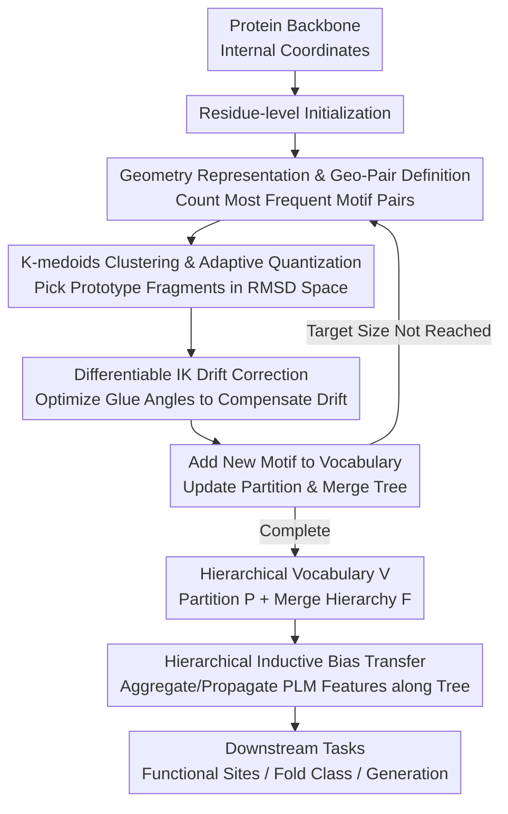

# Protein Structure Tokenization via Geometric Byte Pair Encoding

**Conference**: ICLR 2026  
**arXiv**: [2511.11758](https://arxiv.org/abs/2511.11758)  
**Code**: [GitHub](https://github.com/shiningsunnyday/PT-BPE)  
**Area**: Protein AI / Structure Tokenization  
**Keywords**: GeoBPE, Protein Structure Tokenizer, Hierarchical Vocabulary, Differentiable IK, Multi-resolution

## TL;DR

GeoBPE is proposed as the first framework to extend Byte Pair Encoding (BPE) from discrete text to continuous protein backbone geometry. By alternating between "local merging (k-medoids clustering + quantization)" and "global correction (differentiable inverse kinematics)," it constructs a hierarchical structural motif vocabulary. It surpasses VQ-VAE-based PSTs with >10× compression ratios and >10× data efficiency, ranking first across 24 test sets in 12 downstream tasks.

## Background & Motivation

**Background**: Protein Language Models (PLMs) like the ESM series have achieved significant success on sequences but do not explicitly model folding geometry, limiting performance on structure-dependent functional tasks. Protein Structure Tokenizers (PSTs) are critical bridges connecting sequence and structure. Current mainstream methods are VQ-VAE approaches (e.g., ESM3, FoldSeek's 3Di alphabet, ProToken), which map continuous structures to discrete codebooks via autoencoders.

**Limitations of Prior Work**: VQ-VAE-based PSTs face three fundamental limitations: (1) **Fixed codebooks are prone to collapse**, where imbalanced token usage limits compression efficiency; (2) **Vector-based tokens lack interpretability**, as continuous vectors in a codebook do not exhibit the hierarchical compositional relationships found in BPE subwords; (3) **Fixed token sizes hinder multi-scale analysis**, as all tokens have a fixed residue length, failing to adapt to naturally occurring variable-length functional domains. Furthermore, VQ-VAEs exhibit poor OOD generalization (test/train RMSD ratios reaching 6.4×).

**Key Challenge**: Protein structures are continuous, noisy, and multi-scale, while BPE is designed for discrete symbols. The core difficulty lies in maintaining global geometric consistency during discretization—local quantization introduces cumulative drift, causing distal atomic coordinates to deviate significantly.

**Key Insight**: Protein folding consists of modular substructures (helices, sheets, loops, etc.), naturally suiting BPE’s strategy of "iteratively merging frequent pairs." A key observation is that drift introduced by local quantization can be compensated by optimizing "glue angles" at boundaries, as each boundary provides 3 degrees of freedom (one bond angle + two dihedral angles).

**Core Idea**: Extend BPE from discrete symbols to continuous geometry by alternating between "local k-medoids quantization + global differentiable inverse kinematics (IK) drift correction" to build a hierarchical motif vocabulary of protein structures.

## Method

### Overall Architecture

GeoBPE addresses the challenge of porting BPE, designed for discrete text, to continuous, noisy, and multi-scale protein backbone geometry to build an interpretable, multi-resolution vocabulary. The process starts from residue-level initialization using the internal coordinate representation of the protein backbone (bond lengths, angles, dihedrals) and **repeatedly "finds and merges the most frequent adjacent pairs."** Each merge iteration handles two additional tasks: calculating frequencies for continuous geometry and correcting geometric drift post-quantization.

Specifically, each iteration performs four steps: popping the most frequent Geo-Pair (adjacent motif pair), performing k-medoids clustering in RMSD space to select representative prototype fragments, hard-quantizing all occurrences to the nearest prototype, and finally using differentiable IK to optimize boundary glue angles to absorb the drift. The resulting new motif type is added to the vocabulary, and the partition and merge tree are updated. This loop continues until reaching the target vocabulary size, resulting in a hierarchical vocabulary $\mathcal{V}$, partitions $\mathcal{P}$, and a merge hierarchy $\mathcal{F}$. The merge tree is later reused as a recursive computation tree to aggregate or propagate PLM features for downstream tasks.

### Key Designs

**1. Geometry Representation & Geo-Pair Definition: Enabling Frequency Counting for Continuous 3D Geometry**

BPE requires counting adjacent symbols, but protein backbones are continuous 3D coordinates. GeoBPE represents the backbone using internal coordinates: each residue $i$ is represented by bond lengths $\ell^{N-CA}_i, \ell^{CA-C}_i, \ell^{C-N}_i$, bond angles $\theta^{NCAC}_i, \theta^{CACN}_i$, and dihedral angle $\psi_i$. Adjacent residues are linked via glue parameters $\Gamma_i = \{\theta^{CNCA}_i, \phi_i, \omega_i\}$. A continuous block $\mathcal{M}_{p:q}$ forms a motif, and two adjacent motifs plus their boundary glue angles constitute a Geo-Pair occurrence. By mapping all occurrences to discrete identifiers via a canonical hashable key, the core BPE operation of "counting frequent pairs" is realized on continuous geometry. This internal coordinate system is SE(3)-invariant and separates local motif geometry from connectivity, enabling the decoupled "merge-quantize-correct" pipeline.

**2. K-medoids Clustering & Adaptive Quantization: Using Observed Fragments as Prototypes**

Continuous BPE requires "quantizing" rather than simple symbol replacement. For all occurrences of a frequent Geo-Pair key, GeoBPE performs k-medoids clustering in the RMSD space to obtain $K$ prototypes. Quantization copies the internal parameters of the assigned medoid to the occurrence. Adaptive multi-resolution is employed: every step re-quantizes from the original fragments, and $K$ scales with motif length—coarse-grained for small motifs and fine-grained for large ones—balancing compression and reconstruction. Choosing medoids over centroids ensures each vocabulary entry is a physically observed protein fragment, enhancing interpretability compared to the abstract vectors found in VQ-VAE codebooks.

**3. Differentiable Inverse Kinematics (IK) Drift Correction: Absorbing Error at Boundary Glue Angles**

Replacing an occurrence's internal transform $T^{\text{occ}}_u$ with the medoid's $T^{\text{med}}_u$ introduces drift $\Delta T_u = T^{\text{occ}}_u (T^{\text{med}}_u)^{-1}$, which accumulates along the peptide chain. GeoBPE optimizes the boundary glue angles without altering motif internals to approximate the original geometry: $G^{\text{new}}_{i_{u}-1} \approx G^{\text{orig}}_{i_{u}-1} \cdot \Delta T_u$. This is achieved by minimizing the endpoint frame loss:

$$\mathcal{L}_u(\Gamma) = w_R \|\log(\hat{R}^\top R^*)\|^2 + w_t \|\hat{t} - t^*\|^2$$

where $\hat{F}$ is computed via forward kinematics and $F^*$ is the original frame. Global batch optimization allows all glue angle degrees of freedom across the backbone to be optimized simultaneously. Since each boundary provides 3 degrees of freedom, there is sufficient directional compensation space to maintain global geometric integrity.

**4. Hierarchical Inductive Bias Transfer: Reusing the Merge Tree for Representation**

Unlike discrete PSTs that often lag behind continuous methods due to quantization loss, GeoBPE improves performance by reusing the merge hierarchy $\mathcal{F}$ as a recursive computation tree. Leaf nodes are initialized with pre-trained PLM (e.g., ESM3) features, aggregated bottom-up to motif/protein levels, and then propagated top-down. This embeds hierarchical structural awareness into each residue, benefiting tasks like functional site prediction and fold classification. The merge tree, initially a byproduct of compression, encodes the modular hierarchy of proteins as an inductive bias.

## Key Experimental Results

### Main Results (Downstream Transfer Performance, AUROC%)

| Task | ProteinMPNN | MIF | FoldSeek | ProTokens | ESM3 | VQ-VAE | AminoASeed | **GeoBPE-Transfer** |
|------|-------------|-----|----------|-----------|------|--------|------------|-------------------|
| BindInt-Fold | 51.83 | 50.38 | 53.18 | 44.66 | 44.30 | 47.25 | 47.11 | **59.19 (+33.6%)** |
| BindBio-Fold | 78.42 | 85.79 | 32.37 | 58.47 | 62.84 | 62.02 | 65.73 | **94.94 (+51.1%)** |
| CatBio-Fold | 82.49 | 85.85 | 56.33 | 67.68 | 65.33 | 67.58 | 65.95 | **95.01 (+45.4%)** |
| Con-SupFam | 84.68 | 92.66 | 51.31 | 70.64 | 80.53 | 74.60 | 86.60 | **84.84 (+5.4%)** |
| Average AUROC% | 75.92 | 79.82 | 51.90 | 65.37 | 69.24 | 68.30 | 72.43 | **80.20 (+18.1%)** |

GeoBPE-Transfer ranks first on average across 24 tests in 12 tasks, achieving an +18.13% gain over ESM3 in functional site prediction.

### Ablation Study (Compression-Reconstruction & OOD Generalization)

| Tokenizer | BPR (bits/res) | Test RMSD (Å) | Test/Train RMSD Ratio | Training Data |
|-----------|---------------|---------------|-------------------|-----------|
| ESM3 | ~30× GeoBPE | Low | ~1.0 | 236M structures |
| ProToken | 1× (Ref) | Ref | ~1.0 | ~700K |
| VQ-VAE | Medium | Medium | **6.4×** | ~48K |
| **Ours (GeoBPE)** | **0.27-0.36× ProToken** | Moderate | **1.16-1.28** | **~48K** |

GeoBPE's BPR is only 27-36% of ProToken (>10× compression advantage) and 1.6-2.1% of ESM3 (>50×). It demonstrates robust OOD generalization (test/train RMSD ratio of 1.16-1.28 vs. 6.4 for VQ-VAE) and maintains performance with only 1% training data (>10× data efficiency).

### Key Findings

- **Hierarchical vocabularies reverse the "discretization performance drop"**: While discrete VQ-VAE PSTs usually underperform continuous ones, GeoBPE’s hierarchical inductive bias enables it to outperform both continuous and discrete baselines.
- **GeoBPE tokens align with CATH functional families**: Token boundaries coincide with domain annotations, supporting expert-interpretable case studies.
- **Vocabulary scales smoothly along the Pareto front**: Increasing vocabulary size (600 to 21,000) results in a smooth BPR-distortion curve, a flexibility absent in fixed-dimension VQ-VAE codebooks.
- **Language Modeling Generation**: Paired with a ~7.3M Transformer for unconditional generation, 99% of GeoBPE-generated backbones are unique and designable, with scTM scores up to 49% higher than VQ-VAE.

## Highlights & Insights

- **Elegant Extension of BPE to Continuous Geometry**: Addressing frequency counting for continuous data via canonical hashing and global consistency via differentiable IK is a novel and effective combination.
- **Medoids as Prototypes for Physical Validity**: Unlike latent vectors in VQ-VAEs, medoids are real protein fragments, giving each token explicit physical meaning that aids in expert interpretation.
- **Dual Value of Hierarchical Vocabulary**: It serves both as a multi-resolution controller for reconstruction (tokenizer function) and as an inductive bias for recursive computation trees (downstream representation gain).

## Limitations & Future Work

- **Computational Complexity**: The iterative overhead of k-medoids clustering and global IK optimization is high; while mitigated by sampling, it remains a constraint for massive-scale applications.
- **Backbone-only Modeling**: Restricted to N-CA-C atoms, lacking side-chain conformation modeling, which limits performance on side-chain-dependent functional tasks.
- **Limited Generation Scale**: The 7.3M Transformer used for generation is small; large-scale generation capabilities remain to be explored.
- **Feature Dependency**: GeoBPE-Transfer relies on ESM3 pre-trained features; performance gains are partially attributable to the quality of the underlying PLM.

## Related Work & Insights

- **Vs. ESM3 VQ-VAE**: ESM3 uses 236M structures to achieve low reconstruction error; GeoBPE achieves comparable performance with <0.02% of the data, offering superior generalization and interpretability despite slightly higher RMSD.
- **Vs. FoldSeek 3Di**: 3Di uses 20 fixed symbols for efficient search; GeoBPE offers an expandable, multi-resolution vocabulary.
- **Vs. ProToken**: Both are on the Pareto front, but GeoBPE’s interpretability (CATH alignment) and data efficiency are unique advantages.

## Rating

- Novelty: ⭐⭐⭐⭐⭐ Original extension of BPE to continuous protein geometry.
- Experimental Thoroughness: ⭐⭐⭐⭐⭐ Comprehensive 10-point analysis across 24 test sets covering compression, generalization, and efficiency.
- Writing Quality: ⭐⭐⭐⭐ Rigorous math and clear algorithms, though the symbol system is complex.
- Value: ⭐⭐⭐⭐⭐ Establishes a new paradigm for protein structure representation learning with implications for other structured data (molecules, materials).

<!-- RELATED:START -->

## Related Papers

- [\[ICLR 2026\] ProteinAE: Protein Diffusion Autoencoders for Structure Encoding](proteinae_protein_diffusion_autoencoders_for_structure_encoding.md)
- [\[ICML 2025\] Protein Structure Tokenization: Benchmarking and New Recipe](../../ICML2025/computational_biology/protein_structure_tokenization_benchmarking_and_new_recipe.md)
- [\[ICLR 2026\] GeomMotif: A Benchmark for Arbitrary Geometric Preservation in Protein Generation](geommotif_a_benchmark_for_arbitrary_geometric_preservation_in_protein_generation.md)
- [\[ICLR 2026\] Greater than the Sum of Its Parts: Building Substructure into Protein Encoding Models](greater_than_the_sum_of_its_parts_building_substructure_into_protein_encoding_mo.md)
- [\[ICLR 2026\] FlexRibbon: Joint Sequence and Structure Pretraining for Protein Modeling](flexribbon_joint_sequence_and_structure_pretraining_for_protein_modeling.md)

<!-- RELATED:END -->
