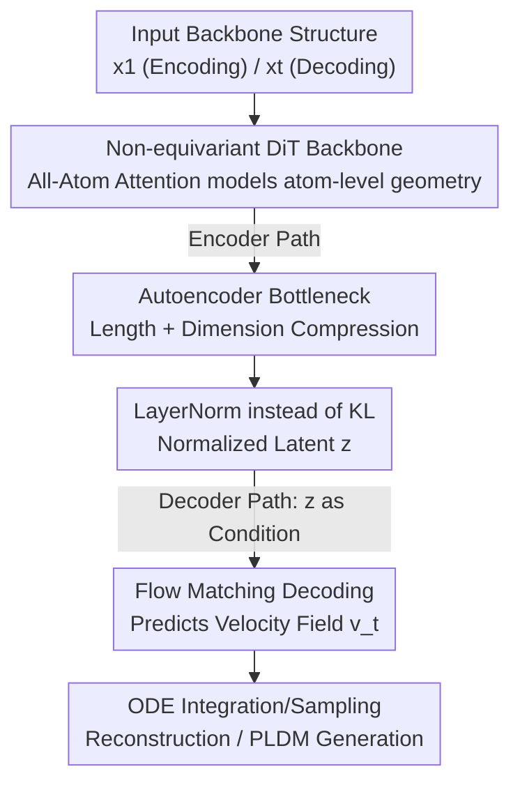

# ProteinAE: Protein Diffusion Autoencoders for Structure Encoding

**Conference**: ICLR 2026  
**OpenReview**: [https://openreview.net/forum?id=tYLCkzHAM2](https://openreview.net/forum?id=tYLCkzHAM2)  
**Code**: [https://github.com/OnlyLoveKFC/ProteinAE_v1](https://github.com/OnlyLoveKFC/ProteinAE_v1)  
**Area**: Protein Structure Encoding / Diffusion Models / Representation Learning / AI for Science  
**Keywords**: Protein Autoencoder, Flow Matching, Continuous Latent Space, Non-equivariant Transformer, Latent Diffusion Generation

## TL;DR
ProteinAE utilizes a non-equivariant Diffusion Transformer to compress protein backbone coordinates directly in $E(3)$ space into a continuous and compact latent representation. Trained end-to-end with only a single flow matching loss, its reconstruction accuracy ($C\alpha$ RMSD) significantly outperforms existing discrete tokenizers. Furthermore, a protein generative model built on this latent space rivals structural domain diffusion models while being nearly 10 times faster.

## Background & Motivation
**Background**: The mainstream paradigm in visual generation is "first use an autoencoder (tokenizer) to compress pixels into a compact latent space, then perform generation within that space." This two-stage approach significantly improves the efficiency and quality of modeling complex distributions. Adapting this paradigm to proteins requires a high-quality "protein structure autoencoder." Prior works include the VQ-VAE tokenizer of ESM3, the Lookup-Free Quantization (LFQ) tokenizer of DPLM-2, and AminoAseed, which improves upon codebooks. These methods discretize continuous 3D coordinates into tokens to facilitate joint masked language modeling with sequences.

**Limitations of Prior Work**: These autoencoders suffer from four structural issues. First, they operate on the $SE(3)$ manifold (handling both translation and coordinate system rotation), necessitating equivariance and various physical constraints that complicate both the latent space and model architecture. Second, discretizing continuous atomic coordinates into tokens inherently leads to loss in reconstruction accuracy. Third, training requires stacking numerous objectives—FAPE loss, distance loss, violation loss, KL loss, etc.—each requiring individual weight tuning. Fourth, they are often restricted by fixed input lengths and lack a compact bottleneck latent space to support efficient generation.

**Key Challenge**: The root cause is the technical route of "insisting on $SE(3)$ equivariance + discretization + multiple losses" to faithfully represent protein geometry. This complicates a simple task—equivariance and discretization increase optimization difficulty while actually sacrificing accuracy and generalization.

**Goal**: Is it possible to design a simpler, more accurate, and more effective protein autoencoder that operates in a continuous, compact latent space?

**Key Insight**: The authors noted recent advances in denoising autoencoders—representations trained with diffusion/denoising objectives maximize the ELBO of input likelihood, a point indirectly validated by AlphaFold3. Consequently, they abandoned equivariant designs in favor of a non-equivariant DiT to perform autoencoding directly on backbone atoms ($C\alpha$, $N$, $C$, $O$) in $E(3)$.

**Core Idea**: Replace "$SE(3)$ equivariance + discrete tokens + multiple losses" with "non-equivariant DiT + single flow matching loss + length/dimension dual-bottleneck" to compress protein structures into a low-dimensional, continuous, and well-normalized space suitable for latent diffusion.

## Method

### Overall Architecture
ProteinAE adopts an encoder-decoder architecture. The **Encoder** takes a clean protein backbone structure $x_1 \in \mathbb{R}^{N\times 4\times 3}$ ($N$ residues, 4 backbone atoms per residue, 3D coordinates each) and outputs a compact latent representation $z$. The **Decoder** operates within a flow matching framework, taking a noisy structure $x_t$ at time $t$ and predicting the velocity field $v^\theta_t$ conditioned on $z$, then reconstructs the structure from noise via ODE integration. The entire model is trained end-to-end using a single flow matching loss without auxiliary losses. Once trained, this continuous latent space can be directly used for downstream Protein Latent Diffusion Models (PLDM) and physical-chemical property prediction.

The pipeline consists of four steps: "Feature Preparation → DiT Backbone Processing → Bottleneck Compression + LayerNorm Normalization → Flow Matching Decoding/Reconstruction." The encoder and decoder share the same components but differ in inputs and conditions:

### Key Designs

**1. Non-equivariant DiT + All-Atom Attention: Dropping equivariance to model $E(3)$ geometry via attention**

To address the issue where "$SE(3)$ equivariance complicates structures and latent spaces," ProteinAE discards equivariance entirely. All feature processing, encoding, and decoding use non-equivariant architectures—a choice consistent with trends in AlphaFold3 and Proteina, which replace explicit geometric equivariance with stacks of "conditioned, biased multi-head self-attention + transition blocks + residual connections." Specifically, the model runs DiT blocks on sequence representations $s$ and conditional representations $c$, optionally injecting attention bias $\beta_{ij}$ derived from the input geometry. To handle variable-length proteins, RoPE is used instead of absolute positional encoding. A DiT block is defined as $s_l = \text{DiT}_{\text{pairbias}}(s_{l-1}, p, c, \beta_{ij})$, followed by a transition block $s_l = s_l + \text{TransitionBlock}(s_l, c)$.

To capture atom-level details, the authors added an All-Atom Attention encoder/decoder inspired by AlphaFold3 but with fewer parameters. It performs "sequence-local atomic attention," allowing all backbone atoms within a sequence neighborhood to interact. Compared to ESM3 VQ-VAE, which relies solely on KNN graphs for local structure, this local atomic attention provides a richer characterization of local interactions. On the encoding side, All-Atom Attention aggregates atom-level features into token-level sequence representations $s$ (providing skip-connection features for decoding), while the decoding side broadcasts token-level features back to atoms to project velocity vectors $v^\theta_t \in \mathbb{R}^{N\times 4\times 3}$.

**2. Length + Dimension Dual-bottleneck: Compressing structures into compact latent spaces for efficient generation**

To solve the lack of compact bottlenecks and inefficient generation, the authors added two stages of compression at the encoder's tail. First is the **Length Bottleneck**: applying one or more 1D convolutions (kernel=3, stride=2) to the DiT output $s_L$ to reduce protein length from $N$ to $N_{\text{down}}=N/r$ (where $r$ is the downsampling ratio). Second is the **Dimension Bottleneck**: using a linear layer to project the token dimension $D$ to a smaller bottleneck dimension $d$. The compression is written as $z = \text{LinearNoBias}(\text{Conv1d}(\text{transpose}(s_L)))$, resulting in a latent representation of shape $(B, N_{\text{down}}, d)$. Decoding reverses this process: $z$ is projected back to $D$, and the length is restored to $N_{\text{target}}$ via interpolation before being added to sequence condition $c$.

The primary value of this bottleneck is allowing downstream PLDMs to run entirely in a low-dimensional latent space, bypassing geometric/physical constraints during structure generation and significantly reducing sampling costs. Ablation studies revealed a counter-intuitive conclusion: aggressive dimension compression (small $d$) only causes a moderate increase in RMSD, while aggressive length compression (large $r$) causes reconstruction quality to deteriorate sharply—indicating that **preserving the sequence length dimension is more important than the feature dimension** for backbone reconstruction. The default configuration is $r=1$ (no length compression) and $d=8$.

**3. Single Flow Matching Loss + LayerNorm instead of KL: Reducing the optimization pipeline to one objective**

To address the need for multiple losses (FAPE, distance, violation, KL) and their respective weights, ProteinAE is trained using only a single flow matching loss. The target velocity field is defined as $v(t)=x_1-x_0$. The model learns to predict this velocity given noisy structure $x_t$, time $t$, and condition $z$. The objective is:

$$\min_\theta \; \mathbb{E}_{x_1\sim p_{ds},\,x_0\sim\mathcal{N}(0,I),\,t\sim p(t)}\left[\frac{1}{4N}\left\|v^\theta_t(x_t,t,z)-(x_1-x_0)\right\|_2^2\right]$$

The time sampling distribution is set to $p(t)=0.02\,\mathcal{U}(0,1)+0.98\,\mathcal{B}(1.9,1.0)$, following standard structural flow matching practices by placing more weight on timestamps near clean structures.

A small but critical accompanying change is replacing the KL regularization used in traditional VAEs with **LayerNorm without learnable scaling** (following DiTo) on the bottleneck output. This eliminates KL weight tuning while empirically improving reconstruction. Furthermore, this normalization allows the latent space to be used for training PLDMs without additional normalization during the diffusion process. One flow matching loss plus one LayerNorm significantly simplifies both the ProteinAE and PLDM training workflows.

### Loss & Training
The model is trained on AFDB-FS (sampled from the AlphaFold Protein Structure Database via MMseqs2 sequence clustering and Foldseek structural clustering), containing 588,318 single-chain structures with lengths 32–256 residues. Random global rotations are applied as data augmentation. Default ProteinAE configuration: Encoder/Decoder DiTs with $L=5$ layers each, token dimension $D=256$, bottleneck $r=1$, $d=8$. The downstream PLDM also uses a DiT architecture (~200M parameters, $L=15$, $D=768$) and intentionally omits expensive triangle attention to increase speed.

## Key Experimental Results

### Main Results: Structure Reconstruction (CASP14/15, $C\alpha$ RMSD ↓)

| Method | CASP14-T | CASP14 oligo | CASP15 TS-dom | CASP15 oligo |
|------|---------|--------------|----------------|--------------|
| CHEAP | 11.15 | 9.93 | 10.22 | 9.22 |
| ESM3 VQ-VAE | 1.02 | 3.08 | 1.23 | 1.94 |
| ProToken | 0.99 | 1.15 | 1.15 | 1.18 |
| DPLM-2 | 1.99 | 2.70 | 3.31 | 3.50 |
| **ProteinAE** | **0.23** | **0.31** | **0.28** | **0.37** |

ProteinAE systematically outperforms discrete tokenizers across all targets, with a particularly significant advantage in the difficult oligomer (oligo) assembly. While many baselines show degraded quality for such complex structures, ProteinAE maintains high fidelity. The authors attribute this to the fact that diffusion autoencoders model the protein structure manifold better than discrete quantization, bypassing the information bottleneck inherent in tokenization.

### Downstream Generation and Property Prediction

Unconditional Backbone Generation (Table 2): ProteinAE-PLDM achieves SOTA among latent space methods and approaches classical structural diffusion models (SDM). At $\gamma=0.35$, it reaches a designability (Des) of 93% and diversity (Div) of 204. At $\gamma=0.5$, Des is 86% and Div rises to 228, demonstrating controllable trade-offs between "designability ↔ diversity" via sampling temperature. In contrast, LatentDiff (another LDM) only achieves 17% Des and 34 Div, while the semi-LDM LSD reaches 69% Des.

| Type | Method | Des↑ | Div↑ | DPT↓ | Nov↓ |
|------|------|------|------|------|------|
| SDM | RFdiffusion | 96% | 247 | 0.43 | 0.71 |
| MLLM | DPLM-2 650M | 63% | 130 | 0.37 | 0.72 |
| LDM | LatentDiff | 17% | 34 | 0.51 | 0.73 |
| semi-LDM | LSD | 69% | 203 | 0.46 | 0.74 |
| **LDM** | **ProteinAE-PLDM γ=0.35** | **93%** | 204 | 0.36 | 0.70 |

Property Prediction (ATLAS, Spearman ρ%): ProteinAE leads across FlexRMSF and FlexBFactor benchmarks in both fold and superfamily splits. For FlexRMSF, it outperforms ESM3 by over 10%; for FlexBFactor (Fold split), it improves from ESM3's 23.60 to 30.87, suggesting continuous latent representations better capture generalizable patterns of protein geometry and dynamics.

Generation Efficiency: On a single 80G A100 for generating a 200-residue backbone (batch=5), ProteinAE-PLDM takes ~1.6 seconds and ~0.3 GB VRAM. RFDiffusion takes ~15 seconds and 5 GB; DPLM-2 takes ~3 seconds and 1 GB. The efficiency gain stems from the dimension bottleneck enabling generation in a low-dimensional space and the removal of triangle attention.

### Ablation Study

| Configuration | Phenomenon | Conclusion |
|------|------|------|
| Length bottleneck $r=1\to4$ | RMSD rises sharply | Sequence length dimension is most critical; default $r=1$ |
| Dimension bottleneck $d=256\to8$ | RMSD rises moderately | Dimensions can be heavily compressed with limited loss; default $d=8$ |
| Base (20M) → Large (100M) | RMSD decreases slightly (especially in hard $r=2$ configs) | Model exhibits positive scalability |
| Register compression replacement | Good for ≤256 residues, collapses >256 (around residue 231) | Fixed-length registers are unsuitable for variable-length proteins |

### Key Findings
- Length is less compressible than dimension: Increasing the length downsampling ratio $r$ from 1 to 4 significantly worsens RMSD, whereas compressing dimensions from 256 to 8 causes only a moderate increase. Protein backbone reconstruction is more sensitive to "preserving each residue's position" than "preserving high-dimensional features."
- Failure of Register compression is insightful: Porting "learnable registers as fixed-length latent representations" from vision to proteins causes sudden collapse at approximately residue 231 when exceeding the training maximum (256). Since protein sequences are naturally variable-length, length/dimension bottlenecks are the more robust mechanism.
- Latent space normalization (LayerNorm instead of KL) not only avoids weight tuning but also allows PLDMs to train directly on $z$ without additional normalization.

## Highlights & Insights
- **Evidence for "Less is More"**: While others add complexity with equivariance, discretization, and multiple losses, ProteinAE simplifies everything to a non-equivariant DiT and a single flow matching loss. This pushes reconstruction RMSD to the 0.2–0.3 range, suggesting that equivariant constraints might be an unnecessary assumption for autoencoding.
- **Dual Diffusion**: Diffusion is used for both autoencoding (reconstruction) and generation (PLDM), but in different spaces. The second diffusion (PLDM) is extremely fast because it operates in the low-dimensional latent space.
- **Transferable LayerNorm Trick**: The use of "LayerNorm without learnable parameters for latent normalization" is a valuable takeaway for any task involving a "two-stage autoencoder + latent diffusion" pipeline, as it saves parameter tuning and simplifies downstream diffusion.

## Limitations & Future Work
- The authors acknowledge the model currently only handles protein monomers and cannot process other biomolecules like ligands, DNA, or RNA.
- PLDM generation quality rivals but doesn't yet significantly surpass the strongest structural domain diffusion models; it is primarily "competitive + faster."
- PLDM still faces issues with sequence length handling, where certain residues exhibit structural collapse or unrealistic geometry.
- *Personal observation*: All reconstruction evaluations are within the length ≤256 range (the training limit). Generalization to longer proteins or out-of-distribution structures is not fully validated; the collapse of the Register variant suggests length extrapolation remains a challenge for this route.

## Related Work & Insights
- **vs ESM3 VQ-VAE / DPLM-2 (Discrete Tokenizers)**: These methods use $SE(3)$ geometric encoding, discretize coordinates, rely on KNN for local structure, and stack multiple losses. ProteinAE uses non-equivariant $E(3)$ modeling, continuous encoding, All-Atom Attention, and a single loss. The difference lies in "discrete vs. continuous + equivariant vs. non-equivariant," where ProteinAE leads by an order of magnitude in reconstruction accuracy.
- **vs LSD (Yim et al. 2025, Hierarchical Latent Diffusion)**: LSD's latent diffusion is built on contact maps and still relies on FrameFlow in the second stage. ProteinAE-PLDM uses a standard DiT to generate directly within its own compact latent space, avoiding explicit equivariance and triangle attention, resulting in higher efficiency and designability.
- **vs RFdiffusion / FrameFlow (Structural Domain Diffusion - SDM)**: SDMs generate directly in structural space, slowed by physical/geometric constraints. ProteinAE-PLDM generates in a low-dimensional latent space, achieving quality close to SDMs while being 10x faster and using an order of magnitude less memory, though generation quality hasn't yet surpassed SDMs.

## Rating
- Novelty: ⭐⭐⭐⭐ Combining "non-equivariant + continuous + single loss" for protein autoencoding is counter-intuitive and successfully connects the reconstruction-to-generation pipeline.
- Experimental Thoroughness: ⭐⭐⭐⭐ Covers reconstruction, generation, property prediction, efficiency, and scalability, with ablations revealing the critical difference between length and dimension.
- Writing Quality: ⭐⭐⭐⭐ Clear structure, good alignment between text and figures, and clear explanation of formulas and design motivations.
- Value: ⭐⭐⭐⭐ Provides a high-fidelity, low-cost latent foundation for protein generation; the LayerNorm-for-KL trick is reusable.

<!-- RELATED:START -->

## Related Papers

- [\[ICLR 2026\] Protein Structure Tokenization via Geometric Byte Pair Encoding](protein_structure_tokenization_via_geometric_byte_pair_encoding.md)
- [\[ICLR 2026\] Flow Autoencoders are Effective Protein Tokenizers](flow_autoencoders_are_effective_protein_tokenizers.md)
- [\[ICLR 2026\] Animal behavioral analysis and neural encoding with transformer-based self-supervised pretraining](animal_behavioral_analysis_and_neural_encoding_with_transformer-based_self-super.md)
- [\[ICLR 2026\] Greater than the Sum of Its Parts: Building Substructure into Protein Encoding Models](greater_than_the_sum_of_its_parts_building_substructure_into_protein_encoding_mo.md)
- [\[ICLR 2026\] FlexRibbon: Joint Sequence and Structure Pretraining for Protein Modeling](flexribbon_joint_sequence_and_structure_pretraining_for_protein_modeling.md)

<!-- RELATED:END -->
