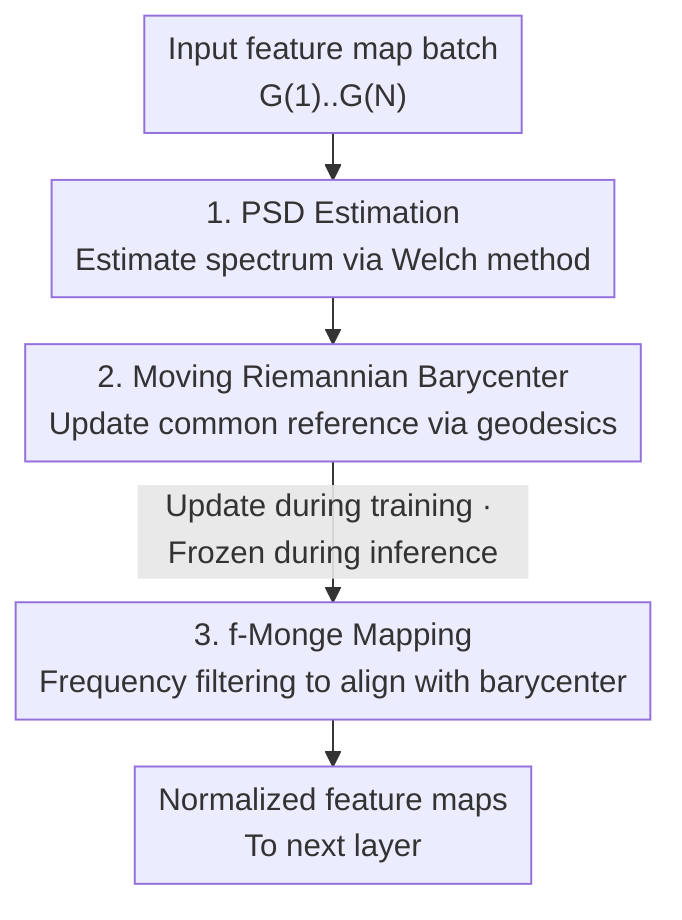

# PSDNorm: Temporal Normalization for Deep Learning in Sleep Staging

**Conference**: ICLR 2026  
**OpenReview**: [https://openreview.net/forum?id=BZMQotjBwW](https://openreview.net/forum?id=BZMQotjBwW)  
**Code**: https://github.com/tgnassou/PSDNorm  
**Area**: Computational Neuroscience / Physiological Signals / Domain Generalization  
**Keywords**: Normalization layer, Sleep staging, EEG, Optimal transport, Power spectral density

## TL;DR
This paper proposes PSDNorm—a drop-in normalization layer replacing BatchNorm/InstanceNorm. It aligns the Power Spectral Density (PSD) of each feature map to a moving Riemannian barycenter PSD using Monge mapping within the network. It achieves SOTA on sleep staging across 10 datasets and tens of thousands of subjects, reaching the accuracy of the strongest baseline with only 1/4 of the labeled data.

## Background & Motivation

**Background**: Sleep staging is a clinical task classifying overnight EEG signals into five stages (Wake/N1/N2/N3/REM) per 30-second epoch. Prevalent approaches use CNNs (e.g., U-Sleep) or Transformers for end-to-end learning, typically inserting BatchNorm, LayerNorm, or InstanceNorm to stabilize training and mitigate data variability.

**Limitations of Prior Work**: Physiological signals exhibit severe distribution shifts—statistical properties of EEG vary significantly across subjects, ages, genders, electrode positions, and acquisition devices. However, BatchNorm/LayerNorm/InstanceNorm treat each sampling point in the time dimension as an independent coordinate, **ignoring the temporal autocorrelation and spectral structure of the signal**. They only correct first/second-order mean/variance shifts but cannot address "spectral shape" shifts, which are the primary source of cross-domain variance in EEG.

**Key Challenge**: Existing work TMA (Temporal Monge Alignment) recognizes this and uses optimal transport to align the PSD of signals to a common reference. However, TMA can only serve as a **preprocessing step** on raw signals; it cannot be inserted into the network like a normalization layer. Consequently, it cannot manage spectral shifts in intermediate feature maps nor benefit from end-to-end training.

**Goal**: Upgrade "spectral structure alignment" from a preprocessing step to a **differentiable normalization layer** that is pluggable into any layer and applicable during both training and inference to specifically handle temporal autocorrelation shifts at the feature map level.

**Key Insight**: The authors note that under the "Gaussian periodic signal" assumption, the signal covariance matrix is a block-circulant matrix, which is diagonalizable under the Fourier basis with eigenvalues representing the PSD of each channel. Thus, the Monge mapping between two Gaussian distributions has a closed-form solution, essentially performing frequency-domain filtering (whitening + re-coloring). This implies "spectral alignment" can be implemented as a lightweight, differentiable convolutional filtering operation within the network.

**Core Idea**: Use f-Monge mapping to align the PSD of each feature map to a moving-average Wasserstein/Riemannian barycenter PSD, replacing the "mean subtraction and variance division" in traditional normalization.

## Method

### Overall Architecture
PSDNorm is a drop-in normalization layer. The input is a batch of pre-normalization feature maps $B=\{G^{(1)},\dots,G^{(N)}\}$ (shape $c\times\ell$), and the output is the aligned feature maps $\tilde B$. The forward pass consists of three serial steps: **estimating the PSD** (Welch method) for each feature map, aggregating these into a batch barycenter to update a **moving Riemannian barycenter PSD** via geodesics, and finally applying **f-Monge mapping** (frequency-domain filtering) to align each feature map to this barycenter. During training, all steps run and the barycenter is updated; during inference, the barycenter is frozen. The entire layer is differentiable. The only extra hyperparameter is filter length $f$ (controlling the temporal correlation range, set to 5~11 in experiments).

### Key Designs

**1. PSD Estimation: Quantifying "temporal autocorrelation" into an alignable spectrum via Welch**

Traditional normalization only calculates mean and variance, discarding the correlation structure between signal coordinates. PSDNorm estimates the PSD for each feature map as the target for alignment. Specifically, it first subtracts the temporal mean $\hat\mu^{(j)}=\frac1\ell\sum_l G^{(j)}_{:,l}$ per channel. Then, the Welch estimator divides the centered signal into $L$ overlapping windows, performs Fourier transforms, squares them, and averages: $\hat P\triangleq\frac1L\sum_{l=1}^{L}\big|(\mathbf 1_c w^\top\odot X^{(l)})F_f^*\big|^{\odot 2}$. Estimating PSD with $f\ll\ell$ frequencies captures local correlations while ignoring long-range ones. This step converts abstract "temporal structure" into a $c\times f$ alignable object.

**2. Moving Riemannian Barycenter: Finding a stable "common spectral reference"**

Where should all feature maps be aligned? To a global barycenter PSD. For Gaussian distributions with block-circulant structures, the Wasserstein barycenter has a closed-form solution $\bar P=\big(\frac1K\sum_k P^{(k)\odot\frac12}\big)^{\odot2}$. During training, the batch barycenter $\hat P_B$ is calculated from the current batch, then merged into the moving barycenter using momentum $\alpha$ via exponential geodesics in the Bures metric:

$$\hat P\leftarrow\Big((1-\alpha)\hat P^{\odot\frac12}+\alpha\hat P_B^{\odot\frac12}\Big)^{\odot2}.$$

This averages in the "spectral geometric space" (Bures/Riemannian manifold) rather than Euclidean space, better respecting the geometry of covariance structures. Like the running mean in BatchNorm, a stop-gradient is applied to the barycenter.

**3. f-Monge Mapping: Alignment as frequency-domain filtering, equivalent to whitening + re-coloring**

Given the target barycenter $\hat P$, the f-Monge mapping is applied: $\tilde G^{(j)}=(G^{(j)}-\hat\mu^{(j)}\mathbf 1_\ell^\top)*\hat H^{(j)}$, where the filter is $\hat H^{(j)}\triangleq\frac1{\sqrt f}(\hat P\oslash\hat P^{(j)})^{\odot\frac12}F_f^*$. Intuitively, the filter "whitens" according to the feature map's own spectrum $\hat P^{(j)}$ and "re-colors" according to the target spectrum $\hat P$. This aligns second-order spectral statistics across different sources. The operation is a 1D circular convolution implemented efficiently via FFT, with complexity $O(Nc\ell f\log f)$. Notably, when $f=1$ and the barycenter is fixed to a uniform spectrum ($\hat P=1$), PSDNorm **degenerates into InstanceNorm**—making InstanceNorm a special case that ignores temporal correlation.

### Loss & Training
The method maintains the original training objectives, using weighted cross-entropy, Adam (learning rate $10^{-3}$), batch size 64, and early stopping based on validation loss. In implementation, BatchNorm in the first three layers of the network is replaced with PSDNorm. To preserve the receptive field, $f$ is set at the first layer and halved in subsequent layers. Momentum $\alpha$ is fixed at $10^{-2}$, with default $f=5$.

## Key Experimental Results

### Main Results
Evaluated on 10 sleep datasets (~11k subjects, 10M samples) using Leave-One-Dataset-Out (LODO) protocol across 3 seeds. Metric: Balanced Accuracy (BACC) using U-Sleep backbone.

| Setting | Metric | BatchNorm | LayerNorm | InstanceNorm | TMA | PSDNorm |
|------|------|-----------|-----------|--------------|-----|---------|
| All Subjects | Mean(Subject) | 78.14 | 76.78 | 79.26 | 78.77 | **79.51** |
| All Subjects | Mean(Dataset) | 78.38 | 77.41 | 78.97 | 78.98 | **79.15** |
| balanced@400 | Mean(Subject) | 77.22 | 75.04 | 78.17 | 77.74 | **78.85** |
| balanced@400 | Mean(Dataset) | 77.55 | 75.05 | 77.78 | 78.03 | **78.34** |

On the CHAT dataset (pediatric subjects with strong shift), PSDNorm outperforms all other normalization by over 1 percentage point (70.57 vs InstanceNorm 68.86).

### Ablation Study

| Configuration | Key Metric | Description |
|------|---------|------|
| PSDNorm (Full) | 79.51 | Frequency alignment + moving barycenter |
| InstanceNorm (≈ $f=1$ + fixed uniform spectrum) | 79.26 | Degenerate version without temporal correlation or learned barycenter |
| TMA (Preprocessing instead of layer) | 78.77 | Monge alignment applied only at input |
| BatchNorm | 78.14 | 1st/2nd order statistics only |

### Key Findings
- **Superiority in data scarcity**: When training data is reduced to 1/4 (balanced@400), PSDNorm's gain over the strongest baseline increases from +0.25% to +0.67%. The paper claims it matches baseline accuracy with ~4x less labeled data.
- **In-network integration > Preprocessing**: PSDNorm outperforms TMA (which also uses Monge alignment) by ~1%, proving that adaptive alignment within the network layers is more effective than input-only alignment.
- **Spectral structure is key**: InstanceNorm, which ignores temporal correlation, is a strong baseline, but is consistently surpassed by PSDNorm. LayerNorm consistently performs the worst.
- **Cross-architecture robustness**: Tested across U-Sleep and a CNN-Transformer backbone; PSDNorm's average rank is significantly better than baselines under Critical Difference (CD) tests.
- **Hyperparameter insensitivity**: Performance remains stable within the range $f \in [5, 11]$.

## Highlights & Insights
- **Implementing "Optimal Transport Alignment" as an FFT filtering layer**: The core insight is that under Gaussian periodic assumptions, Monge mapping equals frequency-domain whitening + re-coloring. This simplifies heavy OT theory into a circulant convolution ($O(Nc\ell f\log f)$) that is differentiable and lightweight.
- **Unified Perspective**: Viewing InstanceNorm as a special case of PSDNorm is elegant. it clarifies exactly which information (temporal autocorrelation) existing layers discard.
- **Geometric vs. Euclidean Averaging**: Maintaining a moving barycenter on the Bures/Riemannian manifold via geodesics respects the geometry of covariance structures better than arithmetic means. This is transferable to any scenario requiring online maintenance of covariance/spectral references.
- It does not assume signals are strictly Gaussian—it uses Gaussian approximation to align second-order statistics while preserving higher-order discriminative information, similar to Deep CORAL.

## Limitations & Future Work
- The method relies on "Gaussian + periodic + uncorrelated sensors → block-circulant covariance" assumptions. For highly non-stationary signals or strong multi-channel coupling, spectral alignment may only correct limited shifts.
- Experiments focus on sleep EEG (2 bipolar channels); generalization to other physiological signals (e.g., ECG, fMRI) or general time-series remains to be verified.
- The layer must be embedded during training, making it difficult to use as a post-hoc plug-and-play for pre-trained models like pure test-time adaptation.
- The rule of halving $f$ per layer is coupled with receptive field engineering and may require tuning for different backbones.

## Related Work & Insights
- **vs TMA (Temporal Monge Alignment)**: Both use f-Monge mapping for PSD alignment, but TMA is a preprocessing step. PSDNorm’s layer-wise, adaptive integration provides an extra ~1% gain.
- **vs Instance/Batch/LayerNorm**: Traditional layers treat temporal points as independent; PSDNorm explicitly models temporal autocorrelation in the frequency domain. InstanceNorm is a degenerate special case ($f=1$, uniform spectrum).
- **vs Test-time Domain Adaptation**: PSDNorm offers robustness benefits similar to test-time adaptation but requires integration during training.

## Rating
- Novelty: ⭐⭐⭐⭐⭐ Elegant unification of OT spectral alignment into a normalization layer.
- Experimental Thoroughness: ⭐⭐⭐⭐⭐ Massive scale (10 datasets, 11k subjects, LODO).
- Writing Quality: ⭐⭐⭐⭐ Clear theory, though frequency-domain notation may be dense for some.
- Value: ⭐⭐⭐⭐⭐ Plug-and-play, data-efficient, and directly useful for physiological signal generalization.

<!-- RELATED:START -->

## Related Papers

- [\[ICLR 2026\] SAIR: Enabling Deep Learning for Protein-Ligand Interactions with a Synthetic Structural Dataset](sair_enabling_deep_learning_for_protein-ligand_interactions_with_a_synthetic_str.md)
- [\[ICLR 2026\] Meta-Learning Theory-Informed Inductive Biases using Deep Kernel Gaussian Processes](meta-learning_theory-informed_inductive_biases_using_deep_kernel_gaussian_proces.md)
- [\[CVPR 2026\] Stronger Normalization-Free Transformers](../../CVPR2026/computational_biology/stronger_normalization-free_transformers.md)
- [\[ICLR 2026\] Scalable Spatio-Temporal SE(3) Diffusion for Long-Horizon Protein Dynamics](scalable_spatio-temporal_se3_diffusion_for_long-horizon_protein_dynamics.md)
- [\[ICLR 2026\] DeepSADR: Deep Transfer Learning with Subsequence Interaction and Adaptive Readout for Cancer Drug Response Prediction](deepsadr_deep_transfer_learning_with_subsequence_interaction_and_adaptive_readou.md)

<!-- RELATED:END -->
