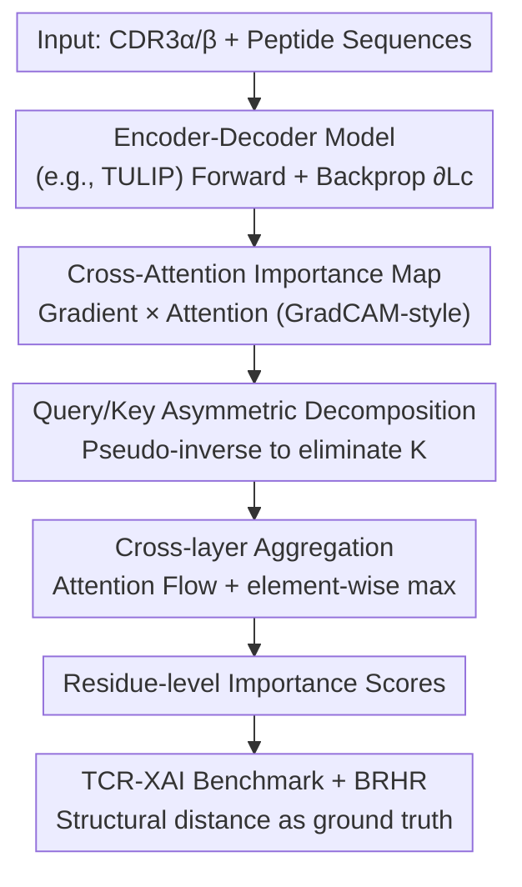

# Quantifying Cross-Attention Interaction in Transformers for Interpreting TCR-pMHC Binding

**Conference**: ICLR 2026  
**OpenReview**: [https://openreview.net/forum?id=S3kSOFhs5m](https://openreview.net/forum?id=S3kSOFhs5m)  
**Project Page**: [https://qcai.jiarui.li/](https://qcai.jiarui.li/)  
**Code**: TBD  
**Area**: Computational Biology / Explainable AI / Transformer  
**Keywords**: TCR-pMHC binding, Cross-attention, Post-hoc interpretability, Encoder-decoder, Immunology

## TL;DR
Aiming at the blind spot where existing interpretability methods only handle self-attention in the "encoder-decoder" architectures commonly used in TCR-pMHC binding prediction models, this paper proposes QCAI. It decomposes asymmetric cross-attention matrices in the decoder into importance scores for both query and key residues and constructs a TCR-XAI benchmark with structural ground truth, achieving SOTA in both interpretability and prediction consistency.

## Background & Motivation
**Background**: T cells recognize antigen peptides presented by MHC molecules (collectively referred to as pMHC) through surface receptors (TCR). The specificity of this binding is central to adaptive immunity and is crucial for vaccine design and personalized cancer therapy. Recently, Transformer models such as TULIP, Cross-TCR-Interpreter, and TCR-BERT have pushed TCR-pMHC binding prediction to high accuracy. SOTA models like TULIP employ an encoder-decoder architecture, using **cross-attention in the decoder** to model the interactions between CDR3α, CDR3β, and peptide sequences.

**Limitations of Prior Work**: These models are black boxes, providing only binding/non-binding predictions without explaining "which residues are actually functioning." Immunology researchers seek to understand mechanisms—which residue inserts into which pocket and why a specific TCR has higher affinity. Existing post-hoc interpretability methods (AttnLRP, TokenTM, AttCAT, etc.) are almost exclusively designed for **encoder-only, self-attention** models and cannot interpret the cross-attention in decoders.

**Key Challenge**: The attention matrix in self-attention is square ($A \in \mathbb{R}^{N\times N}$), where Q, K, and V are homologous, allowing rows or columns to be read directly as token importance. However, in cross-attention, Q comes from one modality while K/V comes from another, resulting in a non-square matrix $A \in \mathbb{R}^{N\times N'}$ that fuses information from two modalities. Thus, it **cannot be directly attributed to the query tokens on one side**. This asymmetry is the primary obstacle for existing methods.

**Goal**: ① Design a post-hoc method capable of interpreting cross-attention in any encoder-decoder Transformer; ② Solve the challenge in immunological XAI where qualitative intuition is used due to a lack of quantitative ground truth.

**Key Insight**: The authors adopt a GradCAM-style "gradient × activation" approach to locate important attention entries and use matrix pseudo-inverse to "solve back" the contributions of non-square attention to both query and key sides. Furthermore, they utilize experimentally determined crystal structures to treat "inter-residue physical distance" as objective ground truth for binding importance.

**Core Idea**: Utilizing gradient-weighted cross-attention maps combined with pseudo-inverse-driven query/key decoupling, the asymmetric cross-attention is quantitatively decomposed back into residue-level importance for each input sequence.

## Method

### Overall Architecture
QCAI is a **post-hoc explanation method** that does not modify or retrain the target model. It extracts residue importance from the decoder's cross-attention after a single forward and backward pass. The pipeline is as follows: CDR3α/β and peptide sequences are fed into an encoder-decoder model (TULIP is used in experiments), and backpropagation is performed for the loss $L_c$ of target class $c$. First, a "gradient × attention" calculation produces the cross-attention importance map. Then, this non-square map is decomposed into token-level scores along both query and key directions. Finally, these are aggregated layer-by-layer to obtain an importance vector for each input residue. These scores are evaluated on the self-constructed TCR-XAI benchmark using structural distance as ground truth.

### Key Designs

**1. Cross-Attention Importance Map: Locking Key Attention Entries via Gradient × Attention**

Directly reading the cross-attention matrix is unreliable because high attention weights do not necessarily contribute to the prediction. Inspired by GradCAM, QCAI weights the attention itself using the gradient of the class loss with respect to the attention matrix, defining the importance map as:

$$S(A_l) = \mathbb{E}_H\!\left[\mathrm{ReLU}\!\left(\frac{\partial L_c}{\partial A_l} \odot A_l\right)\right] + I \in \mathbb{R}^{N\times N'},$$

where $\mathbb{E}_H$ denotes the average over all attention heads, $\odot$ is the element-wise product, and $I$ is the identity matrix added for residual connections. Consequently, only attention entries that are both "high in weight" **and** "contribute significantly to the class loss" are highlighted, avoiding misinterpretation of large but irrelevant weights. ReLU ensures only positive contributions are retained. This step provides importance at the attention matrix level; the next step decomposes it back to input tokens.

**2. Query/Key Asymmetric Decomposition: Solving Non-Square Attention back to Residues via Pseudo-inverse**

This is the technical core of QCAI, specifically addressing the non-square, non-attributable nature of cross-attention. The authors decompose the importance of each side into two parts: **intrinsic importance** and **attention-modulated importance**.

For the query side, intrinsic importance is defined via GradCAM as $S(Q_l)=\mathrm{ReLU}(\frac{\partial L_c}{\partial Q_l}\odot Q_l)$, with column-wise max-pooling over feature dimensions to obtain token-level scores $\omega_l^Q$. However, intrinsic scores do not reflect how Q is modulated within the attention. Thus, attention-modulated importance is defined as $S(Q_l;A_l)\propto \frac{\partial L_c}{\partial A_l}\cdot Q_l$. Since $A_l = Q_l K_l^\top$, isolating the influence of $Q_l$ from $S(A_l)$ requires "eliminating $K_l^\top$". Since $K_l$ is typically non-square and non-invertible, the authors use the **Moore-Penrose pseudo-inverse**:

$$\frac{\partial L_c}{\partial A_l}\cdot Q_l = S(A_l)\cdot K_l\,(K_l^\top K_l)^{-1}\in\mathbb{R}^{N\times d}.$$

Taking the column-wise maximum yields $\omega_l^A$, and finally, the **element-wise maximum of both** is taken: $S(Q_l;A_l)=\max(\omega_l^A,\omega_l^Q)$. This conservative estimate accounts for the fact that Q is also influenced by other layers. Similarly, the key side is decomposed into $S(K_l)$ and attention-derived $\omega_l^{A\prime}$. Since attention explicitly maps query into the key space, the key side does not require a pseudo-inverse and can be derived by taking the maximum across all queries and attention heads in the attention matrix, then $S(K_l;A_l)=\max(\omega_l^{A\prime},\omega_l^K)$. This conservative combination is more robust than either term alone.

**3. Cross-layer Aggregation: Backpropagating Importance to Input Residues via Attention Flow**

Importance from a single layer is insufficient; it must be backpropagated layer-by-layer from the output to the raw input. Drawing on attention flow, QCAI traverses backward from the output layer: let $k$ be the first decoder layer with cross-attention encountered during traversal; layers preceding it are handled as self-attention. Aggregation follows a recursive formula: $\tilde S_k = S(Q_k;A_k)\cdot \tilde S_{k+1}$ (query path) and $S(K_k;A_k)\cdot \tilde S_{k+1}$ (key path). When the model contains multiple decoder blocks with cross-attention where importance might diverge and merge, the authors employ an **element-wise max** strategy: $\tilde S_k=\max(S(\cdot;A_k),\tilde S_{k+1})$ to preserve the strongest attribution signal. This ensures that as long as any cross-attention decoder block exists in the interpretation path, QCAI can output a token-level importance vector for each input residue.

**4. TCR-XAI Benchmark and BRHR Metric: Quantitative Ground Truth via Crystal Structure Distance**

XAI in immunology has lacked objective evaluation. The authors collected 274 experimentally determined TCR-pMHC crystal structures (from STCRDab and TCR3d 2.0, with MHC-I accounting for 77.7% and MHC-II for 22.3%), retaining only samples with complete TCR α/β chains, peptides, and CDR3 regions to form the **TCR-XAI** benchmark. For each sample, the residue-level nearest atom distance is calculated; **smaller distances represent stronger interactions**, serving as the ground truth for binding importance (based on the principle that stable protein-protein interfaces have clear distance thresholds). Based on this, **BRHR (Binding Region Hit Rate)** is proposed: for a percentile threshold $t\in(0,1]$, the top $t$ proportion of residues by importance are selected; if their interaction distance also falls within the top $t$ proportion, it is recorded as a hit. BRHR directly measures "how many of the residues identified by the explanation are actual physical binding residues."

## Key Experimental Results

Experiments were conducted on the SOTA TULIP model (encoder-decoder, parallel processing of CDR3α/CDR3β/peptide), comparing against post-hoc methods like AttnLRP, TokenTM, AttCAT, Rollout, GradCAM, LRP, and RawAttn. These baseline methods do not support cross-attention and can only operate on self-attention layers.

### Main Results: Perturbation Experiments (Table 1)
Perturbation experiments replace the top $k$ tokens with `<PAD>` ($k=4$ for CDR3α/β, $k=7$ for peptide, aligning with average binding residue counts). performance was measured by LOdds (lower is better, indicating greater confidence drop after perturbing important residues) and AOPC (higher is better).

| Method | CDR3a LOdds | CDR3b LOdds | Peptide LOdds | Peptide AOPC |
|------|------|------|------|------|
| **QCAI (Ours)** | **-3.328** | **-3.498** | **-1.470** | **0.013** |
| AttnLRP | -2.481 | -2.662 | -0.017 | 0.000 |
| GradCAM | -2.700 | -3.112 | -1.004 | 0.009 |
| LRP | -2.938 | -3.127 | -1.167 | 0.011 |
| RawAttn | -2.734 | -3.250 | -0.691 | 0.010 |

QCAI achieved the most negative LOdds and highest AOPC on CDR3b and peptide chains. Notably, on the peptide chain, other methods had LOdds near 0 (e.g., AttnLRP at -0.017), suggesting they failed to capture key residues on the peptide side, while QCAI reached -1.470.

### ROC and Hit Rate Analysis

| Chain | QCAI ROC-AUC |
|------|------|
| CDR3a | 0.5492 |
| CDR3b | 0.5489 |
| Peptide | 0.6024 |

Within binding distance thresholds of 3–6 Å, QCAI's ROC-AUC outperformed baseline methods across all chains and thresholds, exceeding 0.6 on the peptide chain. This indicates high consistency between importance scores and underlying structural binding. In BRHR curves, QCAI leads across the practical range; for the peptide chain, it remains optimal before the 50th percentile.

### Key Findings
- **Cross-attention is key for performance gain**: Baseline methods perform worst at positions with the strongest cross-modal interactions (e.g., the peptide chain) because they lack cross-attention information, proving that decoder cross-attention carries the core TCR↔peptide interaction.
- **Case studies verify mechanisms**: In influenza immunodominant peptide (1OGA/5TEZ) cases, QCAI identified key CDR3b residues (R98/W99) and their flanking sites inserting into the HLA-A2 groove. It explained the 25-fold lower affinity of 5TEZ vs 1OGA via the longer, less constrained CDR3a. In Rheumatoid Arthritis self-antigen (8TRR/8TRQ) cases, it localized the CDR3a hairpin region where AttnLRP/TokenTM failed or gave weak scores.
- **Sensitivity to minor sequence changes**: On 2PXY/2Z31 complexes differing by only two amino acids, QCAI provided similar scores for the peptide but distinct patterns for CDR3b, successfully detecting differences in contact sites caused by subtle changes.

## Highlights & Insights
- **Pseudo-inverse for non-square attention** is a clever technical contribution: Using Moore-Penrose pseudo-inverse $K_l(K_l^\top K_l)^{-1}$ to eliminate the non-square, non-invertible $K_l^\top$ allows "unattributable" cross-attention to be solved back into query space—this math trick can be transferred to any encoder-decoder in CV/NLP.
- The **conservative combination of "Intrinsic + Attention-modulated" with element-wise max** acknowledges that a single source may miss signals, representing a simple but robust engineering trade-off.
- **Physical distance as XAI ground truth**: TCR-XAI transforms "explanation quality" from subjective intuition into quantifiable metrics (ROC-AUC, BRHR), establishing a reusable evaluation paradigm for immunological XAI.
- The method is purely post-hoc, requiring no changes to model weights, and can be plugged into any encoder-decoder predictor such as TULIP or MixTCRpred.

## Limitations & Future Work
- Absolute ROC-AUC values are relatively low (~0.55-0.6), suggesting that even with SOTA methods, the alignment between cross-attention explanations and actual binding sites is limited and not yet ready for direct experimental guidance.
- Ground truth uses "nearest atom distance" as a proxy, ignoring non-distance factors like hydrophobic contacts, ionic bonds, and conformational entropy; the authors intend to introduce more refined energy functions like REF15.
- BRHR can be "surpassed" by methods with high false-positive rates at high percentile intervals; the metric itself is sensitive to threshold selection.

## Related Work & Insights
- **vs AttnLRP / TokenTM / AttCAT**: These are designed for encoder self-attention. When facing decoder cross-attention, they degrade to self-attention layers and lose cross-modal interaction info; QCAI explicitly decouples non-square cross-attention, leading to significant gains at cross-modal sites like peptides.
- **vs GradCAM**: QCAI borrows the "gradient × activation" core for localization but additionally solves query/key decoupling and cross-layer aggregation, which GradCAM cannot provide for token-level dual-sided attribution.
- **vs Rollout / attention flow**: QCAI follows attention flow for aggregation but generalizes it to decoder paths with cross-attention and uses element-wise max to handle divergence-convergence in multiple decoder blocks.
- **vs TCRdist / PISTE**: Previous works used residue distance to measure TCR-pMHC interactions but remained mostly qualitative; this work formalizes distance into a quantitative benchmark (TCR-XAI) and metric (BRHR).

## Rating
- Novelty: ⭐⭐⭐⭐⭐ First post-hoc interpretability method for encoder-decoder cross-attention; pseudo-inverse for non-square attention is a genuine innovation.
- Experimental Thoroughness: ⭐⭐⭐⭐ Evaluation via multiple metrics (LOdds/AOPC/ROC/BRHR) and case studies, though primarily validated on the TULIP model.
- Writing Quality: ⭐⭐⭐⭐ Clear derivations and solid motivation; some derivation steps (pseudo-inverse, aggregation) are relatively dense.
- Value: ⭐⭐⭐⭐⭐ Fills the methodological gap in cross-attention interpretability and contributes the TCR-XAI benchmark.

<!-- RELATED:START -->

## Related Papers

- [\[ICLR 2026\] h-MINT: Modeling Pocket-Ligand Binding with Hierarchical Molecular Interaction Network](h-mint_modeling_pocket-ligand_binding_with_hierarchical_molecular_interaction_ne.md)
- [\[ICLR 2026\] Graph Diffusion Transformers are In-Context Molecular Designers](graph_diffusion_transformers_are_in-context_molecular_designers.md)
- [\[ICLR 2026\] I2Mole: Interaction-aware Invariant Molecular Learning for Generalizable Drug-Drug Interaction Prediction](i2mole_interaction-aware_invariant_molecular_learning_for_generalizable_property.md)
- [\[ICML 2026\] Cross-Chirality Generalization by Axial Vectors for Hetero-Chiral Protein-Peptide Interaction Design](../../ICML2026/computational_biology/cross-chirality_generalization_by_axial_vectors_for_hetero-chiral_protein-peptid.md)
- [\[ICLR 2026\] Towards All-atom Foundation Models for Biomolecular Binding Affinity Prediction](towards_all-atom_foundation_models_for_biomolecular_binding_affinity_prediction.md)

<!-- RELATED:END -->
