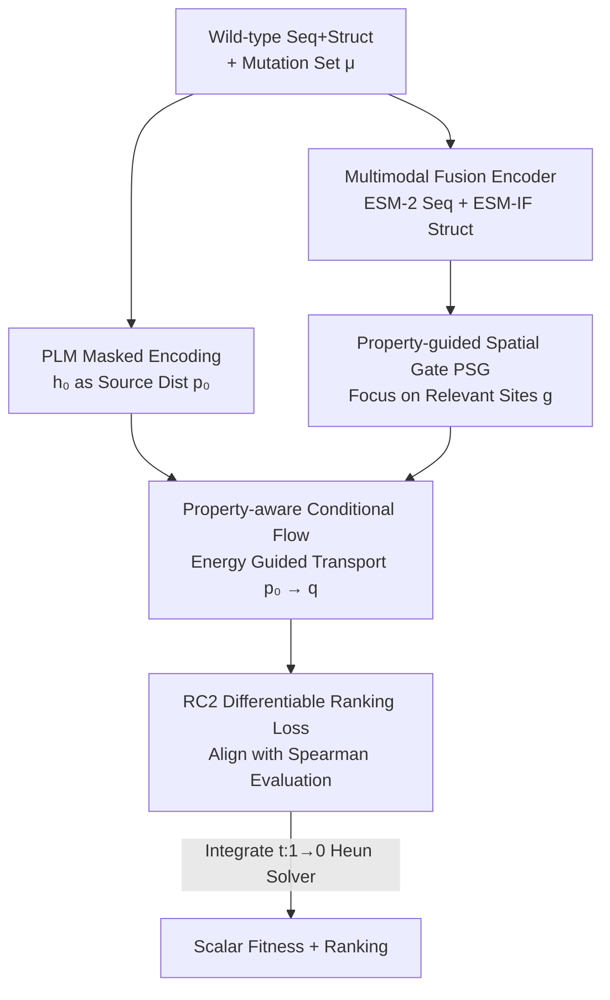

# RankFlow: Property-aware Transport for Protein Optimization

**Conference**: ICLR 2026  
**OpenReview**: [https://openreview.net/forum?id=uS5rA4fDJp](https://openreview.net/forum?id=uS5rA4fDJp)  
**Code**: To be confirmed  
**Area**: Computational Biology / Protein Optimization / Conditional Flow Matching  
**Keywords**: Protein Fitness Prediction, Conditional Flow, Energy Guidance, Differentiable Ranking, Representation Transformation

## TL;DR
Instead of directly attaching a regression head to Protein Language Model (PLM) embeddings to fit fitness values, RankFlow learns an energy-guided conditional flow to **transport** "property-agnostic" PLM representations into a distribution "aligned with target properties." Combined with a differentiable ranking loss (RC2) and a property-guided spatial gate (PSG), it achieves SOTA ranking accuracy and stronger cross-experimental generalization across the ProteinGym, PEER, and FLIP benchmarks.

## Background & Motivation

**Background**: The core of protein optimization lies in modeling the fitness landscape—mapping mutations in sequence or structure to experimentally measured functional readings (stability, binding affinity, enzymatic activity, etc.). Due to the scarcity of labeled data, the mainstream approach utilizes the likelihood or embeddings of pre-trained PLMs (such as the ESM series), either for zero-shot mutation effect scoring or for supervised fine-tuning with a regression head on specific Deep Mutational Scanning (DMS) experiments.

**Limitations of Prior Work**: The authors identify two critical overlooked issues. First, PLM representations are **property-agnostic**—they simultaneously encode multiple, sometimes competing, evolutionary constraints such as foldability, stability, and expression levels. Directly using them can dilute or suppress the signal of the specific property of interest, biasing predictions toward "wild-type-like" rather than "property-improved." Second, many fitness prediction methods **assume mutation effects are additive**, ignoring high-order interactions (epistasis) between multiple mutations. This leads to systematic errors in predicting higher-order mutants, which are precisely where non-additive interactions dominate functional changes.

**Key Challenge**: Given small datasets of only hundreds to thousands of DMS labels, "point-to-point regression" is prone to overfitting to single-experiment dataset biases and fails to capture combinatorial mutation interactions. Furthermore, while downstream evaluation utilizes **ranking** metrics (Spearman correlation), the training objective targets **absolute values**, leading to an inconsistency between training and evaluation protocols.

**Goal**: (1) Reshape property-agnostic PLM representations into property-aligned distributions; (2) Explicitly model interactions within sets of multiple mutations; (3) Align training objectives with ranking evaluations to enhance generalization to unseen experiments.

**Key Insight**: Instead of directly predicting a scalar, the "representations themselves" should be treated as distributions that can be transported. Borrowing from energy-guided flow and guided flow matching, an energy function constructed from observed fitness can guide the flow dynamics to push representations of high-fitness mutants toward "high-fitness regions," naturally ranking them above low-fitness mutants in the representation space.

**Core Idea**: Utilize an **energy-guided conditional flow** to transport PLM embeddings into property-aligned distributions (replacing the regression head), and use a **differentiable ranking loss** to align with evaluation and a **property spatial gate** to focus on relevant sites.

## Method

### Overall Architecture

RankFlow reformulates protein fitness prediction as a conditional flow-matching problem. Given a wild-type protein $x^{wt}$ and a mutation set $\mu$ (possibly modifying multiple sites to obtain a mutant $x^{mt}$), traditional methods learn a deterministic predictor $F_\theta(x^{wt},\mu)=y$. RankFlow instead feeds the mutant into a frozen PLM and masks the mutated amino acids (to remove self-information about wild-type residues). The latent representation $h_0\in\mathbb{R}^{N\times d}$ before the output head is taken as the **source distribution** $p_0$. Then, a conditional flow determined by parameters $\theta$ is learned to transport $p_0$ to a **target distribution** $q$ tilted by an energy function and aligned with the target property.

The pipeline is as follows: Wild-type sequence + structure → multimodal fusion encoder to obtain context condition $F$ → compute property-guided spatial gate $g$ to focus on relevant sites → transport $h_0$ to property-aligned representation $\tilde h_1$ via energy-weighted flow matching conditioned on $(F,g,\mu)$ → read out prediction scores through the PLM head → train with dual objectives of "energy-weighted flow matching + differentiable ranking." During inference, with fixed conditions, a fixed-step Heun solver integrates from $t=1$ to $t=0$ to map the final state representation to scalar fitness.

### Key Designs

**1. Property-aware Conditional Flow: Transporting PLM Representations to High-fitness Regions via Energy**

This design directly addresses the "property-agnostic PLM embeddings and regression overfitting" pain point. Instead of sampling directly from the base distribution $p_0$, the authors construct an energy-tilted distribution $q(h)\propto p_0(h)\exp\{-E(h)\}$, where $E(h)$ encodes the target property. Along a Gaussian conditional path $p_t(h\mid h_0)=\mathcal{N}(\mu_t h_0,\sigma_t^2 I)$, the corresponding property-aware distribution is $q_t(h)\propto p_t(h)\exp\{-E_t(h)\}$. To realize this distribution, a time-varying velocity field $v_t(\theta)$ is learned to match the conditional vector field $u_t(h\mid h_0)$, which has a closed-form solution for Gaussian paths: $u_t(h\mid h_0)=\dot\mu_t\mu_t^{-1}h+(\dot\mu_t\sigma_t-\mu_t\dot\sigma_t)\sigma_t\mu_t^{-1}\nabla_h\log p_t(h\mid h_0)$.

The energy function is the soul of this design, and the authors make it **invariant across experiments**, combining two principles: high-fitness mutants should be preferred, and mutants deviating from local substitution patterns should be highlighted. Specifically, a substitution-aware edit distance $d_{sub}(i,j)$ measures the similarity between two mutants (where $d_{sub}=1$ indicates a single mutation difference). A neighborhood $N(i)$ within radius $r$ is defined for each mutant to calculate the local baseline $\bar{\tilde y}_i$ and variance $s_i$ after normalizing kernel weights $\hat K_{ij}=\exp(-d_{sub})$. The final energy is:

$$E_i(h)=-\Big(\lambda\,\tilde y_i+(1-\lambda)\,\frac{\tilde y_i-\bar{\tilde y}_i}{\sqrt{s_i}}\Big),\qquad w_i(t)\propto\exp\{-\beta E_i(h)\}.$$

Here, $\tilde y_i$ is the standardized global fitness (pushing embeddings toward global high-fitness regions), and $(\tilde y_i-\bar{\tilde y}_i)/\sqrt{s_i}$ measures how "abnormal" the mutant is relative to local substitution trends. $\lambda$ balances these two, and $\beta$ controls the sharpness of the weights. This both rewards global high fitness and highlights local anomalous mutants, ensuring the transport direction of the flow naturally leans toward "high-fitness and informative" directions.

**2. RC2 Differentiable Ranking Loss: Aligning Training Objectives with Ranking Evaluation Rather Than Absolute Values**

While pure energy-weighted flow-matching loss $L_{PFM}(\theta)=\mathbb{E}[\tilde w_i(t)\,\|v_t(h;\theta)-u_t(h\mid h_0)\|_2^2]$ reaches global optimality given infinite data, many real-world experiments provide only hundreds of labels, insufficient for learning the complex transport mapping of precise property values. The authors thus propose the Rank-Consistent Conditional Flow Loss (RC2).

The approach is: pass $h_0$ through the flow model $G(\theta)$ to obtain the predicted final state $\tilde h_1$, calculate logits $\tilde Q^{tgt}$ using the PLM head, and define the prediction score as the sum of logit differences at each mutation site: $\tilde y_i\simeq\sum_{m\in\mu_i}\big(\log\tilde Q^{tgt}_{m=x^{mt}_m}-\log\tilde Q^{tgt}_{m=x^{wt}_m}\big)$. This reading is invariant to logit scales and focuses only on mutations driving property changes. Then, a proxy for the **differentiable Spearman correlation** between predicted scores $\tilde y$ and true labels $y$ is minimized:

$$L_{RFlow}(\theta)=\lambda_{rank}\big(1-\rho_{soft}(R_\tau(\tilde y),R(y))\big),$$

where $R_\tau(\cdot)$ is a differentiable ranking operator with temperature $\tau$ (following the differentiable ranking by Cuturi et al.), and $R(\cdot)$ is a hard rank for ground truth. The total loss is $L(\theta)=L_{PFM}(\theta)+L_{RFlow}(\theta)$. The value of this design lies in matching the Spearman evaluation metric during training by directly optimizing ranking consistency, allowing the model to focus on the relative order of mutants rather than absolute values, resulting in robustness to noise and better generalization to unseen experiments.

**3. Property-guided Spatial Gate (PSG): Focusing Learning on Property-relevant Sites and Suppressing Unrelated Evolutionary Biases**

Even with the objectives above, evolutionary information from PLMs remains property-agnostic and may direct updates toward directions that are neutral or even harmful to the current experiment. The PSG approach first identifies "high vs. low property" directions offline and uses them to assign gating scores to each site. Specifically, sets $S_+, S_-$ are defined as the top and bottom $\xi$ quantiles (default $\xi=0.3$) of the training set ranked by measured properties. Token increments $\Delta h_i^{(\ell)}=h^{(\ell)}(x^{mt}_i)-h^{(\ell)}(x^{wt})$ from the last layer are used to construct a direction matrix $V^{(\ell)}=\mu_+^{(\ell)}-\mu_-^{(\ell)}$ by averaging positions within each set. This points to the separation direction of "high property vs. low property" in the representation space and is calculated and cached once before training.

During training, for each mutant $i$ and position $n$, a cosine similarity score is calculated: $w_{i,n}=\langle\Delta h_{i,n}^{(\ell)},V_n^{(\ell)}\rangle/(\|\Delta h_{i,n}^{(\ell)}\|\,\|V_n^{(\ell)}\|+\varepsilon)$. A high positive score indicates the site aligns with the high-property direction. This is converted via sigmoid into a gate vector $g_i=\gamma\,\sigma(w_i)$ and fed as a condition to the flow model, focusing learning on sites carrying target property signals and weakening the influence of unrelated evolutionary signals. This reduces the "bias toward wild-type" and sharpens editing signals.

**4. Multimodal Fusion Encoder + Conditional Flow Head: Assembling Sequence, Structure, and Mutation Info as Flow Conditions**

To provide sufficient context for the flow, RankFlow uses the ESM-IF structural encoder to capture the geometric context of the wild type and the ESM-2 sequence PLM for evolutionary info. These two paths are projected via MLPs and fused into a unified representation $F\in\mathbb{R}^{N\times d}$ using self-attention blocks. The conditional flow head predicts the velocity field $v_t$ at each step: it adds learnable embeddings (one per site) at mutation sites and constructs $c_m(\mu)=\phi_{pos}(m)+\phi_{aa}(\mu_m)$ (sum of position and amino acid embeddings) for the mutation set $\mu$, prepending it to $h_0$. This allows the flow to learn **mutation-specific** adjustments—the key mechanism for modeling high-order epistasis beyond additive assumptions. The flow head takes current state $h_t$, mutation set $\mu$, and condition $C=\{F,g\}$ as input, consisting of a stack of lightweight U-Net blocks with time embeddings and LayerNorm, parameterized as $v_t(h\mid C;\theta)$.

### Loss & Training

Training follows standard conditional flow matching: for each mutant, frozen PLM $h_0$, fusion representation $F$, and spatial gate $g_i$ form the condition $C_i$. $t\sim U(0,1)$ is sampled to construct the noisy state $h_t=\mu_t h_0+\sigma_t\varepsilon$ ($\varepsilon\sim\mathcal{N}(0,I)$, fixed scheduler), and the target velocity $u_t$ is calculated via closed-form. The flow head predicts $v_t$, and joint optimization is performed using energy-weighted $L_{PFM}$ and rank-consistent $L_{RFlow}$. For hyperparameters, $\lambda$ is swept across $\{0,0.25,0.5,1\}$ (usually 0.5), and a cosine time scheduler is preferred over linear. Configurations are selected on a few representative experiments and reused across all ProteinGym experiments without per-experiment tuning.

## Key Experimental Results

### Main Results

On ProteinGym (201 DMS datasets, excluding WT >1024 residues), PEER's β-lactamase and Fluorescence, and FLIP's GB1, RankFlow (Seq+Struct) achieves SOTA performance under the Random split:

| Benchmark / Category | Metric | RankFlow | Runner-up (DePLM-ESM2) | Description |
|----------------------|--------|----------|-------------------|-------------|
| ProteinGym Stability | Spearman | **0.911** | 0.897 | Stability |
| ProteinGym Fitness   | Spearman | **0.742** | 0.707 | Fitness |
| ProteinGym Activity  | Spearman | **0.722** | 0.693 | Activity |
| β-lact.              | Spearman | **0.912** | 0.904 | PEER |
| GB1                  | Spearman | **0.689** | 0.665 (DePLM-ESM1v 0.676) | FLIP 2-vs-rest |
| Fluo.                | Spearman | **0.687** | 0.662 | PEER |

Across three ProteinGym splits (Random/Modulo/Contiguous), RankFlow is highest in Random and Modulo, with the highest aggregate average (0.669 vs. Kermut 0.655). Only in the Contiguous split (where continuous segments are entirely held out) does it slightly trail the kernel-based method Kermut (0.589 vs. 0.591), indicating superiority in utilizing dispersed contextual information and overall stability against distribution shift.

### Cross-experimental Generalization and Efficiency

Following the DePLM setup, training on 40 other experiments of the same category (sequence similarity <50% to prevent leakage), RankFlow leads in all five categories with **significantly fewer parameters**:

| Model | Trainable Params | Stability | Fitness | Binding | Activity |
|-------|------------------|-----------|---------|---------|----------|
| SaProt (FT) | 650M | 0.703 | 0.442 | 0.391 | 0.495 |
| DePLM (ESM2) | 42.2M | 0.773 | 0.480 | 0.441 | 0.518 |
| RankFlow | **37.1M** | **0.797** | **0.515** | **0.457** | **0.554** |

Parameters are approximately 1/18th of SaProt (37.1M vs. 650M), and training can be completed in about 1 hour on a single A100, whereas some large model baselines require days.

### Ablation Study

| Configuration | Key Effect | Description |
|---------------|------------|-------------|
| Full model | Optimal | Full RankFlow |
| Only $L_{PFM}$ (Energy Flow) | Largest gain across experiments/depths | Property-aware flow matching is the main driver |
| Only $L_{RFlow}$ (RC2) | Particularly useful at high mutation depths | Ranking alignment preserves generalization under supervised scarcity |
| w/o Spatial Gate $g_i$ | Better than RC2-only variant | Focusing on property-relevant sites provides positive contribution |
| w/o Structure info | Moderate decrease (notable in Fitness/Activity) | Still exceeds strong pure-sequence baselines like ESM2(FT)/SaProt(FT) |

### Key Findings
- The largest contributor is **energy-guided flow matching** $L_{PFM}$—showing the most gain across various experiments and mutation depths, confirming that "transporting representations to property-aligned distributions" is the performance foundation.
- **RC2 ranking loss is most critical for high-order mutations**: as mutation depth increases, additive assumptions fail and reliable supervision becomes scarce; the ranking consistency objective best maintains generalization here.
- High-fitness mutants prioritized by RankFlow are enriched at **solvent-exposed sites** and far from active sites (AICDA_HUMAN case), aligning with known biological observations and confirming that ranking isn't a numerical fitting artifact.
- Reorganizing internal PLM information can **outperform MSA-based methods** (ESM-MSA/Tranception), achieving superior ranking without relying on multiple sequence alignments.

## Highlights & Insights
- **From "Predicting Fitness Values" to "Transporting Representation Distributions"**: Using conditional flow + energy tilting to make high-fitness mutants naturally rank higher in the representation space bypasses the old problem of regression head overfitting on small data—this is the most "aha" shift in perspective.
- **Aligning Training Objectives Directly with Evaluation Protocols**: RC2 replaces non-differentiable Spearman with a differentiable proxy, combined with a scale-invariant reading of "logit difference sums at mutation sites," cleanly introducing ranking signals into flow matching. This is worth migrating to any task where evaluation is based on ranking while training fits values.
- **Offline Direction Caching + Gating**: PSG caches a direction $V$ using the mean difference of high/low properties and uses site-wise cosine similarity for gating. This "refocuses" property-agnostic pre-trained representations onto the target property at almost zero additional training cost—a lightweight and reusable trick.
- **Lightweight and Efficient**: With 37.1M parameters and 1 hour on a single GPU, it offers high engineering friendliness compared to full fine-tuning of 650M+ models requiring days.

## Limitations & Future Work
- **Performance Lag on the Contiguous Split**: When entire continuous segments are held out, the advantage of flow disappears, suggesting a remaining weakness in extrapolating to "entirely unseen continuous regions" compared to kernel methods like Kermut.
- The energy function and PSG both rely on training set statistics (local neighborhood, quantile means). On experiments with **extremely small samples or extreme label noise**, the reliability of estimating the neighborhood baseline $\bar{\tilde y}_i$ and direction $V$ is questionable, and sensitivity was not fully discussed.
- Proteins longer than 1024 residues were excluded, leaving applicability to ultra-lengthy proteins unverified.
- Uncertainty estimation follows ProteinNPT (MC-Dropout + resampling) and is only "comparable or slightly higher" than the Stable series; it is not a primary strength. Future work could integrate uncertainty into the flow training objective itself.
- Improvement Ideas: Making the energy function learnable (rather than a manual combination of global/local terms) or updating PSG direction vectors online during training rather than caching once might further enhance robustness to distribution shift.

## Related Work & Insights
- **vs. DePLM**: Both use generative models, but DePLM approximates additive effects per independent site. RankFlow directly learns a conditional flow to transport embeddings and uses learnable mutation set embeddings to explicitly model high-order epistasis.
- **vs. Kermut (Gaussian Process Kernel Method)**: Kermut achieves strong performance using composite seq-struct kernels but inherits the cubic complexity of exact GPs, requiring truncation on large/dense variant libraries. RankFlow is a lightweight flow on top of PLMs, scalable to large libraries, and only slightly trails on the Contiguous split.
- **vs. ProteinNPT / Meta-learning Regressors**: These have high training/inference compute and memory overhead and rely on many related tasks. RankFlow is data and compute efficient, training in one hour on a single GPU.
- **vs. Pure Regression Fine-tuning (ESM2/SaProt FT)**: Regression heads are strong in-assay but prone to dataset bias and poor cross-protein generalization. RankFlow swaps the objective for ranking consistency + distribution transport for better OOD generalization.

## Rating
- Novelty: ⭐⭐⭐⭐⭐ Reformulating fitness prediction as energy-guided representation transport + differentiable ranking is a novel and self-consistent perspective.
- Experimental Thoroughness: ⭐⭐⭐⭐⭐ Covers ProteinGym/PEER/FLIP, three splits, generalization, uncertainty, and ablation; comprehensive chain of evidence.
- Writing Quality: ⭐⭐⭐⭐ Method is formula-dense but clearly derived; some symbols (energy, gating) require cross-referencing with figures.
- Value: ⭐⭐⭐⭐⭐ Lightweight, efficient, and strong generalization; high practical value for real protein engineering in low-data scenarios.

<!-- RELATED:START -->

## Related Papers

- [\[ICLR 2026\] Fast and Interpretable Protein Substructure Alignment via Optimal Transport](fast_and_interpretable_protein_substructure_alignment_via_optimal_transport.md)
- [\[ICLR 2026\] Property-Driven Protein Inverse Folding with Multi-Objective Preference Alignment](property-driven_protein_inverse_folding_with_multi-objective_preference_alignmen.md)
- [\[ICML 2026\] Flexible Kernels for Protein Property Prediction](../../ICML2026/computational_biology/flexible_kernels_for_protein_property_prediction.md)
- [\[ICLR 2026\] KGOT: Unified Knowledge Graph and Optimal Transport Pseudo-Labeling for Molecule-Protein Interaction Prediction](kgot_unified_knowledge_graph_and_optimal_transport_pseudo-labeling_for_molecule-.md)
- [\[ICLR 2026\] Enhancing Molecular Property Predictions by Learning from Bond Modelling and Interactions](enhancing_molecular_property_predictions_by_learning_from_bond_modelling_and_int.md)

<!-- RELATED:END -->
