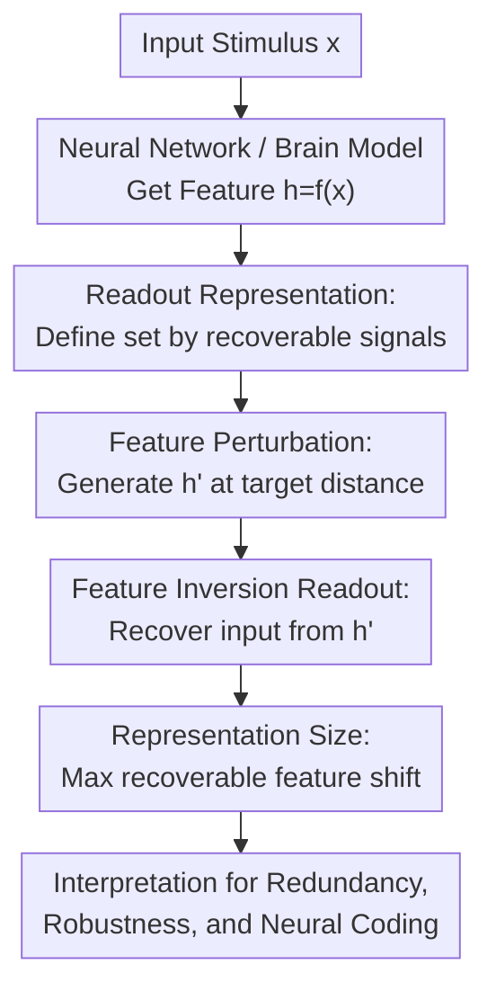

# Readout Representation: Redefining Neural Codes by Input Recovery

**Conference**: ICLR2026  
**OpenReview**: [https://openreview.net/forum?id=pODHH9DLeA](https://openreview.net/forum?id=pODHH9DLeA)  
**Code**: Available (supplementary material)  
**Area**: Computational Neuroscience / Neural Representation  
**Keywords**: Neural Coding, Readout Representation, Feature Inversion, Representation Redundancy, Computational Neuroscience  

## TL;DR
This paper proposes defining neural representations based on "what can be read out from neural features" rather than "what input causally produced the feature." Through perturbed feature inversion experiments in vision and language models, it demonstrates that a single input often corresponds to a broad recoverable region in the feature space, and the representation size serves as a metric for redundancy, robustness, and single-sample representability.

## Background & Motivation
**Background**: In neuroscience and deep learning, the most common framework for sensory representation is hierarchical causal processing: stimuli enter the system, low-level layers extract edges and textures, and high-level layers progressively abstract objects, semantics, or task-related variables. This framework supports various analytical tools such as neural manifolds, Representational Similarity Analysis (RSA), Information Bottleneck, feature visualization, and deep network feature inversion.

**Limitations of Prior Work**: While the causal perspective is natural, it ties "representational content" strictly to the "input that caused the neural state." This makes it difficult to describe phenomena like illusions, dreams, mental imagery, and attentional modulation. For instance, when a person perceives a rope as a snake, the neural activity is triggered by the rope, but the subjective content and subsequent behavior align with a "snake." Stating the state represents a rope fail to explain the misrepresentation, while stating it represents a snake contradicts the causal source.

**Key Challenge**: Hierarchical abstraction is typically understood as discarding details to preserve task-relevant information. However, neural decoding and deep network inversion research repeatedly show that fine-grained input information can be recovered even from higher layers. The issue is not just whether information remains, but what definition should be used to describe the representational status of this residual information.

**Goal**: The authors aim to transform the "informational view" and "teleological view" from philosophy into an operational computational framework. Given a readout process, if a signal can be recovered from a class of neural features, those features represent that signal. Furthermore, the authors wish to quantify the size of the recoverable region a signal occupies in the feature space and test whether this size correlates with redundancy, robustness, model performance, and input sample properties.

**Key Insight**: The paper utilizes Deep Neural Networks (DNNs) as fully observable testing platforms. In artificial models, one can directly access intermediate features, actively perturb them, and perform input recovery. This setup avoids the difficulties of measurement noise and uncontrollable perturbations in biological brains. The problem formulation stems from computational neuroscience: if dreams, illusions, and brain decoding can be understood through readout content, the phenomenon of recovering inputs from perturbed features in artificial networks may provide a clearer definition of representation.

**Core Idea**: The study redefines the representation of an input from a "single feature point generated by the input" to a "set of all features from which the input information can be read out," using "representation size" to measure the extent of this set in the feature space.

## Method

### Overall Architecture
The methodology does not propose a new recognition model but a set of representational definitions and validation experiments. The workflow involves formalizing "readout representation," using feature inversion as a readout mechanism, perturbing original features along the feature space to check if the input remains recoverable, and finally defining "representation size" as the maximum recoverable perturbation distance.

At the definitional level, the neural system or network is denoted as $f:X\times\Xi\to H$, where $x\in X$ is the input stimulus, $\xi\in\Xi$ is the brain state or context, and $h\in H$ is the neural feature. The target signal space is $S$, a reference mapping $\bar{\pi}:X\to S$ provides the ground-truth signal for the input, and the readout process $\pi:H\to S$ recovers the signal from features. While the traditional causal perspective asks "which $x$ produced $h$," this paper asks "which $s$ can be read out from $h$ via $\pi$."

At the experimental level, $\pi$ is instantiated as feature inversion. Given a target feature $h$, the readout searches for an input $x$ such that the network's feature $f(x)$ for this input is as close as possible to $h$. If the input recovered from a perturbed feature $h'$ (far from the original feature) remains close to the original image or text, it indicates the input is represented by a recoverable region rather than a single point.

### Key Designs
**1. Readout Representation: Redefining Neural Codes from Causal Source to Recoverable Content**

The pivotal conceptual shift is defining "representation" as a readout relationship: $h\in H$ represents $s\in S$ if and only if $s=\pi(h)$. Thus, the readout representation of a signal $s$ is the set $H_s^\pi=\{h\in H\mid \pi(h)=s\}$. This differs from treating $h=f(x)$ as the representation of $x$, as it allows multiple distinct neural states to represent the same signal, provided they are recovered as the same content by the readout process.

**2. Representation Size: Quantifying the Redundant Region via Max Recoverable Offset**

To measure the "width" of the representational set, the authors use a threshold-relaxed version: $H_{x,t}^\pi=\{h\in H\mid \forall x'\in\pi(h), d_X(x,x')<t\}$. Representation size is defined as the maximum distance from the original feature within this set: $r_x=\max\{d_H(h,f(x))\mid h\in H_{x,t}^\pi\}$. In vision tasks, $d_X$ primarily uses image-related distances with a threshold of $0.1$; in language tasks, it uses token error rate with a threshold of $0.3$.

**3. Perturbed Feature Inversion: Testing Feature Regions for Input Information**

To probe the boundaries of $H_{x,t}^\pi$, Gaussian noise is added to the original features to generate perturbed features $h'=h+\epsilon$ at specific target correlation distances $c$. The readout process uses feature inversion. In vision models, Deep Image Prior (DIP) is used as a weak structural prior, optimizing a latent $z$ such that $f(g(z))$ matches the target feature. In language models, token logits are optimized directly.

**4. Redundancy Mechanism: High-Dimensional Feature Space and Low-Dimensional Inputs**

The authors link the recovery from perturbed features to representational redundancy. Analysis across hierarchy shows that layers with higher feature dimensions typically have larger representation sizes. This suggests that the high-dimensional ambient space provides a redundant coding space for the low-dimensional natural input manifold. A toy model with 100 tuning neurons demonstrates that many points perturbed off the neural manifold can still be read back to the original input.

### Loss & Training
The study is an analytical framework and does not train new primary models. It uses pre-trained vision (VGG19, CLIP, DINOv2, SDXL-VAE) and language models (BERT, GPT2 series, OPT series). For vision, 64 natural images are sampled from ImageNet; for language, 64 text segments are sampled from the C4 validation split.

Optimization for feature inversion is standardized: the vision side optimizes DIP latents (LR 0.0001, 10,000 iterations), and the language side optimizes token logits (LR 0.1, 10,000 iterations) using the AdamW optimizer. Visual experiments use DIP to reduce high-frequency artifacts, though ablations without DIP show the same qualitative trends.

## Key Experimental Results

### Main Results
The core finding of the vision experiments is that in the low-to-mid layers of several models, the original image can be recovered with high fidelity even when features are severely perturbed. In VGG19, when the feature correlation distance $d_H$ reaches $0.7$, the pixel correlation distance of the recovered image remains below $0.1$.

| Modality / Model | Readout Object | Key Setting | Main Results | Explanation |
|------------------|----------------|-------------|--------------|-------------|
| VGG19 | ImageNet Images | 16 Conv layers, DIP inversion | Low-mid layers maintain $d_X < 0.1$ at $d_H \le 0.7$ | Input info covers a wide feature region |
| DINOv2-giant | ImageNet Images | Quarter-depth layers | Recovery possible from significant perturbation | Self-supervised representations have wide readout regions |
| BERT | C4 Text | 256 tokens, logit optimization | Near-perfect recovery under high perturbation | Token information is highly redundant in mid-layers |
| OPT-350m | C4 Text | Quarter-depth layers | High quality recovery near $d_H \approx 0.7$ | Certain autoregressive LMs have extended regions |

### Ablation Study
The representation size reflects the representational state of individual samples. First, "hit" images (correctly classified by VGG19) exhibit larger representation sizes than "miss" images, especially in higher layers. Second, natural images have significantly larger representation sizes compared to uniform random noise images, which yield a size near zero.

| Configuration | Metric | Result | Explanation |
|---------------|--------|--------|-------------|
| VGG19 Hit vs Miss | Representation size | Hits are larger, especially in deep layers | Successful classification correlates with redundant regions |
| Natural vs Noise | Representation size | Noise is ~0; Natural is significant | Models have stronger readout structures for natural inputs |
| Randomized VGG19 | Representation size | Differences persist partially | Architecture itself is biased toward natural structures |
| Training Influence | Representation size | Trained models have larger sizes in mid-high layers | Training expands regions associated with data distribution |

### Key Findings
- A single input does not map to a unique "canonical feature point." Perturbed points far from the original feature can still yield the same recovered input.
- This phenomenon is most prominent in low-to-mid layers; detail recovery weakens closer to the output layer, indicating that abstraction and compression do not imply the total erasure of detail.
- Representation size correlates with model performance. The fact that "hit" images have larger sizes suggests that a model's ability to handle a sample is reflected in the width of its recoverable region.
- The framework demonstrates that language models vary significantly; BERT and OPT-350m show strong recovery in low-mid layers, while the GPT2 series is weaker, suggesting readout representation as a potential tool for comparing training objectives and architectures.

## Highlights & Insights
- The paper transforms a classical problem in philosophy and neuroscience into a measurable object. By using $H_s^\pi$ and $r_x$, "representation" is grounded in the geometry of the feature space.
- It corrects the intuition that "abstraction loses detail" by showing that abstract layers can become more semantic while retaining vast recoverable information in high-dimensional redundant directions.
- As a single-sample metric, representation size can be used for diagnostics, confidence estimation, and outlier analysis without requiring a large batch of samples.
- From a computational neuroscience perspective, it provides a unified language for illusions and mental imagery: representational content depends on what can be read out by the downstream system.

## Limitations & Future Work
- Readout representation is heavily dependent on the decoder $\pi$. If $\pi$ uses strong priors (e.g., GANs), the readout content might stem from the prior rather than the feature.
- While the study shows correlations with performance, it has not yet systematically proven that representation size can predict generalization or neural behavior across all contexts.
- Feature perturbation is straightforward in artificial networks but difficult in biological brains. Future work may need to use trial-to-trial variability or closed-loop stimulation as substitutes.
- The differences in language models are not fully explained. Weak recovery in certain models might be due to autoregressive training, LayerNorm geometry, or optimization difficulties.

## Related Work & Insights
- **vs Hierarchical-Causal View**: Instead of how inputs cause features, it emphasizes what signals can be recovered from features, better handling misrepresentations.
- **vs Feature Inversion**: Extends inversion beyond visualization to measure the "size" of the representational set through active perturbation.
- **vs RSA / CKA / Manifold Analysis**: While these methods compare sample sets or distributions, $r_x$ focuses on the width of the recoverable region for a single input.
- **vs Model Metamers**: Metamers show different inputs can lead to the same representation. Readout representation shows different features can lead to the same input recovery.

## Rating
- Novelty: ⭐⭐⭐⭐⭐ Connects philosophy and neuro-decoding to a quantifiable metric.
- Experimental Thoroughness: ⭐⭐⭐⭐☆ Covers various modalities and models, though downstream predictive value is preliminary.
- Writing Quality: ⭐⭐⭐⭐☆ Clear logic; conceptual definitions are rigorous.
- Value: ⭐⭐⭐⭐⭐ Encourages a fundamental rethink of "what is a neural code."

<!-- RELATED:START -->

## Related Papers

- [\[ICLR 2026\] A New Paradigm for Genome-wide DNA Methylation Prediction Without Methylation Input](a_new_paradigm_for_genome-wide_dna_methylation_prediction_without_methylation_in.md)
- [\[ICLR 2026\] DeepSADR: Deep Transfer Learning with Subsequence Interaction and Adaptive Readout for Cancer Drug Response Prediction](deepsadr_deep_transfer_learning_with_subsequence_interaction_and_adaptive_readou.md)
- [\[ICLR 2026\] Learning Brain Representation with Hierarchical Visual Embeddings](learning_brain_representation_with_hierarchical_visual_embeddings.md)
- [\[ICLR 2026\] Continuous Multinomial Logistic Regression for Neural Decoding](continuous_multinomial_logistic_regression_for_neural_decoding.md)
- [\[ICLR 2026\] GRAM-DTI: Adaptive Multimodal Representation Learning for Drug-Target Interaction Prediction](gram-dti_adaptive_multimodal_representation_learning_for_drugtarget_interaction_.md)

<!-- RELATED:END -->
