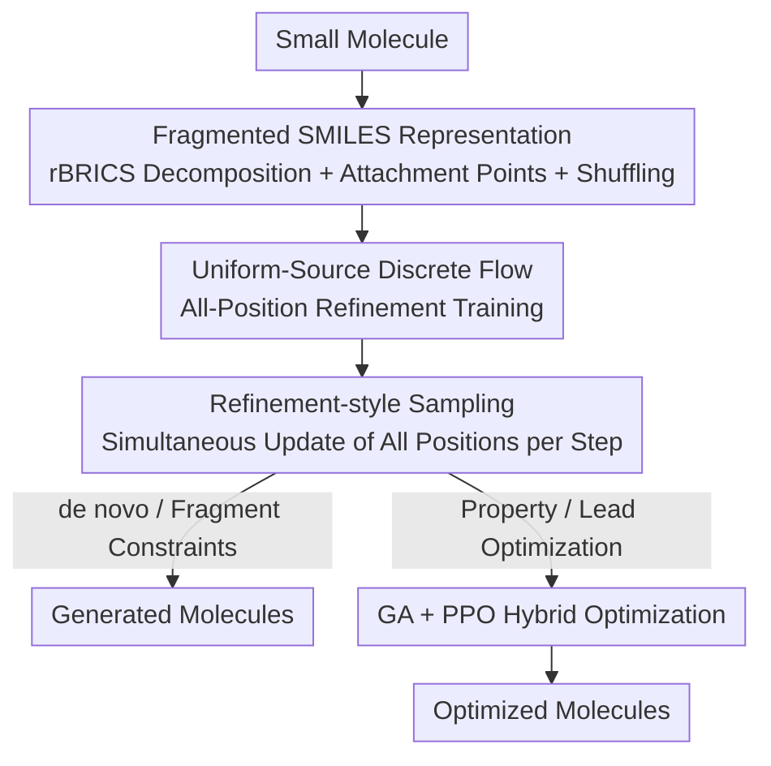

# Refine Drugs, Don't Complete Them: Uniform-Source Discrete Flows for Fragment-Based Drug Discovery

**Conference**: ICLR 2026  
**OpenReview**: [https://openreview.net/forum?id=Qdu92a5DiM](https://openreview.net/forum?id=Qdu92a5DiM)  
**Code**: https://github.com/invirtuolabs/InVirtuoGen_results  
**Area**: Computational Biology / Drug Design / Molecular Generation / Discrete Flow  
**Keywords**: Discrete Flow, Fragmented SMILES, Uniform Source, Molecular Optimization, PPO+Genetic Algorithm

## TL;DR
InVirtuoGen utilizes "uniform-source continuous-time discrete flow" on fragmented SMILES to transform the generation paradigm from "step-by-step completion" to "simultaneous refinement of all positions." This approach not only establishes a superior quality-diversity Pareto frontier in de novo generation but also achieves a new SOTA on the PMO benchmark and lead optimization through a hybrid optimization of Genetic Algorithms and PPO.

## Background & Motivation

**Background**: Fragment-Based Drug Discovery (FBDD) is the mainstream molecular exploration paradigm in both industry and academia—retaining critical substructures like active scaffolds or pharmacophores and modifying only the periphery to tune properties. The primary method for automating this is sequential generation: either using autoregressive models (e.g., SAFE-GPT) to generate tokens in a fixed left-to-right order, or using masked diffusion models (e.g., GenMol) to gradually reveal tokens starting from a fully masked sequence.

**Limitations of Prior Work**: Both approaches possess structural defects. Autoregressive models impose a fixed left-to-right order on molecules which are inherently unordered graphs; this order is arbitrary relative to the structure. While masked diffusion makes predictions for the entire sequence at each step, the training loss is calculated only on "masked positions," meaning once a token is revealed during sampling, it is fixed and not updated further. Furthermore, the number of sampling steps is strictly constrained by the initial number of masked tokens—the sequence length dictates the maximum number of steps unless human-designed remask heuristics are added.

**Key Challenge**: "Completion-based" generation (autoregressive, masked diffusion) treats the generated part as an immutable fact, failing to perform coordinated global adjustments of the entire molecule. Additionally, the tight coupling of sampling steps with sequence length limits sampling precision.

**Goal**: To find a generation paradigm that maintains fragment-level control while allowing all positions to be revisited and updated at every step, and to seamlessly integrate this into practical downstream tasks (property optimization, docking score optimization, lead refinement).

**Key Insight**: The authors leverage the continuous-time discrete flow framework—it transports "uniformly distributed random tokens" to the "real data distribution," naturally predicting all positions at every step and allowing all positions to change simultaneously.

**Core Idea**: Refine drugs, don't complete them—replace masked completion with uniform-source discrete flow to let each denoising step refine all positions simultaneously. This decouples sampling steps from sequence length and allows the model to accept entire (even invalid) sequences as input, facilitating integration with Genetic Algorithms (GA) and PPO.

## Method

### Overall Architecture

The input to InVirtuoGen is a small molecule, and the output is a newly generated or optimized molecule. The process consists of four stages: first, decomposing the molecule into a **fragmented SMILES** representation; then training a denoising model using **uniform-source discrete flow** on this representation (critically, the training loss covers all positions); performing **refinement-based sampling** during generation (where all tokens can change at each step); and finally, for property or lead optimization, layering a **hybrid GA + PPO optimization** for directional chemical space search.

### Key Designs

**1. Fragmented SMILES Representation: Making "Chemically Meaningful Fragments" the Minimum Unit of Generation**

Standard SMILES compress molecular graphs into sequences via depth-first traversal. This linearization often shatters chemically meaningful substructures, providing little control over "retaining scaffolds or assembling fragments," which is unsuitable for FBDD. This paper extends the SAFE representation: using a revised BRICS (rBRICS) algorithm to decompose molecules into chemically reasonable fragment blocks, with attachment points explicitly labeled as $[i*]$ at bond breaks, and fragments separated by spaces. A crucial detail is that fragments are **randomly shuffled** rather than following the original order of attachment points, thereby removing implicit sequential bias—complementing the subsequent bidirectional, unordered generation paradigm. Sequences are tokenized at the atomic level (e.g., `Cl`, attachment tokens count as single tokens), resulting in a vocabulary of only 204 tokens. This representation ensures both "fragment integrity" and "explicit attachment point numbering," serving as the vehicle for fragment-level control.

**2. Uniform-Source Discrete Flow + All-Position Refinement Training: Shifting the Paradigm from Completion to Refinement**

This is the core of the paper, directly addressing the pain point of masked diffusion where "loss is only calculated for masked positions and tokens are fixed once revealed." The authors adopt the discrete flow framework of Gat et al., aiming to transport the source distribution $X_0\sim p$ to the target distribution $X_1\sim q$, where **the source is a uniform distribution over all tokens**. Using a linear schedule, the probability path is:

$$p_t(x^i \mid x_0, x_1) = (1-t)\,\delta_{x_0}(x^i) + t\,\delta_{x_1}(x^i),\quad t\in[0,1].$$

The training objective incorporates prediction error for **every position in the sequence**, rather than just masked positions:

$$\mathcal{L}(\theta) = -\,\mathbb{E}_{t,(X_0,X_1),X_t}\;\frac{1}{1-t^2}\sum_i \log p_{1|T}(X_1^i \mid X_t).$$

The time-dependent weight $\tfrac{1}{1-t^2}$ (inspired by Sahoo et al.) assigns greater weight to the later stages of the trajectory, forcing the model to be more accurate near the destination. The architecture uses a Diffusion Transformer (DiT), modeling long-range dependencies between fragments via bidirectional self-attention. Because the loss covers all positions, the model learns to "pull the entire molecule toward the data distribution at each step" rather than "filling in blanks"—this is the essence of refinement over completion, effectively decoupling sampling steps from sequence length.

**3. Refinement-style Sampling: Simultaneous Updates and Step-Length Decoupling**

Once trained, sampling is no longer "gradually revealing masks" but starts from a uniform random sequence where all positions are resampled every step. While the theoretical discrete-time Markov update is $X_{t+h}^i \sim \delta_{X_t^i}(\cdot) + h\,u_t^i(\cdot, X_t)$, the authors empirically found that directly sampling from the model's predicted per-position distribution:

$$X_{t+h}^i \sim \hat{p}_t^i(X_t)$$

is significantly superior (the authors admit this lacks theoretical proof but is empirically robust). During sampling, the Gumbel noise scale $r$ is decayed by $(1-t)$ and the softmax temperature $T$ is annealed to achieve "early exploration and late refinement." Since the sequence length is factorized as $p_\theta(x) = p(n)\,p_\theta(x\mid n)$, the step size $h$ can be arbitrarily refined (in experiments, smaller $h$ leads to simultaneous improvements in quality and diversity), a flexibility completion-based models lack.

**4. GA + PPO Hybrid Optimization: Turning Uniform Source into an Optimization Powerhouse**

Since de novo generation has limited utility in real-world drug discovery, another major contribution is the hybrid framework for PMO property and lead optimization. **Genetic Algorithm Part**: A "lexicon" of high-scoring molecules is maintained (using a Morgan fingerprint Tanimoto distance $\geq 0.7$ to ensure diversity). Two parents are selected using rank-based probability $p(m)=1/(\text{rank}(m)+\kappa M)$. After rBRICS decomposition, a fragment from one parent is replaced by a fragment from the other (direct string concatenation in fragment space). While offspring are often invalid molecules, it doesn't matter—they serve as the initial state $x_{t=0}$ for discrete flow sampling, allowing the model to refine them into valid variants in the neighborhood. This is more flexible than GenMol's concatenation at fixed dummy attachment points. **PPO (Proximal Property Optimization) Part**: Since discrete flows lack an analytical sequence $\log p(x)$, the authors use Monte Carlo estimation on noised states, optimizing the time-weighted loss $\mathcal{L}=\frac{1}{1-t^2}\sum_{\text{noised}}\log\pi_\theta(x_1^i\mid x_t,t)$. The advantage $A$ is calculated via in-batch normalization $A=\frac{r-\bar r}{\sigma_r+\epsilon}$, following a standard clipped PPO surrogate objective. An **adaptive sequence length bandit** is added to favor high-reward lengths while maintaining exploration. The full process follows Alg. 1 (alternating GA exploration and PPO fine-tuning), and **all tasks share the same hyperparameters**, highlighting that gains come from algorithmic design rather than parameter tuning.

### Loss & Training

The pre-training loss is the all-position discrete flow objective with time weighting $\tfrac{1}{1-t^2}$ (Eq. 4), using a Diffusion Transformer. Pre-training data is consistent with GenMol/SAFE-GPT, using ZINC and UniChem (approx. 1 billion molecules). The downstream optimization phase alternates between GA and PPO (time-weighted PPO loss in Eq. 7 + docking score penalty reward in Eq. 8), using a single hyperparameter configuration across all tasks.

## Key Experimental Results

Evaluation covers four tasks: de novo generation, fragment-constrained generation, PMO target property optimization, and lead optimization.

### Main Results

**PMO Benchmark (with ZINC250k prescreening, comparable to GenMol/f-RAG, sum of AUC-top10, average of 3 runs)**

| Model | Sum of AUC-top10 (23 tasks) |
|------|--------------------------|
| **InVirtuoGen** | **18.993 (±0.219)** |
| GenMol | 18.362 |
| f-RAG | 16.928 |

InVirtuoGen shows significant leads on tasks such as valsartan smarts (0.935 vs 0.822), sitagliptin mpo (0.743 vs 0.584), and scaffold hop (0.711 vs 0.628).

**PMO Benchmark (no prescreening, comparable to baselines without prior information)**

| Model | Sum of AUC-top10 |
|------|----------------|
| **InVirtuoGen (no prescreen)** | **16.676 (±0.256)** |
| Genetic GFN | 16.213 |
| Mol GA | 14.708 |
| REINVENT | 14.184 |

Notably, while GenMol/f-RAG nominally use 10k oracle calls, the ZINC250k prescreening actually consumes ~250,000 additional calls (effective budget near 260k), whereas InVirtuoGen achieves the highest total task score under both settings.

**Lead Optimization (Docking Score DS, lower is better, 5 target proteins)**: On targets like parp1 and jak2, InVirtuoGen's docking scores are significantly better than GenMol/RetMol/GraphGA. For example, for the first seed of parp1, it reaches -14.1 ($\delta=0.4$) / -12.3 ($\delta=0.6$), whereas GenMol achieves -10.6 / -10.4. Under the stricter $\delta=0.6$ similarity constraint where baselines often fail to produce improved leads, Ours remains effective.

### Ablation Study

| Configuration | Conclusion |
|------|------|
| Time granularity h=0.001 → 0.1 | Smaller h (more steps) improves both quality and diversity; high-granularity yields the largest gain |
| Direct per-position sampling (Eq. 6) vs theoretical update (Eq. 2) | Eq. 6 is significantly superior (though lacks theoretical proof) |
| PPO without prescreening and GA | Still outperforms REINFORCE, indicating the PPO adaptation itself is effective |
| Optimization stack components (App. B.3.1) | GA, PPO, and adaptive length bandit all provide positive contributions |

### Key Findings
- **Sampling granularity is a free lunch**: Because steps are decoupled from sequence length, simply reducing $h$ improves both quality and diversity, a degree of freedom completion-based models cannot offer.
- **"Invalid intermediates" are an advantage**: Illegal offspring from GA serve only as initial states; discrete flow refines them into valid, improved molecules in their neighborhood, exploring more broadly than fixed attachment point concatenation.
- **Single hyperparameter set across all tasks**: Gains stem from the paradigm and algorithm design rather than per-task tuning, indicating stronger transferability.

## Highlights & Insights
- **Clean paradigm shift**: Changing "completion" to "refinement" simply requires the training loss to cover all positions + a uniform source. This simultaneously solves the "token locking" and "length-restricted steps" issues of masked diffusion in a concise manner.
- **Synergy between representation and paradigm**: Randomly shuffling fragments removes sequential bias, which perfectly suits the bidirectional, unordered discrete flow; the flow's ability to handle entire (including illegal) sequences makes the GA's string-concatenation crossover natural—representation, generation, and optimization are tightly integrated.
- **Transferable trick**: The adaptation of PPO to a generation model without analytical $\log p(x)$ (via MC estimation of noised log-likelihood + time weighting) is a method that can be transferred to RL-finetuning of other discrete/diffusion-style generators.

## Limitations & Future Work
- **Lack of stereochemistry**: The fragmented SMILES representation does not include stereochemistry, failing to model stereospecific interactions; rBRICS decomposition might also miss chemically relevant bond-breaking patterns.
- **Coarse proxy metrics**: SA/QED correlate weakly with real-world drug-likeness; lacks ADMET evaluation. All results are proxy-based and require experimental validation (though this is a shared issue with all baselines).
- **Sampling modification lacks theory**: While Eq. 6 for direct per-position sampling is empirically strong, it lacks a theoretical foundation.
- **Conflict between fragment constraints and refinement philosophy**: Fragment-constrained generation relies on "naive overwriting" of fixed positions at each step, which disrupts the learned flow dynamics and contradicts the refinement paradigm—a weakness acknowledged by the authors.

## Related Work & Insights
- **vs GenMol (Masked Diffusion)**: GenMol calculates loss only on masked positions, reveals tokens permanently, and is step-bound by mask count; Ours calculates loss on all positions, allows all to vary at each step, and decouples steps from length, enabling a better quality-diversity frontier via fine-grained sampling.
- **vs SAFE-GPT (Autoregressive)**: SAFE-GPT imposes a left-to-right order, conflicting with the unordered nature of molecules; Ours uses bidirectional flow + fragment shuffling to eliminate sequential bias.
- **vs f-RAG / GenMol Optimization**: They rely on ZINC250k prescreening (costing 250k extra calls) for population initialization; Ours achieves higher PMO scores with a smaller effective budget and shared hyperparameters across tasks.
- **vs Uniform Discrete Language Models (Parallel Work)**: Also allows simultaneous token updates but remains within the diffusion framework; Ours is the first refinement-paradigm model using discrete flow on fragmented SMILES.

## Rating
- Novelty: ⭐⭐⭐⭐⭐ First refinement paradigm using discrete flow on fragmented SMILES; "refine not complete" accurately targets the weaknesses of masked diffusion.
- Experimental Thoroughness: ⭐⭐⭐⭐ Covers four task types + dual PMO settings + lead optimization; however, metrics are proxy-based and lack wet-lab validation.
- Writing Quality: ⭐⭐⭐⭐ Clear motivation, complete formulas, and honest disclosure of theoretical gaps in sampling and fragment constraints.
- Value: ⭐⭐⭐⭐⭐ Provides a universal generation backbone from de novo to multi-objective lead optimization with open-source checkpoints and code; highly practical.

<!-- RELATED:START -->

## Related Papers

- [\[ICML 2025\] GenMol: A Drug Discovery Generalist with Discrete Diffusion](../../ICML2025/computational_biology/genmol_a_drug_discovery_generalist_with_discrete_diffusion.md)
- [\[ICLR 2026\] FragFM: Hierarchical Framework for Efficient Molecule Generation via Fragment-Level Discrete Flow Matching](fragfm_hierarchical_framework_for_efficient_molecule_generation_via_fragment-lev.md)
- [\[ICLR 2026\] FACET: A Fragment-Aware Conformer Ensemble Transformer](facet_a_fragment-aware_conformer_ensemble_transformer.md)
- [\[ICLR 2026\] Test-Time Adaptation without Source Data for Out-of-Domain Bioactivity Prediction](test-time_adaptation_without_source_data_for_out-of-domain_bioactivity_predictio.md)
- [\[ICLR 2026\] SigmaDock: Untwisting Molecular Docking with Fragment-Based SE(3) Diffusion](sigmadock_untwisting_molecular_docking_with_fragment-based_se3_diffusion.md)

<!-- RELATED:END -->
