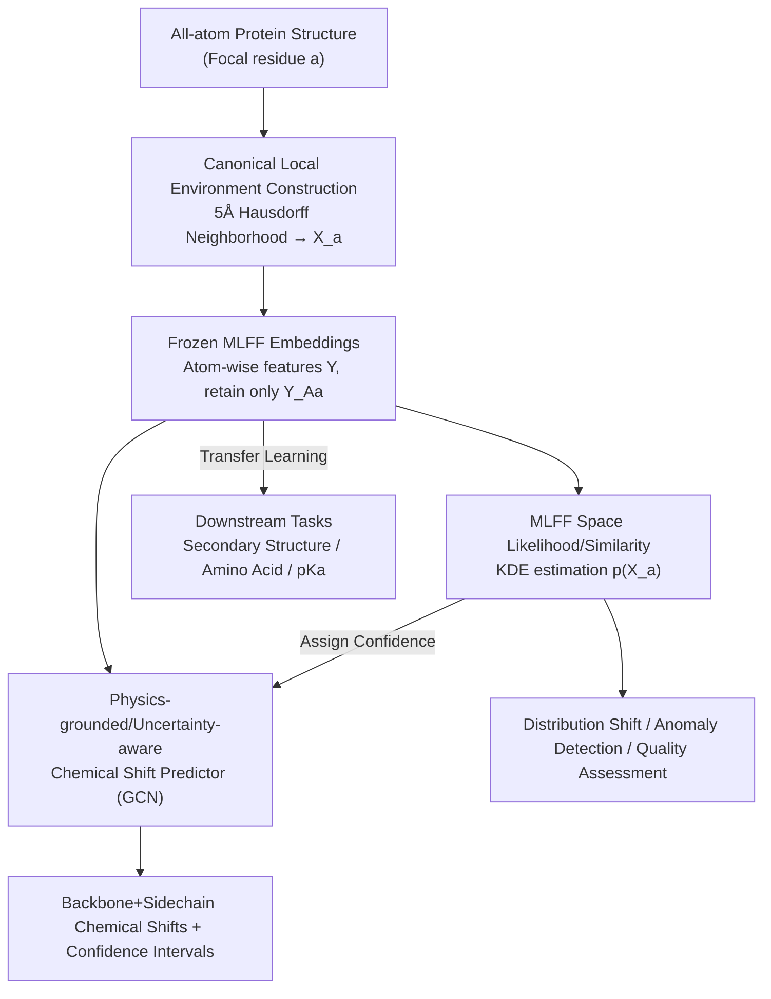

# Representing Local Protein Environments with Machine Learning Force Fields

**Conference**: ICLR 2026  
**OpenReview**: [https://openreview.net/forum?id=9ZogcRkhoG](https://openreview.net/forum?id=9ZogcRkhoG)  
**Code**: https://github.com/mb012/MLFF_representation  
**Area**: Computational Biology / Representation Learning / Protein Modeling  
**Keywords**: Machine Learning Force Fields, Local Protein Environments, Representation Learning, NMR Chemical Shifts, Uncertainty Estimation

## TL;DR
This paper repurposes intermediate layer embeddings from Machine Learning Force Fields (MLFFs), originally intended for predicting energy and forces, as general-purpose representations of local protein environments. By extracting features of atoms within a 5Å neighborhood centered on a residue from a frozen pre-trained MLFF, the authors demonstrate that biochemical information such as secondary structure, amino acid identity, and protonation states is organized zero-shot. This approach achieves SOTA results on downstream tasks like pKa and NMR chemical shift prediction and enables uncertainty estimation via likelihood calculations.

## Background & Motivation
**Background**: A core challenge in applying machine learning to proteins is representing the "local environment"—the chemical microenvironment surrounding a residue determined by atomic identities, bonds, dihedral angles, hydrogen bonds, and electrostatics. Traditional approaches rely on hand-crafted descriptors (dihedrals, hydrogen bonds, Parrinello-Behler symmetry functions), while recent sequence-based foundation models (e.g., ESM) learn representations from massive sequence data.

**Limitations of Prior Work**: Hand-crafted descriptors have limited expressive power and poor generalization across proteins and tasks. Sequence models like ESM learn statistical co-occurrences and do not directly encode quantum-level physics (bond geometry, torsion, electronic interactions), often failing in rare chemical environments or out-of-distribution (OOD) conformations. In computational chemistry, tools like ANI have used "Atomic Environment Vectors (AEV)" for pKa prediction, but AEVs are fixed, manual symmetry function descriptors without message passing, making them unable to adaptively capture context-dependent interactions.

**Key Challenge**: An ideal local representation must be sensitive to local changes, insensitive to global ones, computationally efficient, directly comparable across environments (canonical), and generalizable to unseen environments. Sequence or manual descriptors are naturally weak in "physical grounding" and "cross-chemical generalization."

**Key Insight**: The authors observed that modern MLFFs (MACE, OrbNet, AIMNet, Egret, etc.) are trained on millions of DFT quantum calculation data points. To accurately reconstruct potential energy surfaces, their hidden layers must encode physical quantities such as bond geometry, torsion, and electronic interactions. Furthermore, these features are defined **atom-wise**; atoms serve as invariant "building blocks" across different sequences and folds, facilitating transfer to unseen proteins.

**Core Idea**: Repurpose MLFFs from "energy/force regressors" into "representation learners for local chemical environments." By freezing a pre-trained MLFF and extracting intermediate embeddings as general features for protein environments, the model acts as a "foundation model" for structural biology.

## Method

### Overall Architecture
The pipeline addresses how to generate **comparable, physically grounded, and reusable** local representations for each residue in a protein structure for downstream tasks. It consists of four steps: "Define local environment → Encode with frozen MLFF → Regularize into canonical descriptors → Downstream transfer learning / Likelihood analysis."

The input is the all-atom structure of the protein $X=\{(x_j, z_j)\}$ (coordinates + atomic numbers). For each "focal residue" $a$, its local environment $X_a$ is constructed by merging all residues within a 5Å neighborhood. $X_a$ is fed into a pre-trained MLFF $f_\theta$, where message passing generates atom-wise embeddings $Y$. Only the embeddings of the focal residue's own atoms $Y_{A_a}$ are retained as the canonical descriptor. This process is repeated for all residues. The resulting features follow two paths: one to lightweight downstream networks (classifiers / GCNs) for transfer learning tasks (secondary structure, amino acid identity, pKa, chemical shifts), and another for kernel density estimation in the embedding space to obtain likelihoods for similarity measurement, distribution shift detection, and uncertainty estimation.

### Key Designs

**1. Canonical Local Environments: Enabling Direct Comparison**

Encoding the entire protein (thousands of atoms) is slow, redundant, and produces variable-sized environments that are difficult to compare. The authors define $X_a$ for focal residue $a$ as the set of all residues with an atomic distance $\leq 5Å$ (Hausdorff distance) to $a$. After encoding, **only the embeddings corresponding to the focal residue's own atom set $A_a$ are retained**, denoted as $Y_{A_a}$. The first half ensures sufficient local context is captured, while the second half regularizes the representation into a fixed, comparable object—the descriptor's "anchor" is always the focal residue's atoms regardless of the surrounding environment's size.

**2. Reusing Frozen MLFF Embeddings: Energy Regressor as Feature Extractor**

To fit DFT potential energy surfaces, MLFF hidden layers must encode physical properties. Because of message passing, each atom's feature depends on its context. The authors **completely freeze** the MLFF and extract the final layer's atom-wise embeddings (shape $N\times d$) without protein-specific re-training. These representations are physically grounded (from quantum data), naturally transferable (atoms are universal building blocks), and meaningful zero-shot (distinguishing $\alpha$-helices/$\beta$-sheets via clustering). Evaluation of MACE, OrbNet, AIMNet, and Egret showed MACE performed best on most tasks, while AIMNet excelled at pKa due to its multi-objective training (energy, charge, spin).

**3. Likelihood and Similarity in MLFF Space: KDE as a Probabilistic Model**

To measure how "typical" an environment is, the authors use Kernel Density Estimation (KDE) with a radial basis function kernel in the embedding space. The likelihood of environment $X_a$ is defined as:

$$p(X_a)=\frac{1}{|E_{\mathrm{ref}}|}\sum_{X_{a'}\in E_{\mathrm{ref}}}\exp\!\left(-\frac{\lVert f_\theta(X_a)|_{Y_A}-f_\theta(X_{a'})|_{Y_A}\rVert^2}{2\sigma^2}\right),$$

where $\sigma$ is the bandwidth. This likelihood measures how "common" $X_a$ is relative to a reference set $E_{\mathrm{ref}}$. It is sensitive to subtle conformational changes (e.g., higher likelihood for Amber99-relaxed structures) and can be used for structural quality assessment and OOD detection.

**4. Physics-Grounded, Uncertainty-Aware Chemical Shift Predictor**

As a flagship application, the authors trained GCNs on frozen MLFF embeddings to predict NMR chemical shifts for backbone (N, CA, C, H, HA) and sidechain atoms. The model outperformed the SOTA UCBShift2-X on backbone and sidechain heavy atoms. Crucially, the model is "physically grounded": when rotating a Phenylalanine sidechain ring ($\chi_2$ from $-180°$ to $180°$), the predictor correctly captures the $180°$ periodicity of ring current effects with smooth decay, whereas UCBShift showed non-physical long-range effects beyond 20Å. The likelihood from Design 3 correlates with prediction error, serving as a confidence score.

### Loss & Training
Downstream models are built on **frozen** MLFF embeddings (transfer learning without fine-tuning). Secondary structure and amino acid identity use lightweight classifiers (evaluated via F1/Precision/Recall); pKa and chemical shifts use GCN regression. Data was sourced from RefDB (a non-redundant subset of BMRB), with 1048 chains divided into 823 training and 225 testing samples. Structures were predicted by AlphaFold2, hydrogenated, and relaxed with the Amber99 force field. Ground truth pKa values were calculated using the PypKa Poisson-Boltzmann solver.

## Key Experimental Results

### Main Results
pKa prediction (MAE relative to PypKa, lower is better):

| Residue | PropKa | pKa-ANI | ESM3(Seq) | ESMFold | MACE | OrbNet | AIMNet | Egret |
|---------|--------|---------|-----------|---------|------|--------|--------|-------|
| Glu | 0.551 | 0.445 | 0.459 | 0.351 | 0.306 | 0.306 | **0.265** | 0.304 |
| Asp | 0.469 | 0.473 | 0.528 | 0.419 | 0.280 | 0.284 | **0.267** | 0.272 |
| Lys | 0.393 | 0.401 | 0.359 | 0.278 | 0.320 | 0.282 | **0.270** | 0.298 |
| His | 0.561 | 0.426 | 0.488 | 0.383 | 0.424 | 0.441 | **0.380** | 0.440 |

MLFF embeddings (especially AIMNet) consistently outperformed classical methods and ESM models across four types of titratable residues. For chemical shifts, the MACE-based predictor achieved lower median errors than UCBShift2-X on heavy atoms.

### Ablation Study

| Config / Comparison | Key Finding |
|------|---------|
| MLFF Families | MACE is best for structure/identity/shifts; AIMNet is best for pKa. |
| Environment Radius | 5Å is a balanced choice for efficiency and context. |
| Layer Choice | The final atom-wise feature layer yields the best performance. |
| Likelihood Stratification | Low-likelihood environments correlate with higher shift errors. |

### Key Findings
- **Zero-shot potential**: Unsupervised clustering of MLFF embeddings separates $\alpha$-helices/$\beta$-sheets and amino acid identities without any protein-specific training.
- **Task-specificity**: No single MLFF dominates all tasks. AIMNet's sensitivity to protonation (likely due to charge/spin training) makes it superior for pKa.
- **Physical consistency**: The ring current case study confirms that physically grounded representations extrapolate more reliably than alignment-based SOTA methods.

## Highlights & Insights
- **Cross-domain Foundation Models**: Zero-shot transfer of force fields trained on small molecule quantum data to represent complex protein environments is a successful transition of the "foundation model" paradigm to structural biology.
- **Canonicalization is Crucial**: The "encode many, retain one" strategy is the core trick that makes heterogeneous environments comparable.
- **Likelihood as Uncertainty**: Using KDE for density estimation provides a versatile tool for similarity, OOD detection, and confidence scoring for downstream predictions.

## Limitations & Future Work
- The MLFF is kept **frozen**; fine-tuning might improve performance but was not explored.
- HA carbon chemical shifts still slightly trail UCBShift, suggesting room for improvement in capturing long-range/solvent effects for hydrogens.
- MLFFs still struggle with **long-range interactions** beyond the 5Å window, which may limit performance on tasks involving allosteric coupling or distant electrostatics.
- Reliance on AlphaFold2 structures and Amber99 relaxation may introduce biases from the prediction pipeline into the representations.

## Related Work & Insights
- **vs. Symmetry Functions (AEV, Parrinello-Behler)**: Symmetry functions are fixed and lack message passing. This work's MLFF-based GCN approach captures richer context, resulting in lower pKa errors.
- **vs. Sequence Models (ESM)**: ESM captures sequence statistics, while MLFF embeddings capture quantum physics, performing better on pKa and chemical shifts.
- **vs. UCBShift2-X**: Unlike UCBShift’s reliance on sequence/structure alignment, this approach is fully differentiable, more accurate on heavy atoms, and provides physical consistency and uncertainty scores.

## Rating
- Novelty: ⭐⭐⭐⭐⭐ 
- Experimental Thoroughness: ⭐⭐⭐⭐⭐ 
- Writing Quality: ⭐⭐⭐⭐ 
- Value: ⭐⭐⭐⭐⭐

<!-- RELATED:START -->

## Related Papers

- [\[ICLR 2026\] DistMLIP: A Distributed Inference Platform for Machine Learning Interatomic Potentials](distmlip_a_distributed_inference_platform_for_machine_learning_interatomic_poten.md)
- [\[ICML 2026\] Towards A Generative Protein Evolution Machine with DPLM-Evo](../../ICML2026/computational_biology/towards_a_generative_protein_evolution_machine_with_dplm-evo.md)
- [\[ICLR 2026\] Learning Residue Level Protein Dynamics with Multiscale Gaussians](learning_residue_level_protein_dynamics_with_multiscale_gaussians.md)
- [\[ICML 2025\] Reliable Algorithm Selection for Machine Learning-Guided Design](../../ICML2025/computational_biology/reliable_algorithm_selection_for_machine_learning-guided_design.md)
- [\[ICLR 2026\] SAIR: Enabling Deep Learning for Protein-Ligand Interactions with a Synthetic Structural Dataset](sair_enabling_deep_learning_for_protein-ligand_interactions_with_a_synthetic_str.md)

<!-- RELATED:END -->
