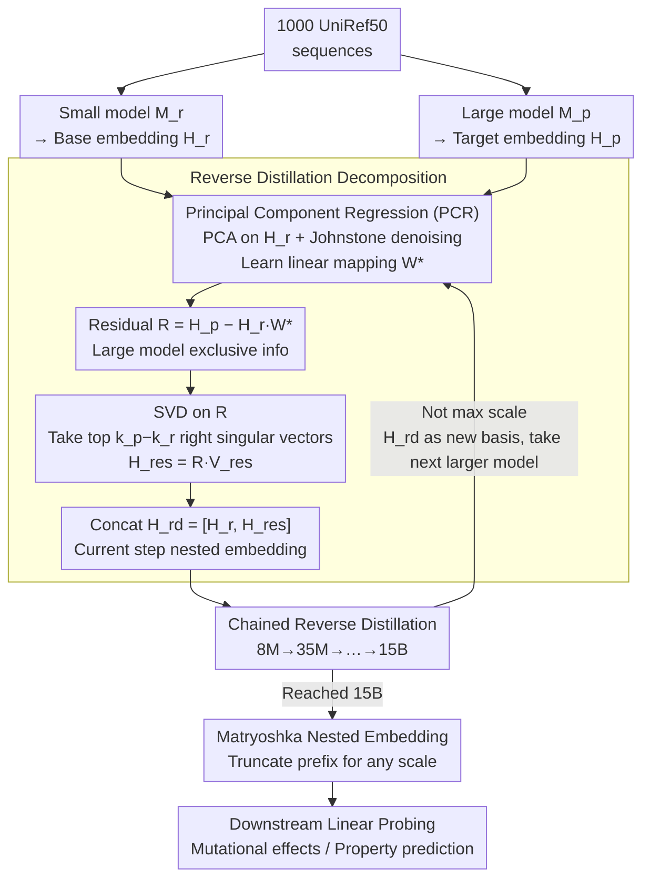

# Reverse Distillation: Consistently Scaling Protein Language Model Representations

**Conference**: ICLR 2026  
**arXiv**: [2603.07710](https://arxiv.org/abs/2603.07710)  
**Code**: [GitHub](https://github.com/rohitsinghlab/plm_reverse_distillation)  
**Area**: AI for Protein / Representation Learning  
**Keywords**: Reverse Distillation, Protein Language Models, Scaling Behavior, Matryoshka Nested Representations, ESM-2

## TL;DR

Addressing the counter-intuitive scaling phenomenon in Protein Language Models (PLMs) where "larger models do not necessarily perform better," a reverse distillation framework is proposed. By using small model representations as a basis and extracting orthogonal residual information from large models through SVD, the method constructs Matryoshka nested embeddings. This ensures larger reverse-distilled models consistently outperform smaller ones, making ESM-2 15B the strongest in the entire family for the first time after reverse distillation.

## Background & Motivation

**Background**: Protein Language Models (PLMs) learn rich protein representations via self-supervised training on massive sequences, achieving breakthrough progress in tasks such as structure prediction, functional annotation, and protein design. While scaling laws are stable in NLP and CV—where larger models improve performance—the PLM family exhibits counter-intuitive scaling behavior.

**Limitations of Prior Work**: Taking the ESM-2 family as an example, performance peaks at 650M–3B parameters, while the largest 15B model shows performance degradation. This introduces two key issues: (1) **Non-monotonic scaling**: It is unpredictable which downstream tasks will favor smaller models over larger ones, complicating model selection; (2) **Non-truncatable embeddings**: Embedding dimensions across different scales are incompatible, preventing the "embed once, truncate as needed" utility of Matryoshka embeddings seen in NLP.

**Key Challenge**: Although large models have sufficient capacity to encode richer high-order features (e.g., enzyme catalytic sites, allosteric coupling), these features are entangled with basic features (e.g., secondary structure propensities, hydrophobicity patterns) in the same representation space. When using linear probes downstream, task-irrelevant high-order features effectively become noise, obscuring the fundamental patterns that drive performance.

**Key Insight**: The authors approach this from a bias-variance tradeoff perspective: small models are constrained by capacity and forced to prioritize high-frequency, widely shared protein features (high bias, low variance); large models encode rare high-order phenomena but introduce variance. If small model representations are used as a "basis" to decompose large model representations into "shared foundation + orthogonal residual," destructive interference between the two feature types can be avoided.

**Core Idea**: Use representations from small models within the same family as a decomposition basis. Through linear regression and SVD, orthogonal residual information from the large model is extracted to construct nested embeddings that restore monotonic scaling behavior.

## Method

### Overall Architecture

Given a small model $M_r$ and a large model $M_p$ ($|M_r| < |M_p|$) from the same family, reverse distillation decomposes the $k_p$-dimensional representation space of the large model into two orthogonal subspaces: $\mathcal{S}_r$ (retaining the $k_r$-dimensional representation of the small model) and $\mathcal{S}_{res}$ (capturing $k_p - k_r$ dimensional residual information unique to the large model). The final output is $H_{rd} = [H_r, H_{res}]$, where the first $k_r$ dimensions are exactly the complete embedding of the small model, naturally possessing Matryoshka nesting properties.

The entire process involves only linear transformations (regression + SVD) without retraining any model. Training requires only 1000 UniRef50 sequences. For the ESM-2 family, chained distillation is performed along the sequence 8M → 35M → 150M → 650M → 3B → 15B to obtain reverse-distilled embeddings for each scale.

### Key Designs

**1. Reverse Distillation Decomposition (Algorithm 1): Splitting large model representations into "interpretable parts from small models" and "increments unique to large models"**

This targets the entanglement of basic and high-order features via a three-phase procedure. Phase 1 runs the small and large models on the same sequence set to obtain $H_r \in \mathbb{R}^{L \times k_r}$ and $H_p \in \mathbb{R}^{L \times k_p}$. Phase 2 uses Principal Component Regression (PCR) to learn a linear mapping $W^* = \arg\min_W \|H_p - H_r W\|_F^2$, fitting the large model representation using the small model basis. Crucially, PCA is applied to $H_r$ first, followed by Johnstone thresholding from random matrix theory to remove noise components, ensuring only signal components participate in the regression to avoid overfitting. Phase 3 calculates the regression residual $R = H_p - H_r W^*$, representing information the small model cannot explain. SVD is performed on $R$ to take the first $k_p - k_r$ right singular vectors $V_{res}$, resulting in the projection $H_{res} = R V_{res}$. Since the decomposition is linear, both components have clear physical meanings: $H_r$ is the complete feature space of the small model, while $H_{res}$ represents high-order features unique to the large model that are orthogonal to basic features, preventing interference.

**2. Chained Reverse Distillation (Algorithm 3): Extending pairwise decomposition to hierarchical decomposition for an entire model family**

A single decomposition handles only one pair of models, but a family often has multiple scales (e.g., 6 for ESM-2). The approach starts with the smallest model $M_1$. The accumulated embedding $H_{acc}^{(i-1)}$ serves as the basis for the next larger model $M_i$, repeating the reverse distillation—learning the mapping, calculating the residual, and extracting orthogonal components via SVD—before appending the new components to the end. For ESM-2, this proceeds 8M→35M→150M→650M→3B→15B. Experiments show that longer progressive chains (e.g., 8M→35M→150M→650M) consistently outperform direct jump chains (e.g., 8M→650M) because each step isolates increments between adjacent scales at a finer granularity, cleaner decoupling biological features at different levels.

**3. Matryoshka Nested Structure and Optimality Guarantee: Enabling a single embedding to function at any scale via prefix truncation**

Since the final output $H_{rd} = [H_r, H_{res}]$ is concatenated in order of scale, it naturally inherits Russian doll (Matryoshka) properties: the first $k_1$ dimensions are the 8M embedding, the first $k_1 + k_2$ dimensions are the rd.35M embedding, and so on. Any prefix truncation yields a valid reverse-distilled embedding for that scale. This resolves the incompatibility of original PLM embedding dimensions, allowing one-time embedding with on-demand retrieval of different dimensions, where performance degrades smoothly with truncation. Regarding optimality, Theorem 1 proves that among all $k_p$-dimensional representations $[H_r, X]$ with $H_r$ as a prefix, reverse distillation provides the $H_{res}$ that minimizes reconstruction error of the original large model representation, a conclusion directly derived from the Eckart-Young theorem.

### Loss & Training

The framework requires no backpropagation; it is based entirely on closed-form solutions. PCR regression coefficients are obtained via matrix inversion, and the residual subspace via SVD. Training requires only $N=1000$ randomly sampled UniRef50 sequences (with <30% sequence identity to evaluation sets), using the total amino acid positions $L = \sum n_i$ as the effective sample size. Since it involves only linear transformations, the computational cost is extremely low.

## Key Experimental Results

### Main Results: ProteinGym DMS Scaling Consistency (28 datasets, single-site mutations)

| Model Comparison | % of Datasets where First > Second | Meaning |
|---------|-------------------|------|
| rd.650M > Original 650M | 71.4% | RD improves performance at the same scale |
| rd.3B > Original 3B | 85.7% | RD improves performance at the same scale |
| rd.15B > Original 15B | 67.9% | RD fixes 15B degradation |
| Original 3B > Original 650M | 53.6% | Original scaling barely works |
| rd.3B > rd.650M | **92.9%** | Scaling is consistent after RD |
| rd.15B > rd.3B | **85.7%** | Scaling is consistent after RD |

### Downstream Protein Property Prediction (Table 4)

| Task | 650M | rd.650M | 3B | rd.3B | 15B | rd.15B |
|------|------|---------|-----|-------|-----|--------|
| SSP Q3 (aupr↑) | 0.831 | 0.833 | 0.791 | 0.816 | 0.845 | **0.861** |
| SSP Q8 (aupr↑) | 0.365 | 0.369 | 0.379 | 0.395 | 0.418 | **0.431** |
| MIB (aupr↑) | 0.881 | 0.855 | 0.893 | 0.891 | 0.900 | **0.901** |
| R2/R1 (aupr↑) | 0.343 | 0.405 | 0.369 | 0.425 | 0.368 | **0.468** |

### Ablation Study: Chained Configuration Comparison (Table 1, 3 DMS datasets)

| Chaining Configuration | ARGR_ECOLI | DN7A_SACS2 | ILF3_HUMAN |
|---------|-----------|-----------|-----------|
| Original 650M (baseline) | 0.834 | 0.868 | 0.712 |
| Direct 8M→650M | 0.849 | 0.878 | 0.765 |
| Direct 150M→650M | 0.845 | 0.866 | 0.751 |
| Full Chain 8M→35M→150M→650M | **0.858** | 0.867 | **0.786** |
| Original 3B (baseline) | 0.845 | 0.880 | 0.749 |
| Full Chain→3B (rd.3B) | **0.873** | **0.890** | **0.801** |

### Key Findings

- **Significant repair of scaling consistency**: In original ESM-2, the proportion of tasks where 3B outperformed 650M was only 53.6%. After reverse distillation, the proportion of rd.3B outperforming rd.650M soared to 92.9%, largely restoring monotonic scaling.
- **Improved Performance at same scale**: rd.650M outperforms original 650M on 71.4% of datasets, indicating that reverse distillation not only fixes scaling relationships but also directly enhances embedding quality.
- **15B degradation reversed**: rd.15B becomes the strongest model in the family, outperforming original 15B in single-mutation (67.9%) and double-mutation tasks (57.1%).
- **Longer chains are consistently better**: The full progressive chain (8M→35M→150M→650M) outperformed direct jump chains (e.g., 8M→650M) across all three exploratory datasets, validating the superiority of stepwise decomposition.
- **Largest gains in R2/R1 prediction**: On the RNA secondary structure task, rd.15B (0.468) improved by 27% compared to original 15B (0.368), suggesting reverse distillation is particularly effective for tasks requiring fine-grained feature separation.
- **SAE analysis validates feature decoupling**: Sparse Autoencoder training on rd.35M embeddings captured 25% more GO terms on average compared to original 35M embeddings (40 vs 32), with significantly higher specificity (fewer "general" terms), supporting the claim that reverse distillation decouples biological representation features.

## Highlights & Insights

- **The brilliance of reverse thinking**: Traditional distillation involves knowledge compression from large to small models. Reverse distillation does the opposite, using the small model to "navigate" for the large model—treating the small model as a decomposition basis to extract incremental information. This elegant shift redefines "why large models fail" as "how to systematically combine contributions across scales."
- **PLM understanding from a bias-variance perspective**: Small models, limited by capacity, tend to encode high-frequency common features (high bias), while large models encode rare high-order features at the cost of variance. This framework not only explains why smaller models often outperform larger ones but also directly guides the strategy for orthogonal decomposition along the bias-variance axis.
- **Engineering beauty in minimal implementation**: The entire method relies on linear regression and SVD, requiring only 1000 sequences for training, with inference overhead only 1.5-1.7x. Without any neural network training, backpropagation, or hyperparameter searching, it systematically fixes scaling behavior. This style of "using the simplest mathematical tools to solve fundamental problems" is commendable.
- **Transferable logic of Matryoshka nesting**: The method of constructing nested embeddings via reverse distillation can be transferred to any model family exhibiting scaling issues. Particularly in foundation models for genomics or drug discovery, if similar non-monotonic scaling exists, the reverse distillation framework can be directly applied.

## Limitations & Future Work

- **Linear decomposition only**: The authors note that non-linear mappings significantly improve reconstruction $R^2$ (8M→35M improves from 0.422 to 0.528) but at the cost of interpretability and Matryoshka guarantees. Future work could explore non-linear residual extraction (e.g., UMAP) or LoRA fine-tuning to capture non-linear interactions while maintaining nested structures.
- **Multi-model inference overhead**: rd.15B requires forward passes through six ESM-2 models. While smaller models are fast, total time is 1.7x the baseline. The authors suggest using LoRA to produce reverse-distilled embeddings directly from the large model's final layer to achieve single-pass inference.
- **Restricted to ESM-2 family**: Validation has not yet been performed on other PLM families (ProtTrans, Ankh, ProGen, etc.) or foundation models outside of proteins. The claim of framework generality requires broader empirical support.
- **Minimal training data (1000 sequences)**: While linear methods have low sample requirements, systematic analysis is needed to determine if larger datasets provide further gains and where marginal returns diminish.
- **Limited downstream task evaluation**: Evaluation primarily focused on DMS mutational effect prediction and a few property prediction tasks; applicability to generative or complex tasks like protein design or protein-protein interaction prediction remains unknown.

## Related Work & Insights

- **vs. Traditional Knowledge Distillation (Hinton et al.)**: Traditional distillation compresses large models into small ones to "simulate the large model"; reverse distillation uses the small model to "understand the large model," aiming for decomposition rather than compression. The directions are opposite yet complementary.
- **vs. Matryoshka Representation Learning (Kusupati et al., NeurIPS 2022)**: MRL learns nested embeddings via multi-scale losses during training, requiring model retraining. Reverse distillation is a post-processing method that constructs nested structures on pre-trained families without modifying training.
- **vs. o-LoRA / Adaptive SVD (Continual Learning)**: These maintain orthogonal subspaces in the task dimension, whereas reverse distillation decomposes orthogonal subspaces in the model scale dimension—different perspectives using similar mathematical tools.
- **vs. PLM Embedding Compression (Lu et al., Devkota et al.)**: Compression methods prove PLM embeddings contain high redundancy. Reverse distillation exploits this discovery—large model redundancy stems from the entanglement of high-order and basic features, which are naturally removed upon decomposition.

## Rating

- Novelty: ⭐⭐⭐⭐⭐ The concept of reverse distillation is simple yet profound, reversing the direction of distillation to guide representation decomposition.
- Experimental Thoroughness: ⭐⭐⭐⭐ 28 ProteinGym datasets + 5 downstream tasks + SAE analysis provide solid validation, but lacks testing on other PLM families.
- Writing Quality: ⭐⭐⭐⭐⭐ Motivations are clearly articulated (the bias-variance view is intuitive), pseudocode is complete, and theoretical proofs are concise.
- Value: ⭐⭐⭐⭐ High practical significance for addressing scaling challenges in protein AI with a generalizable framework, though its ultimate impact depends on expansion to more model families.

<!-- RELATED:START -->

## Related Papers

- [\[ICLR 2026\] Towards Understanding the Shape of Representations in Protein Language Models](towards_understanding_the_shape_of_representations_in_protein_language_models.md)
- [\[ICLR 2026\] ProTDyn: A Foundation Protein Language Model for Thermodynamics and Dynamics Generation](protdyn_a_foundation_protein_language_model_for_thermodynamics_and_dynamics_gene.md)
- [\[ICML 2026\] Protein Language Model Embeddings Improve Generalization of Implicit Transfer Operators](../../ICML2026/computational_biology/protein_language_model_embeddings_improve_generalization_of_implicit_transfer_op.md)
- [\[ICLR 2026\] Controlling Repetition in Protein Language Models](controlling_repetition_in_protein_language_models.md)
- [\[ICLR 2026\] Iterative Distillation for Reward-Guided Fine-Tuning of Diffusion Models in Biomolecular Design](iterative_distillation_for_reward-guided_fine-tuning_of_diffusion_models_in_biom.md)

<!-- RELATED:END -->
