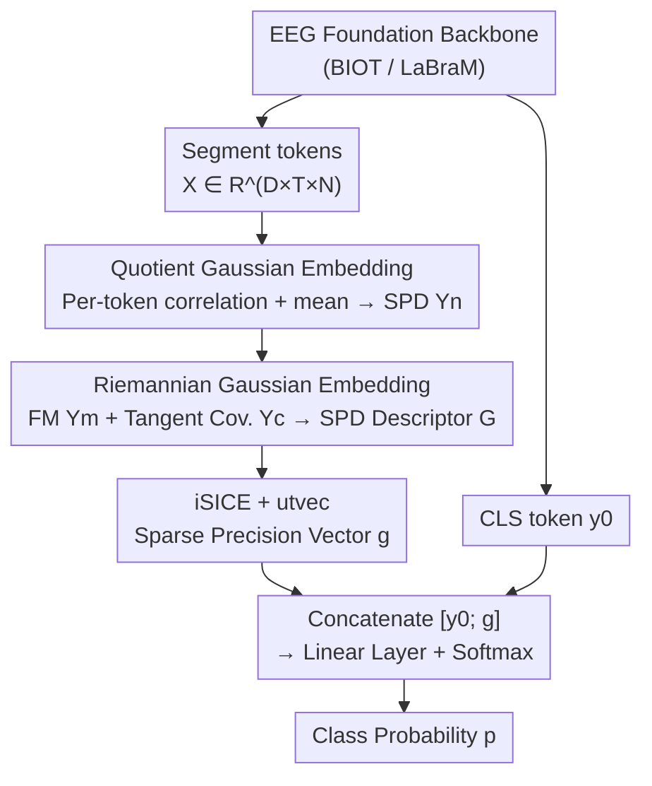

# Riemannian High-Order Pooling for Brain Foundation Models

**Conference**: ICLR 2026  
**OpenReview**: [https://openreview.net/forum?id=66h1sCMm7F](https://openreview.net/forum?id=66h1sCMm7F)  
**Code**: https://github.com/ChenHu-ML/RHOP  
**Area**: Brain Signal Foundation Models / EEG Decoding / Riemannian Geometry / Second-Order Pooling  
**Keywords**: EEG Foundation Models, SPD Manifold, Quotient Gaussian Embedding, Riemannian Gaussian, Global Covariance Pooling

## TL;DR
To address the issue of EEG foundation models typically relying on a single CLS token and discarding spatio-temporal second-order statistics, this paper proposes RHOP, a plug-and-play Riemannian High-Order Pooling head. Each token is encoded as a scale-invariant quotient Gaussian and embedded into the SPD manifold, then aggregated across tokens using Riemannian Gaussians (Fréchet mean + tangent space covariance). Finally, the sparse inverse covariance is concatenated with the CLS token for classification. RHOP consistently improves performance across 4 EEG benchmarks and 3 training paradigms with only a few thousand parameters.

## Background & Motivation
**Background**: Inspired by LLMs, EEG decoding has shifted towards foundation models utilizing "large-scale unlabeled pre-training + downstream fine-tuning," with backbones like BIOT and LaBraM achieving breakthroughs in tasks such as seizure detection, sleep staging, motor imagery, and emotion recognition. In parallel, Riemannian geometry remains a strong baseline for EEG decoding, as power and spatial distributions of multi-channel EEG segments are naturally encoded as Symmetric Positive Definite (SPD) covariance matrices, which are more robust to noise and outliers when operated on the SPD manifold.

**Limitations of Prior Work**: Research on foundation models has focused almost exclusively on backbones, while classification heads are neglected. Most models employ Global Average Pooling (GAP), direct token concatenation, or use only a single CLS token for the classifier—approaches that retain only first-order information and discard critical second-order statistics and global spatio-temporal dependencies. Global Covariance Pooling (GCP) compensates by using a covariance descriptor instead of GAP, but typical GCP compresses all tokens into a **single** covariance matrix, flattening the inherent spatio-temporal hierarchical structure of EEG features.

**Key Challenge**: EEG features possess two neglected empirical properties: first, significant spatio-temporal dependency structures across time segments and channel dimensions; second, prevalent scale drift between different time segments. Two tokens with similar temporal dynamics can have significantly different raw covariances due to differences in amplitude. The former requires "geometry awareness," while the latter requires "scale invariance," both of which are unaddressed by existing pooling heads.

**Goal**: Design a global pooling head that is **statistically aware** (retains second-order information), **geometrically aware** (respects SPD manifold structure), and **respects spatio-temporal structure** (avoids flattening tokens).

**Key Insight**: Model the temporal statistics of a single token as a Gaussian (mean + covariance), but first normalize the covariance into a correlation matrix to eliminate scale drift. Then, model the "distribution of a set of tokens" as a Riemannian Gaussian on the SPD manifold, using the Fréchet mean and tangent space covariance to express higher-order interactions.

**Core Idea**: A three-stage geometric pooling head utilizing "Quotient Gaussian Embedding + Riemannian Gaussian Aggregation + Sparse Inverse Covariance." This packages token-level spatio-temporal structures and higher-order dependencies into an SPD descriptor, integrated with the CLS branch—marking the first geometric pooling head tailored for EEG foundation models.

## Method

### Overall Architecture
RHOP is a pooling head integrable with any EEG foundation backbone (e.g., BIOT / LaBraM). The backbone Extracts spatio-temporal features $X \in \mathbb{R}^{D\times T\times N}$ ($D$ channels, $T$ time segments, $N$ token length) and outputs a global semantic CLS token $y_0$. RHOP converts these token features into a more discriminative statistical descriptor, which is then concatenated with $y_0$ for classification. The pipeline consists of three steps: first, calculating temporal first/second-order statistics for **each token**, normalizing them into correlation matrices, and embedding them into the SPD manifold as quotient Gaussians $Y_n$; second, aggregating the set $\{Y_n\}$ of SPD points using a Riemannian Gaussian (Fréchet mean $Y^m$ + Riemannian covariance $Y^c$) to form a single SPD descriptor $G$; finally, performing sparse inverse covariance estimation (iSICE) on $G$ followed by upper-triangular vectorization and fusion with the CLS token for the classifier.

### Key Designs

**1. Quotient Gaussian Embedding: Normalizing per-token covariance into scale-invariant correlation matrices**

Using raw covariance as an EEG descriptor is sensitive to scale drift; different amplitudes can make two dynamically similar tokens appear distinct. RHOP uses "Quotient Gaussians" to remove this scale freedom. Given a Gaussian $(\Sigma, \mu) \in N(n)$, the quotient Gaussian is defined by the quotient of positive diagonal scaling: $QN(n) \cong N(n) / \mathrm{Diag}^+(n)$. The canonical representative of each equivalence class is the correlation matrix $C = \mathrm{diag}(\Sigma)^{-1/2} \Sigma \mathrm{diag}(\Sigma)^{-1/2}$, which is naturally scale-invariant. For a token: features are transposed to $\tilde{X} \in \mathbb{R}^{N \times T \times D}$, and for the $n$-th token, temporal statistics $\mu_n \in \mathbb{R}^T$ and $\Sigma_n \in \mathbb{R}^{T \times T}$ are calculated across $D$ channels. A small $\sigma I$ ($\sigma = 0.001$) is added to ensure SPD, followed by normalization to obtain $C_n$. Theorem 4.2 is then used to encode the quotient Gaussian $(C_n, \mu_n)$ into an SPD matrix with unit determinant:

$$Y_n = (\det C_n)^{-\frac{1}{T+k}}\begin{bmatrix} C_n + k\,\mu_n\mu_n^\top & \mu_n^{(k)} \\ \mu_n^{(k)\top} & I_k \end{bmatrix}\in S^{+,1}_{T+k}$$

where $\mu_n^{(k)}$ replicates $\mu_n$ into $k$ columns. This step ensures that the mean (first-order) and normalized covariance (second-order) are embedded into a unified SPD form, preserving dependency structures while smoothing amplitude differences between segments. This embedding is end-to-end optimizable using the Affine-Invariant Metric (AIM).

**2. Riemannian Gaussian Embedding: Modeling the distribution of tokens as a Gaussian on the SPD manifold to capture high-order interactions**

Given the set of SPD points $\{Y_n\}_{n=1}^N$ for each token, how are they aggregated into a global descriptor? Traditional GCP collapses tokens immediately, losing hierarchical structure. RHOP estimates a Riemannian Gaussian—incorporating first and second-order statistics on the SPD manifold. The first-order statistic is the Fréchet mean $Y^m = \mathrm{FM}(\{Y_n\})$, which minimizes the sum of squared AIM distances to all points; on $(S^+_n, d_{AIM})$, the FM is globally unique and solved via Karcher flow (restricted to one iteration for computational efficiency). The second-order statistic is the Riemannian covariance $Y^c$, calculated by mapping each point $\mathrm{Log}_{Y^m}(Y_n)$ to the tangent space of $Y^m$, followed by vectorization. The pair $(Y^m, Y^c)$ resides on a product SPD manifold forming a Lie group and is embedded into a single SPD descriptor $G$ using a block matrix embedding that preserves algebraic and geometric structure: $Y^c = LL^\top$ (Cholesky), following:

$$(Y^m, Y^c)\mapsto \begin{bmatrix} L & 0 \\ \phi_{k'}(Y^m) & I_{k'} \end{bmatrix}\in S^{+,1}_{n'+k}$$

where $\phi = f_v \circ \log$ vectorizes the matrix logarithm. This ensures that "high-order interactions of token sets" are carried by an SPD matrix in a geometrically faithful manner.

**3. Sparse Inverse Covariance + CLS Fusion: Highlighting direct dependencies and supplementing global semantics**

RHOP applies Sparse Inverse Covariance Estimation (iSICE) with $\lambda_{SICE}$ regularization to $G$. The inverse covariance (precision) emphasizes **partial correlations**, highlighting direct relationships between variables and suppressing spurious correlations from intermediate variables, making it more compact and discriminative than raw covariance. The sparse precision vector $g = \mathrm{utvec}(\mathrm{iSICE}(G))$ is obtained via upper-triangular vectorization. This is concatenated with the backbone's CLS token $y_0$, which carries global semantics. The combined vector $[y_0; g]$ passes through a linear layer and softmax. This fusion enriches the CLS token with quotient Gaussian and Riemannian high-order statistics, preserving global semantics while adding spatio-temporal structures at the cost of only a few thousand extra parameters.

### Loss & Training
RHOP is a backbone-agnostic pooling head trained using standard classification loss (softmax + cross-entropy). It can be used in three paradigms: Training from scratch, full fine-tuning, and linear probing (freezing the backbone and tuning only the head). Key hyperparameters include embedding dimensions $(k, k')$ and SICE regularization $\lambda_{SICE}$; FM iterations are set to 1 to limit resource usage.

## Key Experimental Results

### Main Results
Evaluation was conducted on four EEG benchmarks: TUAB (Abnormality Detection), TUEV (Event Classification), BCIC2B (Motor Imagery), and PhysioP300. Backbones used include BIOT and LaBraM-Base, compared against iSQRT-COV, iSICE, and SVD-Padé GCP heads.

| Setup / Dataset | Backbone | Metric | Baseline | +RHOP | Gain (Params) |
|--------|------|------|------|------|------|
| From Scratch / TUEV | BIOT | Balanced Acc | 46.82% | **53.55%** | +1.3K (vs GCP +33.1K) |
| From Scratch / TUEV | BIOT | Cohen's Kappa | 44.82% | **51.77%** | — |
| From Scratch / TUEV | BIOT | Weighted F1 | 70.85% | **74.66%** | — |
| Full Fine-tuning / TUAB | LaBraM-Base | Balanced Acc | 81.40% | **82.44%** | +4.6K |
| Full Fine-tuning / TUAB | LaBraM-Base | AUROC | 90.22% | **91.05%** | — |
| Linear Probe / BCIC2B | LaBraM-Base | AUROC | 74.72% | **75.87%** | +0.5K |
| Linear Probe / PhysioP300 | LaBraM-Base | AUROC | 68.93% | **70.44%** | +0.4K |

In terms of efficiency, RHOP is significantly faster than GCP heads: training TUEV from scratch takes only 0.53 mins per epoch (vs 4.71 for iSICE, 10.61 for SVD-Padé), achieving higher accuracy with an order of magnitude fewer parameters and less time.

### Ablation Study
Component ablation (LaBraM-Base, cumulative):

| Configuration | TUAB Balanced Acc | TUAB AUROC | TUEV Cohen's Kappa | TUEV Weighted F1 |
|------|------|------|------|------|
| Baseline (No RHOP) | 0.8140 | 0.9022 | 0.6637 | 0.8312 |
| +QGE | 0.8175 | 0.9048 | 0.6669 | 0.8331 |
| +QGE +RGE | 0.8209 | 0.9069 | 0.6712 | 0.8365 |
| +QGE +RGE +SICE | 0.8227 | 0.9088 | 0.6749 | 0.8391 |
| +QGE +RGE +SICE +CLS (Full) | **0.8244** | **0.9105** | **0.6785** | **0.8420** |

Each component (QGE, RGE, SICE, CLS fusion) brings monotonic improvement. Dimension ablation for $(k, k')$ indicates performance sensitivity, with $(3, 3)$ yielding the best balance for TUAB/TUEV.

### Key Findings
- **Gains are largest when training from scratch**: For TUEV, BIOT+RHOP increases Balanced Acc by nearly 7 points, far exceeding gains during pre-training. This suggests RHOP's spatio-temporal and high-order statistics are especially vital when the backbone lacks pre-trained priors.
- **Superiority over GCP**: While classical GCP collapses tokens and loses time-channel hierarchy, RHOP maintains scale invariance via correlation normalization and aggregates on the manifold via Riemannian Gaussians.
- **Nearly zero cost**: On BCIC2B/PhysioP300, RHOP adds fewer than 1K parameters and insignificantly increases per-epoch time while improving all metrics.

## Highlights & Insights
- **The "quotient" approach to scale freedom is elegant**: Using quotient Gaussians to normalize covariance into correlation matrices provides a geometric basis for removing amplitude drift that is end-to-end optimizable.
- **Modeling token set distributions as SPD**: Riemannian Gaussian embedding packages Fréchet mean and tangent space covariance into a single SPD descriptor, effectively performing second-order pooling on the manifold.
- **Focus on the pooling head over the backbone**: The paper demonstrates that replacing a pooling head with a geometry-aware version provides stable improvements and saves computation, highlighting the untapped potential in classification head design.

## Limitations & Future Work
- **FM iteration approximation**: Restricting Karcher flow to a single step for efficiency means the Fréchet mean may not reach the exact solution, potentially losing expressive power in high-precision tasks.
- **Hyperparameter sensitivity**: The dimensions $(k, k')$ significantly affect results, requiring per-dataset tuning.
- **EEG-specific validation**: While theoretically applicable to fMRI or ECoG, cross-modal validation is omitted.
- **LaBraM-Base limitation**: Due to public weight availability, gains on larger backbones remain unexplored.

## Related Work & Insights
- **vs. Global Covariance Pooling**: Unlike iSICE or SVD-Padé, which collapse tokens and incur high stabilization costs, RHOP preserves token-level hierarchy and aggregates on the SPD manifold with lower complexity.
- **vs. SPD Manifold EEG methods**: While previous works use SPD learning, RHOP integrates SPD geometry as a plug-and-play head for large-scale foundation models.
- **vs. Gaussian Embedding / Information Geometry**: The work follows the route of equating Gaussians to SPD matrices but innovates with a dual-layer structure of quotient Gaussians and Riemannian Gaussians.

## Rating
- Novelty: ⭐⭐⭐⭐ First geometric pooling head for EEG foundation models with a solid dual-layer SPD embedding.
- Experimental Thoroughness: ⭐⭐⭐⭐ Extensive benchmarks and paradigms, though limited to EEG and LaBraM-Base.
- Writing Quality: ⭐⭐⭐⭐ Clear geometric derivations and motivated empirical support.
- Value: ⭐⭐⭐⭐ Highly practical, low-parameter, and efficient plug-and-play head for EEG models.

<!-- RELATED:START -->

## Related Papers

- [\[ICLR 2026\] The Human Brain as a Dynamic Mixture of Expert Models in Video Understanding](the_human_brain_as_a_dynamic_mixture_of_expert_models_in_video_understanding.md)
- [\[ICLR 2026\] TRIBE: Trimodal Brain Encoder for Whole-Brain fMRI Response Prediction](tribe_trimodal_brain_encoder_for_whole-brain_fmri_response_prediction.md)
- [\[ICLR 2026\] Riemannian Variational Flow Matching for Material and Protein Design](riemannian_variational_flow_matching_for_material_and_protein_design.md)
- [\[CVPR 2026\] Predicting Spatial Transcriptomics from Histology Images via High-Order Multi-Cell Interaction Modeling](../../CVPR2026/computational_biology/predicting_spatial_transcriptomics_from_histology_images_via_high-order_multi-ce.md)
- [\[ICLR 2026\] Towards All-atom Foundation Models for Biomolecular Binding Affinity Prediction](towards_all-atom_foundation_models_for_biomolecular_binding_affinity_prediction.md)

<!-- RELATED:END -->
