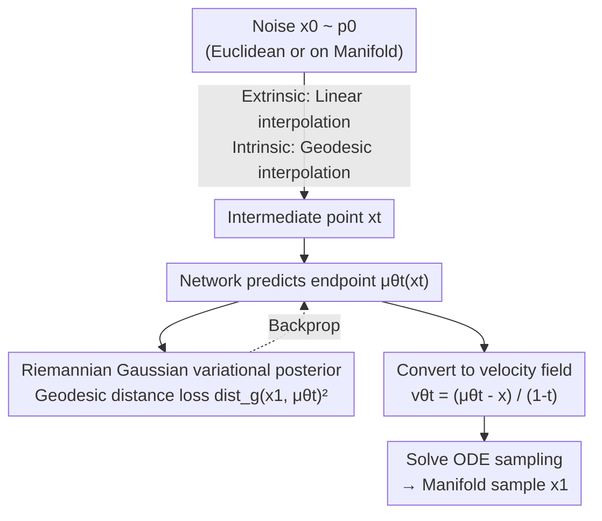

# Riemannian Variational Flow Matching for Material and Protein Design

**Conference**: ICLR 2026  
**OpenReview**: [https://openreview.net/forum?id=NlnDselrtl](https://openreview.net/forum?id=NlnDselrtl)  
**Code**: None  
**Area**: Generative Models / AI4Science / Flow Matching on Manifolds  
**Keywords**: Variational Flow Matching, Riemannian Manifolds, Endpoint Prediction, Jacobi Fields, Material and Protein Generation

## TL;DR
This paper proposes Riemannian Gaussian Variational Flow Matching (RG-VFM), which extends "endpoint prediction" Variational Flow Matching (VFM) to curved manifolds using the Riemannian Gaussian distribution. Using Jacobi fields, it is proved that RG-VFM naturally incorporates a curvature-related penalty compared to velocity-predicting Riemannian Flow Matching (RFM), providing a stronger supervision signal. RG-VFM consistently outperforms Euclidean and velocity-based baselines across synthetic spherical/hyperbolic data, MOF materials, and protein backbone generation tasks.

## Background & Motivation

**Background**: Flow Matching (FM) has emerged as a mainstream generative paradigm alongside diffusion models. It defines per-sample interpolation between source and target distributions and directly regresses the corresponding velocity field, bypassing the training overhead of solving ODEs. Recently, it has been extended in two directions: Variational Flow Matching (VFM), which reformulates training as "posterior inference on trajectories" to let the model **predict endpoints** $x_1$ rather than velocities, thereby gaining a probabilistic perspective and flexible modeling choices; and Riemannian Flow Matching (RFM), which generalizes FM to curved manifolds to respect the geometric structure of data (e.g., rotation group $SO(3)$, spheres, hyperbolic spaces).

**Limitations of Prior Work**: Data for materials and biomacromolecules naturally reside on **heterogeneous manifolds**—atomic coordinates in Euclidean space and orientations in the rotation group $SO(3)$. Current mainstream generators for MOFs and protein backbones (e.g., MOFFlow, ReQFlow) adopt a "mixture" strategy: Euclidean parameters use standard FM (equivalent to endpoint-predicting VFM), while non-Euclidean parameters use RFM. This stitching **lacks a unified variational treatment** for both parameter types: the Euclidean side minimizes the MSE of endpoints, while the rotation side reverts to minimizing the squared error of velocities (initial velocity obtained via log mapping), resulting in inconsistent loss forms.

**Key Challenge**: In Euclidean space, predicting the endpoint (VFM), predicting velocity (FM), and predicting noise (diffusion) are **nearly equivalent** and interchangeable due to affine interpolation. However, on curved manifolds, where tangent spaces change with points and curvature introduces high-order deviations, this equivalence **completely fails**—the endpoint perspective and velocity perspective can no longer be converted in closed form. Consequently, the question arises: what is the actual difference between these two types of supervision on curved surfaces, and which is superior?

**Goal**: (1) Define a variational flow matching objective for general geometries to bring "endpoint prediction" training to manifolds; (2) Formally analyze its relationship with RFM to clarify the geometric source of their differences; (3) Verify whether "variationalizing" existing geometric models yields stable gains in real-world material and protein generation.

**Key Insight**: The authors observe that the posterior $p_t(x_1\mid x)$ **implicitly encodes the geometry of the distribution support**—for instance, CatFlow uses categorical distributions to point velocities toward the probability simplex. Could a distribution defined on a manifold encode curvature information? The Riemannian Gaussian distribution is the natural extension of the Euclidean Gaussian to manifolds.

**Core Idea**: Replace "velocity matching in tangent space" with "minimizing the **geodesic distance** between the predicted endpoint and the true endpoint on the manifold," thus retaining the endpoint supervision advantage of VFM while injecting manifold geometry into the loss.

## Method

### Overall Architecture

The core of RG-VFM is a **replacement of the loss perspective**: instead of comparing velocities in the tangent space as in RFM, the variational posterior is taken as a Riemannian Gaussian distribution defined on the manifold $M$. The model directly predicts the endpoint $\mu^\theta_t(x)$ and minimizes its squared geodesic distance to the true endpoint $x_1$. The generator pipeline is concise: starting from noise $x_0\sim p_0$, an intermediate point $x_t$ is obtained by interpolating between the source and target. The network predicts the clean endpoint $\mu^\theta_t$ from $x_t$, calculating the loss using geodesic distance. During sampling, the predicted endpoint is converted into a velocity field to solve the ODE and push noise to the data distribution.

Depending on the prior $p_0$, the framework has two variants: **Extrinsic RG-VFM-$\mathbb{R}^n$**, where the prior is in the ambient Euclidean space and interpolation follows a straight line (geodesic distance is used only in the loss, avoiding exp/log mappings); and **Intrinsic RG-VFM-$M$**, where the prior and interpolation are both on the manifold (geodesic interpolation), which is formally closer to RFM but with a different loss definition. Theoretical analysis (for fair comparison with RFM) is conducted on the intrinsic variant.

### Key Designs

**1. Riemannian Gaussian Variational Posterior: Bringing "Endpoint Prediction" to Manifolds**

The limitation is that VFM endpoint supervision is only defined in Euclidean space; on curved surfaces, it is unclear how to measure if "endpoints are close." This work uses the Riemannian Gaussian distribution as the variational posterior—the maximum entropy distribution on a manifold determined by mean and covariance:

$$\mathcal{N}_{Riem}(z\mid\sigma,\mu)=\frac{1}{C}\exp\!\left(-\frac{\mathrm{dist}_g(z,\mu)^2}{2\sigma^2}\right)$$

where $z,\mu\in M$ and $\mathrm{dist}_g$ is the geodesic distance determined by metric $g$. Substituting this into the VFM negative log-likelihood objective yields the RG-VFM loss $L_{\text{RG-VFM}}=\mathbb{E}_{t,x_1,x}[-\log\mathcal{N}_{Riem}(x_1\mid\mu^\theta_t(x),\sigma_t(x))]$. A crucial conclusion (Proposition 3.1) is that if the manifold is **homogeneous** (any point can be mapped to any other via an isometric transformation, satisfied by $S^n,H^n,T^n,SO(n)$) and geodesics have closed-form expressions, this objective collapses into a clean geodesic MSE:

$$L_{\text{RG-VFM}}(\theta)=\mathbb{E}_{t,x_1,x}\big[\|\log_{x_1}(\mu^\theta_t(x))\|_g^2\big]=\mathbb{E}_{t,x_1,x}\big[\mathrm{dist}_g(x_1,\mu^\theta_t(x))^2\big]$$

Minimizing this is equivalent to finding the **Fréchet mean** of the target distribution. $\sigma_t(x)$ can be taken as a constant, set to $\sigma_t(x)=1-t$ for time normalization in material/protein experiments. This is effective because the loss only needs to characterize the **local geometry** near $p_1$ without explicitly modeling the entire velocity field.

**2. Intrinsic / Extrinsic Variants: Trading Straight-line Flow for Geometric Awareness at Zero Cost**

Embedding the manifold $M$ into $\mathbb{R}^n$ leads to two implementations. **Extrinsic RG-VFM-$\mathbb{R}^n$**: The prior is standard Euclidean Gaussian, and conditional velocity uses **linear interpolation** $x_t=t\cdot x_1+(1-t)\cdot x_0$. Training uses geodesic distance only in the loss, **requiring no exp/log mappings**—making its training and sampling complexity identical to ordinary VFM. The only difference is replacing Euclidean distance with geodesic distance, encoding geometric information without additional overhead. **Intrinsic RG-VFM-$M$**: Prior and interpolation are on the manifold ($x_t=\exp_{x_0}(t\cdot\log_{x_0}(x_1))$), removing the need for a large ambient space but requiring exp/log calculations at each step. This is a trade-off: extrinsic is simple and cheap, while intrinsic is more general. Since RFM only supports an intrinsic perspective, **fair comparison can only be made between RG-VFM-$M$ and RFM**.

**3. Jacobi Field Analysis: Revealing the Missing Curvature Penalty in RFM**

This is the theoretical core, answering "what is the difference between endpoint and velocity supervision." The authors construct a family of geodesics starting from $x_0$ with perturbed initial velocities $\dot\gamma_s(0)=v_0+sw$, and use the **Jacobi field** $J(\tau)=\partial_s\alpha(s,\tau)|_{s=0}$ to characterize how perturbed initial velocities cause geodesic endpoints to diverge. Both losses are expressed in this framework: RFM loss corresponds to the derivative of the Jacobi field at the start $L_{\text{RFM}}=\mathbb{E}[\|D_\tau J(0)\|_g^2]$, while RG-VFM loss corresponds to the value of the Jacobi field at the end $L_{\text{RG-VFM}}=\mathbb{E}[\|J(1)\|_g^2]$. By Taylor expansion of $J(\tau)$ at $\tau=0$ and evaluating at $\tau=1$, it is proved that $D_\tau J(0)$ is merely a **first-order linear approximation** of $J(1)$ (Proposition 4.2)—truncating at first order loses curvature information. Thus, the difference is exactly a curvature functional (Proposition 4.3):

$$L_{\text{RG-VFM}}(\theta)=L_{\text{RFM}}(\theta)+\mathbb{E}_{t,x_1,x}\big[\mathcal{C}(R,D_\tau J(0),v)+E_{\text{higher}}\big]$$

where the leading order is $\mathcal{C}(R,D_\tau J(0),v)=-\tfrac13\langle R(D_\tau J(0),v)v,D_\tau J(0)\rangle_g-\tfrac16\langle(\nabla_v R)(D_\tau J(0),v)v,D_\tau J(0)\rangle_g$ and $R$ is the Riemannian curvature tensor. In Euclidean space $R=0$, so RG-VFM and RFM are equivalent; on manifolds, this term is non-zero, meaning RG-VFM captures the full geometric structure through $J(1)$, whereas RFM uses a weaker linear approximation $D_\tau J(0)$.

**4. Variationalizing Existing Geometric Models: Plug-and-Play Modification**

The engineering implication is simply "variationalizing the loss for the rotation component of existing models." The authors chose two representative models: **MOFFlow** for MOF generation and **QFlow / ReQFlow** for protein backbone generation. Both use a reparameterization target of "predicting endpoints then reconstructing the velocity field." Euclidean parameters (position, lattice) were already equivalent to VFM, but **rotation components** still used RFM-style velocity loss. This work changes the rotation loss from "velocity matching" to "minimizing the squared geodesic distance between predicted and true rotations on $SO(3)$," keeping all other implementations identical to yield V-MOFFlow, V-QFlow, and V-ReQFlow.

## Key Experimental Results

### Synthetic Data: Curvature Effects

The authors construct "checkerboard" distributions on the sphere $S^2$ and hyperbolic sheet $H^2_{-1}$. Evaluation metrics include Coverage (higher is better), C2ST (lower is better, 0.5 is indistinguishable), and Distance (distance to manifold for extrinsic models, lower is better).

| Model ($S^2$) | Coverage ↑ | C2ST ↓ | Distance ↓ |
|--------|------|------|------|
| Euclidean/Extrinsic/Velocity (CFM) | 64.97 | 58.36 | 0.012 |
| Euclidean/Extrinsic/Variational (VFM) | 79.08 | 56.33 | 0.044 |
| Riemannian/Extrinsic/Variational (RG-VFM-$\mathbb{R}^3$, Ours) | 83.10 | 56.58 | **0.010** |
| Riemannian/Intrinsic/Velocity (RFM) | 66.83 | 57.99 | – |
| Riemannian/Intrinsic/Variational (RG-VFM-$M$, Ours) | **84.21** | 59.72 | – |

Conclusions: (1) Riemannian models generate points closer to the manifold (better geometry); (2) Variational models generate sharper distributions, with RG-VFM achieving the highest Coverage. C2ST does not show a consistent pattern across spherical/hyperbolic data.

### MOF Material Generation (V-MOFFlow)

Structure prediction on the MOF dataset (Boyd et al.) using Matching Rate (MR) and RMSE.

| Model | MR(%) ↑ (stol=0.5, 1 sample) | RMSE ↓ | MR(%) ↑ (stol=0.5, 5 samples) |
|------|------|------|------|
| DiffCSP | 0.09 | 0.3961 | 0.34 |
| MOFFlow (Replication) | 30.40 | 0.2832 | 46.97 |
| **V-MOFFlow (Ours)** | **33.52** | **0.2789** | **50.14** |

Except for stol=1.0, V-MOFFlow outperforms MOFFlow and DiffCSP across all metrics, validating that RG-VFM loss is more effective than RFM-style loss.

### Protein Backbone Generation (V-QFlow / V-ReQFlow)

Evaluated on the PDB dataset using designability (scRMSD/Fraction), diversity, and novelty.

| Model | Fraction ↑ | scRMSD ↓ | Diversity(TM) ↓ |
|------|------|------|------|
| QFlow (Replication) | 0.924 | 1.252 | 0.357 |
| **V-QFlow (Ours)** | **0.968** | **0.923** | 0.387 |
| ReQFlow (Replication) | 0.964 | 0.939 | 0.400 |
| **V-ReQFlow (Ours)** | **0.980** | **0.961** | 0.408 |

V-QFlow and V-ReQFlow outperform their original versions in designability and folding RMSD, suggesting that variational objectives are indeed effective when learning probability paths on manifolds.

### Key Findings
- **Curvature penalty is the source of gain**: Theoretically RG-VFM = RFM + curvature term; experimentally, RG-VFM-$M$ achieved the highest Coverage (84.21).
- **Variationalizing rotations is sufficient**: Modifying only the $SO(3)$ rotation loss in MOFFlow/QFlow/ReQFlow leads to stable performance gains.
- **Extrinsic variant is virtually cost-free**: RG-VFM-$\mathbb{R}^3$ has identical complexity to VFM while providing geometric awareness (lowest Distance 0.010).

## Highlights & Insights
- **Unified both losses via Jacobi fields**: RFM looks at the start derivative $D_\tau J(0)$, while RG-VFM looks at the endpoint $J(1)$. This cleanly explains why they are equivalent in Euclidean space but diverge on curved surfaces.
- **Theorizing "endpoint prediction is better"**: Provides a rigorous theoretical basis (the explicit curvature term) for the empirical observation that endpoint learning performs better.
- **Zero-overhead geometry injection**: If geodesic distance is available in closed form, replacing Euclidean distance with geodesic distance provides geometric awareness without increasing complexity.

## Limitations & Future Work
- The method currently applies only to **simple geometries with closed-form geodesics** ($S^n,H^n,T^n,SO(n)$).
- Fair theoretical comparison holds only between intrinsic RG-VFM-$M$ and RFM.
- C2ST results are inconsistent, and L1 loss (Riemannian Laplace) might be better in hyperbolic spaces, suggesting Riemannian Gaussian may not be the optimal posterior in all cases.
- It remains to be seen if endpoint $SO(3)$ loss is sufficient for long-range geometric constraints in even larger biomolecules.

## Related Work & Insights
- **vs RFM (Chen & Lipman 2024)**: RFM matches velocity in tangent space, which is a first-order approximation of the RG-VFM endpoint loss. This paper proves the difference is a curvature penalty.
- **vs VFM / CatFlow (Eijkelboom 2024)**: VFM predicts endpoints in Euclidean space; this work generalizes it to manifolds using a Riemannian Gaussian posterior.
- **vs MOFFlow / QFlow / ReQFlow**: These use RFM-style velocity loss for rotations; this work completes the variationalization by changing the rotation loss to geodesic endpoint distance.

## Rating
- Novelty: ⭐⭐⭐⭐⭐ High. Using Jacobi fields to unify losses and pinpoint the curvature penalty term is a powerful and explanatory theoretical perspective.
- Experimental Thoroughness: ⭐⭐⭐⭐ Good. Covers synthetic, MOF, and protein tasks, though some metrics (C2ST) lack consistent superiority.
- Writing Quality: ⭐⭐⭐⭐⭐ Excellent. Clear progression from motivation to Jacobi field derivation.
- Value: ⭐⭐⭐⭐ High. Provides a theoretical foundation for endpoint learning and offers a plug-and-play improvement for manifold generators.

<!-- RELATED:START -->

## Related Papers

- [\[ICLR 2026\] Interpolation-Based Conditioning of Flow Matching Models for Bioisosteric Ligand Design](interpolation-based_conditioning_of_flow_matching_models_for_bioisosteric_ligand.md)
- [\[ICLR 2026\] La-Proteina: Atomistic Protein Generation via Partially Latent Flow Matching](la-proteina_atomistic_protein_generation_via_partially_latent_flow_matching.md)
- [\[ICML 2025\] Flexibility-conditioned Protein Structure Design with Flow Matching](../../ICML2025/computational_biology/flexibility-conditioned_protein_structure_design_with_flow_matching.md)
- [\[ICLR 2026\] Multi-Marginal Flow Matching with Adversarially Learnt Interpolants](multi-marginal_flow_matching_with_adversarially_learnt_interpolants.md)
- [\[ICLR 2026\] scDFM: Distributional Flow Matching for Robust Single-Cell Perturbation Prediction](scdfm_distributional_flow_matching_model_for_robust_single-cell_perturbation_pre.md)

<!-- RELATED:END -->
