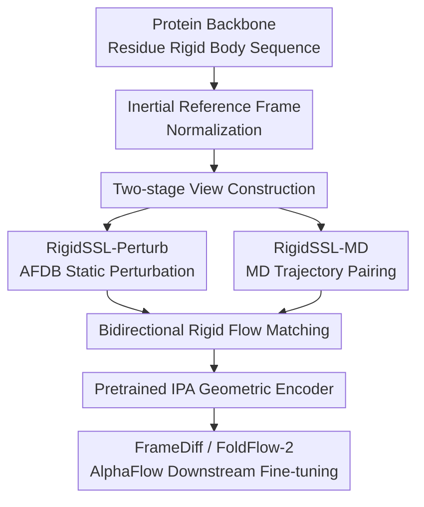

# Rigidity-Aware Geometric Pretraining for Protein Design and Conformational Ensembles

**Conference**: ICLR2026  
**OpenReview**: [https://openreview.net/forum?id=YAWpZcXHnP](https://openreview.net/forum?id=YAWpZcXHnP)  
**Code**: The paper states that the code is available in a public repository, but no specific link was provided in the cache.  
**Area**: Computational Biology / Protein Structure Generation  
**Keywords**: Protein Design, Geometric Pretraining, SE(3) Rigid Body Representation, Flow Matching, Conformational Ensemble  

## TL;DR
RigidSSL represents the protein backbone as a residue-level rigid body sequence. It first learns stable geometric priors under $SE(3)$ perturbations on static structures from AFDB, and then learns realistic conformational transitions using MD trajectories. This enhances the designability, diversity, and biophysical plausibility of protein backbone generation, motif scaffolding, and GPCR conformational ensemble generation.

## Background & Motivation

**Background**: The 3D structure of a protein determines its function; thus, the core goal of de novo protein design is to generate foldable, structurally sound, and potentially functional protein backbones. In recent years, geometric generative models such as FrameDiff, FoldFlow-2, and AlphaFlow have begun modeling directly in the $SE(3)$ space of the protein backbone: each residue is no longer just a point but a local rigid body frame with translation and rotation. These models learn the generation process from noise to real protein conformations via diffusion or flow matching.

**Limitations of Prior Work**: The authors identify three specific shortcomings in current methods. First, many end-to-end generative models attempt to learn "protein geometric common sense" and "downstream generation mechanisms" within the same training objective, leading to high optimization pressure and limited generalization to new lengths or tasks. Second, existing protein geometric pretraining often leans toward atom-level or local fragment representations, which are sufficient for property prediction but do not necessarily capture global folding geometry. Protein generation requires an understanding of long-range folding, secondary structure compositions, and full-chain rigid body motion. Third, while large-scale structure databases like AFDB/PDB are extensive, they are mostly static snapshots and fail to inform the model about how proteins vibrate near the native state or transition between multiple metastable conformations.

**Key Challenge**: Protein generation requires a stable global structural prior without treating the protein as a static photograph. Learning only static structures leads models to generate backbones that "look folded" but lack conformational diversity and dynamical fidelity. Learning only MD dynamics may bias the model toward metastable states, decreasing designability in unfolding and structure prediction pipelines. Integrating both static geometric patterns and dynamic conformational changes into a single transferable representation is the core problem addressed in this paper.

**Goal**: The goal of RigidSSL is not to reinvent a downstream generator but to provide a set of transferable geometric pretraining weights for existing IPA-based protein generation models. It aims to answer three sub-questions: how to use an efficient and global representation to carry protein backbone geometry; how to construct meaningful self-supervised views from static structures and MD trajectories; and how to make the pretraining objective respect the translation and rotation dynamics of residue rigid bodies simultaneously.

**Key Insight**: The authors adopt the AlphaFold2-style residue rigid frame, treating each residue as a rigid body defined by a $C_\alpha$ translation vector and a local rotation matrix. This representation has fewer degrees of freedom than all-atom modeling while retaining more local orientation information than simple $C_\alpha$ point clouds. Subsequently, the authors formulate the relationship between two views as a bidirectional flow matching on $SE(3)$: the model does not just judge if two views are similar but learns the translation and rotation velocities of each residue when flowing from one conformation to another.

**Core Idea**: Use "rigid-body multi-view flow matching pretraining" to learn static geometric regularities and dynamic conformational transitions in advance, then transfer these representations to protein generation models to reduce the burden of learning geometric common sense from scratch.

## Method

### Overall Architecture

The workflow of RigidSSL can be understood as "unifying coordinates, constructing dual views, and learning bidirectional rigid body flows." The input is a protein backbone represented as a sequence of residue rigid bodies, where each residue consists of a translation $\vec{t}_i \in \mathbb{R}^3$ and a rotation $r_i \in SO(3)$. The output is not the direct generation of the final protein but a pretrained IPA geometric encoder that can warm-start downstream models like FrameDiff, FoldFlow-2, or AlphaFlow.

Pretraining is conducted in two phases. Phase I, RigidSSL-Perturb, starts from 432K AFDB static structures and applies translation and rotation noise to each residue frame, forcing the model to learn global geometric priors stable under small perturbations. Phase II, RigidSSL-MD, utilizes 1.3K ATLAS molecular dynamics trajectories, using two snapshots separated by $\delta=2$ ns as dual views to expose the model to realistic conformational fluctuations. Both phases share a key objective: under a canonical reference frame, perform translation LERP and rotation SLERP interpolation between two views, and use bidirectional flow matching to predict both translation and rotation velocities.

### Key Designs

**1. Residue Rigid Body Representation and Inertial Reference Frame Normalization: Placing protein geometry in comparable $SE(3)$ coordinates**

Structure coordinates in protein databases contain arbitrary global rotations and translations. If interpolation or perturbation is performed directly on these coordinates, the model might learn "pose" rather than protein geometry. RigidSSL represents each protein chain as $g=\{T_i\}_{i=1}^L=\{(\vec{t}_i,r_i)\}_{i=1}^L$, where $\vec{t}_i$ is the position of the $i$-th residue $C_\alpha$, and $r_i$ is the local frame orientation determined by backbone atoms $N, C_\alpha, C$. This allows each residue to carry both position and orientation, capturing backbone torsion and local geometry.

Normalization involves two steps: first, subtracting the centroid $\bar{x}=\frac{1}{L}\sum_i x_i$ from all $C_\alpha$ coordinates to move the protein to the origin of the inertial reference frame; second, determining the principal axes via the eigenvectors of the inertia tensor $\hat{I}=\sum_i (\|x_i\|^2 I_3 - x_i x_i^\top)$, and obtaining a deterministic $V\in SO(3)$ through sorting and right-hand rule constraints. This ensures that different proteins or different views of the same protein are expressed in a unified reference frame. This ensures that the LERP/SLERP interpolation paths have clear physical meaning: differences between views result from structural changes rather than arbitrary coordinate system choices.

**2. Two-stage View Construction: Learning static folding priors then actual conformational fluctuations**

RigidSSL-Perturb targets static structure libraries. For a canonicalized structure $g_0$ from AFDB, it adds translation and rotation noise to each residue frame to obtain a second view $g_1$. Translation uses Gaussian noise $\vec{t}_i^1=\vec{t}_i^0+\sigma z, z\sim\mathcal{N}(0,I_3)$. Rotation noise is sampled from an $IGSO(3)$ distribution and right-multiplied to the original frame: $r_i^1=r_i^0\cdot r$. The final scales used are $\sigma=0.03$ and $\epsilon=0.5$; ablations indicate that excessive noise leads to more steric clashes and poorer bond validity.

RigidSSL-MD shifts view construction to real dynamic trajectories. The authors use 1,390 MD trajectories from ATLAS, taking two snapshots separated by $\delta=2$ ns, canonicalizing them, and using them as $g_0$ and $g_1$. This interval avoids instantaneous thermal noise while not pulling states too far apart: small $\delta$ reflects local vibrations, while very large $\delta$ might involve drastic rearrangements. $2$ ns is chosen as the scale for near-native conformational fluctuations. The two stages are complementary: AFDB perturbations provide large-scale, wide-coverage, stable folding geometry; MD trajectories provide small-scale but physically realistic conformational transitions.

**3. Bidirectional Rigid Flow Matching: Implementing mutual information learning as translation and rotation velocity prediction**

The authors aim to maximize the mutual information $MI(g_0,g_1)$ between two views, but instead of using a traditional contrastive loss, they use a surrogate for conditional likelihood: $\log p(g_0|g_1)+\log p(g_1|g_0)$. Intuitively, if a model can infer $g_1$ from $g_0$ and vice versa, it must capture shared structural regularities rather than just remembering a unidirectional perturbation pattern.

During optimization, RigidSSL converts rotation matrices to quaternions and constructs interpolated states for intermediate time $\tau\in[0,1]$. Translation uses linear interpolation $\vec{t}^{\tau}=\tau\vec{t}^1+(1-\tau)\vec{t}^0$; rotation uses Spherical Linear Interpolation $q^{\tau}=SLERP(q^0,q^1,\tau)$ to avoid invalid paths in non-Euclidean rotation space. The IPA model $v_\theta$ receives $\vec{t}^{\tau},q^{\tau},\tau$ and outputs translation velocity $u_{\theta,\mathbb{R}^3}$ and rotation velocity $u_{\theta,SO(3)}$. The objective is to match $\vec{t}^1-\vec{t}^0$ and $\frac{d}{d\tau}SLERP(q^0,q^1,\tau)$. The final loss sums both directions $g_0\rightarrow g_1$ and $g_1\rightarrow g_0$: $L=L_{g_0\rightarrow g_1}+L_{g_1\rightarrow g_0}$. This is the core of "rigidity-awareness": the model learns a continuous flow of residue rigid bodies in $SE(3)$ rather than point-wise regression of atomic coordinates.

### Mechanism Example

Assume the input is a 180-residue enzyme backbone. RigidSSL first constructs local frames for each residue: $C_\alpha$ is the translation center, and $N, C_\alpha, C$ determine the rotation. The full chain is then shifted to the centroid origin and aligned with principal axes to obtain a canonicalized $g_0$.

In the RigidSSL-Perturb stage, a perturbed view $g_1$ is generated for the same chain: each residue's $C_\alpha$ moves slightly, and the local frame rotates by a small angle in $SO(3)$. During training, an intermediate $\tau=0.4$ is sampled. The model sees neither the original nor the perturbed endpoint but the state 40% along the path. It must predict how each residue should translate and rotate to reach the perturbed endpoint, while also learning the reverse direction.

In the RigidSSL-MD stage, assume the same protein class undergoes a small helix breathing motion between frame $s$ and frame $s+2$ ns. The model similarly samples intermediate states, but here the target velocities come from real conformational changes observed in the MD. Once pretraining is complete, this IPA encoder is attached to FoldFlow-2 for backbone generation: the downstream model does not need to learn how helices, loops, and sheets assemble in global space from scratch, but rather continues learning on a representation that has seen extensive static folds and dynamic fluctuations.

### Loss & Training

Training consists of pretraining and downstream fine-tuning. For pretraining, IPA is used as the base encoder. Node representations are derived from residues, and edge representations are initialized using the distogram of $C_\alpha$ pairwise distances. A sinusoidal embedding of time $\tau$ is added after each IPA block. The model maps node representations to translation and quaternion-related velocity outputs.

Regarding pretraining data, RigidSSL-Perturb uses the UniProtKB/Swiss-Prot portion of AFDB v4, yielding 432,194 proteins after filtering for lengths between 60 and 512. RigidSSL-MD uses 1,390 trajectories from ATLAS/MDRepo, extracting snapshot pairs separated by 2 ns. The Adam optimizer is used with a learning rate of $0.0001$. The Perturb stage was trained for 2.75 days on 1 H100 GPU, and the MD stage was trained for 1.88 days on 1 H100 GPU, both with a batch size of 1. In the downstream phase, pretrained IPA weights warm-start FrameDiff, FoldFlow-2, or AlphaFlow, which are then fine-tuned on their respective diffusion or flow matching objectives.

## Key Experimental Results

### Main Results

The paper evaluates two protein design tasks and one conformational ensemble task: unconditional protein structure generation, zero-shot motif scaffolding, and GPCR ensemble generation. The most intuitive results are in unconditional generation: RigidSSL-Perturb tends to favor designability and geometric quality, while RigidSSL-MD favors diversity and biophysical statistics.

| Downstream Model | Pretraining Method | Designability ↑ | Novelty avg. max TM ↓ | Diversity pairwise TM ↓ | MaxCluster ↑ |
|----------|------------|-----------------|-------------------------|--------------------------|--------------|
| FrameDiff | None | 0.775 | 0.555 | 0.565 | 0.033 |
| FrameDiff | RigidSSL-Perturb | 0.875 | 0.494 | 0.534 | 0.033 |
| FrameDiff | RigidSSL-MD | 0.700 | 0.657 | 0.471 | 0.156 |
| FoldFlow-2 | None | 0.329 | 0.810 | 0.620 | 0.183 |
| FoldFlow-2 | RigidSSL-Perturb | 0.758 | 0.770 | 0.650 | 0.252 |
| FoldFlow-2 | RigidSSL-MD | 0.584 | 0.782 | 0.613 | 0.318 |

On FrameDiff, RigidSSL-Perturb increased designability from 0.775 to 0.875, while the novelty metric (max TM-score) decreased from 0.555 to 0.494, indicating generated structures are further from known PDB structures. The Gain on FoldFlow-2 was even more significant, from 0.329 to 0.758. RigidSSL-MD does not necessarily improve designability but shows higher MaxCluster diversity across both models, proving it helps the generative distribution cover more structural clusters.

The paper also reports representative results for motif scaffolding and GPCR ensembles. Motif scaffolding is zero-shot inpainting: fixing functional motif coordinates and generating the external scaffold. GPCR ensemble experiments examine if the generative model can recover conformational distributions, weak contacts, and exposed residues from MD.

| Task | Model / Variant | Key Metric | Result | Comparison |
|------|-------------|----------|------|------|
| Zero-shot motif scaffolding | FoldFlow-2 + RigidSSL-Perturb | Avg. Success Rate | 15.19% | 9.35% (None) |
| 5TRV_long scaffolding | FoldFlow-2 + RigidSSL-Perturb | Successes / 100 | 51 | 30 (Next best: GeoSSL-InfoNCE) |
| GPCR ensemble | AlphaFlow + RigidSSL-Perturb | Pairwise RMSD | 2.20 | 1.55 (Target MD), 2.37 (None) |
| GPCR ensemble | AlphaFlow + RigidSSL-MD | Weak contacts Jaccard | 0.43 | Highest among all baselines |
| GPCR ensemble | AlphaFlow + RigidSSL-MD | Exposed residue Jaccard | 0.71 | Tied for highest |

### Ablation Study

Ablations primarily address whether gains strictly come from more AFDB data and whether the perturbation noise scale is critical. The first set compares FoldFlow-2 trained from scratch on PDB+AFDB for 500k steps versus RigidSSL-Perturb pretraining on AFDB followed by 400k steps of PDB fine-tuning. Despite similar data scales, the RigidSSL scheme achieves better designability and similar novelty in fewer steps.

| Training Method | Steps | Designability ↑ | Novelty avg. max TM ↓ | Diversity pairwise TM ↓ | MaxCluster ↑ |
|----------|-------|-----------------|-------------------------|--------------------------|--------------|
| FoldFlow-2 Scratch (PDB+AFDB) | 500k | 0.738 | 0.764 | 0.657 | 0.250 |
| FoldFlow-2 RigidSSL-Perturb + PDB FT | 400k | 0.758 | 0.770 | 0.650 | 0.252 |

The second ablation shows that noise scales are not "the bigger the better." With rotation noise $\epsilon=0.5$ fixed, translation noise $\sigma=0.03$ yields the highest designability. Small noise fails to learn enough variance, while excessive noise disrupts local physical plausibility.

| Translation Noise | Rotation Noise | Designability ↑ | Novelty avg. max TM ↓ | Diversity pairwise TM ↓ |
|-------------------|----------------|-----------------|-------------------------|--------------------------|
| 0.01 | 0.5 | 0.336 | 0.768 | 0.635 |
| 0.03 | 0.5 | 0.758 | 0.770 | 0.650 |
| 0.05 | 0.5 | 0.589 | 0.769 | 0.654 |
| 0.5 | 0.75 | 0.660 | 0.763 | 0.644 |
| 1.0 | 0.75 | 0.460 | 0.773 | 0.663 |
| 2.0 | 0.75 | 0.347 | 0.797 | 0.624 |

### Key Findings

- RigidSSL-Perturb is a robust pretraining method for protein design: it improves designability in both FrameDiff and FoldFlow-2, particularly for FoldFlow-2, and achieves low Clashscore and MolProbity scores in long-chain generation (700-800 residues).
- The benefit of RigidSSL-MD is not primarily in "easier refolding" but in richer structural distributions and more realistic ensemble observables. It yields higher MaxCluster diversity and the best Jaccard indices for weak contacts and exposed residues in GPCR tasks.
- A clear trade-off exists between the two pretraining phases: static perturbation makes the model prioritize fold-defining features, whereas dynamic trajectories encourage the exploration of metastable conformations. The former suits designability, while the latter suits conformational distribution studies.
- Pretraining yields are not simply a result of data volume. Compared to training from scratch on PDB+AFDB, RigidSSL achieves better structure quality in fewer steps by using objectives aligned with $SE(3)$ rigid body dynamics.

## Highlights & Insights

- A clever aspect of RigidSSL is avoiding traditional contrastive learning for geometric pretraining, instead having the model learn the rigid body flow between views. This provides a supervision signal closer to what generative models actually need: not "are these similar?" but "how does one continuously transform into the other?"
- Splitting static perturbation and MD trajectories into two phases clarifies the interpretation of results. Perturbation handles geometric stability; MD handles dynamical fidelity. This trade-off is explicitly visible in the experiments.
- The residue rigid body representation is a key engineering choice. It is lightweight enough for 432K AFDB pretraining while being more complete than $C_\alpha$ points, as local orientations affect backbone foldability and continuity.
- For protein generation, the takeaway is that pretraining objectives should simulate the state transitions the downstream model will learn. If the downstream model generates in $SE(3)$ frame space, the pretraining should define views, interpolation, and velocity in that same space.

## Limitations & Future Work

- The MD data used in RigidSSL-MD is much smaller than AFDB and originates from force-field simulations, potentially inheriting simulation biases. While it improves ensemble observables, it can cause negative transfer in designability, suggesting dynamic pretraining needs finer-grained task adaptation.
- Current experiments mainly warm-start IPA-based models. While effective for FrameDiff, FoldFlow-2, and AlphaFlow, it hasn't been fully proven for completely different architectures, such as all-atom diffusion models or explicit sidechain generation models.
- Pretraining still approximates residues as rigid bodies, ignoring sidechain conformations and local bond angle deviations. For functional protein design, active site sidechains and pocket electrostatics still require additional modeling.
- GPCR ensemble experiments are representative, but validation still relies on computational metrics. Future work incorporating experimental ensembles (e.g., from NMR) would offer stronger evidence for "biophysical reality."

## Related Work & Insights

- **vs FrameDiff / FoldFlow-2**: These are downstream backbone generators; RigidSSL pretrains their IPA modules. RigidSSL shifts geometric learning upstream so downstream models don't start from zero.
- **vs GeoSSL-InfoNCE**: GeoSSL uses contrastive objectives to maximize mutual information for representation alignment. RigidSSL converts the mutual information surrogate into a bidirectional flow matching task, making the signal more relevant to generation.
- **vs GearNet / ProteinContrast**: These emphasize graph representations and sub-structure contrasts for property prediction. RigidSSL focuses on $SE(3)$ continuous dynamics specifically for generation.
- **vs AlphaFlow**: AlphaFlow generates protein ensembles via flow matching from a single structure. RigidSSL-MD provides an MD-aware initialization for AlphaFlow's IPA module, helping it capture metastable states in systems like GPCRs.

## Rating

- Novelty: ⭐⭐⭐⭐☆ Naturally combines residue rigid frames, two-stage construction, and bidirectional flow matching; innovation lies in the alignment of pretraining with generative tasks.
- Experimental Thoroughness: ⭐⭐⭐⭐☆ Covers unconditional generation, motif scaffolding, GPCR ensembles, and noise ablations. Lacks wet-lab validation and broader architecture transfer.
- Writing Quality: ⭐⭐⭐⭐☆ Motivation is clear, formulas are complete, and the trade-off between Perturb and MD is honestly discussed.
- Value: ⭐⭐⭐⭐⭐ Highly practical for protein generation as a plug-and-play geometric pretraining paradigm, showing how designability and conformational realism can be biased via pretraining data.

<!-- RELATED:START -->

## Related Papers

- [\[ICLR 2026\] Constrained Diffusion for Protein Design with Hard Structural Constraints](constrained_diffusion_for_protein_design_with_hard_structural_constraints.md)
- [\[ICLR 2026\] Decoding Dynamic Visual Experience from Calcium Imaging via Cell-Pattern-Aware Pretraining](decoding_dynamic_visual_experience_from_calcium_imaging_via_cell-pattern-aware_p.md)
- [\[NeurIPS 2025\] Learning Conformational Ensembles of Proteins Based on Backbone Geometry](../../NeurIPS2025/computational_biology/learning_conformational_ensembles_of_proteins_based_on_backbone_geometry.md)
- [\[ICLR 2026\] Beyond Ensembles: Simulating All-Atom Protein Dynamics in a Learned Latent Space](beyond_ensembles_simulating_all-atom_protein_dynamics_in_a_learned_latent_space.md)
- [\[ICLR 2026\] Protein Structure Tokenization via Geometric Byte Pair Encoding](protein_structure_tokenization_via_geometric_byte_pair_encoding.md)

<!-- RELATED:END -->
