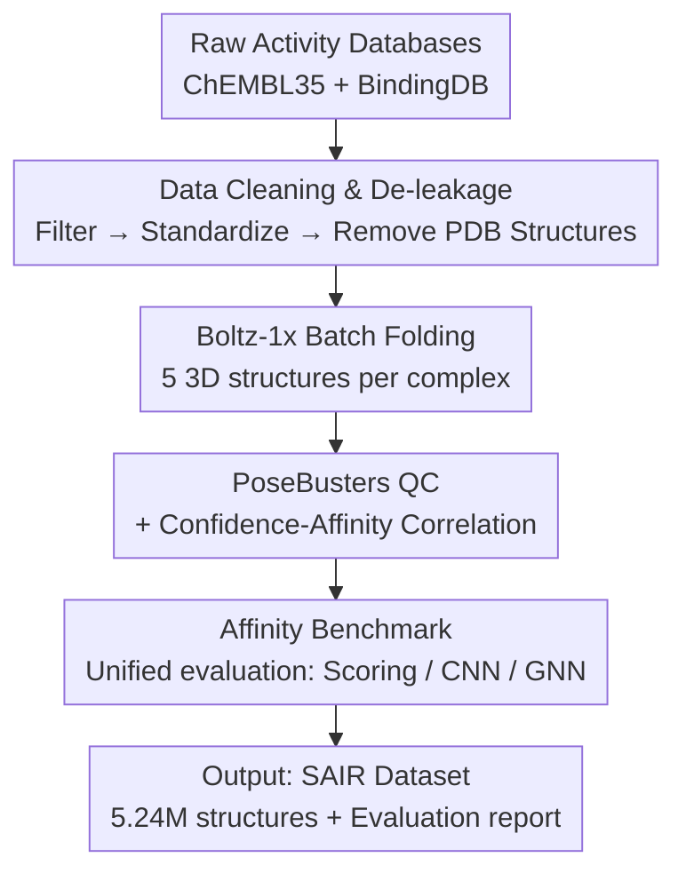

# SAIR: Enabling Deep Learning for Protein-Ligand Interactions with a Synthetic Structural Dataset

**Conference**: ICLR 2026  
**OpenReview**: [https://openreview.net/forum?id=qgk2F6jxH4](https://openreview.net/forum?id=qgk2F6jxH4)  
**Code**: Data will be released upon acceptance (link omitted for anonymous review)  
**Area**: Computational Biology / Drug Discovery / Protein-Ligand Interactions / Structural Datasets  
**Keywords**: Binding Affinity Prediction, Protein-Ligand Complexes, Synthetic Structural Data, cofolding, IC50

## TL;DR
SAIR utilizes the Boltz-1x cofolding model to fold 1.049 million protein-ligand complexes curated from ChEMBL/BindingDB, constructing the largest 3D protein-ligand structural dataset to date with experimental activity labels (5.24 million structures). Based on this, a systematic evaluation of various binding affinity prediction methods reveals that existing models lack generalization capabilities on synthetic structures, highlighting an urgent need for targeted fine-tuning.

## Background & Motivation
**Background**: In drug discovery, the binding affinity between a ligand and its target protein is a core metric, which is intrinsically determined by the 3D structure of the protein-ligand complex. Consequently, deep learning methods operating on 3D structures (3D CNNs, GNNs) are generally more accurate and robust than sequence-level proxy models using only protein sequences and ligand SMILES.

**Limitations of Prior Work**: The scaling of 3D structural methods is limited by the severe scarcity of high-quality crystal structures with experimental affinity labels. The number of known structures with such labels is negligible compared to the billions of possible combinations. Existing datasets either lack affinity labels (CrossDocked, DockGen) or have only a small portion labeled (PLINDER, only for parts searchable in BindingDB), leaving the protein and ligand spaces inadequately covered.

**Key Challenge**: Experimental structure determination is costly, low-throughput, and difficult to fit into drug design iteration cycles. Traditional computational methods (MM/GBSA, Free Energy Perturbation FEP) rely on force fields or quantum chemistry, which are either limited in accuracy or too expensive for million-scale data. Supervision requires scale, yet the lack of data prevents the training of generalizable structural models, creating a deadlock.

**Goal**: To adopt a "distillation" approach—using a cofolding model to complement activity data with synthetic structures—to generate million-scale synthetic 3D complexes with experimental IC50 labels. The goal is to verify if these synthetic structures can effectively train and evaluate structure-level affinity models.

**Key Insight**: Recent works such as AlphaFold, Chai-1, and NeuralPlexer have demonstrated the feasibility of the distillation route using high-confidence computed structures with real labels. The authors apply this to "protein-ligand affinity," a data-starved subfield, selecting the MIT-licensed Boltz-1x to ensure the million-scale dataset is fully open-source and reproducible.

**Core Idea**: Construct a million-scale synthetic structural dataset, SAIR, through "batch folding with open cofolding models + experimental activity labeling + strict quality control and leakage prevention," transforming structure-level affinity deep learning from "data-poor" to "data-driven."

## Method
The "method" presented is a dataset construction and evaluation pipeline rather than a new model architecture. The overall objective is to process raw bioactivity databases into a million-scale structural library with pIC50 labels via cleaning, folding, and quality control, using it as a unified benchmark for existing affinity methods.

### Overall Architecture
The input consists of raw entries from ChEMBL35 and BindingDB (1Q2025). The output is the SAIR dataset (5,244,285 structures, covering 1,048,857 unique systems) and a comprehensive benchmarking report. The pipeline consists of four stages: ① **Data Cleaning & De-leakage**, filtering activity data and removing systems already present in the PDB; ② **Structural Folding**, using Boltz-1x to generate five candidate 3D structures for each complex; ③ **Quality Control**, verifying physical plausibility with PoseBusters and examining correlations between confidence and affinity; ④ **Affinity Benchmark**, running empirical scoring functions/CNNs/GNNs for comparison.

### Key Designs

**1. Data Curation with Strict Cleaning & De-leakage: Ensuring Large and Clean Labels**
Large-scale data is valueless if labels are noisy or leaked into evaluation sets. The authors apply a "minimal but critical" set of filters: excluding entries lacking SMILES/pchembl, missing UniProt IDs, or pointing to multi-targets/mutants; removing entries with data validity warnings or standard relations such as `<` or `>` (out of detection limits). Only experiments marked as "measuring binding" (Ki, IC50, Kd) are kept, with values constrained to a dynamic range of $1\,\text{pM} < x < 100\,\mu\text{M}$. All activities are converted to $\text{pIC50} = -\log_{10}(\text{IC50})$. SMILES are desalted, neutralized at pH 7.0, and deduplicated by UniProt accession and canonical SMILES.

**Leakage prevention** is the most critical step: all protein-ligand systems with experimental structures in the PDB are removed. This is achieved by mapping ligand InChIKeys to Chemical Component Dictionary (CCD) IDs and querying the PDB for (UniProt ID, CCD ID) pairs. This ensures that models trained on PDB structures are evaluated on "unseen" systems in SAIR. The final set includes 1,048,857 complexes.

**2. Boltz-1x Batch Cofolding: Filling Structural Gaps with Permissive Open Models**
Cleaned data lacks 3D structures. The authors select Boltz-1x (an AlphaFold 3-inspired, MIT-licensed open-source cofolding implementation). The core rationale for choosing Boltz-1x over AlphaFold 3 is the **license**: distributing over 5M structures requires an open-source license that permits such scale. Boltz-1x also incorporates a "guiding potential" during the diffusion process to suppress atomic clashes. Each complex generates 5 samples (limited by GPU memory for long sequences) using 3 recycling steps and 200 sampling steps. MSA is generated via MMseqs2 (via ColabFold) on UniRef30 and ColabFoldDB.

**3. PoseBusters Physical QC + Confidence Mining: Labeling Reliability**
Synthetic structures inherit biases; their reliability must be quantified. PoseBusters was used for physical plausibility checks, revealing that only ~3% of structures failed any check (consistent with the Boltz-1x paper), and only 0.53% of complexes failed all five generated structures. **Internal energy checks** accounted for over 50% of failures, typically due to minor steric clashes or bond length anomalies fixable via energy minimization (e.g., OpenMM). In terms of protein families, kinases and phosphatases showed low failure rates, while GPCRs were higher.

Furthermore, the authors examine whether Boltz-1x confidence metrics correlate with affinity. Interface-related metrics (iPTM, complex iPDE, complex iPLDDT) correlate significantly with experimental activity, with the strongest correlation in biochemical assays. A new **interaction PTM** metric—averaging the off-diagonal values of the pair-chains ptm confidence head—achieved a Spearman correlation of $r_s = 0.25$ with affinity, second only to iPTM at $r_s = 0.27$.

**4. Unified Affinity Benchmark: Comparing Three Paradigms**
The authors conduct a unified benchmark on SAIR covering three paradigms: empirical scoring functions (AutoDock Vina, Vinardo), 3D CNNs (Onionnet-2), and GNNs (AEV-PLIG). To avoid leakage, the evaluation uses **only ChEMBL-sourced** structures (as BindingDB was part of the training set for some baseline models). All methods are evaluated "as-is" on the predicted 3D structures. Metrics include Spearman/Pearson/Kendall correlations, AUC, and RMSE/MAE. An additional family-balanced evaluation (weighting by inverse family frequency) was performed to ensure conclusions were not dominated by over-represented targets like kinases.

### Loss & Training
Ours does not involve training a new model. However, downstream validation from an independent work, GatorAffinity, used SAIR for million-scale pre-training. They observed a power-law scaling relationship between the volume of synthetic pre-training data and downstream performance on experimental structures, validating the learnable signal within SAIR.

## Key Experimental Results

### Main Results
SAIR significantly outperforms similar databases in terms of scale and labeling completeness:

| Database | Protein-Ligand Pairs | Structure Type | Activity Labels |
|----------|----------------------|----------------|-----------------|
| CrossDocked | 22.5m | Synthetic + Exp. | None |
| PDBbind+ | 27,385 | Experimental | Yes |
| Binding MOAD | 41,409 | Synthetic/Exp. | Partial (15,223) |
| PLINDER | 449,383 | Experimental | Partial (from BindingDB)|
| DockGen | 41,791 | Synthetic | None |
| **SAIR (Ours)** | **1,048,857** | **Synthetic** | **Yes** |

Key finding from the affinity benchmark (Fig. 5): GNN (AEV-PLIG) > CNN (Onionnet-2) > Scoring Functions (Vina/Vinardo), yet **no method achieved high correlation**. The Spearman correlation of ML methods was comparable to interface confidence metrics (like iPTM) that were never tuned for affinity.

### Ablation Study

| Configuration / Slice | Key Finding | Description |
|-----------------------|-------------|-------------|
| Dataset-wide QC | ~3% of structures failed PoseBusters | Only 0.53% failed all 5 structures; overall reliable quality. |
| Failure Root Cause | Internal energy checks > 50% | Mostly minor clashes/bond anomalies; fixable by minimization. |
| High-confidence Subset (>0.8)| Improved performance for almost all models | High-confidence structures are more likely to be correct. |
| Family-balanced Eval | Rankings and correlations remained stable | Signals generalize across diverse targets, not just kinases. |
| Confidence ↔ Activity | iPTM $r_s{=}0.27$, interaction PTM $r_s{=}0.25$ | Confidence metrics act as weak predictors for affinity. |

### Key Findings
- **Current models generalize poorly to synthetic structures**: GNNs/CNNs trained on experimental structures show low correlation on synthetic ones, suggesting a need for fine-tuning on synthetic distributions.
- **Confidence as a weak predictor**: Interface confidence (iPTM, etc.) achieved predictive power comparable to specialized ML models without any affinity tuning.
- **Assay types influence correlation**: Correlation between confidence and activity is highest in biochemical assays and lowest in cell-based assays, reflecting confounding factors like off-target effects.
- **Downstream pre-training is effective**: GatorAffinity pre-trained on SAIR reduced PDBbind RMSE from 1.343 to 1.293, surpassing SOTA models like GIGN and PSICHIC.

## Highlights & Insights
- **License-driven technical selection**: Opting for the MIT-licensed Boltz-1x over AlphaFold 3 ensures the 5M+ structure dataset can be fully redistributed.
- **Upstream leakage prevention**: Filtering by (UniProt ID, CCD ID) pairs at the source provides a cleaner evaluation set for PDB-trained models than post-hoc splitting.
- **Confidence as a signal**: The authors identified that iPTM and the newly defined "interaction PTM" serve as proxies for biological plausibility and binding strength.
- **Honest reporting of negative results**: The conclusion that "existing methods perform poorly" is framed as a call to action for fine-tuning rather than an attempt to claim a false SOTA.

## Limitations & Future Work
- **Inheritance of teacher model bias**: As a distilled dataset, SAIR inherits the inductive biases of Boltz-1x (e.g., potential mode collapse).
- **Physical plausibility vs. Biological correctness**: PoseBusters ensures chemical validity but not necessarily biological accuracy. Since PDB systems were excluded, there is no ground-truth for RMSD comparison.
- **Modeling simplifications**: The current version folds monomeric protein chains with target ligands, omitting cofactors and ions.
- **Future directions**: Fine-tuning models on SAIR subsets or designing new architectures for synthetic complexes could improve accuracy. The dataset can also support self-distillation of cofolding models.

## Related Work & Insights
- **vs PLINDER**: PLINDER uses experimental structures with linked BindingDB activities (~450k pairs), but only a fraction are labeled. SAIR uses synthetic structures with a much larger, fully labeled million-scale set.
- **vs CrossDocked / DockGen**: These datasets lack experimental affinity labels (e.g., CrossDocked uses binary docking labels). SAIR's core value is the "synthetic structure + real activity" pairing.
- **vs Boltz-2**: Boltz-2 can regress affinity directly from embeddings. Since its training data overlaps with SAIR, it was excluded from the benchmark to ensure fairness.

## Rating
- Novelty: ⭐⭐⭐⭐ The value lies in the data: the first million-scale "synthetic structure + experimental activity" pair library.
- Experimental Thoroughness: ⭐⭐⭐⭐ Comprehensive QC, confidence analysis, and cross-paradigm benchmarking.
- Writing Quality: ⭐⭐⭐⭐ Clear pipeline description and honest disclosure of limitations.
- Value: ⭐⭐⭐⭐⭐ Addresses the "data-hungry" bottleneck of structural affinity deep learning.

<!-- RELATED:START -->

## Related Papers

- [\[ICLR 2026\] PSDNorm: Temporal Normalization for Deep Learning in Sleep Staging](psdnorm_temporal_normalization_for_deep_learning_in_sleep_staging.md)
- [\[ICLR 2026\] Enhancing Molecular Property Predictions by Learning from Bond Modelling and Interactions](enhancing_molecular_property_predictions_by_learning_from_bond_modelling_and_int.md)
- [\[ICLR 2026\] Meta-Learning Theory-Informed Inductive Biases using Deep Kernel Gaussian Processes](meta-learning_theory-informed_inductive_biases_using_deep_kernel_gaussian_proces.md)
- [\[ICLR 2026\] TetraGT: Tetrahedral Geometry-Driven Explicit Token Interactions with Graph Transformer for Molecular Representation Learning](tetragt_tetrahedral_geometry-driven_explicit_token_interactions_with_graph_trans.md)
- [\[ICLR 2026\] PoseX: AI Defeats Physics-based Methods on Protein Ligand Cross-Docking](posex_ai_defeats_physics-based_methods_on_protein_ligand_cross-docking.md)

<!-- RELATED:END -->
