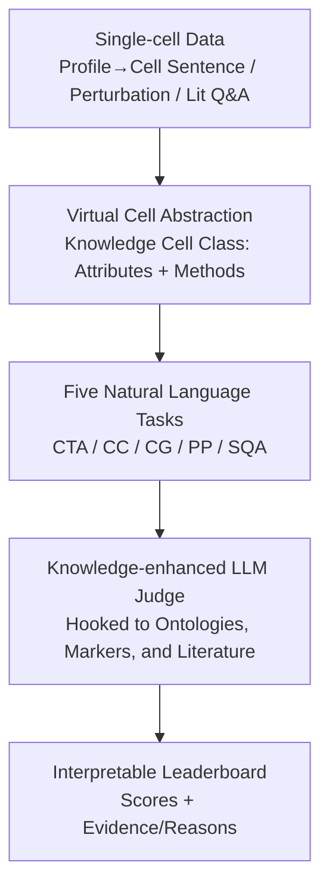

# SC-Arena: A Natural Language Benchmark and Knowledge-Enhanced Evaluation for Single-Cell Reasoning

**Conference**: ICLR 2026  
**OpenReview**: [https://openreview.net/forum?id=5RcoUe1tA1](https://openreview.net/forum?id=5RcoUe1tA1)  
**Code**: https://github.com/SUAT-AIRI/SC-Arena  
**Area**: Computational Biology / LLM Evaluation Benchmark / Single-Cell Reasoning  
**Keywords**: Single-cell benchmark, virtual cell, knowledge-enhanced evaluation, LLM-as-judge, natural language tasks

## TL;DR
SC-Arena reformulates the evaluation of "whether an LLM can serve as a virtual cell" into a natural language arena: it uses an object-oriented "Knowledge Cell Class" abstraction to unify evaluation targets (attributes + methods), designs 5 open-ended natural language tasks, and replaces brittle string-matching metrics with a knowledge-enhanced LLM judge linked to ontologies, marker gene databases, and literature. The study finds that current models are fluent in descriptive tasks but fail systematically in mechanistic and causal tasks such as perturbation prediction and cell type annotation.

## Background & Motivation
**Background**: Single-cell biology is increasingly introducing LLMs for tasks like cell type annotation, perturbation analysis, and mechanistic Q&A, with the goal of constructing a "virtual cell"—a model capable of simulating cellular behavior in silico to accelerate scientific discovery. Both domain-specific models trained from scratch (e.g., scGPT, Geneformer, C2S-Scale) and general-purpose LLMs (e.g., GPT-4o, DeepSeek-R1) are being deployed for these tasks.

**Limitations of Prior Work**: Accompanying evaluation frameworks are significantly lagging. Existing benchmarks suffer from three specific issues: (1) **Task Fragmentation**: Most focus on a single narrow task (e.g., cell type annotation), failing to assess the model's integrated understanding of "cell identity + dynamics." (2) **Format Distortion**: Frameworks like CELLVERSE convert open-ended questions into multiple-choice questions (MCQ) to ensure stability, which disconnects from real-world usage and suppresses reasoning depth. (3) **Hollow Metrics**: Benchmarks like SOAR rely on surface-level string overlap metrics like BLEU or exact match, downgrading complex biological reasoning to lexical matching, which lacks biological basis and interpretability.

**Key Challenge**: Evaluation must simultaneously satisfy three criteria: unified coverage of heterogeneous tasks, an open-ended natural language format, and biological credibility/interpretability. Existing metrics fail in biological fidelity—they cannot distinguish whether a model truly understands cellular mechanisms or is simply memorizing surface patterns. Conventional NLP metrics (BLEU/ROUGE/BERTScore) showed either saturated or near-zero scores in the authors' pilot experiments, failing to capture the quality of biological reasoning.

**Goal**: To build an evaluation framework that unifies heterogeneous tasks using a single object (virtual cell), tests them via open-ended natural language Q&A (without candidate lists), and injects domain knowledge to ensure biological fidelity.

**Key Insight**: The authors adopt an "object-oriented modeling" approach—treating a cell as an instance of a class that possesses both static **attributes** (identity, state) and dynamic **methods** (responses to and interactions with the environment). A true virtual cell model should be able to represent both aspects coherently.

**Core Idea**: Utilizing the "Virtual Cell (Knowledge Cell Class)" abstraction to unify evaluation targets and replacing string matching with a "knowledge-enhanced LLM judge," transforming single-cell evaluation into an open, interpretable, and biologically credible natural language arena.

## Method

### Overall Architecture
SC-Arena is an **evaluation framework** rather than a new model. It organizes the evaluation into three serial processes: framing the candidate model as a "virtual cell" (defining what to test), administering a "formal exam" covering 5 tasks (defining how to test), and scoring via an LLM judge linked to external knowledge bases (defining how to evaluate). Inputs consist of various single-cell data (expression profiles converted to "cell sentences," perturbation settings, mechanistic questions), and outputs are fine-grained, interpretable leaderboards with evidence-based justifications.

### Key Designs

**1. Virtual Cell Abstraction: Unifying Evaluation Targets via the "Knowledge Cell Class"**

This design directly addresses "task fragmentation." Previously, tasks were handled in isolation with no unified unit of evaluation. Borrowing from object-oriented modeling, the authors define each cell to be evaluated as an instance of a **Knowledge Cell Class**, which encapsulates two components. **Attributes** represent the internal identity and state of the cell across multiple modalities: (i) Expression level, where scRNA-seq profiles are encoded as structured "cell sentences" (gene tokens ranked by expression); (ii) Textual level, featuring descriptions of morphology, function, localization, and roles curated from literature and databases; (iii) Ontological level, involving hierarchical annotations from the Cell Ontology (CL). **Methods** represent the external dynamic behaviors of the cell: (i) Cell→Environment, such as cytokine secretion, signaling, antigen presentation, and immune activation; (ii) Environment→Cell, such as transcriptional changes under perturbations like drug treatment or gene knockdown. A model is only considered a qualified virtual cell candidate if it can coherently represent both "attributes + methods." The value of this abstraction lies in mapping disparate annotation, generation, perturbation, and Q&A tasks onto specific attributes or methods of the Knowledge Cell Class within a unified framework.

**2. Five Natural Language Tasks: Mapping Heterogeneous Capabilities within the Knowledge Cell Class**

Based on the Knowledge Cell Class, the authors designed 5 representative tasks. Each task corresponds to a modal mapping or reasoning direction within the class, and all utilize **open-ended natural language Q&A**:

- **Cell Type Annotation (CTA, Expression→Ontology)**: Given a cell sentence, the model predicts the corresponding ontological cell type label.
- **Cell description (CC, Expression→Language)**: Given a cell sentence, the model generates a natural language description of the biological state, testing the interpretability of "translating transcriptomic patterns into human language."
- **Cell Generation (CG, Ontology/Language→Expression)**: Given a cell type name, the model reverse-generates a reasonable cell sentence, testing its ability to produce molecular profiles consistent with semantic labels.
- **Perturbation Prediction (PP, Environment→Cell)**: Given a baseline profile + perturbation signal, the model (i) predicts up/down-regulated genes and (ii) generates the post-perturbation cell sentence.
- **Scientific Q&A (SQA, Cell→Environment)**: Based on literature, the model is asked to extract relevant knowledge and provide mechanistic explanations supported by evidence.

The design motivation is clear: the first three tasks form a closed-loop bidirectional translation between "expression profiles ↔ ontological labels ↔ natural language," while the last two test causal interaction reasoning between the cell and its environment. Together, they cover static identity, dynamic behavior, and cross-modal reasoning.

**3. Knowledge-enhanced Evaluation: Linking LLM Judges to External Bases for Biologically Credible Scoring**

This design addresses "hollow metrics." The authors utilize LLM-as-a-judge but incorporate the Eval-RAG approach. Instead of the judge only seeing the prompt and output, it explicitly accesses a suite of manually curated external resources: Cell Ontology, UniProt, Gene Ontology, CellMarker, and peer-reviewed literature. Formally, each evaluation instance is represented as $I = (q, r, K, g)$, where $q$ is the task prompt, $r$ is the model response, $K$ is the retrieved external knowledge, and $g$ is the ground truth. The judge LLM $E$ maps this quadruple to a score $s = E(I) \in [0, 100]$ (implemented by mapping a discrete $[0,5]$ score to a $[0,100]$ linear scale). Conditioning on both $K$ and $g$ allows the judge to tolerate linguistic variance and award partial credit for semantically relevant predictions, while using authoritative references to penalize biologically impossible factual errors. Knowledge anchors are task-specific: CTA uses CL hierarchical paths to calculate semantic distance; CC uses CL official definitions as reference descriptions; CG uses markers from CellMarker to verify if the generated profile maintains cell identity; PP uses gene function annotations from NCBI/UniProt/GO to check if perturbation responses align with known mechanisms; SQA extracts abstracts and key snippets from original PubMed articles as factual evidence. The framework prioritizes biological fidelity over speculative novelty—only predictions consistent with experimentally verified facts receive high scores. By anchoring to consensus-level evidence rather than dynamic retrieval, the scoring remains stable even if underlying databases are updated.

### An Example: How Perturbation Prediction is Scored
Take a K562 cell with the perturbation condition `DNAJC19+ctrl`. The judge follows structured steps: **Step 1** finds that the prediction partially matches the ground truth but includes unverified down-regulated genes (e.g., FTH1, ARPC1B), questioning reliability. **Step 2** confirms that predicted up/down-regulated genes (e.g., CD63, RPS28) are biologically plausible in the context of CRISPRi perturbation, and the direct target DNAJC19 is correctly predicted as down-regulated. **Step 3** notes that the model captured the core regulated gene set but was imprecise in annotating functional roles for significantly down-regulated genes. **Step 4** provides external validation—known DNAJC19 knockdown triggers mitochondrial stress and related pathways, indirectly validating the predicted expression changes. **Conclusion**: Overall biologically plausible but imprecise (excessive prediction of down-regulated genes), resulting in a moderate score of 3. This walkthrough demonstrates how "scores + evidence/reasons" are generated step-by-step, transforming evaluation from a black-box number into an auditable process for iterative improvement.

## Key Experimental Results

### Main Results
Evaluation results across 5 tasks for general-purpose models (Qwen2.5/Qwen3 series, GPT-4o, DeepSeek-R1, Kimi-K2) and domain-specific models (C2S-Scale, scGenePT, scGPT, Cell-O1). Full scores for each column are normalized (Total max approx. 5 × 100).

| Model | CTA | CG | CC | PP | SQA | Total |
| :--- | :--- | :--- | :--- | :--- | :--- | :--- |
| Qwen2.5-7B | 12.61 | 45.98 | 51.05 | 28.84 | 64.09 | 202.57 |
| Qwen3-235B | 37.47 | 52.76 | 62.03 | 35.94 | 74.48 | 262.68 |
| GPT-4o | 36.29 | 59.70 | 63.02 | 37.24 | 67.56 | 263.81 |
| DeepSeek-R1 | 40.81 | 62.24 | 66.51 | 36.23 | 70.87 | **276.66** |
| Kimi-K2 | 40.00 | 63.04 | 67.89 | 37.10 | 69.13 | **277.16** |
| C2S-Pythia-410m (CTA) | **47.34** | — | — | — | — | — |
| Cell-o1 | 34.11 | 43.91 | 67.89 | 24.20 | 64.09 | 234.20 |

Key Observations: (1) **No system reaches the level of a reliable "virtual cell"**—even the strongest models, Kimi-K2 (277.2) and DeepSeek-R1 (276.7), fail to cross the normalized passing mark (5 × 60 = 300), indicating that single-cell reasoning remains extremely difficult with significant room for improvement. (2) **Severe divergence across tasks**—Description (max 67.9) and SQA (max 74.5) reach the 60–70 range, but cell type annotation is stuck around 40, and perturbation prediction is below 38 for all models, exposing a "fluent but not faithful" gap. (3) **Specific models punch above their weight on targeted tasks**—C2S-Pythia (410M) achieved 47.3 in CTA, surpassing GPT-4o (36.3) and Qwen3-235B (37.5). However, scGenePT scored only 21–26 in PP, suggesting that specialization is highly task-dependent and not universally beneficial.

### Scale and Evaluator Effectiveness Analysis

| Dimension | Key Result | Description |
| :--- | :--- | :--- |
| Model Scale/Iteration | Qwen2.5-7B 202.6 → Qwen3-235B 262.7 | Scaling and iteration yield a ~60 point gain but don't solve mechanistic reasoning. |
| Evaluator Biological Correctness | Spearman $\rho=0.6212$, $p<0.001$ | CTA scores correlate strongly with ontological distance; closer matches to truth get higher scores. |
| Evaluator Discriminative Power | NLP metrics are saturated or near zero | Knowledge-enhanced evaluation differentiates models; LLMs generate deeper, more specific type predictions. |
| Evaluator Robustness | Stable across judge models / knowledge bases | Scoring is insensitive to answer length or underlying database substitution. |

### Key Findings
- **"Fluent but not faithful" is a systemic phenomenon**: General-purpose models outperform specific ones in open-ended generation (description) due to surface fluency, but their advantage disappears or reverses in tasks requiring ontological precision or causal accuracy (annotation, perturbation prediction). Models can "speak biology" but cannot "reason through biology" hierarchically or causally.
- **Knowledge-enhanced evaluation is biologically grounded**: In CTA, scores are strongly positively correlated with the shortest path distance in Cell Ontology ($\rho=0.6212$), proving that scoring aligns with biological hierarchical structures rather than being arbitrary.
- **Conventional NLP metrics lack discriminative power**: BLEU/ROUGE/BERTScore/METEOR scores for different models are clustered together or near zero, failing to reflect differences in biological reasoning quality, which justifies the use of knowledge-enhanced evaluation.
- **Low data leakage risk**: Verification on CTA using the C2S-scale series shows that these models have significantly lower character-level similarity with samples than general models while achieving higher task accuracy, suggesting they have learned task-relevant knowledge rather than memorized data.

## Highlights & Insights
- **Applying Object-Oriented Modeling to Biological Evaluation**: Using the "Knowledge Cell Class (Attributes + Methods)" as a unified evaluation unit is an elegant abstraction. It unifies disparate tasks—annotation, description, generation, perturbation, and Q&A—into "internal modal mappings or dynamic responses," providing high scalability (e.g., adding spatial transcriptomics or developmental trajectories simply requires adding attributes/methods to the class).
- **Knowledge-Enhanced Judges Enable Auditable Evaluation**: The $I=(q,r,K,g)$ design is clever in conditioning on both "external knowledge $K$" and "ground truth $g$." This allows for partial credit for semantically similar predictions (addressing the brittleness of string matching) while penalizing factual errors with credible evidence (addressing the tendency of LLM judges to be fooled by fluent text). Anchoring to consensus evidence ensures scoring stability.
- **"Fluent but not Faithful" as a Transferable Diagnostic Perspective**: Separating linguistic fluency from domain-specific faithfulness provides a binary diagnostic applicable to any evaluation of LLM reasoning in professional domains (law, medicine, chemistry), reminding users that high BLEU or description scores do not equate to true domain understanding.
- **Small Models Surpassing Large Models**: The 410M C2S-Pythia outperforming billion-parameter general models in CTA reinforces the conclusion that "domain-structured knowledge > parameter count."

## Limitations & Future Work
- **Judges Inherit LLM Probabilistic Nature**: The authors acknowledge that knowledge-enhanced judges still possess inherent LLM instability. Future work could use multi-judge ensembles to reduce variance, calibrate with expert-annotated rationales, and integrate real-time knowledge bases (GO/CL/CellMarker) to allow standards to evolve with scientific progress.
- **Limited Modality Coverage**: Currently only covers scRNA-seq expression and literature Q&A; spatial transcriptomics, developmental trajectories (temporal reasoning), and multi-omics (ATAC-seq, proteomics) have not yet been integrated. These are listed as expansion directions for SC-Arena as a "living benchmark."
- **Small Sample Size**: PP includes only 138 interventions, SQA only 254 questions, and CTA/CC/CG share 608 profiles. Statistically, this limits the confidence level of model rankings (reviewer observation).
- **Subjective Passing Grade**: Setting "5 × 60" as a passing mark for a virtual cell lacks external validation and serves more to illustrate that models are "far from the goal" rather than providing an absolute metric (reviewer observation).

## Related Work & Insights
- **vs CELLVERSE**: CELLVERSE unifies multi-modal data into multi-omic cell sentences but relies on MCQs for stability, which suppresses reasoning depth. SC-Arena maintains open-ended natural language Q&A without candidate lists, which is closer to real-world usage.
- **vs SOAR**: SOAR treats models as single-task agents for cell type annotation and uses string matching (BLEU/exact match), offering almost no interpretability. SC-Arena uses knowledge-enhanced judges to provide scores with evidence-based justifications.
- **vs Cell-o1**: As a reasoning agent, Cell-o1 emphasizes batch-level logical consistency but is constrained to selection-based formats requiring candidate lists. SC-Arena focuses on open-ended generation and a unified virtual cell paradigm.
- **vs C2S-Scale**: C2S-Scale focuses on static encoding and scaling laws, evaluating prompted completion using lexical/statistical metrics like BERTScore or Gene Overlap. SC-Arena unifies evaluation targets into dynamic virtual cells and emphasizes mechanistic reasoning.

## Rating
- Novelty: ⭐⭐⭐⭐⭐ The "Knowledge Cell Class" abstraction + knowledge-enhanced LLM judge represents a rare unified and interpretable paradigm in single-cell evaluation.
- Experimental Thoroughness: ⭐⭐⭐⭐ Covers both general and specific models across 5 tasks, validating the judge's correctness, interpretability, discriminative power, and robustness, though sample sizes for individual tasks are small.
- Writing Quality: ⭐⭐⭐⭐ The three-stage framework is clear, and the "fluent but not faithful" insight is well-distilled.
- Value: ⭐⭐⭐⭐⭐ Provides a unified, interpretable, and biologically credible diagnostic tool for single-cell foundation models, with significant guidance for developing biology-aligned models.

<!-- RELATED:START -->

## Related Papers

- [\[ICLR 2026\] GAGA: Gaussianity-Aware Gaussian Approximation for Efficient 3D Molecular Generation](gaga_gaussianity-aware_gaussian_approximation_for_efficient_3d_molecular_generat.md)
- [\[ICLR 2026\] Representing Local Protein Environments with Machine Learning Force Fields](representing_local_protein_environments_with_machine_learning_force_fields.md)
- [\[ICLR 2026\] Take Note: Your Molecular Dataset Is Probably Aligned](take_note_your_molecular_dataset_is_probably_aligned.md)
- [\[ICLR 2026\] VenusX: Unlocking Fine-Grained Functional Understanding of Proteins](venusx_unlocking_fine-grained_functional_understanding_of_proteins.md)
- [\[ICLR 2026\] DriftLite: Lightweight Drift Control for Inference-Time Scaling of Diffusion Models](driftlite_lightweight_drift_control_for_inference-time_scaling_of_diffusion_mode.md)

<!-- RELATED:END -->
