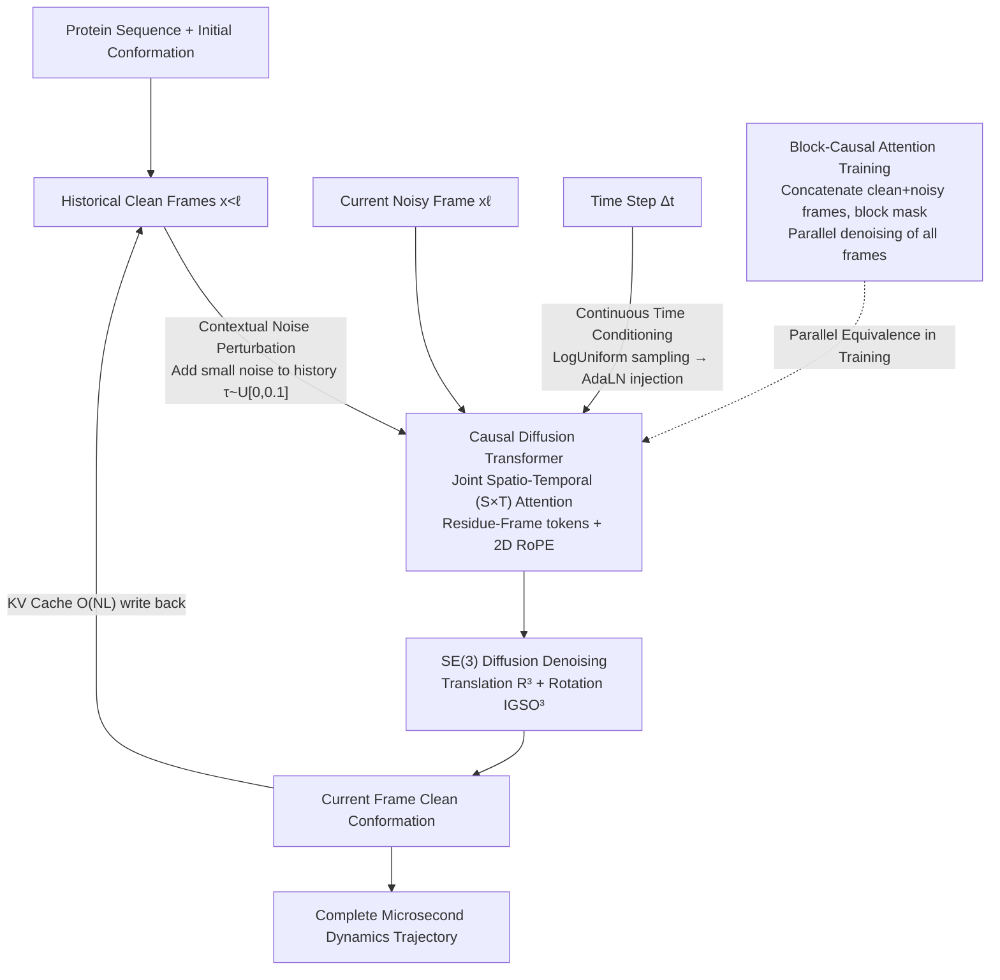

# Scalable Spatio-Temporal SE(3) Diffusion for Long-Horizon Protein Dynamics

**Conference**: ICLR 2026  
**arXiv**: [2602.02128](https://arxiv.org/abs/2602.02128)  
**Code**: [https://bytedance-seed.github.io/ConfRover/starmd](https://bytedance-seed.github.io/ConfRover/starmd)  
**Area**: Computational Biology  
**Keywords**: Protein Conformation Generation, SE(3) Diffusion Model, Spatio-Temporal Attention, Autoregressive Trajectory Generation, Molecular Dynamics Acceleration

## TL;DR
Ours proposes STAR-MD, an SE(3)-equivariant causal diffusion Transformer that achieves microsecond-scale protein dynamics trajectory generation through joint spatio-temporal attention and contextual noise perturbation. It achieves SOTA across all metrics on the ATLAS benchmark and stably extrapolates to microsecond time scales unseen during training.

## Background & Motivation

**Background**: Molecular Dynamics (MD) simulation is the gold standard for studying protein dynamics, but it requires femtosecond integration steps, making the computational cost extremely high (a microsecond simulation requires $10^9$ steps). Recently, generative models have been used to accelerate MD, such as MDGen (diffusion model generating 100ns trajectories), AlphaFolding (simultaneous multi-frame generation), and ConfRover (autoregressive generation).

**Limitations of Prior Work**: (a) Existing methods are limited to short time horizons (nanosecond scale) and cannot scale to biologically relevant microsecond-to-millisecond scales; (b) Uses of AlphaFold2-style Pairformer + triangular attention lead to $O(N^3L)$ cubic computational costs and $O(N^2L)$ KV cache memory requirements; (c) Existing architectures use spatial and temporal modules alternately (space-then-time), limiting the expressivity to capture non-separable spatio-temporal coupling; (d) Serious error accumulation occurs during long-horizon autoregressive generation.

**Key Challenge**: Coarse-graining (using per-residue representation instead of all-atom) makes dynamics a non-Markovian process (requiring historical memory), but computationally expensive pairwise feature processing hinders modeling over longer historical contexts.

**Goal**: Design a protein conformation generation model that can efficiently handle spatio-temporal dependencies and stably generate microsecond-scale long trajectories.

**Key Insight**: Using the Mori-Zwanzig formalism, it is theoretically demonstrated that: (a) coarse-graining necessitates historical memory (non-Markovian), and (b) after removing pairwise features, the memory kernel "expands" and becomes spatio-temporally inseparable—directly justifying the necessity of joint spatio-temporal attention.

**Core Idea**: Replace alternating space+time modules with joint spatio-temporal attention, combined with causal diffusion training and contextual noise perturbation, to achieve scalable long-range protein dynamics generation.

## Method

### Overall Architecture

The goal of STAR-MD is to generate subsequent dynamics trajectories step-by-step given a protein sequence and an initial conformation. It models the entire trajectory as an autoregressive process $\prod_{\ell=1}^{L} p(\mathbf{x}_\ell | \mathbf{x}_{<\ell}, \Delta t_\ell)$—the conformation of the $\ell$-th frame is determined by all previous frames and the time interval $\Delta t_\ell$ of that step. The generation of each frame itself is an SE(3) diffusion process: the model starts from pure noise and restores the conformation to a reasonable geometric position through denoising score matching. Linking these two layers is a Causal Diffusion Transformer, which simultaneously observes historical clean frames and the current noisy frame being denoised, extracts conditional information, denoises the clean conformation of the current frame, writes it back to history, and proceeds to generate the next frame. The following four designs address spatio-temporal modeling, parallel training, stability, and cross-time-scale capability.

### Key Designs

**1. Joint Spatio-Temporal (S×T) Attention: Modeling spatial and temporal coupling simultaneously**

Existing architectures (e.g., ConfRover) split space and time into two alternating modules (space-then-time), which limits the ability to express "non-separable" spatio-temporal coupling. STAR-MD switches to attention over joint tokens of residue-frame pairs $(i, \ell)$: each token corresponds directly to a (residue, time frame). Any token can attend to any residue feature in any previous frame, allowing spatial and temporal dependencies to be captured jointly. Residue and frame indices are encoded using 2D RoPE, allowing positional relationships learned during training to extrapolate to more frames. This approach is necessary, as argued by Mori-Zwanzig theory: Removing expensive pairwise features causes the memory kernel characterizing historical dependence to "expand" and become spatio-temporally inseparable—separated attention cannot represent this coupling in principle, while joint attention can. Computationally, joint attention is $O(N^2 L^2)$, whereas Pairformer + temporal attention is $O(N^3 L + N^2 L^2)$, eliminating the cubic term relative to the number of residues.

**2. Block-Causal Attention Training: Parallel training while maintaining causal structure**

Autoregressive inference is sequential (one frame depends on previously generated frames), but training sequentially is extremely slow. STAR-MD concatenates all clean and noisy frames into a single input sequence and applies a block-level attention mask to constrain information flow: each frame can only attend to the clean versions of frames prior to it. This allows a single forward pass to compute denoising losses for all frames simultaneously, equivalent to parallel teacher-forcing while still obeying the "cannot see the future" causal constraint, aligning training visibility with sequential inference. The cost is doubling the input sequence length (clean + noisy copies), in exchange for simultaneous optimization of all frames.

**3. Contextual Noise Perturbation: Training the model to handle imperfect history**

A common problem in long-range autoregressive generation is error accumulation—small deviations in one frame are amplified by subsequent frames, eventually leading to trajectory drift and collapse. The root cause is that during training, the model always sees perfect ground truth history, while during inference, it must rely on its own (erroneous) predictions. STAR-MD adds a small amount of noise $\tau \sim \mathcal{U}[0, 0.1]$ to historical clean frames during training and does the same during inference, ensuring the quality of history seen during both phases is consistent. This makes the model robust to its own prediction errors. Inspired by Diffusion Forcing, this acts similarly to scheduled sampling but is implemented naturally within the diffusion framework. Ablations show this is key to stability for long trajectories (>250ns).

**4. Continuous-Time Conditioning: Covering multiple time scales with a single model**

To generate both dense short-step trajectories and across large time spans, traditional methods rely on complex context length extrapolation. STAR-MD instead uses the time step itself as a condition: $\Delta t \sim \text{LogUniform}[10^{-2}, 10^1]$ ns is randomly sampled during training and injected via AdaLN. The key is that this decouples "physical trajectory duration" from "context frame count"—even with limited context frames, sampling large steps exposes the model to dependencies spanning long physical times. Thus, a single model covers the range of steps from $10^{-2}$ to $10^1$ ns, transforming "temporal extrapolation" into a "conditioning" problem.

### Loss & Training

The training objective is the denoising score matching loss for SE(3) diffusion, modeling two components of rigid body motion separately: translation uses Gaussian noise on $\mathbb{R}^3$, and rotation uses isotropic Gaussian on $\text{IGSO}_3$, predicting their respective noises. Inference uses KV caching for efficient autoregressive rolling generation, requiring only $O(NL)$ memory, a significant reduction compared to $O(N^2 L)$ in ConfRover—a secondary benefit of removing pairwise features.

## Key Experimental Results

### Main Results

ATLAS benchmark 100ns trajectory generation:

| Method | Cα-level Validity↑ | All-atom Validity↑ | Conformation Coverage↑ | Dynamics Fidelity↑ |
|------|-----------------|-------------|-----------|------------|
| MDGen | Lower | Lower | Medium | Lower |
| AlphaFolding | Medium | Medium | Medium | Medium |
| ConfRover | High | High | High | High |
| **Ours (STAR-MD)** | **Highest** | **Highest** | **Highest** | **Highest** |

STAR-MD reaches Prev. SOTA across all metrics.

### Ablation Study

| Configuration | Description |
|------|------|
| Remove joint S×T attention → alternating modules | Performance drops significantly, validating spatio-temporal coupling value |
| Remove contextual noise perturbation | Long trajectory (>250ns) stability severely degrades |
| Remove continuous-time conditioning | Cross-time-scale generalization capability decreases |
| Remove block-causal training | Training efficiency decreases significantly |

### Key Findings
- **Long-range Extrapolation**: STAR-MD maintains high structural quality at the microsecond scale (1μs = 10× training length), while baseline methods suffer catastrophic degradation after 250ns.
- Contextual noise perturbation is critical for long-range stability—without it, even STAR-MD degrades in long trajectories.
- Joint S×T attention is not only more efficient (removing the $O(N^3)$ term from triangular attention) but also more expressive.
- Continuous-time conditioning allows a single model to cover step sizes from $10^{-2}$ to $10^1$ ns.

## Highlights & Insights
- **Strict Correlation Between Theory and Architecture**: Using the Mori-Zwanzig formalism to justify joint spatio-temporal attention (due to memory kernel expansion and inseparability) rather than relying solely on intuition. This "theory-first → guided architecture" path is noteworthy.
- **Training-Inference Alignment via Contextual Noise**: A simple core idea—adding noise to history frames during training—is vital for long-horizon stability. It acts like scheduled sampling but is perfectly integrated into the diffusion framework.
- **Cascade Effect of Removing Pairformer**: Not using pairwise features reduces both computation ($O(N^3) \to O(N^2)$) and KV cache ($O(N^2L) \to O(NL)$), making long-trajectory generation memory-feasible.
- **Ingenuity of Continuous-Time Conditioning**: By sampling step sizes via LogUniform, a small context window can learn dependencies over large time spans—"temporal extrapolation through conditioning."

## Limitations & Future Work
- Validated only at the Cα-level coarse-graining; does not directly handle all-atom representation—fine-grained side-chain dynamics might be missed.
- MD trajectory quality in the ATLAS dataset is limited by the force field accuracy; the model's learned dynamics are capped by this upper bound.
- The $O(N^2 L^2)$ complexity of joint S×T attention may still become a bottleneck for extremely large proteins + extremely long trajectories.
- Training is performed only on 100ns scale data; the reliability of microsecond extrapolation lacks direct physical validation (e.g., accuracy of free energy surfaces).
- Lack of comparison with enhanced sampling methods (e.g., Metadynamics).

## Related Work & Insights
- **vs ConfRover**: ConfRover uses Pairformer+IPA+KV cache but suffers $O(N^3L)$ computation and $O(N^2L)$ KV cache. STAR-MD replaces this with S×T attention, surpassing it in both efficiency and performance.
- **vs MDGen**: MDGen anchors trajectories to keyframes using a standard Transformer but achieves sub-optimal performance. STAR-MD maintains a full autoregressive structure and is more effective.
- **vs AlphaFolding**: AlphaFolding generates multiple frames simultaneously but discards early window memory. STAR-MD maintains complete historical memory via KV caching.
- **Analogy to Video Generation**: STAR-MD's architectural logic (Causal Diffusion Transformer + block-level training + noise perturbation against drift) is highly consistent with trends in video generation, indicating that protein dynamics generation is converging with video generation technology.

## Rating
- Novelty: ⭐⭐⭐⭐⭐ The Mori-Zwanzig theory-driven design is elegant; microsecond extrapolation is a breakthrough.
- Experimental Thoroughness: ⭐⭐⭐⭐⭐ Multi-time-scale evaluation (100ns/250ns/1μs) + comprehensive ablation + structural/coverage/dynamics metrics.
- Writing Quality: ⭐⭐⭐⭐ Clear theory and method description, though symbol-dense and requires domain background.
- Value: ⭐⭐⭐⭐⭐ Significant advance for protein dynamics simulation, potentially opening new paradigms for generative model-driven drug discovery.

<!-- RELATED:START -->

## Related Papers

- [\[ICLR 2026\] SigmaDock: Untwisting Molecular Docking with Fragment-Based SE(3) Diffusion](sigmadock_untwisting_molecular_docking_with_fragment-based_se3_diffusion.md)
- [\[CVPR 2025\] Towards Spatio-Temporal World Scene Graph Generation from Monocular Videos](../../CVPR2025/computational_biology/towards_spatio-temporal_world_scene_graph_generation_from_monocular_videos.md)
- [\[ICLR 2026\] Learning Residue Level Protein Dynamics with Multiscale Gaussians](learning_residue_level_protein_dynamics_with_multiscale_gaussians.md)
- [\[ICLR 2026\] ProTDyn: A Foundation Protein Language Model for Thermodynamics and Dynamics Generation](protdyn_a_foundation_protein_language_model_for_thermodynamics_and_dynamics_gene.md)
- [\[ICLR 2026\] PSDNorm: Temporal Normalization for Deep Learning in Sleep Staging](psdnorm_temporal_normalization_for_deep_learning_in_sleep_staging.md)

<!-- RELATED:END -->
