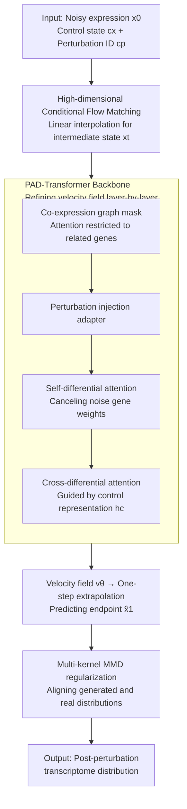

# scDFM: Distributional Flow Matching for Robust Single-Cell Perturbation Prediction

**Conference**: ICLR 2026  
**arXiv**: [2602.07103](https://arxiv.org/abs/2602.07103)  
**Code**: [GitHub](https://github.com/AI4Science-WestlakeU/scDFM)  
**Area**: Computational Biology  
**Keywords**: Single-cell perturbation prediction, Conditional Flow Matching, MMD regularization, Differential attention, Gene co-expression graph

## TL;DR
This paper proposes scDFM, a generative framework based on Conditional Flow Matching (CFM). It ensures distribution-level fidelity through MMD regularization and utilizes a PAD-Transformer backbone to process noisy and sparse single-cell data. On combinatorial perturbation prediction tasks, it achieves a 19.6% reduction in MSE compared to the strongest baseline, CellFlow.

## Background & Motivation
- Predicting transcriptomic responses of cells to genetic or pharmacological perturbations is a central challenge in systems biology and drug discovery.
- Due to the destructive nature of RNA sequencing, the pre- and post-perturbation states of the same cell cannot be observed (unpaired data).
- Existing methods (e.g., CPA, GEARS) primarily focus on mean expression profiles, neglecting higher-order distributional statistics such as variance, skewness, and changes in subpopulation proportions.
- Single-cell data is characterized by sparsity, zero-inflation, and severe noise. While complex regulatory networks exist between genes, most models treat genes as independent features.
- **Key Challenge**: A generative framework is required to model full distributional shifts while robustly handling noise and sparsity.

## Method

### Overall Architecture
The problem scDFM addresses is: given a population of control cells and a perturbation (gene knockout or drug treatment), predict the transcriptomic **distribution** of the population after perturbation—not just the mean, but also the variance and subpopulation structure. It models this as a Conditional Flow Matching (CFM) problem: starting from noisy gene expression $x_0$, it transports samples to the true post-perturbation expression $x_1$ over continuous time $t\in[0,1]$. The transport direction is determined by a time-dependent velocity field $v_\theta(x_t \mid t, c_x, c_p)$, where $c_x$ represents control cells and $c_p$ is the perturbation identity. The velocity field is predicted by a specially designed PAD-Transformer backbone, which incorporates co-expression graph priors and differential attention to calibrate the perturbed state layer-by-layer using control signals. During training, in addition to aligning the velocity field with the reference trajectory, a multi-kernel MMD regularization is added at the extrapolated endpoint to pull the generated population distribution toward the true distribution.

### Key Designs

**1. Conditional Flow Matching in High-Dimensional Expression Space: Learning perturbation transformations directly on original gene dimensions**

Since RNA sequencing is destructive, paired observations of the same cell before and after perturbation are unavailable. Traditional regression on "mean expression profiles" loses higher-order information like variance and subpopulation ratios. scDFM defines the source distribution $x_0$ as noisy gene expression and the target $x_1$ as the post-perturbation expression. It uses a linear interpolation path $\pi_t(x_0, x_1) = (1-t)x_0 + tx_1$ to define intermediate states and regresses the conditional velocity field. The training objective is:

$$\mathcal{L}_{\text{CFM}}(\theta) = \mathbb{E}\big[\|v_\theta(x_t \mid t, c_x, c_p) - v(x_t \mid x_0, x_1, t, c_x, c_p)\|_2^2\big].$$

Unlike CellFlow, which performs flow matching in a 50-dimensional PCA space, scDFM is the first to operate directly in high-dimensional gene expression space, avoiding the loss of distributional details caused by dimensionality reduction and naturally suiting the requirement of mapping from noisy states to real perturbed states.

**2. PAD-Transformer: Resilience to single-cell noise using differential attention and gene graph priors**

The backbone for predicting the velocity field must withstand the zero-inflation and high noise of single-cell data. Standard Transformers tend to waste attention on irrelevant gene tokens, whereas only a subset of genes usually responds to a perturbation. scDFM first constructs a co-expression graph using absolute Pearson correlation $w_{ij} = |\text{Cov}(x_i, x_j) / (\sigma(x_i)\sigma(x_j))|$ as an attention mask, ensuring each gene token only interacts with biologically relevant neighbors. It then employs differential attention $\alpha_{\text{diff}} = A_1 - \lambda A_2$, where two softmax attention maps are subtracted to cancel out irrelevant weights from noisy genes. Each layer follows a three-step refinement: "Perturbation injection → Self-differential attention → Cross-differential attention." Perturbation embeddings $e_p$ are injected via an MLP adapter, self-differential attention suppresses noise activations, and cross-differential attention uses control state representations $h_c$ as a reference to calibrate predictions. Time steps are modulated in each layer via adaLN-Zero.

**3. Multi-kernel MMD Regularization: Compensating for CFM's lack of global distribution alignment**

The CFM loss only constrains point-wise local velocity consistency and does not guarantee that the generated endpoint population $\hat{X}_1$ matches the real $X_1$ at a distributional level, which can lead to biased variance or subpopulation structures. scDFM predicts the endpoint $\hat{x}_1 = x_t + (1-t)\cdot v_\theta(x_t \mid t, c_x, c_p)$ at each training step using one-step extrapolation and directly compares the two population distributions using Maximum Mean Discrepancy (MMD) with a mixture-of-Gaussians RBF kernel: $k_{\text{mix}}(x, x') = \frac{1}{L}\sum_{\ell=1}^L \exp\!\big(-\frac{\|x-x'\|^2}{2\sigma_\ell^2}\big)$. Multiple bandwidths $\sigma_\ell$ (adapted via the median heuristic) cover distributional differences across scales. MMD is chosen over KL or Wasserstein because it is sample-based, computationally efficient, and robust to support mismatch in high-dimensional settings.

### Loss & Training
The total loss $\mathcal{L} = \mathcal{L}_{\text{CFM}} + \lambda \mathcal{L}_{\text{MMD}}$ uses $\lambda > 0$ to balance trajectory consistency and endpoint distribution fidelity. Time step $t$ is injected into each layer of the backbone via sinusoidal embeddings and MLP-based adaLN-Zero modulation.

## Key Experimental Results

### Main Results (Norman Additive Split)

| Model | MSE ↓ | MAE ↓ | DE-Spearman ↑ | DS ↑ | Pearson $\hat{\Delta}_{20}$ ↑ |
|------|-------|-------|---------------|------|------|
| **scDFM (Ours)** | **0.00315** | **0.02155** | **0.5705** | **0.9737** | **0.9260** |
| CellFlow | 0.00392 | 0.02207 | 0.5503 | 0.9321 | 0.8988 |
| GEARS | 0.01387 | 0.06624 | 0.5624 | 0.8601 | 0.2032 |
| scGPT | 0.01349 | 0.03796 | 1.07e-5 | 0.5404 | 0.2414 |
| CPA | 0.03435 | 0.07894 | 0.0713 | 0.6021 | 0.2254 |

### Ablation Study

| Configuration | Key Metric Change | Description |
|------|---------|------|
| w/o MMD | MSE increases, DS decreases | MMD is crucial for distribution-level fidelity |
| w/o Co-expression Graph | DE-Spearman decreases | Biologically-guided attention is effective |
| w/o Differential Attention | Noise sensitivity increases | Differential mechanism suppresses noise |
| Standard Transformer | Performance drops across metrics | PAD-Transformer components are complementary |

### Key Findings
- scDFM reduces MSE by 19.6% compared to CellFlow (0.00315 vs 0.00392) while achieving a Discriminative Score (DS) of 0.9737.
- It performs exceptionally well in Holdout settings (unseen perturbations), validating its generalization capability.
- Pre-trained models like scGPT show nearly zero DE-Spearman, suggesting foundation models struggle to capture perturbation-specific effects.
- The Additive baseline remains competitive, indicating that combinatorial perturbations often exhibit approximately additive effects.

## Highlights & Insights
- This is the first work to apply Conditional Flow Matching directly in high-dimensional gene expression space, offering a more direct approach than CellFlow's PCA-space operations.
- MMD regularization effectively compensates for CFM's limitation in global alignment, achieving both local (trajectory) and global (distribution) fidelity.
- Injecting gene co-expression graphs as biological priors into the attention mask effectively filters noise while preserving regulatory structures.
- The differential attention mechanism is particularly suitable for noisy biological data where only a subset of genes responds to perturbations.

## Limitations & Future Work
- Validation is limited to two datasets: Norman (genetic) and ComboSciPlex (drug).
- Pre-calculating gene co-expression graphs increases computational overhead for data preparation.
- Distributional metrics like DS, while useful, may not directly reflect biological significance.
- A detailed comparison with the latest diffusion-based methods (e.g., scDiffusion) is currently missing.

## Related Work & Insights
- CellFlow (Klein et al. 2025): Performs flow matching in PCA space; scDFM operates in the original expression space.
- GEARS (Roohani et al. 2024): Introduces biological priors like Gene Ontology; scDFM uses co-expression graphs.
- Diff Transformer (Ye et al. 2025): Originally proposed differential attention; scDFM adapts it for perturbation prediction.

## Rating
- Novelty: ⭐⭐⭐⭐⭐ The combination of CFM, MMD, and PAD-Transformer is innovative and well-designed.
- Experimental Thoroughness: ⭐⭐⭐⭐ Comprehensive evaluation across settings and metrics, including ablation studies.
- Writing Quality: ⭐⭐⭐⭐ Clear technical descriptions and well-justified motivations.
- Value: ⭐⭐⭐⭐⭐ Significant impact on computational biology; code is open-source.

<!-- RELATED:START -->

## Related Papers

- [\[ICML 2026\] What Makes a Representation Good for Single-Cell Perturbation Prediction?](../../ICML2026/computational_biology/what_makes_a_representation_good_for_single-cell_perturbation_prediction.md)
- [\[ICLR 2026\] Riemannian Variational Flow Matching for Material and Protein Design](riemannian_variational_flow_matching_for_material_and_protein_design.md)
- [\[ICLR 2026\] Multi-Marginal Flow Matching with Adversarially Learnt Interpolants](multi-marginal_flow_matching_with_adversarially_learnt_interpolants.md)
- [\[ICLR 2026\] Interpolation-Based Conditioning of Flow Matching Models for Bioisosteric Ligand Design](interpolation-based_conditioning_of_flow_matching_models_for_bioisosteric_ligand.md)
- [\[ICLR 2026\] La-Proteina: Atomistic Protein Generation via Partially Latent Flow Matching](la-proteina_atomistic_protein_generation_via_partially_latent_flow_matching.md)

<!-- RELATED:END -->
