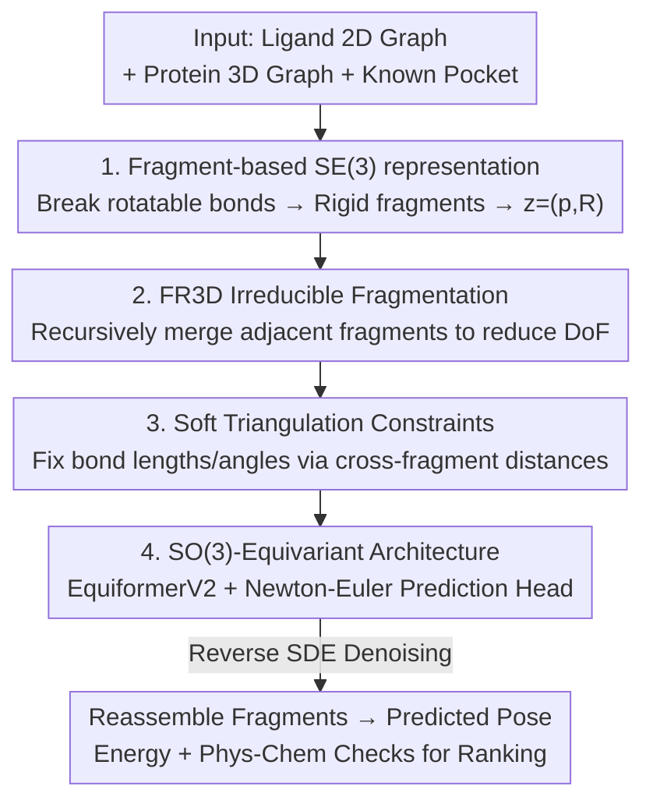

# SigmaDock: Untwisting Molecular Docking with Fragment-Based SE(3) Diffusion

**Conference**: ICLR 2026  
**OpenReview**: [https://openreview.net/forum?id=Vgm77U4ojX](https://openreview.net/forum?id=Vgm77U4ojX)  
**Area**: Computational Biology / Diffusion Models / Molecular Docking  
**Keywords**: Molecular Docking, SE(3) Diffusion, Rigid-body Fragments, Riemannian Diffusion, Drug Discovery

## TL;DR
By decomposing ligands into "rigid fragments," the generation task is transformed from predicting torsion angles to predicting SE(3) rigid-body transformations for each fragment. Using SE(3) Riemannian diffusion to reassemble these fragments into the binding pocket, SigmaDock achieves a 79.9% Top-1 success rate (RMSD < 2 Å and PB-valid) on PoseBusters, making it the first deep learning docking model to outperform classical physical methods under a fair train-test split.

## Background & Motivation
**Background**: Molecular docking predicts the binding pose of a small molecule ligand within a protein pocket, a core step in drug discovery. Physical methods (Vina, Gold) are industry standards; recent diffusion-based deep learning methods (e.g., DiffDock) are expected to offer faster, more accurate, and diverse pose sampling. The mainstream approach is the **torsional model**, which defines a diffusion process over the global translation/rotation of the ligand plus the torsion angles of each rotatable bond, as this low-dimensional manifold captures the primary degrees of freedom of chemically feasible poses.

**Limitations of Prior Work**: Theoretically, torsional models should be data-efficient and generalize well, but **empirical results have been disappointing**. Furthermore, many deep learning docking models generate "chemically unreasonable" poses (bond length/angle distortion, atom clashing). When chemical validity (PB-validity) is included in assessments, as in Buttenschoen et al. (2024), deep learning methods perform much worse than traditional physical methods. Co-folding models (e.g., AlphaFold3) are powerful but require massive data and compute; additionally, joint protein-ligand modeling results in slow inference, making them unsuitable for high-throughput virtual screening (HTVS) involving millions of pairs.

**Key Challenge**: Why are torsional models underperforming? The authors hypothesize that the **score model is forced to implicitly handle the "inverse problem of mapping 3D coordinates back to torsion angle updates,"** which is non-local, highly non-linear, and sometimes ambiguous. Crucially, small local changes in torsion angles cause large distal atomic displacements (leverage effect). Consequently, "independent torsional perturbations" become strongly coupled when mapped back to the Cartesian space observed by the model, destroying the product structure and leading to ill-conditioned learning and rigid sampling dynamics.

**Goal**: Preserve the benefits of structural chemical priors and low-dimensional representations while bypassing the entangled implicit dynamics of torsional models.

**Key Insight**: Since the "torsion-to-coordinate" mapping is the root cause, avoid modeling torsion angles directly. Break the ligand at all rotatable bonds to obtain a set of **internally rigid fragments**; the generation task then reduces to "predicting an SE(3) rigid-body transformation for each fragment," which are composed to recover any chemically feasible pose.

**Core Idea**: Replace "torsion angle prediction" with "SE(3) transformation prediction for each rigid fragment." Move the diffusion process to the geometrically independent product space $\mathrm{SE}(3)^m$, allowing the score model to learn a simpler, better-conditioned function.

## Method

### Overall Architecture
SigmaDock addresses the following: given a ligand 2D graph $G^{2D}_{\text{ligand}}$ and a protein 3D graph $G_{\text{protein}}$ (using a standard re-docking protocol with a fixed receptor and known pocket), predict the binding pose $x \in \mathbb{R}^{|G_{\text{ligand}}|\times 3}$. The ligand is first decomposed into $m$ rigid fragments, and the pose is parameterized as $z=(p,R)\in\mathrm{SE}(3)^m$ (one translation $p$ and one rotation $R$ per fragment). A Riemannian diffusion process is performed on $\mathrm{SE}(3)^m$: the forward process adds noise from the true pose to a stationary distribution (Gaussian translation ⊗ SO(3) uniform rotation), and the reverse process uses a learned score network to "reassemble" noisy fragments into the binding pose.

The pipeline comprises four key components: demonstrating that fragments sampled from the vacuum conformer manifold can be aligned losslessly to the binding manifold, using FR3D to recursively merge fragments to reduce degrees of freedom (DoF), adding soft triangulation constraints to fix cross-fragment bond lengths/angles, and employing an SO(3)-equivariant architecture to parameterize the score function.

### Key Designs

**1. Fragment-based SE(3) Diffusion Representation: Replacing Torsion Prediction with Rigid Transformations**

This addresses the torsional model's pathology. The authors provide a theoretical basis (Theorem 1): for common molecular topologies, the mapping from torsion angles to Cartesian coordinates is non-linear, and the induced measure is highly entangled and **not a product distribution**. In contrast, disjoint rigid fragments yield a **product** of Haar measures on $\mathrm{SE}(3)^m$. Intuitively, local torsional changes cause non-local displacements, correlating independent perturbations in Cartesian space. Fragment representation allows the forward kernel to naturally factorize over $\mathrm{SE}(3)^m$; inter-fragment correlations **enter only through the learned score rather than being induced by noise**, resulting in a better-conditioned mapping and stable reverse integration.

Implementation: The 2D graph is broken into fragments $\{G_{F_i}\}_{i=1}^m$ at rotatable bonds. Local coordinates $\tilde{x}_F$ are centered and fixed. Global coordinates are recovered via group action $x_{F_i}=(p_{F_i},R_{F_i})\cdot\tilde{x}_{F_i}$, parameterizing the pose as $z=(p,R)\in\mathrm{SE}(3)^m$, with a mapping $\phi:\mathrm{SE}(3)^m\to\mathbb{R}^{|G_{\text{ligand}}|\times 3}$. The forward SDE diffuses translation to 0 and rotation to SO(3) uniform. A score network $s_\theta(z,t,G_{\text{dock}})$ is trained via score matching. A prerequisite (§2.2.1) is that conformers sampled from the vacuum distribution $\pi_{\mathcal{M}_c}$ (proxied by RDKit ETKDGv3) can be aligned to true binding poses with $\mathrm{RMSD}\ll 2$ Å, ensuring that "reassembling vacuum fragments" covers the binding manifold.

**2. FR3D Irreducible Fragmentation: Merging Adjacent Fragments to Reduce DoF**

Naively breaking $k$ rotatable bonds yields $\hat{m}=k+1$ fragments and $6\hat{m}$ DoF, which is higher than the $k+6$ DoF in torsional models. FR3D (fragmentation reduction in 3D) mitigates this: starting from $\hat{m}$ fragments, it uses a **random search** to propose merging adjacent fragments until an irreducible fragment set of size $m$ is reached. Fragments are merged when multiple rotatable bonds are connected; the number of fragments is bounded as $1\le m\le k+1$. Empirically, FR3D reduces the fragment count to $m\approx\tfrac{2}{3}\hat{m}$. Random search also serves as data augmentation.

A critical detail is handling "dummy atoms": breaking bonds introduces dummy atoms to preserve geometry. **If a rotatable bond is merged into adjacent fragments, its dummy atoms become "over-constrained"** (fixed dihedral). To ensure the generated output can reach the binding manifold as required by §2.2.1, FR3D removes over-constrained dummy atoms and keeps only free ones.

**3. Soft Triangulation Constraints: Implicitly Fixing Bond Geometry without Locking Dihedrals**

After FR3D, connectivity between fragments needs constraints to prevent bond angle deviation. The authors introduce a **triangulation conditioning mechanism**: for any rotatable bond $BC$ connecting fragments A and D, neighbors form triangles $(A,B,C)$ and $(B,C,D)$. Lemma 1 proves that by extra-constraining cross-fragment distances $\|A-C\|$ and $\|B-D\|$ on top of the rigid templates, bond angles $\angle(A,B,C)$ and $\angle(B,C,D)$ are **uniquely determined**, while the dihedral $\phi_{ABCD}$ remains free.

Implementation: Relative distance mismatch $\Delta d_{A,C}(x_t,t)=\|A(t)-C(t)\|-d^{\text{ref}}_{A,C}$ is fed as an edge feature (reference $d^{\text{ref}}$ from RDKit), with $\lim_{t\to 0}\Delta d_{A,C}=0$. This signals SigmaDock to pull cross-fragment distances back to references as $t\to 0$, implicitly recovering invariant geometry (bond lengths/angles) without explicitly modeling torsion angles.

**4. SO(3)-Equivariant Architecture: Newton-Euler Prediction Head for Coordinate Invariance**

The score network must be SO(3)-equivariant. Built on EquiformerV2, three modifications are made: (i) virtual nodes/edges are added to create a hierarchical topology, reducing node degree to alleviate over-squashing; (ii) node/edge features are customized by structural role; (iii) local edge messages decay smoothly to 0 with distance to ensure stability under perturbation $z$.

A key ambiguity is addressed: the parameterization of $x_F$ via $(p,R)$ is **not unique** because $\tilde{x}_F$ has no standard orientation. The authors use an SO(3)-equivariant prediction head based on Newton-Euler equations: the backbone output is converted into **pseudo-forces** for all atoms in $m$ fragments, which define the score in the SE(3) tangent space. Theorem 2 proves this makes the objective and sampling invariant to the choice of local coordinate axes and ensures an SO(3)-equivariant kernel $p_\theta(z|G_{\text{dock}})$.

### Loss & Training
The model is trained using the SE(3) score matching objective (Eq. 3): $L(\theta)=\mathbb{E}\big[\|s_\theta(Z(t),t,G_{\text{dock}})-\nabla_z\log p_{t|0}(Z(t)|Z(0))\|^2_{\mathrm{SE}(3)^m}\big]$. The training set is PDBBind v2020 (19,443 complexes), with no data augmentation to ensure fair comparison. A pocket is defined by residues within $d_r=d_0+\mathcal{N}(0,\sigma_r)$ of the ligand. Sampling **does not require a separate confidence model**; instead, a cheap heuristic (pseudo-binding energy + phys-chem checks) is used to rank $N_{\text{seeds}}$ candidates.

## Key Experimental Results

### Main Results
Evaluation is conducted on PoseBusters v2 (PB, 308 post-2021 complexes, unseen protein sequences) and Astex (AX, 85 high-quality complexes). The metric is Top-k success rate under symmetry-corrected RMSD, combined with PB-validity.

| Method | PB Top-1 (RMSD<2 & PB-Val) | AX Top-1 (RMSD<2 & PB-Val) | Note |
|------|------|------|------|
| DiffDock | 12.7% | 5.2% | Strongest open-source diffusion baseline |
| TankBind | 3.2% | 1.9% | Torsional/Point-cloud |
| UniMol | 5.9% | 12.0% | Point-cloud docking |
| Gold (Classical) | 38.0% | 56.0% | Physical method |
| Vina (Classical) | 47.0% | 58.0% | Physical method |
| **SigmaDock (Ours)** | **79.9%** | **90.6%** | First DL model to beat physical methods fairly |

SigmaDock's PB-validity is 6.3x higher than DiffDock. On the "unseen protein" subset (sequence similarity $\le 30\%$), it maintains a 42% Top-1 rate, countering the criticism that DL models merely "memorize" data. Notably, it matches AF3 performance (AF3 Top-1 ~84% vs SigmaDock 79.9%) with only 19k training samples, less leakage, and 50x faster sampling, without expensive energy minimization post-processing.

### Ablation Study

| Configuration | RMSD<2 (%) | PB-Val (%) | Note |
|------|------|------|------|
| SigmaDock ($N_{\text{seeds}}=40$, Default) | 80.5 | 79.9 | Full model |
| (−) Triangulation Constraints | 71.9 | 67.1 | Most significant drop |
| (−) PL Interactions | 79.2 | 76.3 | Remove protein-ligand interaction edges |
| (−) FR3D Merging | 74.4 | 73.7 | No fragment merging |
| (−) Energy Scoring | 67.2 | 66.1 | Remove energy term from ranking |
| (−) PB Scoring | 82.1 | 70.8 | Remove PB checks from ranking |
| Samp. from $\mathcal{M}_b$ | 86.4 | 85.4 | Using ground-truth binding conformers (Upper bound) |
| $N_{\text{seeds}}=10$ | 74.7 | 72.2 | Reduced seeds, speed-accuracy trade-off |

### Key Findings
- **Triangulation constraints are crucial**: Removing them leads to the largest drop in performance, showing that "implicitly fixing geometry via distance" is the primary source of chemical validity.
- **Energy scoring is vital for ranking**: Removing the energy term drops Top-1 to 67.2%, proving the heuristic effectively selects high-quality samples.
- **Vacuum sampling is a valid proxy**: Sampling from $\mathcal{M}_b$ (ground truth) gives 86.4%, while sampling from vacuum $\mathcal{M}_c$ only slightly decreases performance, validating the "vacuum fragments can align to binding manifold" hypothesis.
- **Traceable failures**: Failure rates rise significantly in the presence of co-factors (ion/ligand presence: 41.2% fail vs 16.2% fail for co-factor-free). Since SigmaDock explicitly ignores co-factors, this suggests it performs physical inference rather than blind hallucination.
- **Robustness to pocket size**: Performance only drops significantly (RMSD<2 from 81.5% to 69.8%) when expanding the pocket to $2\sigma$ beyond the training mean, while shrinking the pocket does not improve Vina's Top-1, ruling out pocket-size-based advantages.

## Highlights & Insights
- **Diagnosing the root cause**: Rather than stacking layers, the authors first identified the torsional model's pathology (Theorem 1) and addressed it with fragment product spaces—an insightful approach.
- **Balancing DoF**: Fragmenting increases DoF from $k+6$ to $6(k+1)$, but FR3D merging and triangulation constraints reclaim this, locking everything except dihedrals and rigid movement.
- **Turning diversity into advantage**: Diffusion docking is often criticized for chemical invalidity. SigmaDock proves that by choosing the right representation (rigid fragments), generative models can be both accurate and chemically reasonable.
- **Generalizability**: The fragment SE(3) representation can naturally extend to flexible docking (treating side chains as fragments) and co-folding.

## Limitations & Future Work
- **Fixed receptor re-docking only**: Fixed receptors are used for fair benchmarking, but real-world proteins undergo conformational changes. Flexible docking is left for future work.
- **No co-factor modeling**: Explicitly excluding ions and ligands simplifies the problem but leads to higher failure rates in these systems.
- **Dependency on RDKit conformers**: The validity of the approach relies on ETKDGv3 being a good proxy for $\pi_{\mathcal{M}_c}$ and its ability to align with the binding manifold.
- **Future directions**: Incorporate side chains as fragments for flexible docking or introduce stronger physical energy terms to improve performance on co-binding systems.

## Related Work & Insights
- **vs. Torsional Models (DiffDock)**: DiffDock diffuses on torsion + global SE(3), whereas SigmaDock diffuses on $\mathrm{SE}(3)^m$. Fragment spaces are independent/well-conditioned, leading to a jump from 12.7% to 79.9% Top-1.
- **vs. Co-folding (AlphaFold3)**: AF3 requires massive data and is slow. SigmaDock matches AF3-level performance (79.9% vs 84%) with 19k samples and 50x faster sampling, making it better for virtual screening.
- **vs. Classical Methods (Vina/Gold)**: Physical methods previously dominated DL in fair splits. This is the first DL method to significantly outperform Vina on PB (79.9% vs 47%) and AX.

## Rating
- Novelty: ⭐⭐⭐⭐⭐ Reframes torsional diffusion as fragment-based SE(3) diffusion with a theoretically supported paradigm.
- Experimental Thoroughness: ⭐⭐⭐⭐⭐ PB/AX results + sequence similarity stratification + multi-dimensional ablation + co-factor analysis.
- Writing Quality: ⭐⭐⭐⭐⭐ Clear progression from the failure mechanism to the proposed solution.
- Value: ⭐⭐⭐⭐⭐ First DL model to beat classical docking fairly; highly practical for HTVS.

<!-- RELATED:START -->

## Related Papers

- [\[ICLR 2026\] Scalable Spatio-Temporal SE(3) Diffusion for Long-Horizon Protein Dynamics](scalable_spatio-temporal_se3_diffusion_for_long-horizon_protein_dynamics.md)
- [\[ICLR 2026\] Graph Diffusion Transformers are In-Context Molecular Designers](graph_diffusion_transformers_are_in-context_molecular_designers.md)
- [\[ICLR 2026\] PoseX: AI Defeats Physics-based Methods on Protein Ligand Cross-Docking](posex_ai_defeats_physics-based_methods_on_protein_ligand_cross-docking.md)
- [\[ICLR 2026\] FACET: A Fragment-Aware Conformer Ensemble Transformer](facet_a_fragment-aware_conformer_ensemble_transformer.md)
- [\[ICLR 2026\] Enhancing Diffusion-Based Sampling with Molecular Collective Variables](enhancing_diffusion-based_sampling_with_molecular_collective_variables.md)

<!-- RELATED:END -->
