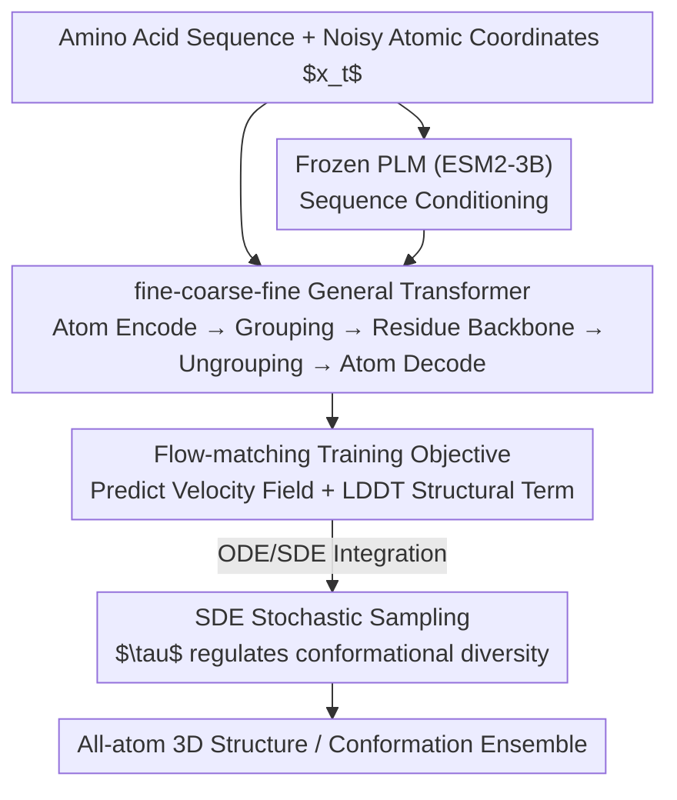

# SimpleFold: Folding Proteins is Simpler Than You Think

**Conference**: ICLR 2026  
**OpenReview**: [https://openreview.net/forum?id=0j0MmK7EMA](https://openreview.net/forum?id=0j0MmK7EMA)  
**Code**: None  
**Area**: Computational Biology / Protein Folding / Generative Modeling  
**Keywords**: Protein Folding, Flow Matching, General Transformer, Generative Models, Conformational Ensembles

## TL;DR
SimpleFold treats protein folding as a conditional generation task from "amino acid sequence to all-atom 3D structure." By utilizing only standard Transformer blocks with a flow-matching objective, it completely discards AlphaFold2’s MSA, pair representations, triangle updates, and equivariant modules. Scaled to 3B parameters on 9M distilled structures, it approaches SOTA on standard folding benchmarks and excels particularly in conformational ensemble generation.

## Background & Motivation
**Background**: Protein folding—predicting 3D atomic structures from amino acid sequences—is a classic challenge. Breakthroughs like AlphaFold2 and RoseTTAFold depend on "domain-specific" architectures meticulously designed for folding, such as Multiple Sequence Alignment (MSA) for evolutionary information, explicit pair representations, and computationally expensive triangle updates/attention. These modules "hard-code" human priors about the protein generation process into the network.

**Limitations of Prior Work**: This domain-specific architecture comes with two costs. First, high computational and engineering complexity; triangle updates have high-order complexity relative to sequence length, and MSA retrieval is slow and depends on homologous sequences, failing for "orphan proteins." Second, early folding models trained with deterministic reconstruction objectives produce only a single structure, failing to capture the multi-conformational nature of proteins as distributions of free-energy minima (ensembles). Subsequent diffusion or flow-based generative works still retain expensive components like pair representations and triangle updates.

**Key Challenge**: The folding field assumes domain-specific inductive biases are necessary for high performance. However, generative models in vision and language have proven that sufficiently large, general architectures can learn structure and symmetry directly from data without manually injecting priors. Are these complex designs truly essential for folding?

**Goal**: Construct a folding model **independent** of MSA, pair representations, triangle updates, and equivariant modules to verify if a pure general architecture plus scaling can achieve competitive performance.

**Key Insight**: Analogize folding to "Text-to-Image" generation, where amino acid sequences act as text prompts and the model outputs all-atom 3D coordinates. Given the success of DiT-style flow-matching in visual generation, a standard Transformer + flow-matching pipeline is adapted for folding.

**Core Idea**: Replace domain-specific architectures with a "General Transformer + Flow-Matching objective + large-scale distilled data" to solve protein folding, allowing the model to learn the laws of structural generation from data.

## Method

### Overall Architecture
SimpleFold defines folding as a conditional flow-matching process: starting from Gaussian noise, it integrates an ODE/SDE along a learned velocity field conditioned on the amino acid sequence to generate all-atom 3D coordinates (backbone and side chains). The entire network consists of "Standard Transformer blocks with adaptive layers," without pair representations or triangle updates.

The architecture follows a three-stage "fine-coarse-fine" pipeline: a lightweight **Atom Encoder** processes noisy coordinates at the atomic level (using local attention on neighboring residues); a **Grouping** operation pools atoms within a residue into a residue token; the **Residue Backbone** (containing most parameters) processes these tokens concatenated with frozen Protein Language Model (PLM) conditions; finally, **Ungrouping** broadcasts residue tokens back to atoms with residuals, and a lightweight **Atom Decoder** outputs the predicted velocity field. All three modules use the same general building block.

### Key Designs

**1. Reformulating folding as flow-matching conditional generation: Replacing deterministic reconstruction with velocity field regression**

To address the limitation where "deterministic reconstruction only outputs a single structure," SimpleFold adopts rectified flow (linear interpolation). Given a data sample $x \sim p_D$ and noise $\epsilon \sim \mathcal{N}(0, I)$, the interpolation is constructed as $x_t = tx + (1-t)\epsilon$ with target velocity $v_t = x - \epsilon$. The network $v_\theta(x_t, s, t)$ learns this velocity field conditioned on sequence $s$ via the core loss:

$$\ell_{\text{FM}} = \mathbb{E}_{x,s,\epsilon,t}\left[\tfrac{1}{N_a}\lVert v_\theta(x_t, s, t) - (x-\epsilon)\rVert^2\right]$$

where $N_a$ is the number of heavy atoms, and coordinates $x, \epsilon \in \mathbb{R}^{N_a \times 3}$ cover all atoms, not just the $C_\alpha$ backbone. To sharpen structural details, an LDDT loss is added: a clean structure is estimated via one-step Euler $\hat{x}(x_t) = x_t + (1-t)v_\theta(x_t, s, t)$, and the error of atom-pair distances $\sigma(\lVert\delta_{ij} - \hat{\delta}_{ij}^t\rVert)$ within a cutoff $C$ is constrained. The total loss is $\ell = \ell_{\text{FM}} + \alpha(t)\ell_{\text{LDDT}}$.

Additionally, **unconventional timestep resampling** is used: $p(t) = 0.98\,\text{LN}(0.8, 1.7) + 0.02\,\mathcal{U}(0, 1)$. Unlike image generation which weights the middle ($t\approx0.5$), this pushes weights **closer to the clean data** ($t\to1$). The motivation is that protein structures have a strong hierarchy (secondary structure → $C_\alpha$ backbone → side chains); oversampling near the data manifold forces the model to learn fine atomic positions like side chains.

**2. Fine-coarse-fine pure General Transformer architecture: Using local attention + grouping/ungrouping to handle protein hierarchy while discarding equivariant and pair modules**

To address the complexity of domain-specific architectures, SimpleFold uses a standard Transformer with adaptive layers (modulating scale/shift by timestep $t$, similar to DiT). The atom encoder and decoder are symmetric and lightweight, utilizing **local attention masks** where atom tokens only attend to neighboring residues to control atomic-level costs. The residue backbone carries the bulk of the parameters. Grouping (averaging atoms to residue tokens) and Ungrouping (broadcasting and using skip connections to distinguish atoms) naturally embed the "atom-residue" hierarchy into the flow, balancing precision and efficiency.

Critically, the model **only maintains single-sequence representations** with no pair representations, eliminating the need for triangle updates and making it far more efficient than ESMFold/AlphaFold2. Furthermore, it is a **non-equivariant** standard Transformer, relying on data scale rather than equivariant modules to learn structural symmetries. This directly challenges the assumption that folding "must be equivariant and use pair representations."

**3. Large-scale distilled data + Model scaling: Treating folding as a problem that truly benefits from scaling**

The benefits of a general architecture are realized only at scale. Data and parameters are scaled concurrently. Data sources include ~160K PDB experimental structures, ~270K structures distilled from AFDB SwissProt (filtered by pLDDT > 85, SD < 15), and 1.9M+ filtered AFESM cluster representatives. To train the 3B model, AFESM was expanded to AFESM-E—taking up to 10 structures with pLDDT > 80 per cluster—resulting in 8.6M distilled structures. The model family (100M to 3B) follows a two-stage pre-training (maximum data) and fine-tuning (high-quality data) strategy. Results show steady performance gains with increased compute, steps, and data—representing the first rigorously verified positive scaling behavior in the folding field.

**4. Langevin-style SDE stochastic sampling: Using a temperature knob to switch between "folding accuracy" and "conformational diversity"**

During inference, integration proceeds from noise $x_0 \sim \mathcal{N}(0, I)$ to $t=1$. SimpleFold uses the equivalence between velocity field $v_\theta$ and score $s_\theta = (tv_\theta - x_t)/(1-t)$ to integrate a Langevin-style SDE via Euler–Maruyama:

$$dx_t = v_\theta\, dt + \tfrac{1}{2}w(t)s_\theta\, dt + \sqrt{\tau \cdot w(t)}\, d\bar{W}_t$$

where $w(t) = \tfrac{2(1-t)}{t+\eta}$ (following the flow SNR, $\eta$ for stability) and $\tau$ controls stochastic intensity. This $\tau$ is an intuitive knob: low values (e.g., $\tau=0.01$) for single precise structures, and high values (e.g., $\tau=0.6$) for diverse conformational ensembles. This allows one model to perform both precise folding and ensemble prediction.

### Loss & Training
The total loss is $\ell = \ell_{\text{FM}} + \alpha(t)\ell_{\text{LDDT}}$, where $\alpha(t)$ varies with timestep and training stage. Pre-training uses large-scale mixed data, while fine-tuning uses high-quality data to improve fidelity. Timesteps are resampled via $p(t)=0.98\,\text{LN}(0.8,1.7)+0.02\,\mathcal{U}(0,1)$, biased toward clean data for side-chain learning.

## Key Experimental Results

### Main Results (Folding Benchmarks)
Comparison on CAMEO22 and CASP14, grouped by encoding (MSA/PLM) and objective (Regression/Generative). SimpleFold-3B is PLM-based, generative, and MSA-free.

| Benchmark | Model | TM-score ↑ | GDT-TS ↑ | RMSD ↓ |
|------|------|-----------|----------|--------|
| CAMEO22 | AlphaFold2 (MSA, Reg.) | 0.863 / 0.942 | 0.844 / 0.903 | 3.578 / 1.857 |
| CAMEO22 | ESMFold (PLM, Reg.) | 0.853 / 0.933 | 0.826 / 0.875 | 3.973 / 2.019 |
| CAMEO22 | ESMFlow (PLM, Gen.) | 0.818 / 0.893 | 0.774 / 0.832 | 4.528 / 2.693 |
| CAMEO22 | **Ours: SimpleFold-3B** | 0.837 / 0.916 | 0.802 / 0.867 | 4.225 / 2.175 |
| CASP14 | ESMFold (PLM, Reg.) | 0.701 / 0.792 | 0.622 / 0.711 | 8.679 / 4.016 |
| CASP14 | ESMFlow (PLM, Gen.) | 0.627 / 0.679 | 0.539 / 0.544 | 10.503 / 6.974 |
| CASP14 | **Ours: SimpleFold-3B** | 0.720 / 0.792 | 0.639 / 0.703 | 7.732 / 3.923 |

SimpleFold-3B achieves 95%+ of RoseTTAFold2/AlphaFold2 performance on CAMEO22 without triangle attention or MSA. On CASP14, it outperforms ESMFold and significantly exceeds the generative ESMFlow.

### Conformation Ensemble Generation (ATLAS MD)
With $\tau=0.6$, SimpleFold leads significantly without specific MD fine-tuning:

| Metric | AF2 | MSA-sub. | Ours | ESMFlow-MD (tuned) | AlphaFlow-MD (tuned) |
|------|-----|----------|-----------|------------------|--------------------|
| Pairwise RMSD r ↑ | 0.10 | 0.22 | **0.44** | 0.19 | 0.48 |
| Global RMSF r ↑ | 0.21 | 0.29 | **0.45** | 0.31 | 0.60 |
| MD PCA W2 ↓ | 1.99 | 2.23 | **1.62** | 1.51 | 1.52 |
| Exposed MI matrix ρ ↑ | 0.02 | 0.10 | **0.14** | 0.20 | 0.25 |

Untuned SimpleFold outperforms AF2 and MSA-subsampling across multiple metrics and approaches models specifically fine-tuned on MD data.

### Key Findings
- **Scaling yields higher returns on difficult tasks**: Moving from 100M to 3B parameters improves performance universally, with larger gains on the difficult CASP14 compared to CAMEO22. SimpleFold-100M is already efficient on consumer hardware like M2 Max Macbooks.
- **Data scaling is effective**: Testing 700M models across data sources shows that more unique structures in the mix lead to better final performance, supporting the claim that simplified folding models benefit from data growth.
- **Generative objectives are the root of ensemble capability**: Deterministic models (AF2) have a Pairwise RMSD r of only 0.10, while SimpleFold achieves 0.44 due to its training objective.
- **Two-state conformation prediction reaches SOTA**: SimpleFold significantly outperforms MSA-based AlphaFlow on Apo/Holo and matches or exceeds ESMFlow on Fold-switch.

## Highlights & Insights
- **Contribution through "Subtraction"**: The most striking aspect is that **removing** domain-specific modules (MSA/pair rep/triangle/equivariant) proves they are not necessary for high performance; general architecture + scaling can compensate. This counters existing dogma.
- **"Text-to-Image" analogy implementation**: Treating sequences as text prompts and folding as conditional generation allows visual/language toolchains (DiT + flow-matching) to be transferred almost directly.
- **A single $\tau$ knob unifying tasks**: Adjusting stochasticity $\tau$ allows one model to excel at both precise folding and diverse ensemble prediction.
- **Counter-intuitive timestep resampling**: Biasing sampling toward clean data to learn side-chain details is a protein-specific insight regarding structural hierarchy that could apply to other hierarchical generation tasks.

## Limitations & Future Work
- **Performance lag vs. top MSA models**: On CAMEO22, SimpleFold-3B still trails AF2/RoseTTAFold2, indicating evolutionary information remains valuable when abundant; the advantage lies in efficiency and ensembles.
- **3B scaling hasn't peaked**: The scaling curve is not yet saturated, suggesting better performance with more model/data, though training costs are already significant.
- **Dependence on distilled data**: Reliance on 2M-8.6M AFDB distilled structures means SimpleFold might inherit biases or upper-bound limits from AlphaFold.
- **Non-equivariance relies on data**: Abandoning equivariant modules means symmetry must be learned entirely from data; robustness in data-sparse regions or extrapolation to very long proteins/complexes requires further verification.

## Related Work & Insights
- **vs AlphaFold2 / ESMFold**: These use MSA or PLM to initialize pair representations and perform triangle/equivariant operations; SimpleFold uses single-sequence representations, no triangle updates, and a flow-matching objective for ensemble capability.
- **vs AlphaFlow / ESMFlow**: These fine-tune flow-matching on top of AF2/ESMFold; SimpleFold is trained from scratch with a pure Transformer and outperforms the PLM-based ESMFlow.
- **vs Proteina**: Proteina also simplifies architecture but retains pair representations and only models $C_\alpha$; SimpleFold omits pair representations and models all atoms.
- **vs AlphaFold3 / Boltz-1**: These use diffusion but retain domain-specific modules; SimpleFold replaces "hard-coded priors" with "general architecture + data learning."

## Rating
- Novelty: ⭐⭐⭐⭐⭐ First pure General Transformer + Flow-matching folding model.
- Experimental Thoroughness: ⭐⭐⭐⭐⭐ Comprehensive scaling family (100M–3B) and multi-benchmark evaluation.
- Writing Quality: ⭐⭐⭐⭐ Clear motivation and analogies, though some implementation details are in the appendix.
- Value: ⭐⭐⭐⭐⭐ Opens a new "simplified + scalable" design space for protein folding.

<!-- RELATED:START -->

## Related Papers

- [\[ICLR 2026\] One Protein Is All You Need](one_protein_is_all_you_need.md)
- [\[ICLR 2026\] Greater than the Sum of Its Parts: Building Substructure into Protein Encoding Models](greater_than_the_sum_of_its_parts_building_substructure_into_protein_encoding_mo.md)
- [\[ICLR 2026\] Property-Driven Protein Inverse Folding with Multi-Objective Preference Alignment](property-driven_protein_inverse_folding_with_multi-objective_preference_alignmen.md)
- [\[ICLR 2026\] VenusX: Unlocking Fine-Grained Functional Understanding of Proteins](venusx_unlocking_fine-grained_functional_understanding_of_proteins.md)
- [\[ICLR 2026\] A Diffusion Model to Shrink Proteins While Maintaining Their Function](a_diffusion_model_to_shrink_proteins_while_maintaining_their_function.md)

<!-- RELATED:END -->
