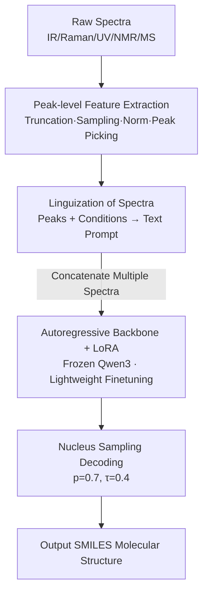

# SpectraLLM: Uncovering the Ability of LLMs for Molecular Structure Elucidation from Multi-Spectral Data

**Conference**: ICLR 2026  
**OpenReview**: [https://openreview.net/forum?id=J5XUzUW8o3](https://openreview.net/forum?id=J5XUzUW8o3)  
**Code**: https://github.com/OPilgrim/SpectraLLM  
**Area**: Computational Biology / AI for Science / LLM Reasoning  
**Keywords**: Molecular Structure Elucidation, Multi-modal Spectra, Large Language Models, LoRA, SMILES Generation

## TL;DR
SpectraLLM unifies heterogeneous spectral data (IR, Raman, UV-Vis, NMR, MS) into natural language prompts for a LoRA-finetuned Qwen3, enabling end-to-end autoregressive molecular SMILES generation. It significantly outperforms modality-specific baselines across four public benchmarks, demonstrating that predictive accuracy increases with the number of joint spectral inputs.

## Background & Motivation
**Background**: Molecular structure elucidation is a foundational task in chemistry, biology, and materials science, where molecular structures are inferred from spectral signals. Experts utilize a complementary suite of tools—IR (vibrational), Raman (scattering), UV-Vis (electronic transitions), NMR (nuclear magnetic resonance, including 1H/13C/HSQC), and MS (mass spectrometry)—to cross-validate and resolve structural ambiguities.

**Limitations of Prior Work**: Automated machine learning approaches exist (e.g., Spec2Mol using CNNs for MS/MS with RNNs for SMILES; subsequent Transformer decoders; DiffMS treating inverse MS as conditional generation). However, most models suffer from two main flaws: first, they are **locked to a single modality** (only MS or only IR); second, they have **rigid architectures**—spectra are treated as fixed numerical features fed into specialized encoders, making it nearly impossible to add new modalities or contextual information like experimental conditions without redesigning the network.

**Key Challenge**: Single-modality spectra are often informationally incomplete, as different structures may appear similar in one specific spectrum (spectral ambiguity). Fusing multimodal data within traditional "numerical feature + specialized encoder" paradigms is inherently inflexible, as each modality is encoded independently, making joint reasoning in a shared space difficult.

**Goal**: To build a unified architecture capable of processing single or arbitrary combinations of multiple spectra to directly generate molecular structures, ensuring that the addition of new modalities or conditions does not require architectural changes.

**Key Insight**: The authors realized that LLMs are naturally suited for processing heterogeneous symbolic information. By transcribing spectral peaks into **text** describing their physical attributes, vibrational frequencies (IR), chemical shifts (NMR), and fragmentation patterns (MS) all fall into the same semantic space. This allows the model to leverage its capabilities in symbolic reasoning, contextualization, and compositional generalization. Interestingly, the authors found that pure language-based pipelines outperformed Vision Language Models (VLMs) reading spectral plots, likely due to artifacts introduced by cross-modal encoding.

**Core Idea**: Recast the "spectrum-to-structure" problem as a "spectral text-to-SMILES text" translation task. A LoRA-finetuned, frozen LLM is used to unify all spectral modalities in a shared linguistic space for autoregressive structure generation.

## Method

### Overall Architecture
SpectraLLM aims to take a set of spectra $s=\{s_1,\dots,s_k\}$ corresponding to the same molecule and output its SMILES sequence $y=(y_1,\dots,y_T)$. The pipeline follows: "Raw Spectra → Peak-level Preprocessing → Translation to Natural Language Prompts → Frozen LLM + LoRA Autoregressive Generation." It operates purely end-to-end without modality-specific encoders, manual rules, or retrieval databases.

Formally, the task is modeled as an autoregressive conditional probability decomposition $p_\theta(y|s)=\prod_{t=1}^{T} p_\theta(y_t|s,y_{<t})$. The training objective is the negative log-likelihood (cross-entropy) of the reference SMILES: $L_{CE}=-\sum_i\sum_t \log p_\theta(y_t^{(i)}|s^{(i)},y_{<t}^{(i)})$. Multiple spectra are converted to text via a mapping function $\phi$ and then concatenated: $x=\phi(s_1)\oplus\phi(s_2)\oplus\cdots\oplus\phi(s_k)$. Adding a modality simply involves appending text to the prompt, which is the key to its flexibility.

### Key Designs

**1. Large-scale Multimodal Corpus Construction and Peak-level Preprocessing**
To perform joint reasoning, a large corpus where single molecules are paired with multiple spectra is required. The authors combined four sources: QM9s (~134k molecules with simulated IR/Raman/UV-Vis), Multimodal Spectroscopic Dataset (790k+ molecules from USPTO with simulated IR/MS and NMR), MassSpecGym (experimental high-res MS/MS for 29k compounds), and MassBank. The combined dataset exceeds 5.5 million spectra for over 940k unique molecules.

Preprocessing involves: Truncating IR/Raman to $500\text{–}4000\,\mathrm{cm}^{-1}$, UV-Vis to $1.0\text{–}15.0\,\mathrm{eV}$ with $0.02\,\mathrm{eV}$ intervals, and normalizing intensities. Local maxima and prominence thresholds are used to extract peaks. NMR data is cropped to significant intervals, and HSQC retains 2D proton-carbon correlations. MS m/z values are rounded to two decimals, and metadata like ionization mode and collision energy are preserved.

**2. Unified Language Representation of Spectra**
This is the core innovation. The mapping function $\phi$ converts peak arrays into natural language prompts $\phi(s_i)\in V^n$. These prompts **explicitly state the modality type** and report significant peaks. Vibrational frequencies, chemical shifts, and fragments are thus embedded in the same linguistic space. Experimental conditions (solvent, instrument, etc.) are included, allowing the model to interpret spectra "contextually"—a significant challenge for traditional numerical encoders.

**3. Parameter-Efficient Finetuning (LoRA) of Frozen LLMs**
Qwen3 is selected as the backbone. Instead of full-parameter finetuning, the **backbone weights are frozen**, and lightweight trainable low-rank adapters (LoRA) are inserted into each Transformer layer. This preserves the LLM's general linguistic capabilities (needed to "read" the prompts) while effectively aligning spectral patterns to chemically valid SMILES sequences.

**4. End-to-End Nucleus Sampling Decoding**
During inference, processed spectral text is fed into the finetuned model to generate candidate SMILES using nucleus sampling ($p=0.7$) with temperature scaling ($\tau=0.4$). This balanced approach avoids dependence on spectral database matching or manual rule-based heuristics.

## Key Experimental Results

### Main Results
On four benchmarks (QM9s, Multimodal Spectroscopic, MassSpecGym, MassBank), SpectraLLM was evaluated on validity, Tanimoto (ECFP4/MACCS), cosine similarity, MCES (Maximum Common Edge Substructure), and functional group recovery.

| Dataset / Modality | Method | Validity↑ | Tanimoto↑ | Cosine↑ | MCES↓ | Functional Groups↑ |
|------|------|------|------|------|------|------|
| QM9s / IR | Spectra2Structure | 100% | 0.0965 | 0.1695 | 10.11 | 0.4383 |
| QM9s / IR | **Ours** | 99.82% | **0.1921** | **0.3120** | **7.57** | **0.6599** |
| QM9s / Raman | Spectra2Structure | 100% | 0.1089 | 0.1901 | 9.42 | 0.4419 |
| QM9s / Raman | **Ours** | 99.08% | **0.2500** | **0.3786** | **6.41** | **0.7317** |
| Multimodal / NMR | NMR2Struct | 47.62% | 0.0433 | 0.1029 | 30.69 | 0.1718 |
| Multimodal / NMR | **Ours** | **98.92%** | **0.4151** | **0.5322** | **8.31** | **0.7209** |

In the NMR domain, the improvement was most dramatic—validity rose from 47.62% to ~99%, and MCES dropped from 30.69 to 8.31, stabilizing the decoding issues prevalent in traditional architectures.

### Ablation Study
Evaluation of multimodal fusion strategies using the same model:

| Input Combination | Tanimoto↑ | Cosine↑ | MCES↓ | Functional Groups↑ | Fraggle↑ |
|------|------|------|------|------|------|
| QM9s / Raman Single | 0.2500 | 0.3786 | 6.41 | 0.7317 | 0.2500 |
| QM9s / IR+Raman+UV-Vis Joint | **0.3355** | **0.4560** | **4.96** | **0.7934** | **0.4117** |
| Multimodal / NMR Joint(1H+13C+HSQC) | 0.4151 | 0.5322 | 8.31 | 0.7209 | 0.5862 |
| Multimodal / NMR+IR+MS Joint | **0.4875** | **0.5973** | **8.12** | **0.8103** | **0.6222** |

### Key Findings
- **More modalities lead to monotonic improvements**: On QM9s, combining IR+Raman+UV-Vis increased Tanimoto from 0.2500 to 0.3355. This suggests the model learns a shared latent space that captures spectral-invariant structural features.
- **Stronger Cross-domain Generalization**: Models trained on multiple spectra generalize better to unseen single-modality conditions than vice-versa.
- **Clear Complementarity**: Raman (sensitive to polarizability) can correct IR/UV-Vis errors in heteroaromatic rings; IR is indispensable for carbonyl positioning and branch configurations.
- **Decoding Sensitivity**: A temperature of $\tau=0.4$ provides the best balance between accuracy and diversity.

## Highlights & Insights
- **"Translating" heterogeneous spectra into language** is a brilliant move: continuous and discrete modalities no longer require different tensor shapes. Multimodal fusion reduces to "prompt concatenation," which is a paradigm applicable to any "heterogeneous signal → symbolic output" task.
- **VLM inferiority vs. Pure Language**: The finding that VLMs are worse than pure language pipelines indicates that "peak picking followed by linguization" is cleaner than end-to-end visual encoding for this specific task.
- **Leveraging LLM Priors**: Using LoRA with a frozen backbone allows the model to reuse general linguistic capabilities, which are useful for "understanding" spectral text reports.

## Limitations & Future Work
- Performance limits are constrained by **intrinsic spectral ambiguity** (molecules with different structures but similar spectra).
- Much of the training data relies on simulated spectra (QM9s/Multimodal); discrepancies with experimental spectra may affect real-world generalization.
- Absolute similarity metrics (Tanimoto < 0.5) suggest we are still far from perfect reconstruction.
- Future work could include explicit chemical constraints during decoding or Augmenting the model with Retrieval-Augmented Generation (RAG) to incorporate database knowledge.

## Related Work & Insights
- **vs. Spec2Mol / NMR2Struct**: Traditional pipelines use fixed numerical features and specialized encoders. SpectraLLM offers validity near 99% and flexible modality combinations but requires more training data and compute.
- **vs. DiffMS**: While DiffMS enhances diversity in MS, SpectraLLM unifies five modalities and outperforms it on most similarity metrics.
- **vs. VLM**: Directly reading spectral plots introduces encoding artifacts, while SpectraLLM's "linguization" approach is more robust.

## Rating
- Novelty: ⭐⭐⭐⭐⭐ 
- Experimental Thoroughness: ⭐⭐⭐⭐ 
- Writing Quality: ⭐⭐⭐⭐ 
- Value: ⭐⭐⭐⭐⭐ 

<!-- RELATED:START -->

## Related Papers

- [\[ICLR 2026\] Hierarchical Multi-Scale Molecular Conformer Generation](hierarchical_multi-scale_molecular_conformer_generation.md)
- [\[ICLR 2026\] Towards Knowledge-and-Data-Driven Organic Reaction Prediction: RAG-Enhanced and Reasoning-Powered Hybrid System with LLMs](towards_knowledgeanddatadriven_organic_reaction_prediction_ragenhanced_and_reaso.md)
- [\[NeurIPS 2025\] Atomic Diffusion Models for Small Molecule Structure Elucidation from NMR Spectra](../../NeurIPS2025/computational_biology/atomic_diffusion_models_for_small_molecule_structure_elucidation_from_nmr_spectr.md)
- [\[ICLR 2026\] Controllable Diffusion-based Generation for Multi-channel Biological Data](controllable_diffusion-based_generation_for_multi-channel_biological_data.md)
- [\[ICLR 2026\] MolEditRL: Structure-Preserving Molecular Editing via Discrete Diffusion and Reinforcement Learning](moleditrl_structure-preserving_molecular_editing_via_discrete_diffusion_and_rein.md)

<!-- RELATED:END -->
