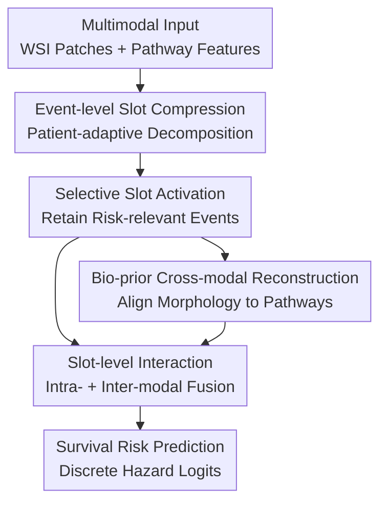

# Structural Prognostic Event Modeling for Multimodal Cancer Survival Analysis

**Conference**: ICLR 2026  
**OpenReview**: [https://openreview.net/forum?id=WqCRSn2WAY](https://openreview.net/forum?id=WqCRSn2WAY)  
**Paper**: [OpenReview](https://openreview.net/forum?id=WqCRSn2WAY)  
**Code**: https://github.com/zylvemvet/SlotSPE  
**Area**: Computational Biology / Multimodal Cancer Prognosis  
**Keywords**: Cancer Survival Analysis, Multimodal Learning, Pathomic Fusion, Slot Attention, Structural Prognostic Events  

## TL;DR
SlotSPE compresses pathology WSI and transcriptomic pathway features into a few patient-adaptive prognostic event slots. It utilizes selective activation, cross-modal reconstruction, and iterative slot interaction for survival risk prediction, achieving an average C-index of 0.721 across 10 TCGA cancer types and maintaining an overall performance of 0.704 even when genomic data is missing.

## Background & Motivation
**Background**: Cancer survival analysis aims to predict death risk or survival time from patient data, a practical task in precision oncology. Pathological Whole Slide Images (WSIs) reveal spatial structures like tissue morphology, tumor regions, and immune cell infiltration, while transcriptomic or pathway-level gene expressions reflect molecular drivers. Recent methods have integrated WSI and omics data through multimodal fusion using MIL, Transformers, co-attention, or prototype representations.

**Limitations of Prior Work**: There is a significant mismatch in data scale and semantic hierarchy. A WSI can contain a massive number of patches, and gene expression involves thousands of genes or hundreds of pathways. Performing full self-attention and cross-modal attention between patch-tokens and pathway-tokens approaches a complexity of $O((M_h+M_g)^2)$, where $M_h$ is the number of WSI patches and $M_g$ is the number of pathways. More importantly, prognosis is often driven by a few sparse, high-level structural events—such as the spatial proximity of tumor nests to lymphocytes or the co-activation of specific pathways—rather than all patches and genes.

**Key Challenge**: The inputs are high-dimensional, redundant, and highly variable observed signals, while labels are sparse patient-level survival outcomes. The model must extract a few key events from massive patches and pathways without fixing these events into a static set of prototypes shared across all patients. Prototype-based methods like PIBD and MMP fail to instantiate sparse events dynamically for each patient and often lose individualized correspondences between morphological patterns and molecular pathways.

**Goal**: Developed a multimodal survival prediction framework acting as a "prognostic event decomposer": First, compress WSI and omics inputs into a few interpretable event representations. Second, allow each patient to activate only the slots truly relevant to their risk. Third, utilize the biological prior that pathological morphology reflects molecular events to align omics slots with WSI patches. Fourth, ensure stable prediction in both multimodal and missing-genomics clinical scenarios.

**Key Insight**: This problem is analogous to factorial coding: complex observations generated by a combination of a few latent factors. Slot attention, typically used for object-centric representation learning, is suitable for competitively extracting limited latent slots from input tokens. Each slot is interpreted as a potential structural prognostic event, making slots direct carriers of event-level representation, selection, and cross-modal alignment.

**Core Idea**: Replace fixed prototypes with patient-adaptive slot attention to compress WSI and pathways into structured prognostic events. Through selective slot activation and biological-prior-driven cross-modal reconstruction, these events predict survival risk while explaining the correspondence between morphology and molecules.

## Method

### Overall Architecture
SlotSPE takes two bags as input for a patient: pathological WSI patch features $X_h \in \mathbb{R}^{M_h \times d}$ and pathway-level omics features $X_g \in \mathbb{R}^{M_g \times d}$. The model first uses slot attention to compress the large bags into a few histology slots and genomic slots. An MoE-style selective activation ensures only the most prognostic slots are retained for each patient. During training, slot reconstruction and cross-modal reconstruction are incorporated to prevent slot collapse and learn the structural prior that "pathological morphology predicts molecular pathways." Finally, intra-modal self-attention and inter-modal iterative cross-attention are performed at the slot level to generate patient representations for outputting hazard logits over discrete time intervals.

The key computational shift is that the model interacts on $S_h$ pathology slots and $S_g$ omics slots rather than $M_h+M_g$ raw tokens. The complexity is reduced to approximately $O(S_gM_g + S_hM_h + S_gM_h)$ for compression and $O((S_g+S_h)^2)$ for interactions. As $S_h, S_g \ll M_h, M_g$, it is more suitable for large-scale WSI scenarios than token-level Transformers.

### Key Designs
**1. Event-level Slot Compression: Factorizing High-dimensional Observations into Patient-adaptive Events**

SlotSPE processes the WSI patch bag and pathway bag separately. For any modality input $X \in \mathbb{R}^{M \times d}$, $S$ learnable slots $S^{(0)} \in \mathbb{R}^{S \times d_{slot}}$ are initialized, followed by iterative cross-attention-based routing. Input tokens are projected into keys/values, and slots into queries. Tokens are competitively explained by slots via softmax across the slot dimension. In iteration $\tau$, slot $k$ receives a weighted aggregation $u_k^{(\tau)}$ of all tokens, followed by an RNN-style update and MLP refinement to produce $s_k^{(\tau+1)}$. This allows slots to dynamically specialize within a patient (e.g., tumor regions vs. stroma), yielding instantiated event sets rather than global static prototypes.

**2. Selective Slot Activation: Risk Prediction via Differentiable Top-K Gating**

Not all potential events are relevant to every patient's prognosis. SlotSPE treats each slot as an expert: an MLP generates risk logits $\ell_k \in \mathbb{R}^{N_t}$ for each slot, and a gating function $\phi$ predicts a retention score $r_k=\phi(s_k)$. A differentiable $K$-hot mask $\hat{G}$ is obtained via Gumbel-Top-K and the Straight-Through estimator, retaining only the $K$ most critical slots. The selected slots are re-normalized by $w_k = \tilde{w}_k\hat{G}_k / \sum_s \tilde{w}_s\hat{G}_s$, where $\tilde{w}=softmax(r)$. This forces the model to learn which events truly differentiate risk under NLL survival loss.

**3. Biological-Prior-Driven Cross-modal Reconstruction: Predicting Molecular Events from Morphology**

Alignment is achieved by requiring genomic-derived slots to be reconstructible from WSI patches. Omics-derived initialization slots $S_g$ execute slot attention on pathology patches $X_h$ to obtain $\tilde{S}_{g\to h}$. A Transformer decoder then uses pathway position embeddings $Q_g$ and $\tilde{S}_{g\to h}$ to reconstruct raw pathway features $\tilde{X}_g$, constrained by MSE $\lVert \tilde{X}_g-X_g\rVert_2^2$. This forces the model to learn molecular-morphology mappings at the event level and enables robust inference when transcriptomic data is missing by completing pathway representations from WSIs.

**4. Slot-level Interaction and Reconstruction Regularization**

Intra-modal masked self-attention models dependencies within the top-K slots of each modality. Inter-modal iterative cross-attention uses slots to query each other across modalities, absorbing complementary information via multi-round RNN-style updates. To prevent slots from becoming "null slots" due to selective activation, reconstruction regularization is added: genomic slots reconstruct $X_g$ via a decoder, and pathology slots reconstruct patch-level embeddings using cosine similarity. This ensures that even slots not selected for risk prediction still explain residual input information.

### Loss & Training
Discrete-time survival modeling is employed. For patient $i$, the model predicts hazard $h_t^{(i)}=P(T=t\mid T\ge t,z^{(i)})$ for each interval $t$. The survival function is $S_t^{(i)}=\prod_{k=1}^{t}(1-h_k^{(i)})$. The training uses negative log-likelihood (NLL) survival loss:

$$
L_{surv}=-\sum_i \left[c^{(i)}\log S_{t^{(i)}}^{(i)}+(1-c^{(i)})\log S_{t^{(i)}-1}^{(i)}+(1-c^{(i)})\log h_{t^{(i)}}^{(i)}\right].
$$

The total objective is $L=L_{surv}+\lambda L_{recon}$, where $L_{recon}$ includes reconstructions for omics, pathology, and cross-modal branches. In the main experiments, $\lambda=0.1$. The WSI patches are extracted at 20× magnification using the UNI encoder. Survival time is discretized into 4 intervals. Slot attention is iterated $T=10$ times, and iterative cross-attention is performed $L=3$ times.

## Key Experimental Results

### Main Results
The model was evaluated on 10 TCGA cancer types for Disease-Specific Survival (DSS). SlotSPE achieved a superior average C-index compared to modality-specific and multimodal baselines.

| Setup | Strongest Baseline | Prev. SOTA C-index | SlotSPE Overall C-index | Gain |
|------|--------------|-----------------|--------------------------|------|
| Genomic Only | SNNTrans | 0.662 | 0.681 | +0.019 |
| Pathology Only | CLAM-MB | 0.682 | 0.690 | +0.008 |
| Multimodal (Default) | LD-CVAE / MOTCat | 0.692 | 0.721 | +0.029 |
| Missing Genomics | LD-CVAE | 0.688 | 0.704 | +0.016 |

SlotSPE ranked first or second in 8 out of 10 cancer types. Notably, in scenarios with missing genomics, it still outperformed the full-modality performance of several baseline models (e.g., LD-CVAE's full performance was 0.692). KM and RMST analyses further demonstrated its ability to significantly stratified high- and low-risk patients (e.g., in UCEC, log-rank $p=1.33\times10^{-7}$).

### Ablation Study
Ablation of key components confirms the necessity of each design:

| Configuration | Overall C-index | Description |
|------|-----------------|------|
| Baseline (Vanilla Slots) | 0.687 | Basic slots and fusion without selective activation or cross-modal reconstruction |
| w/o Selective Slot Attention | 0.699 | No sparse event selection; prediction diluted by non-discriminative slots |
| w/o Cross-modal Reconstruction | 0.696 | Weakened morphological-molecular correspondence |
| SlotSPE | 0.721 | Full model with all modules synergistic |

### Key Findings
- **Architecture Efficiency**: Performance gains are driven by architecture, not just the encoder. SlotSPE outperformed MCAT (0.713 vs 0.730) using the same ResNet50 encoder.
- **Robustness**: Cross-modal reconstruction enables inference when genomics are missing, maintaining a C-index of 0.704 compared to 0.619 for MOTCat under the same condition.
- **Clinical Interpretability**: Histology-derived and genomics-derived slots align with similar tissue regions. High-risk groups showed enrichment in fatty acid metabolism, while low-risk groups were associated with DNA repair and immune pathways.

## Highlights & Insights
- **Representation as Events**: Reinterprets token compression as "event modeling," providing a structured and interpretable intermediate layer for survival prediction.
- **Bio-prior Alignment**: Uses the biological relationship between morphology and molecules to constrain the latent space, providing both performance gains and missing-modality robustness.
- **Selective MoE-style Sparsity**: Learns to identify the primary risk factors for a specific patient by selecting relevant sparse events.
- **Generalizability**: The slot-based decomposition approach is potentially applicable to other multimodal medical tasks like radiology-pathology fusion.

## Limitations & Future Work
- **Biological Validation**: While slots are plausible as "prognostic events," further biological validation is required to equate specific slots to established clinical mechanisms.
- **Center Heterogeneity**: Testing on external multi-center cohorts is necessary to validate robustness against different scanners and staining procedures.
- **Reconstruction Overhead**: The reconstruction branches add computational cost during training, though they are partially optional during inference.
- **Uncertainty Estimation**: Future work could incorporate uncertainty into the reconstruction head to distinguish between more and less reliable morphological inferences.

## Related Work & Insights
- **Comparison with MCAT/MOTCat/SurvPath**: These methods rely on dense token-level co-attention, which is computationally expensive and lacks explicit event decomposition. SlotSPE provides a sparser, more structured interaction.
- **Comparison with PIBD/MMP**: Unlike global, relatively static prototypes, SlotSPE's slots are dynamically instantiated per patient, capturing individual morphological-molecular correspondences.
- **Comparison with LD-CVAE**: While LD-CVAE focuses on missing modalities via VAEs, SlotSPE provides superior absolute performance and more direct biological interpretability through morphological reconstruction of pathways.

## Rating
- **Novelty**: ⭐⭐⭐⭐☆
- **Experimental Thoroughness**: ⭐⭐⭐⭐⭐
- **Writing Quality**: ⭐⭐⭐⭐☆
- **Value**: ⭐⭐⭐⭐⭐

<!-- RELATED:START -->

## Related Papers

- [\[AAAI 2026\] ConSurv: Multimodal Continual Learning for Survival Analysis](../../AAAI2026/computational_biology/consurv_multimodal_continual_learning_for_survival_analysis.md)
- [\[ICLR 2026\] SAIR: Enabling Deep Learning for Protein-Ligand Interactions with a Synthetic Structural Dataset](sair_enabling_deep_learning_for_protein-ligand_interactions_with_a_synthetic_str.md)
- [\[ICLR 2026\] Animal behavioral analysis and neural encoding with transformer-based self-supervised pretraining](animal_behavioral_analysis_and_neural_encoding_with_transformer-based_self-super.md)
- [\[ICLR 2026\] AntigenLM: Structure-Aware DNA Language Modeling for Influenza](antigenlm_structure-aware_dna_language_modeling_for_influenza.md)
- [\[ICLR 2026\] CryoNet.Refine: A One-step Diffusion Model for Rapid Refinement of Structural Models with Cryo-EM Density Map Restraints](cryonetrefine_a_one-step_diffusion_model_for_rapid_refinement_of_structural_mode.md)

<!-- RELATED:END -->
