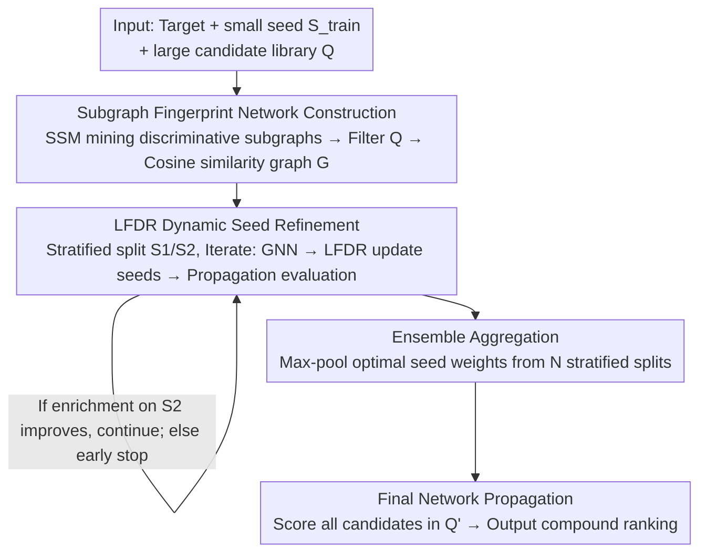

# SubDyve: Subgraph-Driven Dynamic Propagation for Virtual Screening Enhancement

**Conference**: ICLR 2026  
**OpenReview**: [https://openreview.net/forum?id=9vo3J4LwoT](https://openreview.net/forum?id=9vo3J4LwoT)  
**Area**: Computational Biology / Virtual Screening / Graph Network Propagation  
**Keywords**: Virtual Screening, Network Propagation, Discriminative Subgraph, Local False Discovery Rate, Seed Refinement

## TL;DR
SubDyve replaces general molecular fingerprints with "class-discriminative subgraphs" to construct similarity networks. It then utilizes an iterative seed refinement process guided by the local False Discovery Rate (LFDR) to safely expand a small set of known active molecules into a larger seed set. In low-label virtual screening scenarios with only dozens of active labels, SubDyve significantly boosts early enrichment metrics (BEDROC / EF1%) on DUD-E and the 10-million-scale ZINC library.

## Background & Motivation

**Background**: Virtual Screening (VS) aims to identify compounds active against a specific target from a synthesizable chemical space of approximately $10^{60}$ molecules. In early-stage drug discovery, most targets have only a few known active molecules; thus, "low-label" scenarios are the norm. Mainstream approaches fall into two categories: supervised GNN or 3D representation models trained on large-scale balanced datasets, and zero-shot screening using Foundation Models (FM) like ChemBERTa, MoLFormer, or AMOLE pre-trained on massive unlabeled molecular data.

**Limitations of Prior Work**: Supervised models suffer from severe overfitting in low-label settings. FM-based methods score each compound **independently**, failing to capture dependencies between molecules. An orthogonal approach is Network Propagation (NP), which treats known active molecules as seed nodes in a molecular similarity graph and diffuses activity signals along the network, ranking candidates based on global connectivity to the seed set. While NP naturally generalizes from few labels, it has two persistent issues: ① Similarity graphs are usually built on **general fingerprints** like ECFP, which fail to encode fine-grained substructures that distinguish activity from inactivity, thus smoothing over critical differences; ② NP inherits **topological bias** from the underlying graph, where nodes in dense clusters are ranked highly solely due to connectivity, leading to a surge in false positives when the seed set is small.

**Key Challenge**: The success of virtual screening often hinges on **subtle substructural differences** between related molecules. General fingerprints combined with naive propagation fail to discern these substructures and are easily biased by dense regions in the graph, leading to a collapse in precision under low-label conditions.

**Goal**: Under strictly low-label or zero-shot conditions, the objective is to enable the similarity network to encode **discriminative substructures** while **controllably suppressing false positives** during seed expansion.

**Key Insight**: The authors combine two strategies—using Supervised Subgraph Mining (SSM) to select class-discriminative subgraphs for network construction, and leveraging the statistical Local False Discovery Rate (LFDR) to provide a **provable FDR upper bound** for seed expansion. This transforms "uncontrolled" expansion into "expansion with a brake."

**Core Idea**: Replace general fingerprint graphs with discriminative subgraph fingerprint graphs and replace one-time propagation with LFDR-guided iterative seed refinement. This allows for the expansion of high-confidence candidates while keeping false positives within a controllable range.

## Method

### Overall Architecture
SubDyve addresses the ranking problem of identifying true active molecules from a vast candidate pool given a small set of known actives. Formally: given a candidate molecule set $Q$ and a known active subset $C \subset Q$ (where only a small seed subset $S_{\text{train}}$ is available), the goal is to assign a relevance score $r(q)$ to each $q \in Q$ such that active molecules are ranked at the top.

The pipeline consists of three sequential stages: **Graph Construction** (filtering candidates and building a subgraph fingerprint similarity network using discriminative subgraphs), **Seed Refinement** (iterative LFDR-guided seed refinement on the network to update seed weights), and **Ensemble Aggregation** (integrating optimal seed weights from $N$ stratified splits to perform a final propagation for scoring). The seed refinement stage includes an internal $M$-step iteration loop: "GNN training $\rightarrow$ LFDR seed update $\rightarrow$ propagation evaluation," with early stopping based on enrichment scores on a held-out set $S_2$.

### Key Designs

**1. Subgraph Fingerprint Network Construction: Making Similarity Aware of "Activity-Defining Substructures"**

This step addresses the first issue of NP—that general fingerprints (ECFP/MACCS) smooth over subtle activity-distinguishing substructures. Instead of off-the-shelf fingerprints, SubDyve uses a Supervised Subgraph Mining (SSM) algorithm to mine **discriminative subgraph patterns** ($SP$, referred to as DiSC: discriminative subgraph combination) from the labeled seed set $S_{\text{train}}$ and selected negative samples. Each molecule is encoded as a $d$-dimensional subgraph pattern fingerprint, where each dimension records the frequency of a specific discriminative subgraph combination.

Using these fingerprints, the authors first perform **candidate filtering**: only molecules hitting at least one subgraph in $SP$ are retained, resulting in a contracted candidate set $Q'$. On the 10-million ZINC library, this step reduces the pool to approximately 30,000, making subsequent propagation computationally feasible. A graph $G$ is then constructed on $Q'$ based on pairwise cosine similarity of subgraph fingerprints. Compared to general fingerprint graphs, edge weights here directly reflect "shared discriminative substructures," preventing closely related but differently active molecules from being incorrectly clustered.

**2. LFDR Dynamic Seed Refinement: Installing an "FDR Brake" on Seed Expansion**

This step addresses the second issue of NP—poor specificity and high false positives due to small seed sets. SubDyve **iteratively and controllably** expands the seed set. It first performs a stratified split of $S_{\text{train}}$ into disjoint sets $S_1$ and $S_2$: $S_1$ initializes the propagation, while $S_2$ serves as a held-out "supervisory ground truth" to guide refinement.

Each iteration involves three tasks. First, **GNN Training**: Graph $G$ is fed into a GNN to obtain logits $\hat l_i$ and embeddings $z_i$. The training objective is a composite loss $L_{\text{total}}=(1-\lambda_{\text{rank}})\cdot L_{\text{BCE}}+\lambda_{\text{rank}}\cdot L_{\text{RankNet}}+\lambda_{\text{contrast}}\cdot L_{\text{Contrast}}$. BCE is weighted by the low proportion of active molecules to combat class imbalance; RankNet ensures known actives in $S_2$ are ranked above unlabeled candidates; and Contrastive loss pulls each molecule closer to its most similar neighbors. GNN input features $x_i$ are concatenated vectors: seed weight $w_i$, propagation score $n_i^{\text{NP}}$, subgraph fingerprint $f_i^{\text{FP}}$, RBF similarity $s_i^{\text{PCA}}$ to $S_1$ in PCA space, a hybrid rank $h_i^{\text{hyb}}$ (average of PCA and NP ranks), and ChemBERTa semantic embeddings $e_i^{\text{PT-CB}}$.

Second, **LFDR-Guided Seed Update**, the statistical core of the method. Logits are standardized as $z_i=(\hat l_i-\mu)/\sigma$ to estimate the local false discovery rate $q_i=\text{LFDR}(z_i)$. Only molecules with $q_i$ below a threshold $\tau_{\text{FDR}}$ are retained as seeds, and weights are updated as follows:

$$S_{t+1}=\{i\in Q' : q_i<\tau_{\text{FDR}}\},\quad w_i^{(t+1)}=w_i^{(t)}+\beta\big(\sigma(z_i)-\pi_0\big)$$

where $\sigma(\cdot)$ is the sigmoid function, $\pi_0$ is the prior null hypothesis probability, and $\beta$ controls the update rate. Under a two-group mixture model $f(z)=\pi_0 f_0(z)+\pi_1 f_1(z)$, the authors demonstrate that this rule provides a **provable FDR upper bound** (Proposition 1: $\text{mFDR}(R_\alpha)\le\alpha$ and $\text{FDR}(R_\alpha)\le\alpha$). This theoretical guarantee differentiates it from naive NP by preventing false positives during expansion.

Third, **Propagation and Evaluation**: A new round of propagation is performed using updated weights, evaluated by early enrichment factors on $S_2$. Early stopping depends solely on enrichment scores to avoid leakage bias.

**3. Ensemble Aggregation and Final Ranking: Suppressing Randomness of Single Splits**

Single $S_1/S_2$ splits are unstable in low-label settings, and optimal seeds from one split might be due to chance. SubDyve performs $N$ stratified splits, repeating the refinement for each to obtain optimal seed weights. These $N$ sets of weights are aggregated via **element-wise max-pooling** into a final ensemble seed vector. Max-pooling implies that "if a molecule is identified as a high-confidence seed in any split, it is included in the final set," integrating discoveries from multiple splits without being penalized by misses in others. This ensemble vector drives the final full-library propagation to rank all molecules in $Q'$.

### Loss & Training
The core objective is the composite loss $L_{\text{total}}$ during GNN seed refinement: weighted BCE (imbalance) + RankNet pairwise ranking (boosting known actives) + Contrastive loss (similar molecules). $\lambda_{\text{rank}}$ and $\lambda_{\text{contrast}}$ are weighting hyperparameters. Key hyperparameters include the LFDR threshold $\tau_{\text{FDR}}$, update rate $\beta$, iteration steps $M$, and split count $N$. Early stopping relies on $S_2$ enrichment metrics rather than the training loss.

## Key Experimental Results

### Main Results

Zero-shot screening on ten DUD-E targets (threshold=0.9), reporting BEDROC ($\alpha=20$) and EF1% by average rank:

| Method | BEDROC Avg Rank | EF1% Avg Rank |
|------|------|------|
| **SubDyve (Ours)** | **1.6** | **1.6** |
| DrugCLIP | 2.4 | 2.0 |
| MoLFormer | 3.0 | 3.3 |
| CDPKit | 3.6 | 3.7 |
| AutoDock Vina | 4.0 | 4.0 |
| PharmacoMatch | 4.5 | 4.4 |

SubDyve shows significant advantages on specific targets: on EGFR and PLK1, which are conformationally flexible and have diverse binding modes, SubDyve reaches BEDROC scores of 86 and 85, respectively, significantly higher than MoLFormer (75/69). On ACES, which has a deep and narrow pocket, EF1% reaches 57.0, far exceeding DrugCLIP (32.4) and AutoDock Vina (13.87). The maximum improvement reported is +34.0 for BEDROC and +24.6 for EF1%. Even when the MMseqs2 homology similarity threshold is tightened to 0.5, SubDyve remains competitive or superior.

PU-style screening for CDK7 (1,468 actives + 10M ZINC, ~30k candidates after filtering):

| Method | BEDROC(%) | EF0.5% | EF1% |
|------|------|------|------|
| **SubDyve (Ours)** | **83.44** | **155.31** | **97.59** |
| rdkit + NP | 79.04 | 148.69 | 89.24 |
| GRAB (PU Learning) | 40.68 | 44.22 | 45.21 |
| PSICHIC | 9.37 | 4.07 | 6.92 |
| BIND (FM, 2.4M interactions) | – | – | – |

Compared to the PU learning baseline GRAB, EF1% is more than doubled (98.0 vs 45.2). Compared to PSICHIC, EF0.5% is 38x higher. BIND, an FM pre-trained on millions of interactions, fails (EF10%=0.04), likely due to distribution mismatch. SubDyve (1,088s) is 12.3x faster than AutoDock Vina and uses 15.06x less memory than DrugCLIP.

### Ablation Study

Ablation of Subgraph Fingerprints and LFDR on PU data (BEDROC / EF1%):

| Subgraph FP | LFDR | BEDROC | EF1% |
|------|------|------|------|
| ✗ | ✗ | 79.04 | 89.24 |
| ✓ | ✗ | 78.68 | 89.68 |
| ✗ | ✓ | 63.78 | 67.22 |
| ✓ | ✓ | **83.44** | **97.59** |

### Key Findings
- **Components are "complementary"**: Adding only subgraph fingerprints yields minimal gains. Adding only LFDR leads to a **performance drop** (BEDROC 79.04 $\rightarrow$ 63.78) because LFDR refinement quality depends on network reliability; refinement on a poor network amplifies errors. Peak performance requires both.
- **Robustness to small seed size**: SubDyve leads across seed sizes of 50, 150, and 250 without needing fingerprint adjustments (unlike general fingerprints where MACCS might suit 50 and Avalon 250).
- **LFDR threshold insensitivity**: Performance fluctuations across $\tau \in \{0.05, 0.10, 0.30, 0.50\}$ are within $\pm 0.5\%$, indicating robustness of the "brake" mechanism.
- **Case Study**: Hits retrieved by SubDyve cluster more tightly with seeds in the subgraph fingerprint space (PCA visualization), identifying related active molecules sharing functional substructures that RDKit fingerprints miss.

## Highlights & Insights
- **Introducing LFDR into Network Propagation**: Providing a **provable FDR upper bound** for seed expansion addresses the "uncontrolled expansion" problem, moving from empirical thresholding to theoretical control. This is transferable to any semi-supervised iterative pseudo-labeling scenario.
- **Dual-use Subgraph Fingerprints**: Using the same representation to filter candidates (reducing the 10M pool) and construct the similarity graph (encoding activity-sensitive substructures) elegantly solves both computational efficiency and precision.
- **Ensemble Max-Pooling**: Aggregating multiple stratified splits using "keep if high-confidence in any split" effectively suppresses high variance in low-label scenarios.

## Limitations & Future Work
- Strong dependence on SSM quality: The quality of mined discriminative subgraphs determines the upper bound for graph construction and refinement; negative sampling strategies may introduce bias.
- Subgraph filtering might exclude potential active molecules with novel scaffolds not covered in $S_{\text{train}}$.
- Theoretical FDR bounds rely on the two-group mixture model and $\pi_0$ estimation; guarantees may weaken if the actual distribution deviates significantly.
- Benchmarking is limited to DUD-E and CDK7; target diversity could be expanded. The multi-loop ensemble process is relatively complex with several hyperparameters.

## Related Work & Insights
- **vs. Foundation Models**: FMs score compounds independently; SubDyve explicitly models molecular relationships through NP. SubDyve outperforms BIND on CDK7, suggesting "relationship modeling + substructure awareness" is more effective than "large-scale pre-training" under distribution mismatch.
- **vs. Traditional NP**: While both use propagation, SubDyve replaces general fingerprints with discriminative subgraph fingerprints and one-time propagation with LFDR refinement, improving BEDROC from 79.04 to 83.44 on PU data.
- **vs. PU Learning (GRAB)**: GRAB uses soft labels; SubDyve's seed refinement also expands signals but with LFDR control, doubling EF1%.
- **vs. Substructure-Aware Graphs**: Methods like SSM/ACANet use subgraphs for property prediction; SubDyve systematically integrates these into VS graph construction and propagation.

## Rating
- Novelty: ⭐⭐⭐⭐⭐ The combination of discriminative subgraph construction and LFDR-controlled propagation is new in VS and solves two major NP pain points.
- Experimental Thoroughness: ⭐⭐⭐⭐⭐ Comprehensive coverage across multiple targets, 10M-scale libraries, seed sizes, and ablation studies.
- Writing Quality: ⭐⭐⭐⭐ Clear structure; however, some key details (feature encoding, LFDR algorithm) are moved to the appendix.
- Value: ⭐⭐⭐⭐⭐ Fast and memory-efficient, addressing a critical need in low-label virtual screening.

<!-- RELATED:START -->

## Related Papers

- [\[NeurIPS 2025\] AANet: Virtual Screening under Structural Uncertainty via Alignment and Aggregation](../../NeurIPS2025/computational_biology/aanet_virtual_screening_under_structural_uncertainty_via_alignment_and_aggregati.md)
- [\[AAAI 2026\] S2Drug: Bridging Protein Sequence and 3D Structure in Contrastive Representation Learning for Virtual Screening](../../AAAI2026/computational_biology/s2drug_bridging_protein_sequence_and_3d_structure_in_contrastive_representation_.md)
- [\[ICML 2026\] Advancing Ligand-based Virtual Screening and Molecular Generation with Pretrained Molecular Embedding Distance](../../ICML2026/computational_biology/advancing_ligand-based_virtual_screening_and_molecular_generation_with_pretraine.md)
- [\[ICLR 2026\] Drugging the Undruggable: Benchmarking and Modeling Fragment-Based Screening](drugging_the_undruggable_benchmarking_and_modeling_fragment-based_screening.md)
- [\[ICLR 2026\] WFR-FM: Simulation-Free Dynamic Unbalanced Optimal Transport](wfr-fm_simulation-free_dynamic_unbalanced_optimal_transport.md)

<!-- RELATED:END -->
