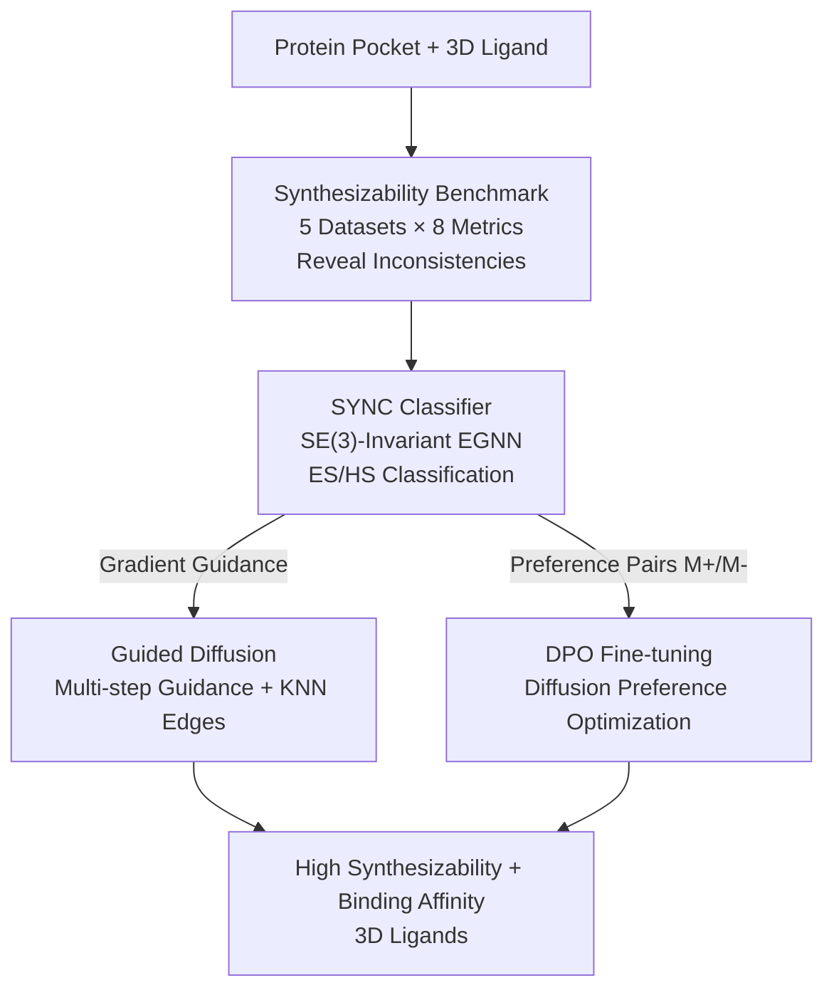

# SYNC: Measuring and Advancing Synthesizability in Structure-Based Drug Design

**Conference**: ICLR 2026  
**OpenReview**: [https://openreview.net/forum?id=y1tPw4Uuzg](https://openreview.net/forum?id=y1tPw4Uuzg)  
**Code**: https://github.com/XYxiyang/SYNC  
**Area**: Computational Biology / Drug Design / Diffusion Models  
**Keywords**: Structure-Based Drug Design, Synthesizability, SE(3)-Invariance, Guided Diffusion, DPO

## TL;DR
This paper benchmarks 8 classic synthesizability metrics across 11 SBDD models, revealing inconsistencies between these metrics. It proposes SYNC, a lightweight SE(3)-invariant synthesizability classifier, and integrates it as a plug-and-play module into the diffusion process (via Guided Diffusion and DPO), significantly improving the synthesizability of generated molecules with minimal loss in binding affinity.

## Background & Motivation
**Background**: Structure-Based Drug Design (SBDD) aims to generate 3D ligand molecules that bind with high affinity to a given protein pocket. Current mainstream approaches model this as a pocket-conditioned generation task, evolving from early autoregressive models to current diffusion models (e.g., TargetDiff, DecompDiff) that simultaneously denoise atom types, coordinates, and bonds. Performance on binding metrics like docking scores has steadily improved.

**Limitations of Prior Work**: High binding affinity is futile if molecules cannot be synthesized, which remains the primary obstacle for SBDD deployment. Evaluating synthesizability is difficult: (1) Rule-based methods (SA, SYBA) are fast but qualitative and generalize poorly; (2) Retrosynthesis-based methods (AizynthFinder) offer high true positive rates but are limited by precursor libraries and are extremely time-consuming (e.g., 170k seconds for 10k molecules); (3) Learning-based methods (RAScore, FSScore) are flexible but often use coarse-grained features and ignore 3D conformations.

**Key Challenge**: Benchmarking 8 metrics across 11 SBDD methods (Figure 1) reveals significant inconsistencies—for one molecule, 3 metrics might suggest poor synthesizability while 5 suggest the opposite. Furthermore, SBDD generates 3D conformations, yet existing metrics are mostly 1D/2D, discarding 3D information like bond angles and steric hindrance that directly determine synthetic feasibility.

**Goal**: (1) Establish a benchmark for fair comparison of synthesizability metrics; (2) Develop a fast, accurate, and differentiable synthesizability metric; (3) Enable SBDD models to directly generate synthesizable molecules without sacrificing binding affinity.

**Key Insight**: Synthesizability should be invariant to translation and rotation (SE(3)-invariant), and 3D features like bond angles are only visible in 3D space. A "3D-aware + SE(3)-invariant + differentiable + fast" classifier can serve as both a metric and a gradient guidance signal for diffusion.

**Core Idea**: Replace inconsistent traditional metrics with SYNC, an SE(3)-invariant EGNN classifier. Use SYNC as a plug-and-play module to inject synthesizability into generated molecules via Guided Diffusion and DPO.

## Method

### Overall Architecture
The work consists of three components: a **metric benchmark** evaluating the reliability of existing metrics, the **SYNC classifier** as an improved metric, and the integration of SYNC into diffusion via **Guided Diffusion** and **DPO** to inject synthesizability.

For the benchmark, due to the difficulty of labeling "unsynthesizable" molecules, "Easy-to-Synthesize (ES)" vs. "Hard-to-Synthesize (HS)" is used as a proxy. Enamine stock molecules represent ES, while four datasets with ES/HS labels (TS1/TS2/TS3 and Nonpher-Test) are used to evaluate 8 classic metrics, confirming their poor generalization.

SYNC takes 3D molecular conformations (coordinates $x_M$, types $v_M$, links $e_M$) as input, using $L$ layers of EGNN to extract SE(3)-invariant features, followed by a non-linear head for ES/HS classification. Being differentiable, it provides gradients for the diffusion process.

Two downstream paths use the SYNC signal $p_\phi(y\mid M)$: Guided Diffusion adds the gradient of SYNC relative to the predicted clean molecule $\hat M_0$ to the sampling process, while DPO uses Guided Diffusion to create preference pairs (ES $M^+$, HS $M^-$) to fine-tune the generative model.

### Key Designs

**1. ES/HS Synthesizability Benchmark: Using Easy/Hard as Proxies**
Since "unsynthesizable" molecules are hard to label, the authors use ES/HS as proxies. Marketable molecules are ES, while HS molecules are easier to collect than "absolutely unsynthesizable" ones. 5 datasets were constructed to compare 8 classic metrics. Results show rule-based methods fail on certain datasets (SA/SYBA accuracy drops to ~0.57 on TS3), and retrosynthesis methods like AizynthFinder suffer from false negatives and high computational costs.

**2. SYNC: SE(3)-Invariant 3D Classifier**
A good classifier must be **fast**, **differentiable**, **3D-aware** (for bond angles and steric hindrance), and **SE(3)-invariant**. SYNC uses an EGNN backbone: each layer updates coordinates and type features using $x_M^{(l)}, v_M^{(l)}, e_M$. The final prediction satisfies $\mathrm{SYNC}(T_g(x_M,v_M,e_M))=\mathrm{SYNC}(x_M,v_M,e_M)$ for any SE(3) transformation $T_g$. SYNC ranked 1st across 5 datasets (avg. rank 2.0), outperforming both traditional metrics and non-3D learning-based models.

**3. Guided Diffusion: SYNC Gradient Guidance and Connectivity**
SYNC acts as a pretrained classifier $p_\phi(y\mid M_t)$ in the denoising process: $p_{\theta,\phi}(M_{t-1}\mid M_t,P,y)\propto p_\theta(M_{t-1}\mid M_t,P)\,p_\phi(y\mid M_t)$. Since SYNC is trained on clean conformations, gradients are estimated using predicted clean molecules: $\nabla p_\phi(y\mid M_t)\approx\nabla p_\phi(y\mid \hat M_0)$.

Two engineering designs: (1) **Multi-step guidance**: To prevent atom displacement causing bond breakage (fragmentation), multiple guidance steps are applied within a single diffusion step, specifically during later stages when the molecular structure is more "solidified." (2) **KNN Edges**: SYNC requires bond connectivity, which diffusion lacks. During guidance, K-nearest neighbors are used to construct edges (filtered by a 2.0 Å threshold) to maintain atom-bond consistency.

**4. DPO with SYNC: Preference Optimization**
While guidance is training-free, DPO embeds synthesizability into model weights. Preference data is generated using the guidance mechanism: for the same pocket, gradient-ascent produces $M^+$ and gradient-descent produces $M^-$. The diffusion DPO loss is:

$$L_\theta=-\mathbb{E}_{(P,M^+,M^-)\sim D,\,t\sim U(0,T)}\log\sigma\Big(-\beta T\omega(\lambda_t)\big[L_D(M^+,p_\theta)-L_D(M^+,p_{\mathrm{ref}})-L_D(M^-,p_\theta)+L_D(M^-,p_{\mathrm{ref}})\big]\Big)$$

DPO is faster at inference as it avoids iterative gradient calculation.

### Loss & Training
SYNC was trained on a separate dataset of millions of 3D molecules. DPO fine-tuning utilized paired data from CrossDocked2020 (3,431 pairs for TargetDiff, 1,991 for DecompDiff), taking ~1800 iterations (≈2 epochs).

## Key Experimental Results

### Main Results
Synthesizability Benchmark (Classification Accuracy, higher is better; SYNC avg. rank 1st):

| Metric | TS1 | TS2 | TS3 | Nonpher-Test | Enamine | Avg Rank |
|------|------|------|------|------|------|------|
| AizynthFinder | 0.9535 | 0.7509 | 0.7511 | 0.5688 | 0.8061 | 6.0 |
| SA | 0.9853 | 0.8090 | 0.5667 | 0.8313 | 0.9844 | 4.0 |
| GASA | 0.9850 | 0.8010 | 0.7590 | 0.9188 | 0.9538 | 3.0 |
| **SYNC (Ours)** | **0.9911** | **0.8406** | 0.7564 | **0.9313** | 0.9520 | **2.0** |

Improvement on generated molecules (using TargetDiff backbone):

| Method | SYNC↑ | SA↑ | Aizynth↑ | SYBA↑ |
|------|------|------|------|------|
| TargetDiff (Base) | 0.1958 | 0.601 | 0.1124 | -41.991 |
| TargetDiff-Guide | 0.3977 (+100.3%) | 0.626 (+4.2%) | 0.1365 (+21.4%) | -33.123 (+21.1%) |
| TargetDiff-DPO | 0.2385 (+21.8%) | 0.626 (+4.2%) | 0.1283 (+14.1%) | -34.396 (+18.1%) |

Binding affinity (Vina Dock) remained stable or improved: TargetDiff -7.42 → Guide -7.75, DPO -7.58.

### Ablation Study

| Configuration | Key Observation |
|------|---------|
| SYNC (3D) | Top performer across most benchmarks (Full Model). |
| SYNC-1D-FPS / 1D-SMILES | Significant performance drop, highlighting 3D importance. |
| SYNC-Edge | Negligible difference; bond types are less critical than connectivity. |
| Guidance: Constant | Worse than vanilla; early-stage guidance is detrimental. |
| Guidance: Multi-Step | Significant synthesizability boost in late stages (Current Setup). |

### Key Findings
- **3D Information is Crucial**: Removing 3D features led to significant performance degradation, proving that bond angles and steric hindrance are vital.
- **Guidance Timing > Intensity**: Early guidance is harmful as atoms lack structure. Multi-step guidance in the later stages of diffusion is most effective.
- **Guide vs DPO Trade-off**: Guidance yields the highest metric improvement but is slower. DPO is faster at inference and generalizes across the model weights.
- **Backbone Complexity**: Backbones that generate larger, more complex molecules (like DecompDiff) show smaller relative gains.

## Highlights & Insights
- **Proxy Labels**: Using ES/HS rather than absolute synthesizability effectively sidesteps labeling bottlenecks.
- **Unified Classifier**: SYNC serves as a metric, a gradient signal, and a data generator simultaneously.
- **Generating Preference Data**: Using the classifier to generate its own training pairs for DPO overcomes the sparsity of "good" molecules in raw diffusion samples.
- **Synergy of Affinity and Synthesizability**: Improving synthesizability does not necessarily hurt affinity; stable, synthesizable conformations often fit protein pockets better.

## Limitations & Future Work
- **Lack of Wet-lab Validation**: SYNC remains a computational proxy; actual synthesis experiments are needed for validation.
- **Proxy Bias**: ES/HS labels from different sources might introduce dataset bias.
- **Hyperparameter Sensitivity**: Guidance is sensitive to intensity ($\lambda$) and timing, requiring careful tuning to avoid fragmented molecules.

## Related Work & Insights
- **Vs. Traditional Metrics**: SYNC offers a better trade-off between speed, accuracy, and differentiability than SA (rule-based), Aizynth (slow), or GASA (non-3D).
- **Vs. Building-block Methods**: While building-block methods ensure synthesizability via templates, they often output 2D structures needing 3D docking. SYNC operates directly in 3D SBDD.
- **Vs. ChemProjector**: Unlike projection methods that can drastically alter structure, SYNC uses local adjustments to improve synthesizability while preserving affinity.

## Rating
- Novelty: ⭐⭐⭐⭐ Integrated use of the classifier for guidance and DPO data generation is clever.
- Experimental Thoroughness: ⭐⭐⭐⭐ Cross-dataset benchmarking and multi-backbone validation are solid.
- Writing Quality: ⭐⭐⭐⭐ Clear structure and well-motivated sections.
- Value: ⭐⭐⭐⭐ Addresses the practical "synthesis gap" in SBDD with a plug-and-play solution.

<!-- RELATED:START -->

## Related Papers

- [\[ICML 2025\] Piloting Structure-Based Drug Design via Modality-Specific Optimal Schedule](../../ICML2025/computational_biology/piloting_structure-based_drug_design_via_modality-specific_optimal_schedule.md)
- [\[ICML 2026\] EvoEGF-Mol: Evolving Exponential Geodesic Flow for Structure-based Drug Design](../../ICML2026/computational_biology/evoegf-mol_evolving_exponential_geodesic_flow_for_structure-based_drug_design.md)
- [\[ICLR 2026\] I2Mole: Interaction-aware Invariant Molecular Learning for Generalizable Drug-Drug Interaction Prediction](i2mole_interaction-aware_invariant_molecular_learning_for_generalizable_property.md)
- [\[ICLR 2026\] A Joint Diffusion Model with Pre-Trained Priors for RNA Sequence-Structure Co-Design](a_joint_diffusion_model_with_pre-trained_priors_for_rna_sequence-structure_co-de.md)
- [\[ICLR 2026\] ProteinAE: Protein Diffusion Autoencoders for Structure Encoding](proteinae_protein_diffusion_autoencoders_for_structure_encoding.md)

<!-- RELATED:END -->
