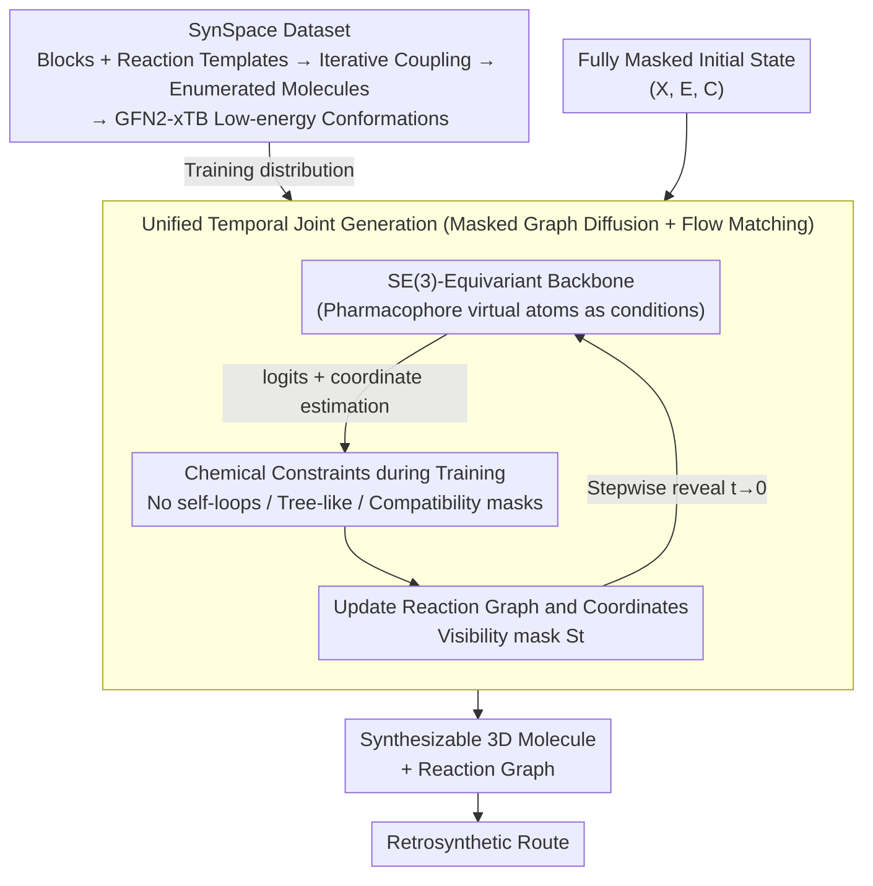

# SynCoGen: Synthesizable 3D Molecule Generation via Joint Reaction and Coordinate Modeling

**Conference**: ICLR 2026  
**arXiv**: [2507.11818](https://arxiv.org/abs/2507.11818)  
**Code**: [GitHub](https://github.com/andreirekesh/SynCoGen)  
**Area**: Medical Image/Molecule Generation  
**Keywords**: Synthesizable molecule generation, 3D conformation generation, masked graph diffusion, flow matching, drug discovery

## TL;DR

SynCoGen proposes a multimodal generation framework combining masked graph diffusion and flow matching. It simultaneously samples molecule building block reaction graphs and 3D atomic coordinates, ensuring synthetic accessibility while achieving high-quality 3D molecule generation.

## Background & Motivation

Generative molecular design is highly valuable for drug discovery, but a critical bottleneck is **synthetic accessibility**—generated molecules are often difficult to synthesize in the laboratory. Existing methods have two major deficiencies:

**Template-based synthesis methods** (e.g., GFlowNet, Transformer) can only generate 2D molecular graphs and cannot model 3D geometric structures, which are crucial for the chemical/biological properties of drugs.

**3D molecular generation methods** (e.g., SemlaFlow, MiDi) can generate atomic coordinates but do not consider synthetic pathways, leading to molecules that are often unsynthesizable.

SynCoGen aims to **bridge the gap between 3D molecule generation and synthetic feasibility**, simultaneously generating synthesizable molecular graphs and physically plausible 3D conformations within a unified framework.

## Method

### Overall Architecture

SynCoGen represents a molecule as a triplet $(X, E, C)$, where $X \in \{0,1\}^{N \times (|\mathcal{B}|+1)}$ encodes which building block is selected for each node (plus a mask state), $E \in \{0,1\}^{N \times N \times (|\mathcal{R}|V_{\max}^2+2)}$ encodes which reaction and reaction centers connect the nodes, and $C \in \mathbb{R}^{N \times M \times 3}$ represents the 3D coordinates of all atoms. The method operates in two layers: first, the "synthesizable molecule generation" constraint is baked into the training distribution using the SynSpace dataset; then, an SE(3)-equivariant backbone proceeds from a fully masked initial state to simultaneously denoise the discrete "assembly blueprint" $(X, E)$ and the continuous "geometric shape" $C$ along a single timeline. $(X, E)$ follows an absorbing (mask) diffusion process to gradually reveal the reaction graph, while $C$ follows visibility-aware flow matching to synchronize coordinate sculpting. In each step, chemical constraints are applied to the backbone's predicted logits to block illegal assemblies. At the end of sampling, a molecule is obtained that both provides a reversible synthetic route and possesses a physically plausible conformation.

### Key Designs

**1. SynSpace Dataset: Embedding "Synthesizability" into Training Data**

For the model to learn to generate only synthesizable molecules, the training set must consist exclusively of synthesizable molecules. The authors used a set of low-cost, high-yield building blocks and reaction templates to enumerate valid molecules via iterative coupling. Semi-empirical GFN2-xTB was then used to calculate multiple low-energy conformations for each molecule, forming SynSpace with 1.2 million synthesizable molecules and 7.5 million conformations. The core set uses 93 building blocks + 19 reaction templates (virtual synthetic space > 1 billion molecules), while the extended SynSpace-L scales to 378 building blocks + 26 reactions (> 1 trillion molecules). Selected reactions satisfy the condition that "all product atoms come from two reactants, each with at most one leaving group," allowing for clean determination of edges on the building block graph by preserving atom mapping. This locks the model into a "chemically synthesizable" subspace at the data distribution level rather than relying on post-hoc filtering.

**2. Unified Temporal Joint Generation of Masked Graph Diffusion + Flow Matching: Synchronized Blueprint and Coordinate Growth**

Discrete reaction graphs and continuous coordinates typically belong to two different generative paradigms; treating them separately can lead to coordinate-graph mismatches. SynCoGen shares a single time step $t$ for both: the reaction graph $(X, E)$ utilizes MDLM-style absorbing (masked) diffusion, while coordinates $C$ utilize Conditional Flow Matching (CFM), forming a multimodal sampling process with "coupled scheduling and dual resolution." Discrete diffusion handles building blocks/reactions, while continuous flow handles atomic coordinates. To address the variable number of atoms—where coordinates should not leak when a node is still masked—the authors introduced a **visibility mask** $S_t$. When a building block remains masked at step $t$, its atomic coordinates are hidden from the model, cleanly supporting variable atom counts.

**3. Chemical Constraints during Training: Blocking Invalid Molecules with Structural Masks**

Even with clean data, free sampling might assemble graphs that violate chemical rules. At each sampling step, the authors apply three types of hard constraints directly to the backbone's output logits: setting diagonals to zero to prohibit self-reactions (no self-loops); limiting $n$ building blocks to at most $n-1$ edges to ensure tree-like assembly; and compatibility masking—once a reaction edge is fixed, the candidate building blocks for connected nodes are pruned to those chemically compatible with that reaction. Ablations show these chemical-sensitive constraints are the largest contributors to validity metrics.

**4. SE(3)-Equivariant Backbone and Pharmacophore Virtual Atoms: Symmetric Geometry + Conditional Generation in One Network**

The backbone, based on an adapted SemlaFlow, predicts building block/reaction logits $L_t^X, L_t^E$ and regresses coordinate estimates $\hat{\tilde{C}}_0^t$ in a single forward pass while maintaining SE(3) equivariance. For pharmacophore-conditioned generation, target pharmacophores are treated as "virtual atoms" and integrated into the same equivariant-invariant dynamics module. This allows a single amortized model to cover unconditional generation, fragment linking, and pharmacophore-conditioned design without retraining for each target.

### Loss & Training

The total loss is a weighted sum of three terms: $\mathcal{L} = \mathcal{L}_{\text{graph}} + \mathcal{L}_{\text{MSE}} + \mathcal{L}_{\text{pair}}$. $\mathcal{L}_{\text{graph}}$ is the cross-entropy for $(X, E)$ supervising reaction graph recovery; $\mathcal{L}_{\text{MSE}}$ is the mean squared error for masked atomic coordinates driving flow matching; $\mathcal{L}_{\text{pair}}$ is a short-range pairwise distance regularization to ensure atom spacing stays within reasonable physical ranges.

## Key Experimental Results

### Main Results

| Method | Valid.↑ | AiZyn.↑ | Synth.↑ | GFN-FF↓ | xTB↓ | PB↑ | FCD↓ |
|------|---------|---------|---------|---------|------|-----|------|
| **Ours** | **96.7** | **50** | **72** | **3.01** | **-0.91** | **87.2** | **2.91** |
| SemlaFlow | 93.3 | 38 | 36 | 5.96 | -0.72 | 87.2 | 7.21 |
| JODO | 91.1 | 38 | 31 | 4.72 | -0.74 | 84.1 | 4.22 |
| EQGAT-diff | 85.9 | 37 | 24 | 4.89 | -0.73 | 78.9 | 6.75 |
| MiDi | 74.4 | 33 | 31 | 4.90 | -0.74 | 63.0 | 6.00 |

Ours significantly leads in synthetic accessibility (AiZyn +12, Synth +36 vs SemlaFlow) and conformational energy quality.

### Ablation Study

| Config | Key Metric | Description |
|------|---------|------|
| W/o chemical constraints | Valid. drops significantly | Chemical-sensitive graph constraints are the largest performance contributors |
| W/o self-conditioning | Valid./FCD drops | Self-conditioning contributes significantly to quality |
| SemlaFlow retrained on SynSpace | Valid. 72.0 | Proves performance gain comes from training strategy, not just data/architecture |
| SynSpace-L (Larger search space) | Maintains high quality | Scalable to larger building block vocabularies |

### Key Findings

- **Fragment Linking**: On 3 FDA-approved drug targets, Ours generated linkers with docking scores comparable to or better than native ligands, with retrosynthetic parsing rates of 58-79% (vs 0% for DiffLinker).
- **Pharmacophore-Conditioned Generation**: Across 10 PDB/LIT-PCBA targets, Ours achieved the best docking scores on 8/10, with retrosynthetic parsing rates 15-65% higher than all baselines.
- **Zero-shot Conformation Generation**: Given a random reaction graph, conformational generation quality close to ETKDG (RDKit) can be achieved.

## Highlights & Insights

1. **"Synthesis is Generation" Paradigm**: Synthetic constraints are directly encoded into the generation process rather than post-processed, fundamentally guaranteeing synthesizability.
2. **Multi-resolution Multimodal**: Discrete diffusion at the building block level and continuous flow matching at the atomic level—the "dual-resolution unified time" design is elegant.
3. **Zero-shot Conditional Design**: No need for retraining on specific targets; a single amortized model performs multiple drug design tasks.
4. **Data Contribution**: SynSpace, containing 1.2M+ synthesizable molecules and 7.5M+ conformations, is a significant open resource for the field.

## Limitations & Future Work

1. **Limited Building Block Vocabulary**: The current maximum vocabulary is 378 building blocks, limiting chemical diversity.
2. **No Macrocycle Support**: Training constraints limit edge counts, preventing the generation of macrocycles.
3. **Lack of Wet-lab Validation**: Generated molecules have not yet undergone physical synthesis and biological activity testing.
4. **Parsing Rate Upper Bound**: AiZynthFinder itself can only parse 50-70% of known drug molecules, potentially underestimating true synthetic feasibility.

## Related Work & Insights

- Compared to **CGFlow** (GFlowNet + Flow Matching), Ours does not requires retraining for each target or an external reward function.
- **SemlaFlow** provided the equestrian backbone architecture foundation but lacked synthetic constraints.
- **DiffLinker** is a dedicated fragment linking model, but generated molecules are completely unsynthesizable.
- Significant insight for computational chemistry and AI drug discovery: synthetic constraints can be "embedded" directly into generative models.

## Rating

- **Novelty**: ⭐⭐⭐⭐⭐ First joint generation framework modeling both synthetic paths and 3D structures.
- **Experimental Thoroughness**: ⭐⭐⭐⭐⭐ Extensive results across unconditional, fragment linking, and pharmacophore tasks; thorough ablation.
- **Writing Quality**: ⭐⭐⭐⭐ Overall clear, though the notation system is complex.
- **Value**: ⭐⭐⭐⭐⭐ Direct application value for AI-driven drug discovery; dataset and code are open source.

<!-- RELATED:START -->

## Related Papers

- [\[ICLR 2026\] FlexRibbon: Joint Sequence and Structure Pretraining for Protein Modeling](flexribbon_joint_sequence_and_structure_pretraining_for_protein_modeling.md)
- [\[ICML 2025\] Scalable Non-Equivariant 3D Molecule Generation via Rotational Alignment](../../ICML2025/computational_biology/scalable_non-equivariant_3d_molecule_generation_via_rotational_alignment.md)
- [\[AAAI 2026\] Apo2Mol: 3D Molecule Generation via Dynamic Pocket-Aware Diffusion Models](../../AAAI2026/computational_biology/apo2mol_3d_molecule_generation_via_dynamic_pocket-aware_diff.md)
- [\[ICLR 2026\] A Genetic Algorithm for Navigating Synthesizable Molecular Spaces](a_genetic_algorithm_for_navigating_synthesizable_molecular_spaces.md)
- [\[ICLR 2026\] GAGA: Gaussianity-Aware Gaussian Approximation for Efficient 3D Molecular Generation](gaga_gaussianity-aware_gaussian_approximation_for_efficient_3d_molecular_generat.md)

<!-- RELATED:END -->
