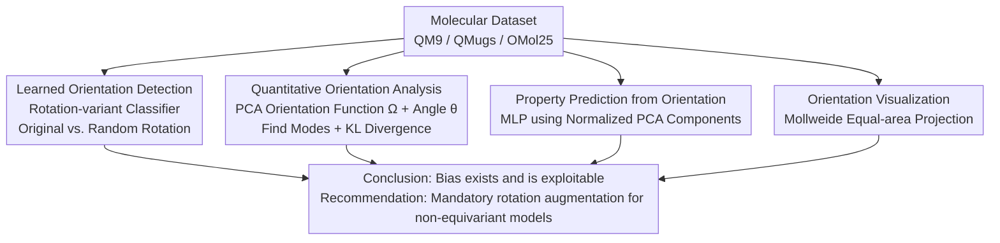

# Take Note: Your Molecular Dataset Is Probably Aligned

**Conference**: ICLR 2026  
**OpenReview**: [https://openreview.net/forum?id=zrCGvLOrTL](https://openreview.net/forum?id=zrCGvLOrTL)  
**Code**: https://github.com/sciai-lab/are-my-molecules-aligned  
**Area**: Geometric Deep Learning / Molecular Machine Learning  
**Keywords**: orientation bias, equivariance, data augmentation, QM9, SO(3)

## TL;DR
This paper systematically reveals and quantifies a pitfall often overlooked by machine learning newcomers in mainstream molecular datasets like QM9, QMugs, and OMol25: molecules are not randomly oriented. A simple classifier can distinguish original samples from randomly rotated ones with high accuracy, and neural networks can even predict molecular properties by "looking only at the orientation," reminding the community that the performance of non-equivariant models without rotation augmentation is artificially inflated by these spurious signals.

## Background & Motivation

**Background**: Molecular machine learning has progressed rapidly, largely relying on large-scale datasets such as QM9, QMugs, and OMol25. These datasets are batch-produced by chemoinformatics software (e.g., Corina for initial conformers + DFT relaxation), and these codes **typically do not randomize molecular poses/orientations** when generating 3D geometries. Meanwhile, a main theme in geometric deep learning is using SO(3)-equivariant networks to handle coordinate system arbitrariness—equivariant models give consistent predictions for inputs differing only by a rotation, making them naturally insensitive to molecular orientation.

**Limitations of Prior Work**: While strictly equivariant architectures are theoretically elegant, they rely on "non-standard building blocks" like tensor products, specialized normalization, and specific non-linearities, which are computationally expensive and difficult to tune. Consequently, there is a (re-)emerging trend to "relax equivariance constraints, learn approximate symmetries, or even actively break built-in equivariance" (AlphaFold 3 being a prominent example). However, once a model is no longer strictly equivariant, hidden orientation biases in datasets can quietly leak into the training process.

**Key Challenge**: The fact that molecular datasets **are not randomly oriented** is common knowledge among chemoinformatics experts but remains an invisible landmine for ML researchers. It is difficult to detect such bias by visual inspection of 3D structures (QMugs and OMol25 show almost no visible alignment), yet it exists and can be exploited as a "shortcut"—non-equivariant models might achieve artificially high metrics by relying on false orientation signals when tested without random rotations. Even for equivariant architectures, if the training target (e.g., electron density on a grid) is defined on a non-spherically symmetric Cartesian grid, orientation bias introduces systematic errors.

**Goal**: To transform the observation that "molecular datasets have orientation bias" from "expert tacit knowledge" into an **open, detectable, quantifiable, and visualizable** conclusion with empirical evidence of harm, while providing practical recommendations.

**Key Insight**: The authors extend the ideas of Lawrence et al. (2025a) beyond just "detecting bias." They introduce a complementary suite of methods to **systematically characterize the entire distribution of molecular orientations**, proving that bias exists, can be exploited by networks, and can be visualized intuitively.

**Core Idea**: The problem of "random orientation" is converted into three falsifiable experiments: (1) training a **rotation-variant** (rather than equivariant/invariant) classifier to distinguish "original vs. random rotation"; (2) defining orientation functions via PCA to statistically measure the non-uniformity of orientation distributions; (3) feeding only the "orientation" to an MLP to see if it can predict chemical properties—a three-pronged approach to confirm the existence and harm of bias.

## Method

### Overall Architecture

The paper does not propose a new architecture; its "method" is a **diagnostic toolbox for orientation bias in molecular datasets**. Given a molecular dataset (where each molecule is a set of atomic charges and coordinates $\{(z_a, x_a)\}$), the authors perform a four-step check: use a classifier to **prove bias is detectable**, use PCA + statistics to **quantify bias strength and identify common poses**, use an orientation-only regressor to **prove bias can be exploited**, and use projection visualization to **make it visible** that chemically similar molecules have similar orientations.

### Key Designs

**1. Learned Orientation Detection: Exposing Alignment with a "Rotation-Variant" Classifier**

If a dataset were truly orientation-invariant, the task of "distinguishing whether a molecule is in its original pose or randomly rotated" should be impossible (better than random guessing)—this is the classifier two-sample test. The authors train a simple three-layer Message Passing Neural Network (MPNN): for each sample, a rotation matrix is sampled uniformly from SO(3) with a certain probability, and the network learns to judge "is this molecule randomly rotated?" via binary cross-entropy. The message passing is $f_i^{(k+1)} = \bigoplus_{j\in\mathcal{N}(i)} \mathrm{MLP}(f_j^{(k)}, \mathrm{emb}(x_i-x_j))$, where both the **angular and radial parts** of the relative displacement vector $x_i-x_j$ are embedded using Gaussian basis functions. Crucially, this network is **neither rotation-equivariant nor invariant but intentionally designed to be "rotation-variant"** to perceive orientation.

To rule out trivial shortcuts (like sensing an edge aligned with an axis), the authors add Gaussian noise up to $\delta=1\,\text{Å}$ to atomic coordinates and a random "pre-rotation" up to $\alpha$ degrees before the test rotation. Even with $1\,\text{Å}$ perturbation (comparable to a C-C bond length of $1.5\,\text{Å}$) and $\alpha=90°$, the classifier maintains high accuracy on QM9/QMugs/OMol25, proving the "standard poses" are highly consistent and detectable.

**2. Quantitative Orientation Analysis: Compressing "Bias" into a Scalar via PCA**

To compare orientations, each molecule is assigned an orientation. A mapping $\Omega: M \to SO(3)$ is constructed to be **equivariant to rotation**: if $M$ is rotated by $R$, $\Omega(RM)=\Omega(M)R^T$. A simple implementation uses the **normalized principal components of centered atomic coordinates** as basis vectors $e_1, e_2, e_3$. To resolve sign ambiguity, the first two components are signed such that $\max_a |x_a\cdot e_i| = \max_a x_a\cdot e_i$, and the third is fixed by $\det=1$.

The "distance" between two rotations $R_1, R_2$ is defined as the angle of the relative rotation matrix: $\theta(R_1,R_2)=\arccos\!\big(\frac{\mathrm{tr}(R_1^T R_2)-1}{2}\big)$. For truly random orientations (Haar measure on SO(3)), the angular distance to any reference pose follows $p(\theta)=\frac{2}{\pi}\sin^2(\theta/2)$. The authors calculate the angular distance matrix $\Theta_{ij}$ and use Kernel Density Estimation to find the "most common pose." The **KL Divergence** between the empirical distribution and the uniform distribution is estimated using the Kozachenko-Leonenko estimator on the SO(3) manifold. Results: QM9 (0.90), QMugs (1.76), and OMol25 (1.04), where larger values indicate stronger non-uniformity.

**3. Property Prediction from Orientation: Proving Exploitability**

The authors design an extreme experiment: a simple MLP is given **only the normalized principal components** (orientation info, no chemical or geometric details) to regress molecular properties. It is trained on "standard poses" and "randomly rotated" versions. If orientation is truly random, principal components contain no chemical information, and the optimal model should only output the target mean. **Any testing MSE significantly lower than the "mean prediction" baseline proves the model learned non-trivial patterns from orientation.**

Results (Tab. 1) confirm this: MLPs trained on standard poses significantly outperform the mean baseline for properties like $\epsilon_{\text{LUMO}}$, ZPVE, $c_V$ (QM9), $U_{RT}$, $\hat V_{ee}$ (QMugs), and $E_{\text{tot}}$ (OMol25). Models trained on randomly rotated versions collapse to the mean baseline, proving that chemically similar molecules have similar default orientations.

**4. Orientation Visualization: Making "Chemical Similarity $\to$ Orientation Similarity" Visible**

To make the distribution intuitive, the three principal components $e_1, e_2, e_3\in S^2$ are mapped to 2D using the **equal-area Mollweide projection**, colored blue/yellow/magenta. Truly uniform distributions appear uniform on this projection; any clustering indicates bias. Visualization shows QMugs and OMol25 axes align with standard Cartesian coordinates. Overlaying chemical properties as heatmaps reveals correlations between orientation and properties.

### Loss & Training
The detector uses binary cross-entropy. The regression tasks use MSE loss, averaged over 5 runs. The MPNN uses a $10\,\text{Å}$ radial cutoff.

## Key Experimental Results

### Main Results: Predicting Properties via Orientation (Excerpt from Tab. 1)
"MSE of mean" is the theoretical baseline for predicting only the target mean. "MSE of MLP" uses only normalized principal components.

| Dataset | Property | Random Rotation | Mean Baseline MSE | MLP MSE (Test) |
|--------|------|----------|--------------|------------------|
| QM9 | $\epsilon_{\text{LUMO}}$ [eV] | No | 1.6355 | **1.4237 ± 0.0048** |
| QM9 | $\epsilon_{\text{LUMO}}$ [eV] | Yes | 1.6355 | 1.6367 ± 0.0001 |
| QM9 | ZPVE [eV] | No | 0.8107 | **0.6204 ± 0.0011** |
| QM9 | $c_V$ | No | 16.169 | **13.814 ± 0.083** |
| QMugs | $U_{RT}$ [Eh] | No | 890.54 | **843.48 ± 0.09** |
| OMol25 | $E_{\text{tot}}$ [eV] | No | $14394.3\times10^6$ | $\mathbf{(13689.1\pm1.7)\times10^6}$ |

### Orientation Non-uniformity (KL Divergence Estimates)

| Dataset | Est. KL Divergence (Higher = More Biased) |
|--------|------------------------------|
| QMugs | 1.76 |
| OMol25 | 1.04 |
| QM9 | 0.90 |

OMol25 subsets vary greatly: GEOM (5.613) and ANI-2X (4.328) are strongly aligned, while SPICE2 (0.005) and Biomolecules (0.070) are nearly uniform.

### Key Findings
- **Robustness to Perturbation**: The detector distinguishes original vs. rotated samples even with $1\,\text{Å}$ noise and $90°$ pre-rotation, showing bias is a distribution-level systematic effect, not a fragile "single-edge" shortcut.
- **Orientation Predicts Properties**: Predicting properties from orientation better than the mean baseline proves that non-equivariant models can exploit non-physical mappings to inflate performance.
- **Bias is Invisible**: QMugs/OMol25 look unaligned to the human eye, yet statistically they are. "Appearing unaligned" is not a valid reason to skip rotation augmentation.

## Highlights & Insights
- **Empirical Proof of Tacit Knowledge**: The paper uses the classifier two-sample test and orientation-only regression to bridge the gap between chemoinformatics intuition and ML empirical evidence.
- **Strategic use of Rotation-Variant Networks**: While the field seeks equivariance, this work uses variant networks as "probes" to expose symmetry breaking in data.
- **KL Divergence as a Scalar Metric**: Provides a way to audit geometric datasets (point clouds, proteins) and compare subsets quantitatively.
- **Baseline Argument**: The "optimal mean baseline" provides a clean "zero-information upper bound"—any model performing better must have learned non-trivial patterns.

## Limitations & Future Work
- The paper is **auditorial** rather than algorithmic; it recommends practices (rotation augmentation, reporting equivariance error) rather than proposing new architectures.
- Property regression uses a simple MLP. While Appendix E.5 tests Transformers, more work is needed to quantify the magnitude of impact on state-of-the-art practical models.
- PCA-based orientations can be unstable for spherically symmetric molecules or when eigenvalues are degenerate.

## Related Work & Insights
- **vs. Lawrence et al. (2025a)**: Lawrence first proposed the existence of bias; this work systemically characterizes the **entire distribution** (PCA, KL Divergence, Mollweide visualization), moving from "is there bias" to "how strong is it and how is it exploited."
- **vs. Strictly Equivariant Architectures**: Such models (e.g., MACE) are immune to orientation bias but are computationally expensive. This work cautions that the trend toward "relaxing equivariance" must be paired with rigorous rotation augmentation.
- **vs. Canonicalization (e.g., Baker et al. 2024)**: While bias is a risk, explicitly utilizing canonical orientations can be beneficial—they are two sides of the same coin.

## Rating
- Novelty: ⭐⭐⭐⭐ (Comprehensive evidence chain for a systematic pitfall).
- Experimental Thoroughness: ⭐⭐⭐⭐ (Cross-validation across multiple datasets and metrics).
- Writing Quality: ⭐⭐⭐⭐⭐ (Clear logic and motive).
- Value: ⭐⭐⭐⭐⭐ (Immediate impact on evaluation rigor in molecular ML).

<!-- RELATED:START -->

## Related Papers

- [\[ICLR 2026\] Align Your Structures: Generating Trajectories with Structure Pretraining for Molecular Dynamics](align_your_structures_generating_trajectories_with_structure_pretraining_for_mol.md)
- [\[ICLR 2026\] SAIR: Enabling Deep Learning for Protein-Ligand Interactions with a Synthetic Structural Dataset](sair_enabling_deep_learning_for_protein-ligand_interactions_with_a_synthetic_str.md)
- [\[ICLR 2026\] A Genetic Algorithm for Navigating Synthesizable Molecular Spaces](a_genetic_algorithm_for_navigating_synthesizable_molecular_spaces.md)
- [\[NeurIPS 2025\] FGBench: A Dataset and Benchmark for Molecular Property Reasoning at Functional Group-Level in Large Language Models](../../NeurIPS2025/computational_biology/fgbench_a_dataset_and_benchmark_for_molecular_property_reasoning_at_functional_g.md)
- [\[ICLR 2026\] Graph Diffusion Transformers are In-Context Molecular Designers](graph_diffusion_transformers_are_in-context_molecular_designers.md)

<!-- RELATED:END -->
