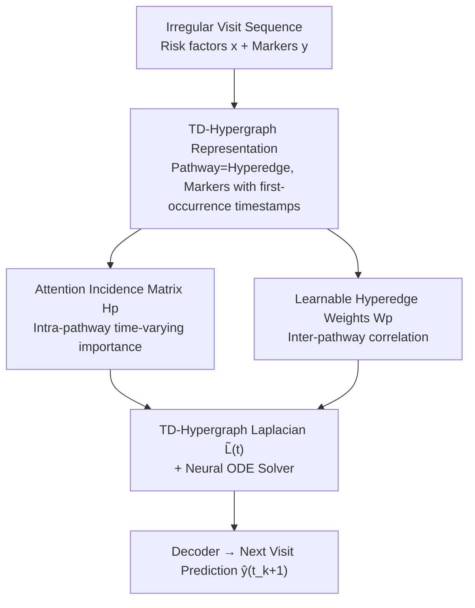

# Temporally Detailed Hypergraph Neural ODEs for Disease Progression Modeling

**Conference**: ICLR 2026  
**OpenReview**: [https://openreview.net/forum?id=3XRAkZtMPK](https://openreview.net/forum?id=3XRAkZtMPK)  
**Code**: Provided with supplementary materials (no independent repository link provided in the paper)  
**Area**: Computational Biology / Clinical Temporal Modeling / Graph Neural Networks  
**Keywords**: Disease progression modeling, Hypergraph neural ODE, EHR, continuous-time dynamics, patient subtyping

## TL;DR
The paper models clinically recognized disease progression pathways as "Temporally Detailed Hypergraphs" (TD-Hypergraphs) with per-marker timestamps. It utilizes a Neural ODE driven by a learnable Hypergraph Laplacian to characterize continuous-time progression dynamics under irregular visit data. On two real-world EHR datasets, it predicts complication markers for the next visit, with the F1 score significantly outperforming baselines such as LSTM, Transformer, Temporal Graph Networks, and Neural ODEs.

## Background & Motivation

**Background**: The goal of disease progression modeling is to characterize and predict how a patient's complications worsen over time from longitudinal Electronic Health Records (EHR). Each visit contains a set of risk factors (lab tests, medications, vital signs) and a set of complication markers (e.g., hypertension, atrial fibrillation, heart failure, cerebrovascular disease, stroke). The task is to predict the marker vector for the next visit. Existing methods fall into two categories: mechanistic models (incorporating pathophysiological processes, interpretable but difficult to adapt from real data) and data-driven models (HMM, LSTM, Transformer, Neural ODE, etc.).

**Limitations of Prior Work**: Existing approaches are unsatisfactory in three aspects. First, visit times are **irregularly sampled**, whereas underlying disease states evolve in continuous time, creating a natural mismatch for discrete sequence models (LSTM/Transformer). Second, many chronic diseases (Type 2 Diabetes, Alzheimer's, CKD, CVD) have **clinically recognized progression pathways** used to guide treatment, but structured integration of these pathways into data-driven models is difficult due to multi-step, high-order dependencies rather than simple pairwise relations. Third, strong **patient heterogeneity** exists: progression rates and paths vary (e.g., rapid renal injury vs. years of stability).

**Key Challenge**: Neural ODEs (e.g., NODE) that capture continuous-time dynamics do not utilize clinically validated progression pathways. Conversely, continuous-time GNNs representing pathways only model **pairwise relations** (a complication and its direct predecessor/successor), missing **high-order interactions** among all marker nodes on a pathway. Even when hypergraphs are used for high-order relations, existing temporal hypergraph networks only attach timestamps to the **entire hyperedge**, failing to characterize fine-grained temporal progression of "which marker appears when" within the hyperedge.

**Goal**: To construct a unified framework that encodes high-order dependencies of clinical pathways and adaptively learns individual patient dynamics over irregular continuous time.

**Key Insight**: Model a progression pathway (e.g., Hypertension → Atrial Fibrillation → Heart Failure) as a **single hyperedge** and attach a "first-occurrence timestamp" to each marker within the hyperedge, resulting in a Temporally Detailed Hypergraph. The continuous-time gradient of progression is governed by the Laplacian of this hypergraph.

**Core Idea**: Replace the fixed dynamics operator in a Neural ODE with a **learnable, time-adaptive TD-Hypergraph Laplacian** $\tilde{L}(t)$. An attention incidence matrix encodes time-varying marker importance "within pathways," while learnable hyperedge weights encode correlations "between pathways." Together, they inject clinical knowledge into continuous-time progression dynamics.

## Method

### Overall Architecture

The input to TD-HNODE consists of a patient's irregular visit sequence (risk factors $x(t_k)$ and complication markers $y(t_k)$ up to the current time) and a TD-Hypergraph $H_u$ constructed from clinical pathways. The output is a prediction of the complication marker vector $\hat{y}(t_{k+1})$ for the next visit at $t_{k+1}$. The framework is a "Hypergraph-driven Neural ODE": clinical pathways are represented as a hypergraph (nodes = markers, hyperedges = pathways). At each visit, risk factors and markers are embedded into node representations to construct a learnable TD-Hypergraph Laplacian $\tilde{L}(t)$. This operator, along with risk factors and the hidden state $S(t_k)$, is passed to a Neural ODE solver to integrate the hidden state from $t_k$ to $t_{k+1}$, followed by decoding the marker prediction.

The key to the hypergraph lies in how the Laplacian $\tilde{L}(t)$ is generated: it is assembled from an **Attention Incidence Matrix $H_p$** (capturing time-varying marker importance within pathways) and a **Learnable Hyperedge Weight Matrix $W_p$** (capturing correlations between pathways). Since both depend on the "most recent visit $t_{k_0}$" as a time anchor, $\tilde{L}$ evolves with disease progression, denoted as $\tilde{L}(t)$.

### Key Designs

**1. TD-Hypergraph Representation: Attaching First-occurrence Timestamps to Markers**

To address the issue that pathways involve multi-step high-order dependencies while standard graphs only model pairs, this paper represents each clinical pathway $p_j=\langle v_1^j, v_2^j, \dots\rangle$ as a **single hyperedge** $e_j$. This connects all marker nodes in the pathway simultaneously to express high-order dependencies. Different hyperedges naturally overlap through shared markers (e.g., multiple diabetes pathways starting from hypertension), facilitating the characterization of cross-pathway dependencies. **Temporal detailing** is introduced: each hyperedge records not just marker existence but the **timestamp when each marker was first observed**, $e_j^u=\{(v_1^j,t_1),(v_2^j,t_2),\dots,(v_{k}^j,t_k),(v_{k+1}^j,\infty),\dots\}$. Markers already appeared carry real timestamps, while those not yet appeared use a placeholder $\infty$. Since patients may not complete a full pathway, observed segments may be shorter than the clinical path. The essential difference from existing temporal hypergraphs is that the latter attach timestamps to the **entire hyperedge**, whereas TD-Hypergraphs push timestamps down to **each marker within a hyperedge**, allowing "occurred vs. potential" markers to be treated differently as the hypergraph evolves over time. Markers are assumed to be irreversible (0→1 or maintain), fitting the nature of chronic diseases.

**2. Attention Incidence Matrix $H_p$: Modeling Intra-pathway Time-varying Importance**

To overcome the limitation of static Laplacians treating all markers within a hyperedge equally (where incidence matrix $H$ is binary 0/1), this paper replaces it with an adaptive incidence matrix based on cross-attention. Using the marker $v_{k_0}$ from the most recent visit $t_{k_0}$ as the "current progression point," the pathway is split into an **Observed Set** $O_j=\{v_1,\dots,v_{k_0}\}$ and a **Potential Set** $F_j=\{v_{k_0+1},\dots\}$. Initial marker embeddings are combined with positional encodings using two schemes: observed markers use continuous time encoding $\phi_{\text{time}}(t_i)$, and future markers use discrete index encoding $\phi_{\text{idx}}(i)$. Cross-attention with softmax normalization is then performed using the current progression point as the query:

$$\alpha_j(i,k_0)=\begin{cases}\exp\!\big(q^{\text{time}}_{k_0}\!\cdot k^{\text{time}}_i/\sqrt{d}\big)/Z_O, & v_i\in O_j,\\[4pt]\exp\!\big(q^{\text{idx}}_{k_0}\!\cdot k^{\text{idx}}_i/\sqrt{d}\big)/Z_F, & v_i\in F_j.\end{cases}$$

The incidence matrix is modulated as $H_p(i,j)=H(i,j)\cdot\alpha_j(i,k_0)$. This matrix encodes structural relations, directionality, and time-aware importance, reflecting how a marker's role changes over time during progression.

**3. Learnable Hyperedge Weight Matrix $W_p$: Inferring Inter-pathway Correlation**

Traditional hypergraphs use a **fixed** diagonal weight matrix $W$, which cannot express varying correlations between pathways for individual patients. This paper learns hyperedge weights from data: self-attention is applied to each marker within its subset (Observed or Potential) to obtain context-enhanced representations $\tilde{v}_i$, which are then aggregated (e.g., mean pooling) into pathway-level representations $g_j$. All pathways are stacked into matrix $G\in\mathbb{R}^{m\times d}$ and projected to a latent space $\tilde{G}=GW_E$. Finally, the learnable hyperedge weight $W_p=\tilde{G}\tilde{G}^\top\in\mathbb{R}^{m\times m}$ is obtained via inner product. This captures data-driven similarity between all pairs of pathways, weighting more relevant progression paths—for instance, retinopathy and nephropathy pathways in diabetic patients often gain higher correlation weights as they frequently progress together.

**4. Knowledge-Injected Laplacian $\tilde{L}(t)$ + Neural ODE: Embedding Clinical Knowledge into Dynamics**

The adaptive incidence matrix $H_p$ and learnable weights $W_p$ are assembled into the knowledge-injected TD-Hypergraph Laplacian:

$$\tilde{L}=I-D_v^{-1/2}H_p W_p D_e^{-1}H_p^\top D_v^{-1/2}$$

Thus, $\tilde{L}$ encodes time-sensitive intra-pathway dependencies via $H_p$ and inter-pathway correlations via $W_p$. Since $H_p$ and $W_p$ depend on the latest visit $t_{k_0}$, $\tilde{L}$ varies over time and is denoted $\tilde{L}(t)$. Within each integration interval $[t_k, t_{k+1}]$, the Laplacian is constructed from all visits up to $t_k$ and remains fixed during the integration steps (as no new observations enter between visits). This results in the final progression model:

$$\frac{dS(t)}{dt}=-\tilde{L}(t)\big(S(t)+h(x(t))\big)\Theta$$

The negative sign simulates diffusion-like propagation between markers, and $h(x(t))$ maps risk factors to the latent space to inject initial patient conditions (hidden state initialized as $S(t_1)=0$). The solver (RK4) integrates the hidden state to the next visit for decoding, and the model is trained using Binary Cross-Entropy (BCE).

### Loss & Training
The objective is to minimize the BCE for the next visit markers: $\min_\Theta \frac{1}{N}\sum_u L(\hat{y}_u(t_{k+1}), y_u(t_{k+1}))$. The ODE solver uses RK4 with 10 default steps. Embedding dimension $d=128$. Due to extreme label imbalance and the necessity for early detection, evaluation **emphasizes Recall**.

## Key Experimental Results

### Main Results
Two real-world EHR datasets: University Hospital (2,415 patients) and the public MIMIC-IV (902 patient sequences), with 34 risk factors and 21 complication markers. The hypergraph was constructed from pathways validated by clinical collaborators.

| Dataset | Metric | TD-HNODE | Strongest Baseline (ContiFormer) | Gain |
|--------|------|----------|----------------------|------|
| University Hospital | Accuracy | **79.4** | 77.2 | +2.2 |
| University Hospital | F1-score | **20.4** | 16.7 | +3.7 |
| MIMIC-IV | Accuracy | **87.9** | 86.2 | +1.7 |
| MIMIC-IV | F1-score | **42.9** | 36.5 | +6.4 |
| MIMIC-IV | Recall | **85.7** | 82.1 (ContiFormer) / 62.3 (NODE) | +23.4 vs NODE |

TD-HNODE achieved the best results across all 4 metrics on both datasets. Compared to unstructured models like T-LSTM, NODE, and CODE-RNN, the Recall and F1 gains were particularly significant. Compared to the temporal graph network TGNE, Recall was higher by 3.9 and 12.9 points on the respective datasets, confirming that modeling high-order interactions with hyperedges is more expressive than pairwise edges.

### Ablation Study
Effectiveness of the two core components: Adaptive Incidence Matrix $H_p$ and Learnable Hyperedge Weights $W_p$ (F1, %).

| $H_p$ | $W_p$ | University Hospital F1 | MIMIC-IV F1 | Note |
|:---:|:---:|:---:|:---:|------|
| ✓ | ✓ | **20.4** | **42.9** | Full Model |
| ✗ | ✓ | 18.9 | 36.6 | w/o intra-pathway time-varying attention |
| ✓ | ✗ | 18.7 | 38.5 | w/o inter-pathway correlation modeling |
| ✗ | ✗ | 15.5 | 30.8 | Degraded to static hypergraph Laplacian |

### Key Findings
- **Components are mutually beneficial**: Adding only $H_p$ increased F1 from 15.5 to 18.7 on UH; adding only $W_p$ increased it to 18.9. Combining both reached 20.4. Performance dropped significantly on MIMIC-IV if either was removed, indicating they provide independent performance gains.
- **Hyperparameter Sensitivity**: Recall increased significantly when embedding dimensions went from 64 to 128, though gains plateaued or overfitted at higher dimensions. ODE steps showed underfitting at 4/6 steps and stabilized around 10.
- **Interpretability of Patient Subtypes**: t-SNE and hierarchical clustering on patient embeddings revealed three distinct clusters. Cluster 2 showed the fastest progression—compared to Cluster 3, cardiac revascularization occurred 9 months earlier, blindness 18 months earlier, and congestive heart failure 12 months earlier, proving the model captures progression heterogeneity.

## Highlights & Insights
- **"Timestamping at the marker level" is the differentiator**: Unlike existing temporal hypergraphs that timestamp hyperedges, this work timestamps each marker and uses the "current progression point" to split pathways into past/potential sets, treated via continuous vs. discrete encodings.
- **Laplacian as a Learnable ODE Operator**: Injecting knowledge into $\tilde{L}(t)$ to drive diffusion dynamics elegantly solves both graph structure and irregular time challenges with a single operator.
- **The $W_p=\tilde{G}\tilde{G}^\top$ Correlation Matrix** upgrades hyperedge weights from static diagonal matrices to data-driven pathway similarities, which are inherently interpretable.

## Limitations & Future Work
- The framework is **limited to known pathways**: the hypergraph is pre-constructed from validated paths, preventing the discovery of unknown trajectories. Future work may explore frequent pattern mining or Bayesian networks to infer unknown paths.
- Plans exist to introduce **causal inference** to evaluate the effects of complex treatment regimens, as the current model is purely predictive.
- Observation: Absolute Precision is low (14.3% on UH). While Recall is prioritized clinically, false positive costs remain a concern. Reliability on small dataset scales and high-quality pathway annotations needs further validation.

## Related Work & Insights
- **vs. Neural ODEs (NODE / CODE-RNN)**: These model continuous-time dynamics but ignore clinical pathway structures. This paper uses the Hypergraph Laplacian as an ODE operator to inject knowledge, leading to massive Recall/F1 leads.
- **vs. Continuous-time Graph Networks (TGNE / MegaCRN)**: These only model pairwise relations, missing high-order interactions. This work uses hyperedges to connect whole pathways.
- **vs. Temporal Hypergraph Networks (DHSL / HyperTime)**: These timestamp entire hyperedges and often use snapshots; this work lowers timestamps to the marker level for fine-grained progression.
- **vs. Sequence Models (T-LSTM / ContiFormer)**: These lack explicit pathway structures. This work combines high-order structures with continuous time, providing stable gains over ContiFormer.

## Rating
- **Novelty**: ⭐⭐⭐⭐⭐ Lowering timestamps to marker-level and using learnable Laplacians as ODE operators is a clean and rare combination.
- **Experimental Thoroughness**: ⭐⭐⭐⭐ Includes 2 datasets, 8 baselines, ablation, and subtyping studies, though data scale is somewhat small.
- **Writing Quality**: ⭐⭐⭐⭐⭐ Clear problem definitions, construction logic, and derivations.
- **Value**: ⭐⭐⭐⭐ High practical significance for disease progression and subtyping; the framework is transferable to other "prior pathway + irregular time" tasks.

<!-- RELATED:START -->

## Related Papers

- [\[ICLR 2026\] Automatic and Structure-Aware Sparsification of Hybrid Neural ODEs with Application to Glucose Prediction](automatic_and_structure-aware_sparsification_of_hybrid_neural_odes_with_applicat.md)
- [\[ICLR 2026\] Intrinsic Lorentz Neural Network](intrinsic_lorentz_neural_network.md)
- [\[ICML 2026\] Disentangling Latent Risk Pathways via Bayesian Hypergraph Inference](../../ICML2026/computational_biology/disentangling_latent_risk_pathways_via_bayesian_hypergraph_inference.md)
- [\[ICLR 2026\] AntigenLM: Structure-Aware DNA Language Modeling for Influenza](antigenlm_structure-aware_dna_language_modeling_for_influenza.md)
- [\[ICLR 2026\] Animal behavioral analysis and neural encoding with transformer-based self-supervised pretraining](animal_behavioral_analysis_and_neural_encoding_with_transformer-based_self-super.md)

<!-- RELATED:END -->
