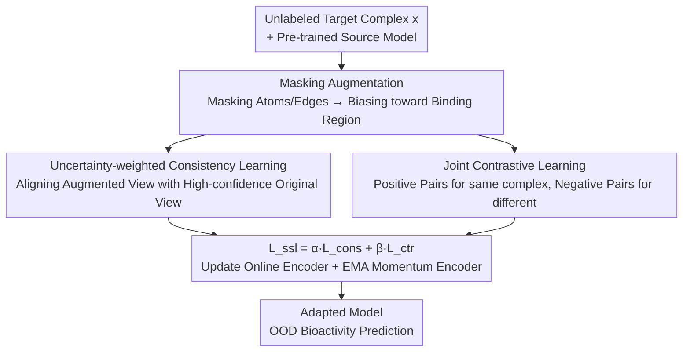

# Test-Time Adaptation without Source Data for Out-of-Domain Bioactivity Prediction

**Conference**: ICLR 2026  
**OpenReview**: [https://openreview.net/forum?id=0R6HLWvWYk](https://openreview.net/forum?id=0R6HLWvWYk)  
**Code**: None  
**Area**: Computational Biology / Drug Discovery / Test-Time Adaptation  
**Keywords**: Bioactivity Prediction, Out-of-Distribution Generalization, Test-Time Adaptation, Source-Free, Contrastive Learning

## TL;DR
Aiming at the realistic drug discovery scenario where source training data is inaccessible and only a pre-trained source model is available, this paper proposes TAB—a test-time adaptation framework. It employs uncertainty-weighted consistency learning to force model attention towards genuine binding regions and suppress reliance on shortcut substructures, combined with contrastive learning to prevent representation collapse. Consequently, it consistently outperforms SOTA methods that require source data under three types of distribution shifts: scaffold, protein, and assay.

## Background & Motivation

**Background**: Protein-ligand bioactivity prediction (predicting the extent to which a small molecule ligand modulates the function of a target protein, outputting affinity values such as IC50 / EC50 / Kd / Ki) is a cornerstone of modern drug discovery. In recent years, the mainstream approach has been to construct "pocket-ligand complexes" as graphs and model them using Graph Neural Networks (GNNs). Representative models like DTIGN and GIGN integrate the geometric interaction graphs of ligands and proteins to effectively characterize binding modes.

**Limitations of Prior Work**: These methods almost entirely rely on the assumption that training and testing data come from the same distribution. However, real-world scenarios are dynamic and uncertain—experimental conditions change, entirely new molecular scaffolds emerge, and previously unseen proteins are encountered (events like COVID-19 can even introduce completely new target proteins). Once encountering such Out-of-Distribution (OOD) situations, the generalization ability of models drops sharply.

**Key Challenge**: Existing methods such as invariant learning (IRM, GroupDRO) and graph generalization (EERM, SR-GNN) can mitigate OOD to some extent, but they **all require full access to source data**: either relying on source data to construct multiple training environments for learning invariance, generating augmented samples from source data, or analyzing source graph structures to find transferable subgraphs. In reality, source data is often **completely inaccessible** due to confidentiality, privacy, or intellectual property restrictions—one only has access to a pre-trained source model. This "Source-Free + OOD" setting has not been studied before.

**Key Insight**: The authors seize a biological fact—bioactivity is essentially determined by **specific binding interactions** within the pocket-ligand complex. Ligands cannot function independently; activity is highly dependent on the target protein and the geometric arrangement of the surrounding space. However, models easily develop "privileged substructure bias": certain ligand groups or protein surface patterns appear repeatedly in active complexes but are not causal determinants of binding (e.g., the large number of active ligands with methyl-substituted benzene rings in kinase inhibitor datasets). Models treat these **non-causal shortcuts** as predictive signals, leading to overfitting and cross-domain failure.

**Core Idea**: Since source data is unavailable, the model is updated directly at **test time** using self-supervised objectives—incorporating consistency learning to redirect attention from shortcut substructures to genuine binding regions, and contrastive learning to maintain representation discriminativeness. These two components complement each other, allowing the model to learn representations that are "sensitive to bioactivity and invariant to distribution shifts" without touching any source data.

## Method

### Overall Architecture

The input to TAB (Test-time Adaptation for Bioactivity prediction) is a batch of **unlabeled target domain** pocket-ligand complex graphs $x=(V,E)$ (where nodes are atoms and edges are chemical bonds), and the supervision signal is solely a pre-trained source model; the output is the bioactivity prediction on the target domain after adaptation. The entire adaptation process involves minimizing a self-supervised loss on the test set: $\min_\theta \mathbb{E}_{x\sim D_{test}}[L_{ssl}(f_\theta(x))]$, requiring no labels and no access to source samples, features, or statistics.

Specifically, for each complex, augmented views are first generated using "randomly masked atom and edge features." Since the binding interface occupies only a small portion of the entire complex, most masked content falls outside the binding site, thus naturally directing the mask's attention toward the binding region. Based on the augmented views, TAB simultaneously runs two self-supervised branches: the upper part is **uncertainty-weighted consistency learning**—aligning augmented views with "high-confidence original views" (minimizing cosine feature distance) and weighting each sample with confidence estimated via Monte-Carlo dropout; the lower part is **joint contrastive learning**—treating two augmented views of the same complex as positive pairs and different complexes as negative pairs, utilizing a MoCo-style momentum encoder and a memory queue to stabilize the feature space and expand negative samples. The total loss $L_{ssl}=\alpha L_{cons}+\beta L_{ctr}$ jointly optimizes the online encoder, while the momentum encoder is updated via EMA.

### Key Designs

**1. Source-Free Test-Time Adaptation Setting + Masking Augmentation: Turning "Inaccessible Source Data" into a Solvable Self-Supervised Problem**

The first contribution of this paper is actually the problem setting itself. Existing fine-tuning, continual learning, and domain adaptation all require at least target labels or a portion of the source data (see the comparison in Table 1 of the original paper), failing to cover the most restricted realistic scenario: "no source data, no target labels, only the source model." TAB formalizes the adaptation process as minimizing a self-supervised loss $\min_\theta \mathbb{E}_{x\sim D_{test}}[L_{ssl}(f_\theta(x))]$ on the unlabeled target set, thereby bypassing reliance on source data.

The fundamental operation supporting the entire self-supervision is the **random masking of atom and edge features** to generate augmented views $T(x)$. This step seems simple but precisely targets the "privileged substructure bias": because the binding interface accounts for a minimal proportion of the complex, the vast majority of masked elements are atoms and edges peripheral to the binding site. The model is forced not to rely on those recurring peripheral shortcut substructures; meanwhile, even if a few key atoms are occasionally masked, core geometric clues and binding poses remain largely intact, so attention is naturally drawn to the binding region without destroying key signals. Masking augmentation serves as both a means to eliminate shortcuts and a "perturbation source" shared by the subsequent consistency and contrastive branches.

**2. Uncertainty-weighted Consistency Learning: Aligning Augmented Views with Reliable Original Views, Letting Only Trustworthy Samples Speak**

The goal of the consistency branch is to "align the original representation $f^o_i=f_\theta(x_i)$ of each complex with its perturbed representation $f^a_i=f_\theta(T(x_i))$," implemented by minimizing the cosine distance $1-\frac{f^o_i\cdot f^a_i}{\|f^o_i\|\|f^a_i\|}$. The intuition is: if the model truly captures invariant features related to binding, the representation should not change significantly after masking out peripheral shortcut substructures; conversely, forcibly making the two consistent compels the model to abandon reliance on shortcuts and focus on the binding region.

However, not all samples are equally trustworthy, and blindly aligning noisy samples can destabilize adaptation. To address this, the authors introduce **uncertainty weighting**: using Monte-Carlo dropout to perform $K$ random forward passes on the original input, obtaining $K$ feature samples, calculating the mean $\mu_i$ and variance $\sigma^2_i=\frac{1}{K-1}\sum_k\|f^{(k)}_\theta(x_i)-\mu_i\|^2$, and defining confidence as the inverse of variance $w_i=1/(\sigma^2_i+\epsilon)$. Samples with small variance (stable prediction) receive higher weights, while samples with high variance (where the model is uncertain) are suppressed. The final consistency loss is:

$$L_{cons}=\frac{1}{B}\sum_{i=1}^{B} w_i\cdot\Big(1-\frac{f^o_i\cdot f^a_i}{\|f^o_i\|\|f^a_i\|}\Big).$$

This ensures that high-confidence samples dominate the adaptation direction, preventing errors from being amplified under the already difficult OOD conditions.

**3. Joint Contrastive Learning + Momentum Encoder: Preventing Representation Collapse from Consistency-Only Learning**

Consistency learning alone carries a risk: blindly pulling positive pairs closer can compress representations too tightly, causing features of different complexes to cluster together and lose discriminativeness (this is why "w/o contr" and "consistency only" occasionally perform worse than the baseline in the ablation). The contrastive branch compensates for this: it treats **two augmented views** $T(x)$ and $T(x)'$ of the same complex as positive pairs and different complexes as negative pairs. Following the instance-discrimination principle, it pulls positive pairs closer and pushes negative pairs apart, strengthening binding-related signals and sharpening the boundary between "activity-related vs. unrelated features."

To expand the diversity of negative samples, the authors maintain a FIFO **memory queue** $Q$ storing features from historical mini-batches. To stabilize the feature space and avoid drastic jitter in each batch, a MoCo-style **momentum encoder** $f_{\theta'}$ is used, with parameters initialized from source weights and updated via EMA $\theta'\leftarrow m\theta'+(1-m)\theta$. This provides stable features without requiring backpropagation for every batch. The contrastive loss is:

$$L_{ctr}=-\frac{1}{B}\sum_{i=1}^{B}\log\frac{\exp(f^a_i\cdot f^{a'}_i/\tau_c)}{\sum_{j=1}^{B}\exp(f^a_i\cdot f^{a'}_j/\tau_c)+\sum_{q=1}^{|Q|}\exp(f^a_i\cdot f^a_q/\tau_c)},$$

where $f^a$ is the online encoder output, $f^{a'}$ is the momentum encoder output (no gradient backpropagation and queued), and $\tau_c$ is the temperature. The consistency and contrastive branches are complementary—the former anchors attention to the binding region, while the latter ensures representations do not collapse. Only together do they yield "invariant yet discriminative" bioactivity-aware representations.

### Loss & Training
The total self-supervised loss is $L_{ssl}=\alpha L_{cons}+\beta L_{ctr}$, where $\alpha, \beta$ are the weights for consistency and contrastive learning, respectively. The process for each batch (see Algorithm 1 in the original paper): ① Obtain the original view $x^o=x$ and augmented view $x^a=T(x)$; ② Calculate confidence weights $w$ using MC dropout; ③ Compute the consistency loss $L_{cons}$; ④ Generate another augmented view $x^{a'}=T(x)'$ and compute the contrastive loss $L_{ctr}$; ⑤ Update the online encoder $\theta$ via gradient descent; ⑥ Update the momentum encoder $\theta'$ via EMA. All experiments use DTIGN as the backbone to ensure a fair comparison.

## Key Experimental Results

### Main Results

On DTIGN (scaffold OOD, averaged across 8 protein target subsets), TAB leads comprehensively. Note that all compared methods **require access to source data**, while TAB is source-free:

| Dataset | Metric | Ours (TAB) | Best Baseline | Gain |
|--------|------|---------|----------|------|
| DTIGN (avg) | RMSE ↓ | 1.157 | ~1.209 (ERM) | -4.3% |
| DTIGN (avg) | Pearson R ↑ | 0.448 | 0.414 (ERM) | +8.2% |
| DTIGN (avg) | Kendall τ ↑ | 0.312 | 0.295 | +5.8% |
| SIU 0.6 (Kd) | R / τ / ρ ↑ | 0.393 / 0.283 / 0.419 | 0.384 / 0.257 / 0.381 (SR-GNN) | Led comprehensively |
| SIU 0.6 (Ki) | R / τ / ρ ↑ | 0.141 / 0.115 / 0.175 | 0.123 / 0.060 / 0.091 (ERM) | Significant gain |
| DrugOOD (assay) | R / τ ↑ | 0.388 / 0.230 | 0.269 / 0.170 | Significant gain |
| DrugOOD (protein) | RMSE ↓ / R ↑ | 1.319 / 0.144 | 1.367 / 0.018 (ERM) | -3.5% / +0.126 |

An interesting phenomenon: on DTIGN, many OOD methods requiring source data (IRM, GroupDRO, Mixup-GNN, etc.) are **actually worse than the most basic ERM** on average, indicating that forcibly applying general OOD techniques to bioactivity prediction is ineffective; TAB, however, consistently surpasses ERM across almost all metrics. On the DrugOOD assay task, TAB's RMSE (1.552) is slightly higher than ERM's (1.506), but correlation metrics (R from 0.119→0.388) lead significantly—indicating TAB is better at predicting the **relative ranking** of activity, which is more valuable for drug screening.

### Ablation Study

Average of 8 DTIGN subsets ("w/o contr" removes contrastive, "w/o cons" removes consistency):

| Configuration | RMSE ↓ | R ↑ | τ ↑ | Description |
|------|--------|-----|-----|------|
| TAB (full) | 1.157 | 0.448 | 0.312 | Complete model, all optimal |
| w/o contrastive | 1.191 | 0.432 | 0.285 | Removing contrastive; τ drops most |
| w/o consistency | 1.201 | 0.427 | 0.295 | Removing consistency; R drops |
| ERM | 1.209 | 0.414 | 0.295 | No-adaptation baseline |

### Key Findings
- **Both modules are indispensable and complementary**: Using consistency or contrastive alone sometimes results in performance lower than the baseline—consistency alone causes over-compression and weak discriminability; contrastive alone might amplify spurious differences without regularization. Only combining them consistently exceeds ERM, validating the complementary design of "consistency-anchored binding regions + contrastive-anti-collapse."
- **TAB truly looks at the right places**: The authors conducted a case study using perturbation attribution (randomly removing ligand atoms, neighboring pocket atoms, and intermolecular edges to observe prediction change $\Delta\hat{y}=\hat{y}_{ori}-\hat{y}_{per}$). After disrupting binding interactions, activity should theoretically decrease, and $\Delta\hat{y}$ should be positive; however, the ERM baseline actually showed **negative values**, exposing its reliance on irrelevant sites. TAB consistently yielded significantly larger positive $\Delta\hat{y}$, proving it truly focuses on relevant binding regions.
- **Correlation metrics benefit the most**: TAB’s improvement in correlation-based ranking metrics like R / τ / ρ is usually much larger than its improvement in RMSE, suggesting that source-free TTA primarily fixes "cross-domain ranking disorder" rather than absolute value calibration.

## Highlights & Insights
- **Formalizing and providing the first solution for the "Source-Free" constraint**: Confidentiality, privacy, and IP are hard constraints in drug discovery. This paper is the first to study Source-Free OOD bioactivity prediction; the problem setting itself is highly valuable.
- **Masking augmentation serves two purposes**: Because the binding interface is small, random masking likely hits peripheral shortcut substructures. This both eliminates privileged substructure bias and naturally directs attention to the binding region without additional attention supervision. This "utilizing structural sparsity" idea is transferable to other structural biology tasks with small interface proportions.
- **Uncertainty weighting implemented via MC dropout**: Using the inverse of variance as confidence requires zero extra labels and zero source data to stabilize adaptation directions in high-noise OOD scenarios. It is a lightweight and reusable trick.
- **Adapting mature CV techniques (Consistency + MoCo) to molecular graph TTA**: The authors point out that molecular data has unique challenges (structural complexity, substructure bias, binding region modeling) and CV-based TTA cannot be directly copied. This work provides the first customized TTA for bioactivity.

## Limitations & Future Work
- **DrugOOD requires prior molecular docking**: DrugOOD only provides SMILES and amino acid sequences, lacking interaction information. The authors relied on molecular docking to complete 3D structures (details in the appendix). Docking quality directly affects results, and docking itself involves computational costs and errors.
- **RMSE slightly increases in assay tasks**: On the DrugOOD assay, RMSE is higher than ERM, indicating that TAB optimizes ranking consistency rather than absolute value calibration—if the downstream task requires precise activity values instead of ranking, current benefits are limited.
- **Backbone limitation**: All experiments were fixed on DTIGN as the backbone; the adaptation effectiveness of TAB on other types of backbones (e.g., sequence models, non-geometric GNNs) was not verified.
- **Hyperparameter dependence**: Hyperparameters such as the number of MC dropout passes $K$, temperature $\tau_c$, momentum $m$, and weights $\alpha/\beta$ all need tuning. The main text does not provide sensitivity analysis (it is in the appendix), and the cost of tuning when deploying on entirely new targets is unknown.

## Related Work & Insights
- **vs. Invariant Learning (IRM / GroupDRO / CIA-LRA / CaNet)**: They rely on source data to construct multiple training environments for learning invariance; TAB adapts source-freely at test time. In DTIGN experiments, these methods often fall behind ERM, whereas TAB consistently surpasses it.
- **vs. Graph OOD (EERM / SR-GNN)**: They analyze source graph structures to find transferable subgraphs, which still requires source data; TAB does not touch source graphs and forces the discovery of invariant substructures through masking + consistency.
- **vs. CV TTA (TTT / TTT-MAE / SHOT / MEMO)**: They target proxy tasks like rotation prediction, masked reconstruction, or pseudo-labeling for images; TAB designs specialized consistency + contrastive objectives for molecular graph binding region modeling and substructure bias, representing the first bioactivity TTA.
- **vs. Domain Adaptation (DANN / AFSE)**: Requires both source and target data to be present during training; TAB requires only target data.

## Rating
- Novelty: ⭐⭐⭐⭐⭐ First to propose and solve Source-Free OOD bioactivity prediction; both problem setting and methodology are novel.
- Experimental Thoroughness: ⭐⭐⭐⭐ Three benchmarks, three types of shifts (scaffold/protein/assay), and thorough ablation + attribution case studies; however, lacks hyperparameter sensitivity in the main text and is limited to a single backbone.
- Writing Quality: ⭐⭐⭐⭐ Motivation (binding regions vs. shortcut substructures) is clearly explained; Figures 1 and 2 are intuitive.
- Value: ⭐⭐⭐⭐⭐ Directly addresses the real-world pain point of non-shareable data in drug discovery; source-free adaptation has high practical utility.

<!-- RELATED:START -->

## Related Papers

- [\[ICLR 2026\] A New Paradigm for Genome-wide DNA Methylation Prediction Without Methylation Input](a_new_paradigm_for_genome-wide_dna_methylation_prediction_without_methylation_in.md)
- [\[AAAI 2026\] GP-MoLFormer-Sim: Test Time Molecular Optimization through Contextual Similarity Guidance](../../AAAI2026/computational_biology/gp-molformer-sim_test_time_molecular_optimization_through_contextual_similarity_.md)
- [\[ICLR 2026\] Adaptive Data-Knowledge Alignment in Genetic Perturbation Prediction](adaptive_data-knowledge_alignment_in_genetic_perturbation_prediction.md)
- [\[ICLR 2026\] Towards Knowledge-and-Data-Driven Organic Reaction Prediction: RAG-Enhanced and Reasoning-Powered Hybrid System with LLMs](towards_knowledgeanddatadriven_organic_reaction_prediction_ragenhanced_and_reaso.md)
- [\[ICLR 2026\] Refine Drugs, Don't Complete Them: Uniform-Source Discrete Flows for Fragment-Based Drug Discovery](refine_drugs_dont_complete_them_uniform-source_discrete_flows_for_fragment-based.md)

<!-- RELATED:END -->
