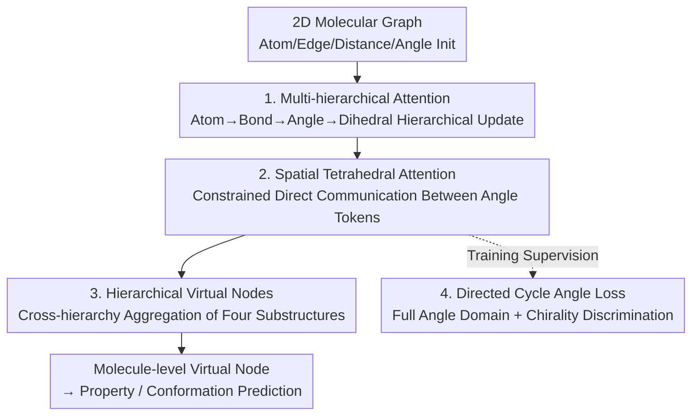

# TetraGT: Tetrahedral Geometry-Driven Explicit Token Interactions with Graph Transformer for Molecular Representation Learning

**Conference**: ICLR 2026  
**OpenReview**: [https://openreview.net/forum?id=3WVihbSW0i](https://openreview.net/forum?id=3WVihbSW0i)  
**Code**: https://github.com/xkxxfyf/TetraGT  
**Area**: Computational Biology / Molecular Representation Learning / Graph Transformer  
**Keywords**: Molecular Geometry, Bond and Dihedral Angles, Tetrahedral Attention, Chirality Discrimination, Conformation Pre-training

## TL;DR
TetraGT is the first to feed molecular bond and dihedral angles as explicit tokens into a Graph Transformer. It employs "Spatial Tetrahedral Attention" constrained by tetrahedral geometry to allow direct communication between angle tokens. Combined with a Directed Cycle Angle Loss for chirality discrimination and hierarchical virtual nodes, it achieves SOTA on quantum chemistry benchmarks like PCQM4Mv2 and OC20 IS2RE, while leading in downstream transfer tasks such as QM9, PDBBind, Peptides, and LIT-PCBA.

## Background & Motivation

**Background**: Predicting properties such as enzyme catalytic activity, drug activity, and molecular spectra inherently depends on the 3D conformation of molecules. Bond and dihedral angles are key geometric parameters determining conformational stability. Following the success of Transformers, Graph Transformers (Graphormer, EGT, Uni-Mol+, TGT, etc.) have become mainstream in molecular representation learning. Recent works have also introduced "triangular inequality constraints" for inter-atomic distance prediction, inspired by AlphaFold, proving that geometric constraints significantly improve property prediction accuracy.

**Limitations of Prior Work**: However, these methods only represent molecules as node tokens (atoms) and edge tokens (bonds). Higher-order geometric structures (bond angles, dihedral angles) are always **indirectly** calculated from combinations of atoms/edges. The authors summarize three specific issues: (1) **Lack of local chirality**—molecules with different chirality may produce nearly identical distance matrices, making it impossible to distinguish "left-handed" from "right-handed" molecules using distance alone; (2) **Implicit geometric modeling**—in models like QuinNet and ViSNet that introduce four-atom or five-atom interactions, higher-order information is still implicitly encoded through operations on atom tokens, allowing geometric parameter deviations to propagate and accumulate; (3) **Neglect of structural dependencies**—existing methods do not explicitly characterize the mutual constraints between bond angles and dihedral angles, which collectively determine the overall conformation.

**Key Challenge**: Once higher-order geometric information (angles) can only be expressed through atoms/edges, it both accumulates errors and loses physical constraints (such as the inequalities that face angles and dihedral angles in a tetrahedron must satisfy), leading to predicted conformations that are physically inconsistent and unable to distinguish chirality.

**Goal**: Elevate bond angles and dihedral angles to "first-class citizens" in the model—representing and interacting with them directly as structured tokens, while explicitly injecting tetrahedral geometric constraints and enabling the model to distinguish chirality and predict geometry from scratch (without relying on initial 3D coordinates from tools like RDKit).

**Key Insight**: The authors introduce "face angle and dihedral angle inequalities" from spatial geometry—any four non-coplanar atoms form a tetrahedron (a geometric 3-simplex, not necessarily an $sp^3$ center), and its face angles and dihedral angles must satisfy a set of inequalities and a conversion formula. This provides a physical prior for how angles should constrain each other.

**Core Idea**: Use "explicit angle tokens + attention constrained by tetrahedral inequalities" to replace "implicit angle derivation from atom combinations," allowing bond and dihedral angles to communicate directly and satisfy geometric consistency naturally.

## Method

### Overall Architecture
TetraGT is an $L$-layer Graph Transformer where each layer maintains embeddings for four types of tokens: nodes $h^{(l)}$ (atoms), edges $e^{(l)}$ (bonds), bond angles $b^{(l)}$, and dihedral angles $t^{(l)}$. The input consists of atom features $X\in\mathbb{R}^{n\times d_x}$, edge features $E$, a distance matrix $D$, all bond angles $B\in\mathbb{R}^{n_b}$, and dihedral angles $T\in\mathbb{R}^{n_t}$. Dihedral angle tokens are initialized using atom and edge representations superimposed with face angle information, thereby "embedding" tetrahedral constraints into the representation. Each layer operates in two steps: first, **Multi-hierarchical Attention** updates representations level-by-level along the "atom → bond → bond angle → dihedral angle" path, followed by **Spatial Tetrahedral Attention** allowing direct interaction between angle tokens sharing a vertex or a common face. **Hierarchical Virtual Nodes** are interspersed for cross-hierarchy global aggregation, and the **Directed Cycle Angle Loss** is used during training to supervise angles and distinguish chirality.

The overall methodology centers on making angle tokens explicit and enabling efficient communication under tetrahedral constraints. The pipeline is summarized in the following diagram:

### Key Designs

**1. Multi-hierarchical Attention: Making Angle Tokens Explicit and Hierarchical**

Addressing the limitation that higher-order geometry is indirectly derived from atom combinations, TetraGT updates four types of substructures as true tokens in every layer. Nodes and edges undergo standard attention, where node representations are aggregated via edge guidance, and edge representations are formed by Query-Key inner products plus the previous layer's edge representation:

$$h^{(l)} = \mathrm{softmax}\!\left(e^{(l)}\,\sigma(e^{(l-1)}W^{(l,e)}_G)\right)h^{(l-1)}W^{(l,h)}_V,\quad e^{(l)} = \frac{h^{(l-1)}W^{(l,h)}_Q\,(h^{(l-1)}W^{(l,h)}_K)^\top}{\sqrt{d_h}} + e^{(l-1)}W^{(l,e)}_E$$

Crucially, bond angles $b^{(l)}_{ijk}$ are updated by adding the **current layer** edge representations of its two constituent edges $(ij), (jk)$ to the previous layer's bond angle representation. Dihedral angles $t^{(l)}_{ijkl}$ are formed by adding representations of three consecutive edges $(ij), (jk), (kl)$. This allows representations to grow naturally along the "atom → bond → bond angle → dihedral angle" hierarchy. Higher-order structures gain independent, learnable carriers, preventing geometric deviations from propagating indirectly through atoms/edges.

**2. Spatial Tetrahedral Attention: Direct Communication Under Tetrahedral Constraints**

Explicit angle tokens are insufficient without a mechanism for interaction. However, modeling interactions between all triplets and quadruplets is computationally prohibitive ($O(N^3)$) and physically meaningless for many arbitrary substructures. TetraGT selectively models meaningful high-order interactions within **tetrahedral structures** and uses local sampling where each angle only attends to its $w$ nearest neighbors, reducing complexity to $O(wN^2)$.

For a central bond angle $(i,j,k)$, it performs "face interaction" with neighboring bond angles sharing vertex $k$:

$$o^f_{jki} = \sum_{l\in N_w(j)} a^f_{ijkl}\,v^f_{lkj},\quad a^f_{ijkl} = \mathrm{softmax}_l\!\left(\frac{q^f(b_{jki})\cdot p^f(t_{lkj})}{\sqrt{d}} + b^f(b_{lki})\right)\sigma\!\big(g^g(b_{lki})\big)$$

"Dihedral interactions" between dihedral angles are symmetric. Fixed sets of atoms naturally form common base bond angles, ensuring that interacting dihedral angles are not composed of unconnected atoms. The key innovation is that the bias term $b^f$ and gating term $g^f$ are scalars derived from angle embeddings, injecting Lemma 1's face angle inequalities ($\theta_1+\theta_2>\theta_3$, $\theta_1+\theta_2+\theta_3<2\pi$), dihedral angle inequalities, and face-dihedral conversion formulas:

$$\cos(t_{ijkl}) = \frac{\cos(b_{jki}) - \cos(b_{lki})\cos(b_{lkj})}{\sin(b_{lki})\sin(b_{lkj})}$$

Consequently, attention does not just learn similarity; it is "pushed" by geometric constraints toward physically valid interactions, ensuring global consistency and physical feasibility of predicted conformations. After interaction, angle representations are updated via residues and FFNs: $b^{(l)} = b^{(l-1)} + \mathrm{FFN}(o^f_{jki})$, $t^{(l)} = t^{(l-1)} + \mathrm{FFN}(o^d_{ijkl})$.

**3. Directed Cycle Angle Loss: Explicit Chirality Discrimination via Directionality**

Distance matrices cannot distinguish chirality—during chiral inversion, at least one angle changes from $\sigma$ to $2\pi-\sigma$ relative to a fixed reference, yet both values yield identical distance matrices. At the molecular periphery, distance differences caused by chirality are nearly invisible. Previous methods often restricted angles to $0$–$\pi$, effectively erasing chiral variations. TetraGT expands the angle prediction range to $(0, 2\pi)$ with a counter-clockwise orientation, accommodating all chiral states. Angles are discretized into bins, using a **Directed Cycle Angle (DCA) loss**:

$$\mathcal{L}_{\mathrm{DCA}} = \min\!\left(-\sum_{i=1}^{N} q_i\log(p_i),\; -\sum_{i=1}^{N} q_i\log(p_{(i+1)\bmod N})\right)$$

The cyclic minimum of adjacent bins accounts for boundary conditions: 359° and 1° are conceptually close but numerically distant; the cyclic structure avoids over-penalizing such "near-neighbor angles." By explicitly encoding directionality into angles, TetraGT is the first molecular representation method to achieve chirality awareness through angle modeling.

**4. Hierarchical Virtual Nodes: Alleviating Bottlenecks in Cross-Scale Information Compression**

Virtual nodes shorten information bottlenecks on graphs, but prior approaches either compressed all atom information into one node (losing structural detail) or added virtual nodes only at the atom level (insufficient for 3D interactions). TetraGT assigns a **dedicated virtual node to each type of substructure** (atom, edge, bond angle, dihedral angle), interacting with tokens of its type via appropriate mechanisms: FFN for atoms, triplet interaction for edges, and tetrahedral interaction for angles. Finally, a molecule-level virtual node connects these four substructure virtual nodes to serve as the final representation for property prediction, enabling multi-scale aggregation without mutual interference.

### Loss & Training
TetraGT's property prediction task follows a **three-stage** training process. ① **Conformation Prediction Stage**: Train a conformation predictor to predict all inter-atomic distances, bond angles, and dihedral angles from a 2D graph (optionally with RDKit distance estimates). Cross-entropy is used for distance and the DCA loss for angles. Following TGT, binned angles are predicted rather than continuous values due to dihedral instability. ② **Pre-training Stage**: Train the task predictor on noisy real 3D conformations. Distance/angle prediction serves as an auxiliary denoising task, trained via multi-task learning alongside the main pre-training target (e.g., HOMO-LUMO gap) to ensure robustness to input noise. ③ **Fine-tuning Stage**: Freeze the pre-trained conformation predictor (generating high-precision 3D features in a stochastic mode with dropout). Pass predicted distances and angles to the task predictor, jointly optimizing the main task and auxiliary geometric tasks on downstream datasets.

## Key Experimental Results

### Main Results
TetraGT attains new SOTA results on large-scale quantum chemistry benchmarks:

| Dataset | Metric | Ours | Prev. SOTA | Gain |
|--------|------|------|----------|------|
| PCQM4Mv2 (valid) | MAE (meV)↓ | 65.9 (24L+RDKit) | 67.1 (TGT+RDKit) | -1.2 meV |
| PCQM4Mv2 (valid) | MAE (meV)↓ | 67.1 (24L, Pure 2D) | 67.1 (TGT req. RDKit) | Pure 2D parity |
| OC20 IS2RE | Energy MAE (meV)↓ (AVG) | 397.7 | 403.0 (TGT) | -5.3 meV |
| OC20 IS2RE | EwT (%)↑ (AVG) | 9.14 | 8.82 (TGT) | +0.32 |
| LIT-PCBA | ROC-AUC (%)↑ | 82.4 | 81.5 (TGT/GEM-2) | +0.9 |
| PDBBind core | R↑ / MAE↓ | 0.852 / 0.909 | 0.830 / 0.940 (Transformer-M) | R +0.022 |
| Peptides-struct | MAE↓ | 0.2421 | 0.2449 (Graph ViT) | -0.0028 |
| Peptides-func | AP (%)↑ | 72.86 | 71.50 (DRew) | +1.36 |

Notably, the 24-layer TetraGT using only 2D molecular graphs matches the performance of TGT using RDKit conformations, demonstrating that explicit modeling of high-order substructures enables "geometry prediction from scratch." On QM9, TetraGT achieves SOTA in 5 of 12 properties and outperforms TGT on all targets, particularly in orbital energy tasks like HOMO ($\epsilon_H$), LUMO ($\epsilon_L$), and gap ($\Delta\epsilon$), which align with pre-training targets. Improvements on properties dependent on long-range polarization or global shape are more limited, consistent with the physical intuition that pre-training supervision favors energy/orbital properties.

### Ablation Study
Comparison of angle interaction mechanisms (PCQM4Mv2 validation-3D, Table 7):

| Configuration | Distance CE↓ | Angle CE↓ | Time per Epoch |
|------|------------|------------|--------------|
| No Attention | 1.204 | - | 1.00× |
| Axial Attention | 1.164 | 1.310 | 1.36× |
| Full Attention | 1.179 | 1.307 | 1.43× |
| Tetrahedral Attention (Ours) | 1.125 | 1.231 | 1.12× |

Ablation of major designs (PCQM4Mv2, Table 8):

| Configuration | Val. MAE (meV)↓ | Description |
|------|-----------------|------|
| Baseline | 73.6 | Vanilla Graph Transformer |
| + Tetrahedral Interaction | 71.0 | Largest contribution (-2.6) |
| + DCA loss | 70.6 | Further stability in optimization |
| + Hierarchical Virtual Nodes | 70.2 | Multi-scale aggregation |
| Optimized Loss Ratio | 68.8 | Best loss balancing |

### Key Findings
- **Tetrahedral Interaction Module is the primary contributor**: Among the three main designs, the jump from 73.6 → 71.0 is the most significant. It is more accurate than axial or full attention (lowest distance CE of 1.125) and has minimal overhead (only 1.12× time per epoch, far lower than 1.43× for full attention), proving that selective interaction via tetrahedral geometry and local sampling balances accuracy and efficiency.
- **Geometric Constraint Injection works**: Embedding Lemma 1 inequalities and conversion formulas into attention biases/gates ensures physically consistent conformations, enabling the 2D-only input to match RDKit-assisted methods.
- **Efficient Scaling**: 6/12/24-layer models outperform Uni-Mol+ and TGT on PCQM4Mv2 and OC20 with comparable or shorter training/inference times. OC20 pre-training cost was only 33 A100 GPU-days, less than one-third of Uni-Mol+ (112).
- **Depth is required for high-order encoding**: A visible gap remains between 12-layer and 24-layer models, suggesting that encoding high-order substructures requires deeper networks and greater capacity.

## Highlights & Insights
- **Turning "Geometric Inequalities" into Attention Biases/Gates**: Instead of soft loss constraints, tetrahedral face/dihedral inequalities and conversion formulas are directly injected into attention scoring. This "geometry as inductive bias" approach can be transferred to any token interaction task requiring structural constraints.
- **Elegant Chirality Resolution**: Expanding the angle domain to $(0, 2\pi)$ and using a cyclic loss to handle the 359° vs. 1° boundary allows for chirality discrimination without being penalized by binning boundaries—a reusable trick for architectural angle regression.
- **Hierarchical Virtual Nodes as "Buses"**: Assigning separate virtual nodes to atoms, edges, bond angles, and dihedral angles before summarizing them alleviates the bottleneck of compressing cross-scale information, a concept applicable to any multi-granularity graph task.
- **$O(wN^2)$ Complexity via Local Sampling**: Interaction is limited to the $w$ nearest neighbors, making explicit high-order tokens computationally feasible for large molecules.

## Limitations & Future Work
- Future work pointed out by the authors includes studying the **dynamic representation** of molecular geometry (spatial stereochemistry) and adding more effective geometric constraints—implying the current model primarily captures static conformations.
- The three-stage training relies heavily on pre-training on PCQM4Mv2 for geometry and properties; whether the pre-training distribution sufficiently covers entirely new chemical spaces remains a concern.
- Sensitivities in the distance/angle loss ratio (4:1 vs 1:4 inconsistency in the text vs table) suggest that hyperparameter tuning for loss balance is critical.
- While explicit dihedral modeling provides expressiveness, it is only effective with high depth (12 vs 24 layers), increasing computational barriers. Scalability for extremely large systems mostly relies on local sampling, and accuracy loss at such scales is not fully discussed.

## Related Work & Insights
- **vs Uni-Mol+ / TGT**: These apply AlphaFold-style "triangular inequality constraints" to **edge-level** inter-atomic distance prediction. TetraGT extends this principle to higher-order elements using **tetrahedral inequalities** to constrain interactions between bond and dihedral angles, essentially "ascending from triangle to tetrahedron," enabling chirality sensing and geometry prediction from scratch.
- **vs QuinNet / ViSNet**: These use four-atom or five-atom interactions for expressiveness, but high-order information remains an **implicit combination** of atom tokens, which accumulates error. TetraGT treats bond/dihedral angles as **explicit first-class tokens**, reducing error propagation from the source.
- **vs Graphormer / EGT**: Graphormer uses atoms as tokens and implicitly encodes bonds via attention biases; EGT uses edge embeddings as tokens. Both stop at the node/edge level. TetraGT completes the hierarchy by adding bond angle and dihedral angle tokens and modeling their inter-dependencies.

## Rating
- Novelty: ⭐⭐⭐⭐⭐ First to use bond/dihedral angles as explicit tokens with tetrahedral constraints and an ingenious chirality approach.
- Experimental Thoroughness: ⭐⭐⭐⭐⭐ Broad coverage of quantum chemistry, catalysis, binding affinity, peptides, and drug discovery plus full ablation/efficiency analysis.
- Writing Quality: ⭐⭐⭐⭐ Clear geometric theory, though some formulas are notation-dense and loss label inconsistencies exist.
- Value: ⭐⭐⭐⭐⭐ Provides a transferable paradigm of "geometry prior as inductive bias" for molecular representation, efficient and capable of 2D geometry prediction.

<!-- RELATED:START -->

## Related Papers

- [\[ICLR 2026\] Enhancing Molecular Property Predictions by Learning from Bond Modelling and Interactions](enhancing_molecular_property_predictions_by_learning_from_bond_modelling_and_int.md)
- [\[ICLR 2026\] Learning Explicit Single-Cell Dynamics Using ODE Representations](learning_explicit_single-cell_dynamics_using_ode_representations.md)
- [\[ICLR 2026\] SAIR: Enabling Deep Learning for Protein-Ligand Interactions with a Synthetic Structural Dataset](sair_enabling_deep_learning_for_protein-ligand_interactions_with_a_synthetic_str.md)
- [\[ICLR 2026\] Learning Brain Representation with Hierarchical Visual Embeddings](learning_brain_representation_with_hierarchical_visual_embeddings.md)
- [\[ICLR 2026\] Graph Diffusion Transformers are In-Context Molecular Designers](graph_diffusion_transformers_are_in-context_molecular_designers.md)

<!-- RELATED:END -->
