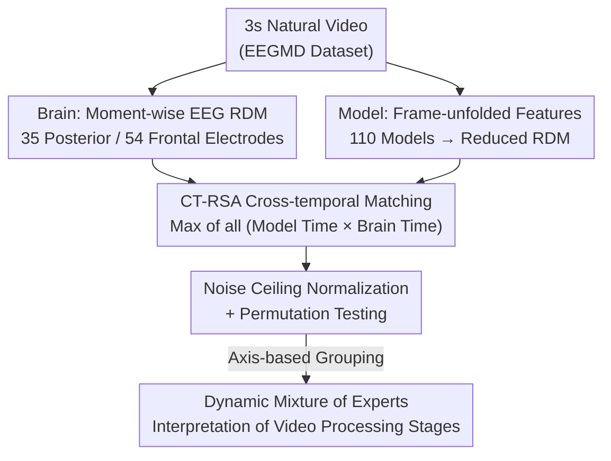

# The Human Brain as a Dynamic Mixture of Expert Models in Video Understanding

**Conference**: ICLR 2026  
**OpenReview**: [https://openreview.net/forum?id=bSsNSfyj8m](https://openreview.net/forum?id=bSsNSfyj8m)  
**Code**: https://github.com/cvai-roig-lab/Net2Brain (CT-RSA has been integrated into the Net2Brain library)  
**Area**: Computational Neuroscience / Video Understanding / Representational Alignment  
**Keywords**: EEG, Model-Brain Alignment, Video Understanding, Temporal Integration, Representational Similarity Analysis

## TL;DR
The authors perform the first "model-brain representational alignment" benchmark of 110 video/image deep models on large-scale dynamic EEG recordings. They propose Cross-Temporal Representational Similarity Analysis (CT-RSA) to match frame-by-frame model features with millisecond-by-millisecond brain responses. The study reveals that neural preferences switch over time during 3-second natural video clips (from static low-level $\rightarrow$ static high-level objects $\rightarrow$ mid-level temporal actions). Different brain regions (posterior vs. frontal) and different time points favor different model types; thus, the optimal "alignment model" does not exist in a single network but resembles a "mixture of experts" that switches dynamically.

## Background & Motivation
**Background**: Representational alignment is a core tool in computational cognitive neuroscience, comparing internal representations of task-trained deep networks with brain activity. Better alignment suggests the model captures mechanisms used by the brain for specific visual tasks. This approach has succeeded in the visual cortex over the past decade, though most work utilizes **fMRI** (functional Magnetic Resonance Imaging).

**Limitations of Prior Work**: fMRI is limited by slow blood-oxygen-level-dependent (BOLD) responses, with temporal resolution measured in seconds, failing to capture fine-grained dynamics at the millisecond scale. Real-world stimuli are **dynamic videos**, where temporal context significantly alters visual processing (e.g., neural adaptation, context-dependent action integration). Conclusions from static images do not automatically generalize. Existing video fMRI benchmarks (Sartzetaki et al., 2025) reveal impacts along architecture, task, and temporal integration axes, but fMRI's low temporal resolution obscures rich brain dynamics and the temporal unfolding of model features.

**Key Challenge**: There is a mismatch between the **rapid temporal evolution** of neural representations (millisecond scale) and the blurred temporal measurements of fMRI. Simultaneously, model features are temporal objects unfolding frame-by-frame, but prior alignment methods often compress them into static vectors, losing the "model time $\leftrightarrow$ brain time" correspondence.

**Goal**: (1) Establish the first large-scale **EEG** model-brain alignment benchmark for natural videos; (2) Design an alignment metric for hypothesis-free matching between frame-wise model features and moment-wise brain responses; (3) Systematically compare 110 models across temporal integration, classification tasks, architecture, and pre-training to characterize the dynamic laws of brain video processing.

**Key Insight**: Instead of assuming "frame $X$ corresponds to millisecond $Y$," the study employs "cross-temporal maximum matching" to compare all model timepoints $\times$ all brain timepoints, allowing the data to reveal which model feature best matches a given neural state.

**Core Idea**: By observing the shifting alignment strengths of different model types on millisecond-level EEG over time, the study interprets brain video processing as a **dynamic Mixture of Experts (MoE)**.

## Method

### Overall Architecture
The method addresses the comparison of "frame-wise model features" and "millisecond-wise EEG responses" without predefined temporal correspondences. The workflow consists of two parts: **dual-system temporal representation extraction** and **CT-RSA cross-temporal alignment**.

First, for each 3-second video, representations are extracted from both the brain and models. On the brain side, subsets of EEG electrodes (35 posterior / 54 frontal) are used to construct cross-subject averaged Representational Dissimilarity Matrices (RDMs) at each EEG timepoint $t_N$. On the model side, for each layer and model timepoint $t_M$, feature maps are flattened and reduced to 100 principal components to create RDMs. Second, CT-RSA computes Spearman correlations between RDMs of all model $(L, t_M)$ combinations and all brain $t_N$ timepoints. For each EEG timepoint, only the highest correlation score is retained, forming a "brain time $\rightarrow$ best alignment score" curve. Over $10^7$ RSA scores were processed for 110 models and two electrode partitions, followed by noise ceiling normalization and permutation testing for significance.

### Key Designs

**1. CT-RSA: Cross-temporal maximum matching without predefined frame-to-time mapping**
This core innovation addresses the unknown correspondence between sub-sampled model frames and millisecond brain responses. While traditional RSA (Kriegeskorte, 2008) compares static representations, the authors extend it to the temporal dimension: for every model layer $l$, model time $t_M$, and EEG time $t_N$, Spearman correlation is computed based on RDMs: $R_{l\text{-}t_M t_N} = \rho(B_{t_N}, M_{l\text{-}t_M})$. Then, for each EEG timepoint, the maximum correlation across all layers and model timepoints is taken: $R_{t_N} = \max_{l\text{-}t_M}(R_{l\text{-}t_M t_N})$. The brain RDM is averaged across subjects: $B_{t_N}=\text{avg}_s(B_{s\text{-}t_N})$ where $B^{ij}_{s\text{-}t_N}=1-r(v^i_{s\text{-}t_N}, v^j_{s\text{-}t_N})$ ($r$ is Pearson correlation). Selecting the maximum allows the data to determine the best-fit feature, enabling the extraction of alignment trajectories and supporting temporal generalization studies.

**2. Temporally unfolded feature extraction + Dual-system moment-wise RDM**
To perform cross-temporal matching, both systems must have sequences of representations. Unlike prior works that squash model features, here each video is divided into $S$ segments of length $T$, extracting features of shape $(T, C, H, W)$ per layer. These are unfolded into $M = T \times S$ model moments. Each feature map undergoes sparse random projection and PCA reduction to 100 components $f_{l\text{-}t_M}$. Model RDMs are constructed as $M^{ij}_{l\text{-}t_M}=1-r(f^i_{l\text{-}t_M}, f^j_{l\text{-}t_M})$. The brain side symmetrically samples at 50 Hz with multivariate noise normalization (MVNN) to create cross-subject RDMs.

**3. Noise ceiling normalization and grouped permutation tests**
Given $10^7$ RSA scores, direct comparison is hindered by varying signal-to-noise ratios (SNR). Upper and Lower Noise Ceilings (UNC/LNC) are calculated. All reported scores are normalized by dividing by the UNC. Significance is determined via permutation testing: 10,000 row/column shuffles of the RDM for a null distribution, followed by a two-tailed sign test (with pre-stimulus baseline correction). Results are corrected via FDR and required to form clusters of at least two consecutive significant timepoints.

### Loss & Training
Ours does not involve training new models. The 110 computer vision networks are pre-trained: 44 for ImageNet object recognition, 10 for Kinetics-400 image-based action recognition, 49 for Kinetics-400 video-based action recognition (including 3 VisionMamba and 8 VideoMamba state-space models), and 7 action models trained on Kinetics-710/Something-Something-v2. EEG data comes from the new EEG Moments Dataset (EEGMD), utilizing 1102 3-second natural videos (the same set used in the BOLD Moments Dataset), with 6 subjects, 128 electrodes, and 1000 Hz sampling.

## Key Experimental Results

### Main Results
Processing of 3-second videos is divided into four stages: (I: 0.06–0.24s, II: 0.24–0.8s, III: 0.8–2s, IV: 2–3s).

| Region / Stage | Dominant Representation Type | Best Alignment Model | Key Phenomenon |
|------|------|------|------|
| Posterior Stage I | Static low-level features | AlexNet | Image models significantly outperform video models via early layers. |
| Posterior Stage II | Static high-level objects | DenseNet | Object recognition models dominate via late layers. |
| Posterior Stage III | Mid-level temporal actions | MViT-v2 | Video models (temporal integration) surpass image models. |
| Posterior Stage IV | Mid-level temporal actions | MViT-v2 | Video models maintain superiority, but the gap narrows. |
| Frontal Stages I–II | Static high-level actions | Static action models | Strongest peak at 0.5s; no significant alignment after 0.8s. |

Posterior electrodes show **strong temporal correspondence**: early EEG moments match early model moments, and late EEG moments match progressively later model moments (up to ~0.6s). Frontal electrodes show **no** such correspondence.

### Ablation Study

| Axis / Configuration | Key Finding | Description |
|------|---------|------|
| Context Window & Sampling | Alignment in Posterior III/IV correlates with frame count/FPS. | Supports that late posterior processing relies on temporal integration. |
| Architecture: SSM vs CNN/Transformer | SSMs align best in Posterior I–II (esp. II) using mid-deep layers. | Recurrent temporal processing benefits intermediate response alignment. |
| Architecture: CNN | Inferior early-stage alignment. | Suggests global attention is useful for early alignment. |
| Architecture: Static SSM | Advantage in Posterior II disappears. | SSM advantage stems from temporal recursion rather than cross-patch recursion. |
| Pre-training: Self-supervised | Optimal alignment in Posterior II. | General pre-training tasks benefit object-stage generalization. |
| Pre-training: No pre-training | Optimal alignment in Posterior III. | Avoids shortcut learning inherent in certain pre-training tasks. |

### Key Findings
- **Counter-intuitive result**: While classical neuroscience suggests a strict "one-way" temporal hierarchy (low $\rightarrow$ high), this study finds that **mid-level temporal action features align until the end of the video**, challenging strict hierarchical views and suggesting continued integration in the posterior brain.
- **Region Specialization**: The posterior (visual cortex) is highly temporal and updates with video content; the frontal (prefrontal) is early and stable, processing only static action info in the first 0.8s without temporal correspondence.
- **Architecture/Pre-training Switching**: SSM advantages appear during intermediate stages requiring recursion. Self-supervised pre-training is beneficial for the object stage (II), but "no pre-training" performs better in the temporal integration stage (III).

## Highlights & Insights
- **CT-RSA utility**: The "max-matching" approach bypasses the frame-to-millisecond mapping problem and condenses millions of scores into interpretable trajectories. This logic can be migrated to any alignment problem between two temporal systems.
- **"Dynamic Mixture of Experts" Metaphor**: No single network is optimal throughout; the brain switches preferences over time. This implies that ideal video models should dynamically shift between "static object" and "mid-level temporal action" processing.
- **First large-scale natural video EEG benchmark**: Fills the gap in M/EEG natural video data, with CT-RSA open-sourced in the Net2Brain library.

## Limitations & Future Work
- Frontal electrode inclusion is exploratory with coarse spatial resolution ("posterior vs. frontal"), preventing precise localization.
- The "max-matching" mechanism creates localized optimistic biases (corrected via pre-stimulus baselines), requiring cautious interpretation when comparing different tasks.
- Limited sample size (6 subjects) and group-average analysis; conclusions are based on 3-second clips.
- The hypothesis of "frontal-to-posterior feedback" shaping late processing cannot be proven causally by correlational alignment methods.

## Related Work & Insights
- **vs. Sartzetaki et al. (2025) (Video fMRI Benchmark)**: Built on the same model set, but switches fMRI for millisecond-level EEG and adds the model temporal dimension. fMRI findings show temporal video models align in EVC; ours **localizes this to the III/IV stages (after 0.8s)**.
- **vs. Static Image M/EEG temporal hierarchy studies**: Prior work found object hierarchy early on ($<500$ms). Ours replicates this in stages I–II but extends the window to show that action features continue to integrate until the clip ends, **revising** the strict hierarchy view.

## Rating
- Novelty: ⭐⭐⭐⭐⭐ First large-scale EEG video benchmark + CT-RSA + "Dynamic MoE" perspective.
- Experimental Thoroughness: ⭐⭐⭐⭐⭐ 110 models $\times$ 4 axes $\times$ 2 regions $\times$ full timespan.
- Writing Quality: ⭐⭐⭐⭐ Clear interdisciplinary narrative, though stages are visually dependent.
- Value: ⭐⭐⭐⭐⭐ Advances understanding of temporal brain dynamics and provides actionable insights for bio-inspired video representation learning.

<!-- RELATED:START -->

## Related Papers

- [\[ICLR 2026\] Towards Understanding the Shape of Representations in Protein Language Models](towards_understanding_the_shape_of_representations_in_protein_language_models.md)
- [\[ICLR 2026\] Riemannian High-Order Pooling for Brain Foundation Models](riemannian_high-order_pooling_for_brain_foundation_models.md)
- [\[ICLR 2026\] TRIBE: Trimodal Brain Encoder for Whole-Brain fMRI Response Prediction](tribe_trimodal_brain_encoder_for_whole-brain_fmri_response_prediction.md)
- [\[ICLR 2026\] OmniMouse: Scaling properties of multi-modal, multi-task Brain Models on 150B Neural Tokens](omnimouse_scaling_properties_of_multi-modal_multi-task_brain_models_on_150b_neur.md)
- [\[ICLR 2026\] MindPilot: Closed-loop Visual Stimulation Optimization for Brain Modulation with EEG-guided Diffusion](mindpilot_closed-loop_visual_stimulation_optimization_for_brain_modulation_with_.md)

<!-- RELATED:END -->
