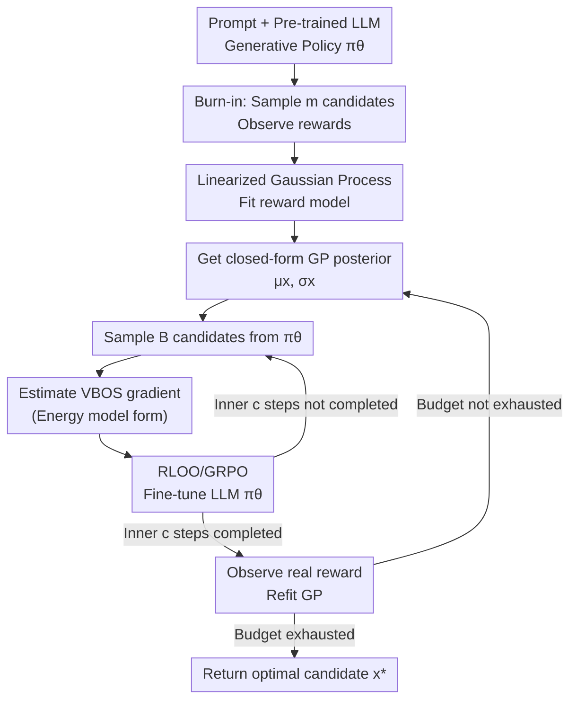

# Thompson Sampling via Fine-Tuning of LLMs

- **Conference**: ICLR 2026
- **arXiv**: [2510.13328](https://arxiv.org/abs/2510.13328)
- **Code**: [GitHub](https://github.com/IBM/thompson-sampling-via-fine-tuning-of-llms)
- **Area**: Medical Imaging
- **Keywords**: Thompson Sampling, Bayesian Optimization, LLM Fine-Tuning, Probability of Maximality, VBOS

## TL;DR

ToSFiT is proposed to directly parameterize the Probability of Maximality (PoM) by fine-tuning Large Language Models (LLMs), extending Thompson Sampling to large-scale unstructured discrete spaces and bypassing the challenges of acquisition function maximization.

## Background & Motivation

Bayesian optimization (BO) faces a core challenge in large-scale unstructured discrete spaces (such as amino acid sequences or quantum circuit designs): due to the lack of gradient information, maximizing the acquisition function is infeasible within combinatorial discrete domains. For example, the space of protein sequences with 20 amino acids and a length of 100 exceeds the number of atoms in the universe.

Thompson Sampling (TS) is a classical BO strategy that balances exploration and exploitation by sampling from the reward posterior and selecting points that maximize these samples. Its sampling distribution is essentially the Probability of Maximality (PoM). However, in large-scale discrete domains, directly sampling from the PoM still requires traversing all possible points.

**Mechanism**: Since LLMs have already encoded rich prior knowledge through pre-training, can the generative distribution of an LLM be used to directly parameterize the PoM, thereby transforming Thompson Sampling into an LLM fine-tuning problem?

## Method

### Overall Architecture

ToSFiT addresses the issue in combinatorial discrete spaces (e.g., amino acid sequences, quantum circuits) where traditional BO requires "maximizing the acquisition function" at every step—a task that is computationally impossible when scanning all points. Its core insight is to reframe "selecting the next candidate" as making the LLM's generative distribution $\pi^\theta$ approximate the **Probability of Maximality (PoM)** of the rewards. Since sampling directly from the LLM approximates sampling from the PoM, Thompson Sampling reduces to the single task of "fine-tuning the LLM to the current posterior."

Specifically, the algorithm first uses the pre-trained LLM under prompt conditions to generate a batch of burn-in candidates, observes their rewards, and fits a Gaussian Process (GP) reward model. It then enters an outer loop: each round begins by obtaining the closed-form GP posterior $\mu_x, \sigma_x$, followed by several inner gradient steps. In each step, a batch of candidates is sampled from the LLM, and the LLM is updated using the VBOS objective gradient, causing the generative distribution to slowly drift toward the PoM under the current posterior. After the inner steps are completed, real rewards for these candidates are observed, the GP is refitted, and the process continues until the budget is exhausted, at which point the optimal candidate is returned.

### Key Designs

**1. Variational Bayesian Optimistic Sampling (VBOS): Replacing Unenumerable PoM with a Differentiable Objective**

In discrete spaces where $|X|$ is too large to traverse, direct sampling from the PoM requires scanning all points, which is the exact step the framework seeks to avoid. ToSFiT follows the approach of O'Donoghue & Lattimore (2021), directing the policy $\pi$ to maximize the variational objective $\mathcal{V}(\pi) = \mathbb{E}_{x \sim \pi}\left[\mu_x + \sqrt{-2\ln(\pi_x)} \cdot \sigma_x\right]$, where $\mu_x$ and $\sigma_x$ are the posterior mean and standard deviation provided by the GP. The $\mu_x$ term encourages exploitation of high-reward regions, while the $\sqrt{-2\ln(\pi_x)} \cdot \sigma_x$ term decays as the policy becomes more confident about a point (larger $\pi_x$), acting as an adaptive UCB exploration reward. This ensures the optimal solution of the objective corresponds exactly to the PoM, replacing "enumerative sampling" with the "optimization of a distribution" parameterized by an LLM.

**2. Energy Model Form of VBOS Gradient: Translating Posterior Bias Directly to Generative Probability Changes**

With a differentiable objective, the gradient with respect to LLM parameters must be calculated. Differentiating $\mathcal{V}(\pi^\theta)$ (Proposition 1) yields $\frac{d}{d\theta}\mathcal{V}(\pi^\theta) = \mathbb{E}_{x \sim \pi^\theta}\left[(\mu_x - \xi - v^{-1}(\pi_x^\theta) \cdot \sigma_x) \cdot \frac{d}{d\theta}\ln\pi_x^\theta\right]$, where $v^{-1}(u) = \sqrt{-2\ln u} - 1/\sqrt{-2\ln u}$. This form possesses a natural energy model interpretation: the term in brackets represents the "real posterior reward" minus the "current implicit estimate of the LLM." When the LLM underestimates the expected reward of a point, the bracket is positive, pushing $\ln\pi_x^\theta$ higher and increasing the generation probability of that candidate; otherwise, it is suppressed. Thus, the fine-tuning signal does not require manually designed rewards but is given directly by the gap between the GP posterior and the current policy confidence.

**3. RLOO Baseline and Variance Normalization: Making High-Variance Policy Gradient Estimates Stable and Trainable**

The expression above is a Monte Carlo policy gradient, which has high variance and can be unstable during fine-tuning. ToSFiT employs the RLOO (Reinforce Leave-One-Out) baseline on each batch, setting the baseline $\xi_i$ for each candidate as the mean pseudo-reward of the other samples in the same batch $\xi_i = \frac{1}{B-1}\sum_{j\neq i}\hat{\hat{r}}^\theta_{x_j}$ to reduce variance. It then uses the empirical standard deviation of the advantage function for normalization, resulting in a variance-adaptive learning rate. This combination is mathematically equivalent to GRPO (Group Relative Policy Optimization), allowing the reuse of mature LLM reinforcement learning training stacks without re-implementing optimizers from scratch.

**4. Linearized Gaussian Process: Decoupling Reward Model Fitting Cost from Observation Count**

In the overall framework, the GP must be repeatedly refitted, but standard GP inference scales cubically with the number of observations, which is unacceptable for BO with thousands of iterations. ToSFiT utilizes the Moore–Aronszajn theorem to express any kernel as a linear kernel $K(x,z)=\langle\phi(x),\phi(z)\rangle$ under a feature map $\phi: X \to \mathbb{H}$, reducing the posterior update complexity to $\Theta(\dim(\mathbb{H})^2)$. This complexity depends only on the feature dimension and is independent of the number of observations. Expressiveness is maintained by the choice of $\phi$ (fixed embedding models, online learning, or task-specific designs). This ensures that even as more samples are collected, the cost of refitting the GP each round remains constant, enabling long-term execution of the outer loop.

### Loss & Training

During actual training, an empirical estimate of the VBOS gradient is performed using a batch of $B$ sampled candidates: $\frac{d}{d\theta}\mathcal{V}(\pi^\theta) \approx \frac{1}{B}\sum_i \frac{\hat{\hat{r}}_{x_i}^\theta - \xi_i}{\widehat{\text{advantage std}}} \cdot \frac{d}{d\theta}\ln\pi_{x_i}^\theta$, where the numerator is the RLOO-corrected advantage and the denominator is the empirical standard deviation of the advantages. To preserve the priors provided by pre-training and context, fine-tuning uses a small learning rate and only a few gradient steps per round, allowing the policy to drift slowly rather than being steered away by single-round observations.

## Theoretical Analysis

**Theorem 1 (Core Theoretical Contribution)**: The cumulative regret upper bound for exact VBOS is improved from $\tilde{\mathcal{O}}(\sqrt{T|X|})$ to $\tilde{\mathcal{O}}(\sqrt{T\gamma^T})$ (where $\gamma^T$ is the maximum information gain), and the regret upper bound for approximate VBOS is provided for the first time:

$$\mathbb{E}\left[\sum_{t=1}^T R^* - R_{x^t}\right] \leq \sqrt{C_{\sigma_n} H T \gamma^T} + \mathbb{E}\sum_{t=1}^T D_{\sigma^t}(\pi^t, \tilde{\pi}^t)$$

Key insight: Policy initialization must be close to the prior (pre-training + context), and fine-tuning must be cautious (small learning rate) to maintain prior knowledge.

## Key Experimental Results

### Main Results

| Task | Model | Search Space | Reward |
|------|------|----------|------|
| FAQ Answer Optimization | Qwen3-1.7B/8B | All token sequences | Semantic alignment score |
| Protein Search | ProtGPT2-0.7B | Amino acid sequences | Thermal stability index |
| Quantum Circuit Design | Qwen2.5-Coder-1.5B/7B | Qiskit circuit code | Negative energy |

Ours (ToSFiT) achieves SOTA sample efficiency and computational efficiency across all three tasks, significantly outperforming seven baseline methods (including In-context BO, RL, and Evolutionary Search).

### Key Findings

- **Importance of Strong Priors**: Removing key information from the prompt (e.g., number of qubits) significantly degrades performance.
- **Cautious Fine-Tuning**: Excessive learning rates lead to forgetting the prior and result in stagnation.
- **Batch Optimization Effectiveness**: Increasing batch size reduces sample efficiency but improves iteration efficiency.
- **Computation-Sample Efficiency Trade-off**: Increasing the number of gradient steps per round can further improve sample efficiency.

### Ablation Study

| Ablation | Effect |
|------|------|
| Remove prior context | Performance drops significantly |
| Large learning rate | Initial gain but subsequent stagnation |
| Increase gradient steps | Gain in sample efficiency |
| Increase batch size | Gain in iteration efficiency |

## Highlights

1. Perfect integration of theory and practice: New regret bounds directly guide the algorithm design.
2. Clever utilization of LLM pre-trained priors, avoiding acquisition function maximization in discrete spaces.
3. Elegant and intuitive energy model interpretation of the VBOS gradient.
4. Generality verified across three highly diverse experimental tasks (NLP, Proteins, Quantum Computing).

## Limitations

1. Uses fixed feature mappings instead of joint learning with the GP.
2. Fine-tuning the full model introduces computational and memory overhead.
3. Assumption of a linearized scalable GP limits the expressiveness of the reward model.
4. Only evaluated on sequence generation tasks; does not cover other discrete spaces like graph structures.

## Related Work & Insights

- **BO in Discrete Domains**: Bal et al. (2025) assume Cartesian product decomposition; Swersky et al. (2020) optimize via local mutation strategies.
- **VAE Relaxation**: Kusner et al. (2017) and others relax discrete spaces into continuous spaces.
- **Deep Kernel Learning**: Ranković & Schwaller (2025) learn feature mappings online.

## Rating

- **Novelty**: ⭐⭐⭐⭐⭐ — Significant contributions in both theory and methodology by combining Thompson Sampling with LLM fine-tuning.
- **Value**: ⭐⭐⭐⭐ — Applicable to practical scenarios such as protein design and circuit optimization.
- **Writing Quality**: ⭐⭐⭐⭐⭐ — Clear theoretical derivations and well-motivated experimental design.
- **Significance**: ⭐⭐⭐⭐⭐ — Opens a new direction for the integration of LLMs and Bayesian Optimization.

<!-- RELATED:START -->

## Related Papers

- [\[ICML 2025\] SToFM: a Multi-scale Foundation Model for Spatial Transcriptomics](../../ICML2025/computational_biology/stofm_a_multi-scale_foundation_model_for_spatial_transcriptomics.md)
- [\[ICML 2025\] Protein Structure Tokenization: Benchmarking and New Recipe](../../ICML2025/computational_biology/protein_structure_tokenization_benchmarking_and_new_recipe.md)
- [\[ICCV 2025\] MolParser: End-to-end Visual Recognition of Molecule Structures in the Wild](../../ICCV2025/computational_biology/molparser_end-to-end_visual_recognition_of_molecule_structures_in_the_wild.md)
- [\[ICML 2025\] Scalable Non-Equivariant 3D Molecule Generation via Rotational Alignment](../../ICML2025/computational_biology/scalable_non-equivariant_3d_molecule_generation_via_rotational_alignment.md)
- [\[ICLR 2026\] Fine-Tuning Diffusion Models via Intermediate Distribution Shaping](fine-tuning_diffusion_models_via_intermediate_distribution_shaping.md)

<!-- RELATED:END -->
