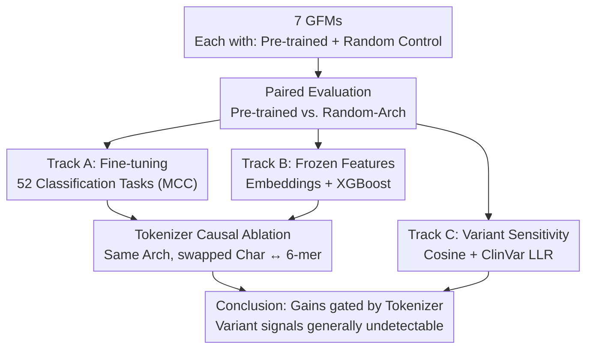

# Tokenization to Transfer: Do Genomic Foundation Models Learn Good Representations?

**Conference**: ICLR 2026  
**OpenReview**: [https://openreview.net/forum?id=4UY1NHG5Ge](https://openreview.net/forum?id=4UY1NHG5Ge)  
**Code**: https://github.com/m42-health/gfm-random-eval  
**Area**: Computational Biology / Representation Learning / Foundation Model Evaluation  
**Keywords**: Genomic Foundation Models, Unsupervised Pre-training, Tokenizer Inductive Bias, Randomly Initialized Baseline, Variant Sensitivity  

## TL;DR
The authors systematically benchmarked 7 Genomic Foundation Models (GFMs) against their "randomly initialized weight" counterparts across 52 genomic tasks. They found that random baselines are surprisingly strong, pre-training gains are strictly gated by the tokenizer (gains are negligible for character-level but significant for subword-level), and these models fail to perceive clinically relevant single-nucleotide variants regardless of pre-training. The conclusion is that the current NLP-mimicking pre-training paradigm in genomics brings only "tokenizer-gated marginal improvements."

## Background & Motivation
**Background**: The success of Large Language Models (LLMs) has been directly ported to genomics, giving rise to various Genomic Foundation Models (GFMs, such as DNABERT-2, Nucleotide Transformer, HyenaDNA, Caduceus, GENA-LM, etc.). They follow the two-stage LLM paradigm: unsupervised pre-training on massive DNA sequences (next-token or masked language modeling) followed by downstream fine-tuning, with the expectation of compressing genomic knowledge into parameters to produce a universal "foundation model."

**Limitations of Prior Work**: Pre-training often requires hundreds of millions of parameters, long sequences of hundreds of thousands to millions of tokens, and terabytes of data, incurring massive computational costs. However, existing studies show that **no single GFM consistently performs best**, and the relationship between pre-training performance and downstream performance remains ambiguous. In other words, massive compute is spent on pre-training without a clear understanding of the actual downstream return on investment.

**Key Challenge**: Almost all GFM evaluation papers only report "pre-trained model vs. other pre-trained models." Few ask the sharper question: how much worse does the same model perform with **randomly initialized weights and zero pre-training** on downstream tasks? If the difference is negligible, the value of the pre-training stage becomes questionable.

**Goal**: This study answers three sub-questions: (1) In fine-tuning tasks, how much does pre-training actually improve over random initialization, and what factors determine this? (2) Are pre-trained features truly superior when frozen? (3) Can GFM embeddings reflect mutations in "single-nucleotide variant detection," the most clinically valuable task?

**Key Insight**: The authors' critical operation is providing each GFM with an "apples-to-apples" control group—**the exact same architecture and configuration but with random weights**. This cleanly isolates the "delta from pre-training" from the "inherent capability of the architecture/tokenizer," a comparison missing in previous evaluations.

**Core Idea**: Rather than proposing a new model, the study uses paired experiments (Pre-trained vs. Random), causal ablation of tokenizers, and variant sensitivity probes to falsify the default assumption that "genomic pre-training is always useful," attributing gains to the **inductive bias of the tokenizer** rather than the pre-training process itself.

## Method

### Overall Architecture
This is an **evaluative/scrutinizing** paper; the "Method" consists of a controlled experimental design. The core framework involves selecting 7 GFMs spanning diverse architectures (Encoder/Decoder, Transformer/SSM), tokenizers (Character / k-mer / BPE), and scales (450K–580M) (see Table 1). Each model is prepared in two versions: "Pre-trained checkpoint" and "Randomly initialized architecture-matched control." They are evaluated across three tracks covering 52 tasks and nearly 10,000 fine-tuning experiments. The tracks stress-test **discriminative ability (fine-tuning)**, **feature quality (frozen embeddings)**, and **variant sensitivity (single-base level)**, followed by a causal ablation of tokenizers to attribute observed differences.

### Key Designs

**1. Paired Pre-trained vs. Random Control: Isolating the True Pre-training Delta**

Previous evaluations compared different GFMs horizontally, confounding "architecture/tokenizer strength" with "pre-training gains." This paper provides each model with a **bit-for-bit aligned random version** (same size, tokenizer, and hyperparameter budget). Fig. 1 plots random scores (x-axis) vs. pre-trained scores (y-axis). Only points above the diagonal indicate positive pre-training gains. For fairness, large-scale hyperparameter searches (learning rate, weight decay, batch size, warm-up, LoRA vs. full fine-tuning) were conducted for every (model, task) pair. A key finding was that **full fine-tuning consistently outperformed LoRA**; using LoRA on random baselines systematically underestimates them, overvaluing pre-training. Results show random baselines are incredibly strong: a random 8M-parameter Caduceus achieved an average MCC ≈ 0.62 on difficult histone/enhancer tasks in the NT Benchmark, outperforming larger pre-trained models like NT-500M and GENA-LM.

**2. Tokenizer Causal Ablation: Inductive Bias Dominates, Pre-training Loss is Misleading**

To prove the tokenizer causes the performance difference, authors conducted a clean causal experiment: training two **identical HyenaDNA models** (same size, data, steps) where the only difference was the tokenizer (Character vs. 6-mer, Table 3). Paradoxically, the character-level model had lower pre-training loss (1.180 vs. 1.215) but the 6-mer model had much higher downstream average MCC (+0.187). This leads to two conclusions: (i) **Pre-training perplexity is a poor proxy for downstream performance**—language modeling fits token predictability, which may not align with labels. (ii) **Tokenizer inductive bias can dominate downstream performance independently of loss**. Character tokenizers (4 bases) create an "easy" input space for random models, leaving little room for pre-training gains. Large-vocabulary subword tokenizers create sparse, difficult input spaces where pre-training the token representations becomes truly valuable.

**3. Variant Sensitivity Probe: Quantifying "Numbness" to Single-Base Mutations**

Clinical applications rely on single-nucleotide differences, but classification tasks do not test this resolution. Three probes were designed: (a) **Mutation Sensitivity**: Injecting 1 to 1024 SNPs into a sequence and measuring the cosine similarity between original and mutant embeddings; (b) **ClinVar Variants**: Comparing embeddings of benign vs. pathogenic exon variants in genes like TP53 and BRCA2; (c) **Log-Likelihood Ratio (LLR)**: Calculating $\text{LLR}=\log \frac{P(\text{ALT})}{P(\text{REF})}$ for each SNP and assessing AUROC for distinguishing pathogenic/benign variants. Conclusion: Even when half the bases are mutated, some GFM embeddings maintain cosine similarity >0.99. ClinVar LLR AUROC fell between 0.345–0.536, near random guessing (0.5). Existing GFMs cannot reliably encode allele-level information.

### Loss & Training
The paper uses the native pre-training objectives of each GFM (next-token for Decoders, MLM for Encoders). Experimental protocols: fine-tuning used the best of 6 learning rates; low-resource experiments used 30 epochs and 4 learning rates. Frozen feature evaluation used max pooling + XGBoost on 9 biotypes. Variant experiments used fixed 1024-length sequences to avoid tiling/context window artifacts. The authors note that while NT-500M was pre-trained on 1000G variants, its 15% MLM mask rate is far higher than the natural mutation rate (0.5%), which, combined with 6-mer tokenization, likely makes it insensitive to single-base changes.

## Key Experimental Results

### Main Results
Pre-training gain $\Delta$ (MCC) on NT Benchmark Histone tasks:

| Model | Tokenizer | Pre-trained − Random $\Delta$ | Notes |
| :--- | :--- | :--- | :--- |
| Caduceus (8M) | Char | +0.014 | Random baseline already ≈0.62 |
| HyenaDNA | Char | +0.031 | Char-level, low gain |
| Mistral (580M) | Char | +0.148 | Char-level but good arch; still benefits |
| DNABERT-2 | BPE | +0.059 | Subword, benefits |
| GENA-LM | BPE | +0.121 | Subword, benefits |
| NT-500M | k-mer | +0.111 (+0.242 on GUE) | Subword, highest gains |
| NTv2-50M | k-mer | +0.177 | Subword, benefits |

Key Phenomenon: Character-level random baselines are naturally strong, leaving little for pre-training. Subword models have weak random baselines, making pre-training the primary driver of performance.

### Ablation Study
Tokenizer Causal Ablation (Identical HyenaDNA, Table 3):

| Metric | Character | 6-mer | Difference |
| :--- | :--- | :--- | :--- |
| Pre-training Loss ↓ | **1.180** | 1.215 | Char is lower |
| Average Downstream MCC ↑ | 0.139 | **0.326** | 6-mer +0.187 |

Frozen Biotype Classification: By increasing embedding dimensions (Fig. 5), 5 out of 7 random models outperformed their pre-trained counterparts. Pre-training only showed superiority at low dimensions ($d=64$).

### Key Findings
- **Tokenizer determines the random baseline, and pre-training gain is gated by the tokenizer**: Character-level models have strong random baselines and low pre-training headroom; subword models have weak random baselines where pre-training becomes essential.
- **Pre-training loss is a misleading proxy**: Lower loss does not equate to better downstream performance.
- **Capacity > Pre-training (Frozen Features)**: Increasing random model dimensions allows them to catch up to or beat pre-trained features.
- **Variant sensitivity is a systemic weakness**: Cosine similarities remain >0.99 even for high mutation counts, and LLR AUROC is near-random. Existing GFMs fail to encode allele-level signals regardless of tokenizer or pre-training.

## Highlights & Insights
- **"Randomly Initialized Control" is the strongest baseline ignored by the field**: It cleanly deconstructs GFM performance.
- **Causal ablation upgrades correlation to causation**: Matching architectures while swapping tokenizers provides counter-intuitive proof that tokenization dominates the outcome.
- **Building blocks over scale**: The study suggests the path forward is not just more compute, but biologically-informed tokenizers and variant-aware training objectives.

## Limitations & Future Work
- **Task Scope**: Primarily focused on discriminative classification; does not cover generative design or long-range tasks (e.g., enhancer-promoter loops) where specialized models might still hold leads.
- **Context Window**: Many evaluated models were capped at 1024 tokens, preventing analysis of long-range dependencies.
- **Probe Sophistication**: Variant sensitivity used simple probes (cosine/LLR), which might miss subtler signals.
- **Future Directions**: Biology-informed tokenization (preserving single-base signals) and mutation-aware pre-training objectives (aligning mask rates with natural mutation rates).

## Related Work & Insights
- **vs. Nucleotide Transformer / DNABERT-2 / GENA-LM**: This study is a systematic re-examination of their "utility," proving most gains are architectural or tokenizer-derived.
- **vs. Scaling Law Studies**: While others ask "how much does scale help," this study asks "how much does pre-training help relative to random," concluding that current paradigms often offer little marginal value.
- **vs. NLP Paradigms**: Pre-training is transformative for LLMs, but in genomics—with its small vocabulary and sparse, single-base signals—the NLP recipe does not translate directly.

## Rating
- Novelty: ⭐⭐⭐⭐ 
- Experimental Thoroughness: ⭐⭐⭐⭐⭐ 
- Writing Quality: ⭐⭐⭐⭐ 
- Value: ⭐⭐⭐⭐⭐ 

<!-- RELATED:START -->

<!-- RELATED:END -->

## Related Papers

- [\[ICLR 2026\] Low rank adaptation of chemical foundation models generate effective odorant representations](low_rank_adaptation_of_chemical_foundation_models_generate_effective_odorant_rep.md)
- [\[ICLR 2026\] Towards Understanding the Shape of Representations in Protein Language Models](towards_understanding_the_shape_of_representations_in_protein_language_models.md)
- [\[ICLR 2026\] Riemannian High-Order Pooling for Brain Foundation Models](riemannian_high-order_pooling_for_brain_foundation_models.md)
- [\[ICLR 2026\] Towards All-atom Foundation Models for Biomolecular Binding Affinity Prediction](towards_all-atom_foundation_models_for_biomolecular_binding_affinity_prediction.md)
- [\[ICML 2026\] DNAChunker: Learnable Tokenization for DNA Language Models](../../ICML2026/computational_biology/dnachunker_learnable_tokenization_for_dna_language_models.md)

<!-- RELATED:END -->
