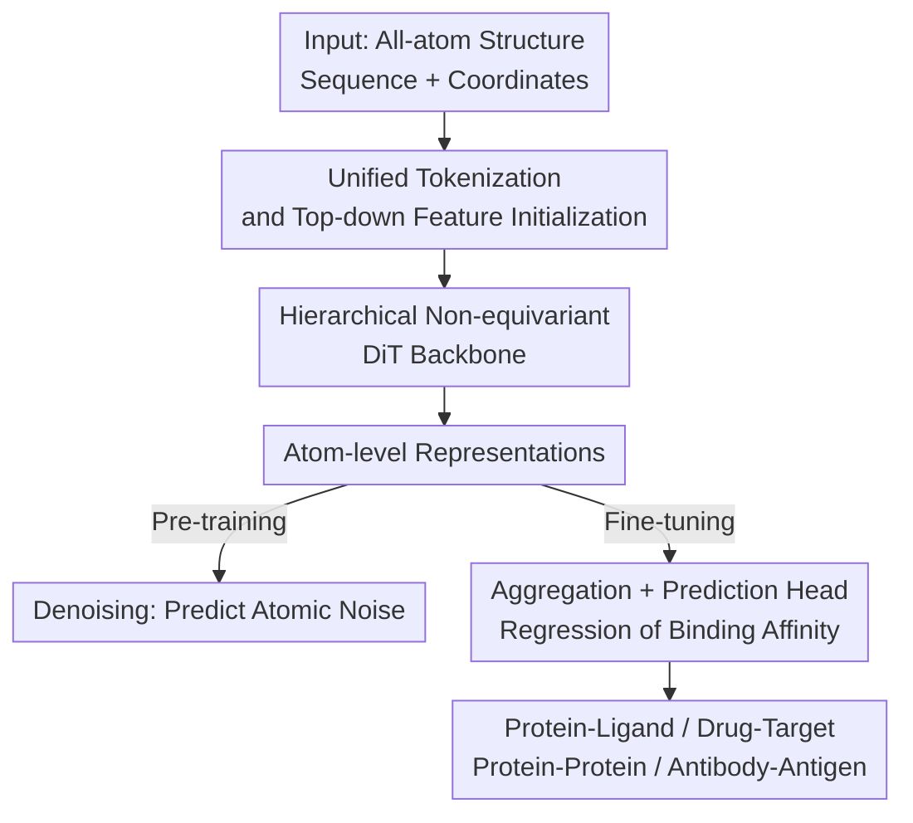

# Towards All-atom Foundation Models for Biomolecular Binding Affinity Prediction

**Conference**: ICLR 2026  
**OpenReview**: [https://openreview.net/forum?id=o0Qfsq1fK8](https://openreview.net/forum?id=o0Qfsq1fK8)  
**Code**: https://github.com/VectorShi/ADiT  
**Area**: Computational Biology / All-atom Representation Learning / Binding Affinity Prediction  
**Keywords**: Binding Affinity, AlphaFold 3, Diffusion Transformer, All-atom Modeling, Denoising Pre-training

## TL;DR
This paper transforms the AlphaFold 3 architecture from "generative structure prediction" into a "representation learner," proposing the All-atom Diffusion Transformer (ADiT). By utilizing unified tokenization to encode both proteins and small molecules, removing the heavy conditional trunk and MSA/template dependencies, and performing denoising pre-training on PDB, a single model achieves or approaches SOTA across four types of affinity tasks: protein-ligand, drug-target, protein-protein, and antibody-antigen, with stable performance gains as the model size increases.

## Background & Motivation
**Background**: Methods like AlphaFold 3 can already predict the 3D structures of biomolecular complexes with high precision from sequences. however, structure prediction is merely an intermediate product—the ultimate goal is to design functional proteins with strong binding affinity for specific targets. Nevertheless, binding affinity prediction has consistently been difficult, with the fundamental bottleneck being the extreme scarcity of high-quality experimental affinity labels.

**Limitations of Prior Work**: Existing affinity prediction methods are mostly specialized—RDE-Network, DiffAffinity, and Prompt-DDG are dedicated to protein-protein interactions, while MGraph-DTA, HGNN-DTA, and ProFSA focus on protein-ligand interactions. This specialization for single interaction types severely limits generalization; a model designed for one task cannot be used for another. Furthermore, many methods use only sequence inputs or model at the residue level (coarse-grained), failing to leverage the benefits of structure prediction or characterize the all-atom details that determine affinity.

**Key Challenge**: On one side, the "large-scale pre-training + fine-tuning" foundation model paradigm in NLP/CV (BERT, GPT, SAM, CLIP) has proven that data scale can yield generalization; on the other side, the field of biomolecular interactions remains stuck with specialized models for each task and is hampered by label scarcity. What is missing is a unified, structure-based foundation model capable of transferring across interaction types.

**Goal**: To construct a general, structure-based all-atom foundation model that, after a single pre-training phase, can be transferred to multiple affinity tasks such as protein-ligand, drug-target, protein-protein, and antibody-antigen.

**Key Insight**: AlphaFold 3 itself is a Transformer architecture capable of jointly encoding sequences and structures across various interaction types, making it a natural starting point. However, it is a generative model, and using it directly for downstream representation often yields poor results (the generative objective optimizes "reconstruction of geometry" rather than "characterization of function/interaction features"). The authors propose three key insights: (i) when the goal shifts from "predicting geometry" to "encoding known geometry," the heavy conditional trunk module designed for generation is no longer critical and can be significantly simplified; (ii) an atom-sequence bi-level Transformer architecture is naturally suited for jointly encoding structure and sequence; (iii) pre-training on large-scale structural data is expected to mitigate affinity label scarcity and enhance cross-task generalization.

**Core Idea**: "Re-engineer" AlphaFold 3 from a generative structure predictor into a representation learner—removing MSA/templates and the heavy trunk, and switching to denoising pre-training to obtain the All-atom Diffusion Transformer (ADiT), unifying various biomolecular binding affinity predictions with a single model.

## Method

### Overall Architecture
ADiT receives the all-atom structure of a biomolecular complex (sequence $A \in \{1,...,20\}^L$ and coordinates $x \in \mathbb{R}^{L\times3}$) as input. Through unified feature initialization and a hierarchical Diffusion Transformer backbone, it outputs atom-level representations. In the pre-training phase, self-supervised learning is performed using a denoising objective. In the fine-tuning phase, atom representations are aggregated step-by-step into complex-level representations, followed by a prediction head for binding affinity regression. The entire pipeline reshapes "generative AlphaFold 3" into an "encoding representation learner": removing the heavy trunk intended for structure generation, discarding MSAs and templates, and retaining only the scalable Diffusion Transformer stacks.

### Key Designs

**1. From AlphaFold 3 to ADiT: Removing the Heavy Trunk and Switching to Denoising Objectives**

This design addresses the limitation where directly fine-tuning generative models like AlphaFold 3 for downstream tasks is ineffective because the generative objective optimizes "reconstruction" rather than "interaction features." The authors' core judgment is that when the structure is already provided as input and the model's role shifts from "inferring geometry" to "encoding known geometry," the multi-modal trunk conditional module in AlphaFold 3 becomes less critical. Consequently, ADiT undergoes four substantial modifications: (1) Objective: changed from generative structure prediction to simpler denoising representation learning; (2) Input: removed computationally expensive and not always available MSAs and templates, using the pre-trained protein language model ESM-2 for evolutionary information and RDKit descriptors for small molecules; (3) Architecture: removed the heavy trunk and computationally intensive Pairformer blocks, retaining only scalable Diffusion Transformer stacks; (4) Retained modern components from AlphaFold 3 (SwiGLU, gating, atom/token bi-level alternation). This "subtraction" reduces computational cost and is more suitable for learning general representations, enabling ADiT to cover multiple tasks with a single model.

**2. Unified Tokenization and Top-down Feature Initialization**

To allow a single model to process both proteins and small molecules, ADiT uses generalized tokenization: each residue in a protein is a token, and each heavy atom in a small molecule is a token. Features are initialized in a top-down manner—first building token-level features, then propagating token-level information downward to fuse with atom-specific information for atom-level features. Token conditional representations consist of two parts: sequence features from ESM-2-650M (calculated only for residue tokens, small molecule tokens are zeroed) + token type embeddings to distinguish protein/small molecule sources. Token pair representations concatenate paired token conditions and add relative sequence distance and chain distance encodings (deliberately using only concatenation and linear layers, avoiding the expensive Pairformer).

A noteworthy detail is that ADiT explicitly distinguishes between the "single representation" $s_{atom}$ and the "condition" $c_{atom}$ at the atom level: subsequent Diffusion Transformers **use the condition as an anchor to extract structural information from the single representation**. Thus, the condition $c_{atom}$ only encodes chemical and evolutionary information (atom type, atom name + token condition), while the single representation $s_{atom}$ contains structural information like coordinates. The atom pair representation $z_{atom}$ fuses atom conditions, uses RBF kernels to embed Euclidean distances, and encodes whether two atoms belong to the same token, finally adding the corresponding token pair representation to capture both local and global interactions. This division of labor—where structural information enters only the single representation and not the condition—is the key adaptation for borrowing generative diffusion structures for representation learning.

**3. Hierarchical Non-equivariant DiT Backbone**

The backbone uses a Diffusion Transformer (DiT) for hierarchical representation learning, alternating between the atom level and token level. The process is: update atom representations using $N^{atom}_{block}$ atom DiT blocks → obtain token representations via "Atom2Token" average pooling → refine using $N^{token}_{block}$ token DiT blocks → restore to atom representations via a linear layer + "Token2Atom" broadcasting (a non-learned expansion operation), added to previous atom representations via skip connections → further refine with $N^{atom}_{block}$ atom DiT blocks. Each DiT block includes adaptive LayerNorm, multi-head self-attention, and transition functions, with skip connections to stabilize training. The attention is formulated as:

$$A^h_{ij} \leftarrow \text{softmax}_j\!\left(\frac{q^{h\top}_i k^h_j}{\sqrt{d}} + \text{Linear}^h_b(z_{ij}) + \beta_{ij}\right)$$

where $\beta_{ij}$ controls whether to model the interaction between $(i,j)$: it is 0 at the token level (fully connected), while the atom level is sparsified—every 32 atoms only attend to 128 atoms nearby in the sequence, saving the overhead of all-atom pairwise attention.

The most counter-intuitive aspect of this design is that it is **non-equivariant**: ADiT uses only a linear layer to embed all atomic coordinates and does not introduce geometric inductive biases like SE(3) equivariance or locality. The required rotational/translational invariance is approximated by centering the input coordinates at the centroid and using random rotation data augmentation during pre-training. The authors' hypothesis is that overly strong equivariance constraints might restrict the model; removing them allows for more flexible capture of non-geometric features (e.g., electrostatic interactions, chemical semantics from RDKit/ESM-2) that determine binding thermodynamics. Moreover, non-equivariant Transformer architectures are simpler, more scalable, and better suited for building foundation models.

### Loss & Training
A two-stage "pre-train then fine-tune" approach is adopted. **Pre-training** uses denoising self-supervision: Gaussian noise $\varepsilon \sim \mathcal{N}(0, \sigma^2 I)$ is added to each atomic coordinate, the noisy structure is fed into ADiT, and a noise prediction head predicts the noise from atom representations. Since the model is non-equivariant, random rotations are used for data augmentation. The noise scale is fixed following (Zaidi et al., 2023); preliminary experiments found $\sigma = 0.5\text{Å}$ to be best (variable noise scales showed no significant gain). Pre-training data is sourced entirely from the PDB (433,297 single chains, 481,382 protein-protein, and 427,947 protein-ligand samples, clustered into 150,009 clusters), and **no functional labels are used** to avoid data leakage. **Fine-tuning** uses a smaller learning rate: clean structures are input, processed via "Atom2Token" average pooling and "Token2Complex" sum pooling to get complex-level representations for the prediction head. Since the goal is learning representations from clean samples rather than generating from noise, the diffusion timestep is held constant at 0 (corresponding to clean samples) during fine-tuning. The authors trained three versions: ADiT-S (12M), ADiT-M (35M), and ADiT-L (253M), where ADiT-L's layers and hidden dimensions are aligned with AlphaFold 3.

## Key Experimental Results

### Main Results
Evaluated across four types of interaction tasks, ADiT-L achieves or approaches SOTA almost across the board, and even the 12M ADiT-S outperforms most specialized baselines.

| Task | Dataset | Metric | ADiT-L | Prev. SOTA | Gain |
|------|---------|--------|--------|------------|------|
| Protein-Ligand | LBA-30 | Pearson↑ | 0.645 | GET 0.633 | +1.9% |
| Protein-Ligand | LBA-60 | RMSE↓ | 1.246 | ProNet 1.343 | −7.2% |
| Protein-Ligand | LBA-60 | Pearson↑ | 0.797 | ProFSA 0.764 | +4.2% |
| Drug-Target | Davis | MSE↓ | 0.198 | NHGNN-DTA 0.196 | Par with SOTA |
| Drug-Target | Davis | $r^2_m$↑ | 0.751 | NHGNN-DTA 0.744 | +0.9% |
| Protein-Protein | SKEMPIv2 | Pearson↑ | 0.691 | Prompt-DDG 0.677 | +2.1% |
| Antibody-Antigen | HER2 | Pearson↑ | 0.567 | GearBind+P 0.515 | +10.1% |

Notably, the authors also fine-tuned Protenix (an open-source reproduction of AlphaFold 3) as a control for "directly fine-tuning a generative model." ADiT consistently outperformed Protenix across all protein-ligand metrics (e.g., LBA-60 Pearson 0.797 vs 0.707), confirming that "generative models alone are insufficient for representation." Furthermore, specialized methods like GET and ProNet often show inconsistency between different splits (e.g., good on LBA-30 but poor on LBA-60), while ADiT is stable across both.

### Ablation Study
A single-factor ablation based on ADiT-M on SKEMPIv2 (Table 4).

| Configuration | Pearson↑ | Spearman↑ | RMSE↓ | MAE↓ | Description |
|---------------|----------|-----------|-------|------|-------------|
| ADiT-M (Full) | 0.683 | 0.539 | 1.559 | 1.098 | Baseline |
| w/o Pre-training | 0.649 | 0.511 | 1.624 | 1.169 | Random init, Pearson drops 5.2% |
| w/o All-atom info | 0.658 | 0.517 | 1.606 | 1.153 | Backbone only, Pearson drops 3.7% |
| w/ Larger (ADiT-L 253M) | 0.691 | 0.560 | 1.540 | 1.088 | Stable scaling gain |
| w/ Smaller (ADiT-S 12M) | 0.660 | 0.524 | 1.597 | 1.132 | Stable scaling loss |

### Key Findings
- **Pre-training is the largest contributor**: Removing pre-training and using random initialization causes Pearson to drop by 5.2%, Spearman by 5.5%, RMSE to worsen by 4%, and MAE by 6%, proving that large-scale structural denoising pre-training is the core for mitigating label scarcity.
- **All-atom modeling is beneficial**: Replacing all-atom representations with backbone-only leads to a consistent decline in all metrics, indicating that all-atom details such as side chains are valuable for characterizing affinity.
- **Stable scaling trends**: The three scales (12M, 35M, 253M) show consistent improvements across multiple benchmarks, replicating scaling laws observed in other fields.
- **Applicable to real antibody optimization**: ADiT remained leading on the HER2 antibody (average edit distance of 7.6 from Trastuzumab, representing a difficult out-of-distribution sample). In case studies, ADiT correctly ranked 7 wet-lab-validated affinity-increasing mutations (e.g., S54Y, S57W in Anti-5T4 UdAb; SH103W/Y, IL34W in CR3022) near the top, showing its potential as an antibody optimization tool.

## Highlights & Insights
- **Systematic "Generative to Representation Learner" transformation**: Instead of simply fine-tuning AlphaFold 3, the authors reconstructed it across four dimensions (denoising replacing generation, ESM-2+RDKit replacing MSA/templates, removing trunk/Pairformer, and fixed timestep 0). This approach of "distilling an expensive generative model into a lightweight encoder" is transferable to other structural generative models.
- **Betting against the equivariant trend**: While current structural modeling often stacks SE(3) equivariant layers, this paper does the opposite by using pure non-equivariant Transformers + centroid centering + random rotation to approximate invariance. This yields architectural simplicity and scalability, while arguing that strong geometric biases might suppress non-geometric features like electrostatic interactions and chemical semantics—a thought-provoking trade-off.
- **Explicit decoupling of single representation vs. condition**: Clarifying the division of labor—where structural info enters the single representation and chemical/evolutionary info enters the condition—is a subtle but crucial design point when using diffusion structures for representation learning.
- **Unified tokenization for everything**: The scheme where residue = token and heavy atom = token allows a single model to be reused across four types of interaction, providing the engineering foundation for a "general foundation model."

## Limitations & Future Work
- **Dependency on given structures**: ADiT encodes "known geometry." For protein-protein/antibody tasks, it still relies on FoldX to generate mutant structures. Structure quality directly impacts affinity prediction, and an end-to-end pipeline from sequence to affinity is not yet implemented.
- **Fixed noise scale**: The authors acknowledge using a single $\sigma=0.5\text{Å}$. Due to computational limits, they did not explore "carefully designed noise scale distributions," which might capture both coarse and fine-grained features using multi-scale noise.
- **Approximate rather than guaranteed invariance**: Approximating invariance with random rotation + centroid centering is theoretically less rigorous than equivariant layers. Its robustness in extreme cases with insufficient data/rotation coverage remains to be systematically verified.
- **Slightly lower performance on regression metrics in ranking tasks**: On ranking tasks like SKEMPIv2, ADiT's Pearson is strongest, but its RMSE/MAE is only on par with the best baselines, meaning absolute error is not comprehensively leading.

## Related Work & Insights
- **vs. AlphaFold 3 / Protenix**: AF3 is a generative model for structure prediction, relying on MSAs/templates and a heavy trunk. ADiT transforms it into a representation learner (denoising objective, ESM-2+RDKit instead of MSA, removing trunk/Pairformer). Directly fine-tuning Protenix is inferior to ADiT, showing "generative model $\neq$ good representation."
- **vs. Specialized affinity methods (RDE-Network / DiffAffinity / Prompt-DDG / ProFSA / GET)**: These are limited to single tasks (PP or PL) and often show inconsistent performance across splits. ADiT unifies four types of interaction with one all-atom foundation model and shows more stability across splits.
- **vs. Residue-level structural representation methods**: Many structural representation learning methods model only at the residue/backbone level and are limited to proteins. ADiT performs all-atom modeling and covers both proteins and small molecules, with ablations showing the gain from all-atom information.
- **vs. Equivariant structure models (GET, etc.)**: Mainstream methods inject geometric bias via SE(3) equivariance. ADiT uses non-equivariant Transformers + data augmentation for simplicity and scalability, questioning if strong geometric bias suppresses non-geometric chemical features.

## Rating
- Novelty: ⭐⭐⭐⭐ Systematically transforming AF3 into a unified all-atom representation learner and betting on non-equivariant design is novel and consistent.
- Experimental Thoroughness: ⭐⭐⭐⭐ Covers four types of interaction + three model scales + ablations + wet-lab case studies, though mostly dependent on known structure inputs.
- Writing Quality: ⭐⭐⭐⭐ Motivation and transformation logic are clear, supported by three key insights.
- Value: ⭐⭐⭐⭐ Provides a scalable, cross-task foundation model paradigm for biomolecular affinity and open-sources the implementation.

<!-- RELATED:START -->

## Related Papers

- [\[ICLR 2026\] Pallatom-Ligand: an All-Atom Diffusion Model for Designing Ligand-Binding Proteins](pallatom-ligand_an_all-atom_diffusion_model_for_designing_ligand-binding_protein.md)
- [\[ICLR 2026\] BioMD: All-atom Generative Model for Biomolecular Dynamics Simulation](biomd_all-atom_generative_model_for_biomolecular_dynamics_simulation.md)
- [\[ICLR 2026\] PepTri: Physical, Evolutionary, and Mutual Information Tri-guided All-atom Diffusion Peptide Design](peptri_tri-guided_all-atom_diffusion_for_peptide_design_via_physics_evolution_an.md)
- [\[ICLR 2026\] Physically Valid Biomolecular Interaction Modeling with Gauss-Seidel Projection](physically_valid_biomolecular_interaction_modeling_with_gauss-seidel_projection.md)
- [\[ICLR 2026\] Triangle Multiplication is All You Need for Biomolecular Structure Representations](triangle_multiplication_is_all_you_need_for_biomolecular_structure_representatio.md)

<!-- RELATED:END -->
