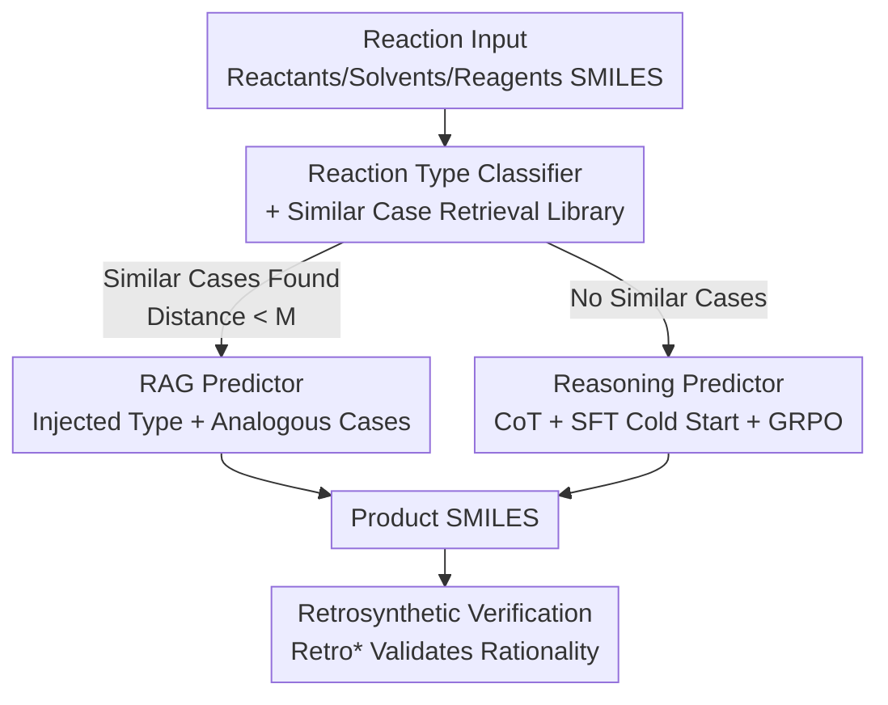

# Towards Knowledge-and-Data-Driven Organic Reaction Prediction: RAG-Enhanced and Reasoning-Powered Hybrid System with LLMs

**Conference**: ICLR 2026  
**OpenReview**: [https://openreview.net/forum?id=gmHCxj1fYI](https://openreview.net/forum?id=gmHCxj1fYI)  
**Area**: Computational Biology & Chemistry / LLM Reasoning / Retrieval-Augmented Generation  
**Keywords**: Organic Reaction Prediction, RAG, Chain-of-Thought, GRPO, Retrosynthetic Verification

## TL;DR
This paper proposes **Reaction-Thinker**, a hybrid organic reaction prediction system driven by both knowledge and data. It utilizes a classifier and a similarity-based retrieval library to divert samples: those with similar cases follow a RAG path (injecting reaction types and analogous cases into prompts), while those without follow a "CoT Reasoning + GRPO Reinforcement Learning" path. The system achieves an Exact Match of 89.86%, surpassing all compared LLMs and even traditional specialized models (Chemformer 88.13%).

## Background & Motivation

**Background**: Organic reaction product prediction has long relied on the experience and mechanistic knowledge of chemists. AI methods are categorized into template-based (machine learning + expert/atom-mapping extracted templates) and template-free (GNNs, Transformer sequence models learning patterns directly from corpora). Recently, LLMs (ChemDFM, ChemLLM, GPT-4o, etc.) have been introduced due to their pre-trained chemical knowledge and reasoning capabilities, hoping to replicate the human cognitive process of "analyzing functional groups → hypothesizing bond breaking and formation → deriving reaction paths → predicting main products."

**Limitations of Prior Work**: Current fine-tuning of chemical LLMs is essentially end-to-end data-driven learning. It fails to fully activate the chemical knowledge embedded in pre-trained parameters or utilize the LLM's in-context learning and reasoning abilities. Consequently, predictions lack interpretability, and accuracy often fails to beat traditional specialized models—leaving the potential of LLMs largely untapped.

**Key Challenge**: Unleashing the potential of LLMs is hindered by two bottlenecks. First, **high-quality structured chemical training data is extremely scarce**; unlike mathematics with the Lean community and web-scale corpora, chemistry lacks public reaction reasoning resources, and annotation is expensive. Second, **learning strategies for chemical LLMs are lagging**; most frameworks stop at "Pre-training + SFT," while RAG (which injects domain knowledge and suppresses hallucinations) and Reinforcement Learning (RL) (which enhances reasoning and interpretability) are rarely applied in chemical LLMs.

**Goal**: To build a hybrid learning framework merging SFT, RAG, and RL that combines data-driven and knowledge-driven paradigms for interpretable, high-performance reaction prediction.

**Key Insight**: When predicting reactions, chemists **directly analogize known cases** for familiar reactions but **derive from mechanisms step-by-step** for unfamiliar ones. Accordingly, the authors use the "existence of similar cases" as the signal for diversion, directing samples into two specialized pipelines rather than forcing a single model to handle all scenarios.

**Core Idea**: Use a "classifier + similar case retrieval" to divert reactions; **those with cases follow RAG, while those without follow CoT Reasoning + GRPO**. The system takes the strengths of both paths and merges them via weighted aggregation.

## Method

### Overall Architecture
Reaction-Thinker consists of four core modules forming a branched pipeline. Given a reaction input (reactants, solvents, reagents in SMILES), the system first uses a **reaction type classifier** to determine the most likely reaction type, then searches a **similar case retrieval library** for analogous reactions. If one or more similar cases are retrieved (embedding distance less than threshold $M$), the **RAG Predictor** path is taken, injecting the reaction type and cases into the user prompt. If no similar cases are found, the input is sent to the **Reasoning Predictor** for Chain-of-Thought (CoT) analysis. Both paths produce final products, with overall accuracy derived from weighted aggregation. Finally, the paper proposes using **retrosynthetic verification** to re-examine "incorrect" predictions—many products that fail to match the ground truth are actually chemically plausible.

### Key Designs

**1. Reaction Type Classifier + Similar Case Retrieval Library: Diverting samples and providing RAG analogies via embedding distance**

This pair of modules serves as the "dispatch center" of the pipeline, addressing the pain point that a single model cannot handle all reactions both interpretably and accurately. The classifier is a two-layer MLP: SMILES are converted into various structural fingerprints (RDK, LAYERED, PATTERN, AVALON, MORGAN, each excelling at different substructures/similarities) using RDKit and concatenated. The second layer outputs the reaction type, while the first layer's output is extracted as a **reaction embedding** (Rea-Embedding). The classifier is trained on Schneider-50K (50,000 reactions, 50 representative types).

The retrieval library is constructed using Rea-Embeddings: for each reaction in the ORD training set, the Euclidean distance (L2 norm) to other reactions of the same type is calculated. Samples with a distance less than threshold $M$ have their full reaction SMILES (reactants, solvents, reagents, products) added to the library for that type. During inference, the same embedding and classification are performed on test samples; RAG is used if training cases are within distance $M$, otherwise the reasoning path is taken. $M$ is a critical switch: a smaller $M$ leads to higher RAG accuracy with lower coverage, while a larger $M$ increases coverage but decreases accuracy.

**2. RAG Predictor: Injecting reaction types and analogous cases as external knowledge into prompts**

Addressing the issue that fine-tuning ignores LLM in-context learning, this path simulates the chemist's habit of "referencing similar reactions." The authors construct a custom SFT dataset using only reactions where **at least one similar case was successfully retrieved**. Each sample includes the reaction input, predicted reaction type, retrieved similar cases, and target product. Full-parameter SFT is then used to fine-tune Qwen3-32B as the backbone. Thus, the model learns "how to infer using analogous cases in context" rather than rote mapping. Ablation shows that compared to direct end-to-end mapping, adding RAG brings a **7.5% relative accuracy Gain** (83.13% vs 77.35%).

**3. Reasoning Predictor: Two-stage CoT data + SFT cold start + GRPO reinforced reasoning**

To address the double pain point of "no analogies for unfamiliar reactions" and "scarcity of chemical reasoning data," this path bootstraps reasoning through synthetic CoT data and RL. **CoT data is created in two stages**: Stage 1 extracts reaction SMILES from USPTO-MIT (filtered to prevent leakage) and uses Qwen2.5-72B to reverse-engineer mechanisms and derive products given the **full ground truth SMILES**. This yields 119k high-quality CoT entries. Stage 2 uses Stage 1 data to SFT a DeepSeek-R1-Distill-Qwen-7B, then runs GRPO on the ORD training set, **retaining only reasoning trajectories that lead to correct predictions**. This accumulates 575k verified CoT entries (covering ~55k ORD samples).

**Training** follows a two-stage process: using DeepSeek-R1-Distill-Qwen-32B as a backbone, full-parameter SFT is first performed for cold start, followed by GRPO using LoRA on the ORD training set. For each query, GRPO samples $G$ responses $\{y_1,\dots,y_G\}$, normalizing advantages as $\hat{A}_{i,t} = \frac{r_i - \mathrm{mean}(\{r\})}{\mathrm{std}(\{r\})}$. The reward function consists of four parts: format reward (0.1), length reward (0.1 for 500–2000 tokens), validity reward (0.1 for chemically valid SMILES), and accuracy reward (2.0 for exact matches). Cold start is essential: GRPO without SFT reaches only 9.67%, while SFT + GRPO reaches 68.24%, a **13.9% relative Gain**.

**4. Retrosynthetic Verification: Revising "False Negative" evaluation with Retro***

This reflects on the evaluation paradigm itself. Error analysis reveals failures in complex multi-functional/multi-step reactions or missing conditions. More fundamentally, many organic reactions naturally generate side products through parallel paths, yet datasets usually record only 1–3 main products. Consequently, "comparing only against a single ground truth" penalizes chemically reasonable products. The authors propose a new paradigm: for each prediction from the reasoning predictor, Retro* is used to verify if a plausible retrosynthetic route exists from the given input. If reasonable, it is marked correct. **47.8%** of previously "wrong" predictions were found to be chemically reasonable, raising the total valid reaction ratio to 92.64%.

### Loss & Training
RAG Predictor: Full-parameter SFT of Qwen3-32B. Reasoning Predictor: Full-parameter SFT cold start of DeepSeek-R1-Distill-Qwen-32B, followed by GRPO with LoRA. The objective function is:
$$\mathcal{J}(\theta) = \mathbb{E}\Big[\tfrac{1}{G}\sum_{i=1}^{G}\tfrac{1}{|y_i|}\sum_{t=1}^{|y_i|}\min\big(c_{i,t}(\theta)\hat{A}_{i,t},\ \mathrm{clip}(c_{i,t}(\theta),1-\epsilon,1+\epsilon)\hat{A}_{i,t}\big) - \beta\, D_{\mathrm{KL}}[\pi_\theta\Vert\pi_{\mathrm{ref}}]\Big]$$
where $c_{i,t}(\theta)=\frac{\pi_\theta(y_{i,t}\mid q,y_{i,<t})}{\pi_{\theta_{old}}(y_{i,t}\mid q,y_{i,<t})}$ is the importance sampling ratio.

## Key Experimental Results

The dataset is the Open Reaction Database (ORD) pre-processed by ORDerly, with 832k training / 86k test samples. Metrics include Validity, Exact Match, and Fingerprint Tanimoto Similarity (FTS). Text similarities like BLEU are avoided as structural changes in SMILES are not linear with text changes.

### Main Results

| Model | Type | Exact Match (%) | FTS-MORGAN (%) |
|------|------|------|------|
| Chemformer | Specialized | 88.13 | 92.40 |
| Molecular Transformer | Specialized | 85.84 | – |
| GPT-4o † | General LLM | 28.26 † | 64.93 † |
| DeepSeek-R1 | General LLM | 11.68 | 55.71 |
| ChemDFM-13B | Chemical LLM | 52.41 | 77.27 |
| Text-Chem-T5 | Chemical LLM | 47.88 | 76.45 |
| **Reaction-Thinker (Ours)** | Hybrid | **89.86** | **95.22** |

The final score comes from weighted paths: 81.7% of test samples had similar cases (RAG path: 94.70% EM); the remaining 18.3% took the reasoning path (68.24% EM); combined EM is 89.86%.

### Ablation Study

| Configuration | Exact Match (%) | Note |
|------|------|------|
| w/ RAG | 83.13 | Type + cases injected |
| w/o RAG (End-to-End) | 77.35 | Direct SMILES mapping, -7.5% rel. |
| w/ SFT + GRPO | 68.24 | Full reasoning path |
| w/ SFT, w/o GRPO | 59.93 | No RL, -13.9% rel. |
| w/o SFT + GRPO | 9.67 | RL without cold start |
| w/o SFT, w/o GRPO | 6.52 | Base backbone |
| w/ FTS reward | 56.83 | Performance drops with FTS reward |
| w/o FTS reward | 68.24 | Baseline GRPO |

Threshold $M$ impact: At $M=10$, 81.7% coverage with 94.70% accuracy (Overall 89.86%). At $M=100$, 99.10% coverage but 88.94% accuracy (Overall 88.74%). $M=10$ was chosen.

### Key Findings
- **Cold start is critical for GRPO**: Without SFT, GRPO only reaches 9.67%. Cold start allows the model to internalize the reasoning paradigm before RL pushes it from 59.93% to 68.24%.
- **Fingerprint similarity reward triggers reward hacking**: Introducing MORGAN FTS to alleviate sparse rewards caused accuracy to drop from 68.24% to 56.83%. The model learned to **copy reactant SMILES** to gain high similarity rewards since products and reactants are structurally similar.
- **47.8% of "Errors" are valid**: Retro* verification shows nearly half of misclassifications are chemically feasible, exposing the flaws of "single ground truth" evaluation.

## Highlights & Insights
- **"Existence of analogies" as a routing signal** is clever: it maps cognitive habits ("analogy for knowns, deduction for unknowns") to specialized pipelines.
- **Data bootstrapping via correct GRPO trajectories**: Using RL-generated correct trajectories as training data (57.5k) turns the scarcity of chemical reasoning data into a "self-sustaining" cycle.
- **Real-world reward hacking**: FTS rewards being exploited by "copying reactants" serves as a warning that reward design for Science must prevent proxy targets from being bypassed.
- **Retrosynthetic evaluation**: Using independent tools to validate product rationality provides a more realistic metric for open-ended tasks than Exact Match.

## Limitations & Future Work
- The reasoning predictor still has room for improvement; optimizing reward functions is a priority.
- RAG and reasoning are currently **separate modules**; the plan is to integrate them into a unified architecture.
- Performance relies heavily on the 81.7% retrieval coverage; in sparse-data distributions, performance would drop toward the ~68% of the reasoning path.
- CoT data was reverse-engineered from outcomes; future work focuses on enhanced data including actual synthetic processes for better forward-prediction rigor.

## Related Work & Insights
- **vs Specialized Models**: Chemformer (88.13%) is a strong baseline; Ours counter-attacks with 89.86% using LLMs + hybrid driving.
- **vs Chemical LLMs**: Previous models (ChemDFM, etc.) followed the "Pre-training + SFT" path (47%–52%); Ours demonstrates that RAG and GRPO significantly amplify backbone potential.
- **vs Zero-shot LLMs**: GPT-4o and DeepSeek-R1 (11%–28%) show that general reasoning is insufficient; domain knowledge and specific training are mandatory.

## Rating
- Novelty: ⭐⭐⭐⭐ Combines routing, RAG analogy, CoT+GRPO, and retrosynthetic validation while honestly exposing reward hacking.
- Experimental Thoroughness: ⭐⭐⭐⭐ Covers general/chemical/specialized baselines with comprehensive ablations.
- Writing Quality: ⭐⭐⭐⭐ Clear narrative on motivation and failure analysis.
- Value: ⭐⭐⭐⭐ Provides a reusable "Knowledge + Data" paradigm for Scientific LLMs.

<!-- RELATED:START -->

## Related Papers

- [\[ICLR 2026\] Adaptive Data-Knowledge Alignment in Genetic Perturbation Prediction](adaptive_data-knowledge_alignment_in_genetic_perturbation_prediction.md)
- [\[ICLR 2026\] CellDuality: Unlocking Biological Reasoning in LLMs with Self-Supervised RLVR](cellduality_unlocking_biological_reasoning_in_llms_with_self-supervised_rlvr.md)
- [\[ICLR 2026\] Automatic and Structure-Aware Sparsification of Hybrid Neural ODEs with Application to Glucose Prediction](automatic_and_structure-aware_sparsification_of_hybrid_neural_odes_with_applicat.md)
- [\[ICLR 2026\] Test-Time Adaptation without Source Data for Out-of-Domain Bioactivity Prediction](test-time_adaptation_without_source_data_for_out-of-domain_bioactivity_predictio.md)
- [\[ICLR 2026\] KGOT: Unified Knowledge Graph and Optimal Transport Pseudo-Labeling for Molecule-Protein Interaction Prediction](kgot_unified_knowledge_graph_and_optimal_transport_pseudo-labeling_for_molecule-.md)

<!-- RELATED:END -->
