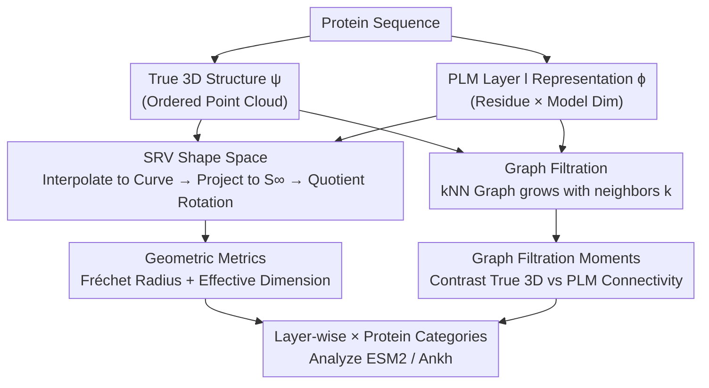

# Towards Understanding the Shape of Representations in Protein Language Models

**Conference**: ICLR 2026  
**OpenReview**: [https://openreview.net/forum?id=Dnn8SSBJaY](https://openreview.net/forum?id=Dnn8SSBJaY)  
**Code**: https://github.com/KBeshkov/ProtGeom (Available)  
**Area**: Computational Biology / Protein Language Models / Representation Geometry / Explainability  
**Keywords**: Protein Language Models, ESM2, Shape Space, SRV Representation, Graph Filtration  

## TL;DR
Rather than explaining how Protein Language Models (PLMs) process individual sequences, this work utilizes Square-Root Velocity (SRV) representation from shape analysis and graph filtration tools to characterize "how the entire protein space is deformed by PLMs" as measurable geometric objects. It discovers that representations in ESM2 layers undergo expansion followed by contraction, and that the model most faithfully encodes 3D structures and captures local contexts of approximately 2 and 8 residues near the penultimate layer.

## Background & Motivation

**Background**: PLMs, exemplified by ESM2, have become the backbone for protein folding prediction, sequence design, and functional scoring. It is widely believed that their hidden representations encode physical, evolutionary, and functional attributes of proteins, serving as effective initializations for folding models like ESMFold.

**Limitations of Prior Work**: Existing PLM explainability research—whether using categorical Jacobians to reveal pairwise statistics of co-evolving residues or Sparse Autoencoders (SAEs) to identify human-interpretable features like "binding sites, structural motifs, functional domains, or Gene Ontology terms"—focuses exclusively on **how a single sequence is mapped to a high-dimensional vector**. They answer "what a protein looks like" but fail to address "how relationships between different proteins are rearranged in the PLM latent space."

**Key Challenge**: Given "structure determines function and similar structures imply similar functions," the truly valuable information lies in the **pairwise geometric relationships between proteins**. However, current approaches have two blind spots: first, they examine individual points without considering the metric structure between them; second, since PLM representations are tensors of size `residue count × model dimension`, common practices of global averaging across the residue dimension **effectively erase the "shape" information** of the representation.

**Goal**: This work aims to compare the "metric space of proteins" with the "shape metric space of PLM representations" to clarify two issues: (1) how each PLM layer transforms the geometry (dimensionality and spread) of the entire protein space; (2) at what context scales and in which layers PLMs most faithfully preserve the actual 3D structure.

**Key Insight**: The authors transfer the mature **shape analysis** framework into PLM research. While distance tools like RMSD, TM-score, and FATCAT based on "optimal superposition" exist for protein structure comparison, they have not been applied to measure PLM hidden representations. The critical observation is that by treating a protein (or its PLM representation) as an **ordered point cloud → curve** in $\mathbb{R}^m$, one can define a metric space that is invariant to rotation and translation and allows for the comparison of proteins with different lengths.

**Core Idea**: Replace "mean-pooled vectors" with the "shape space of curves" and employ "graph filtration" probes to characterize the PLM's deformation of the entire protein space through computable geometric statistics.

## Method

### Overall Architecture

This study does not propose a new model but rather establishes a **geometric analysis pipeline**: Given a protein sequence, it is simultaneously mapped to its true 3D structure ($\psi$) and passed through a PLM to extract hidden representations from a specific layer ($\phi$). Both outputs are ordered point clouds, measured via two complementary paths: one interpolates the point clouds into curves and projects them into the SRV shape space to calculate the "geometry of the protein set at that layer" (spread and dimensionality); the other converts point clouds into k-nearest neighbor (kNN) graphs and applies graph filtration to measure the "similarity between the connectivity of PLM representations and the true 3D structures." These metrics are then swept across layers of ESM2/Ankh and across different protein categories in SCOPe.

### Key Designs

**1. SRV Shape Space: Representing Proteins and Hidden States as "Curves" then Removing Rotation/Translation**

Directly comparing true structures in $\mathbb{R}^3$ with PLM representations in $\mathbb{R}^m$ ($m \gg 3$) is meaningless due to differing dimensions and varying protein lengths. The solution abstracts "proteins" as continuous curves $\gamma:[0,1]\to\mathbb{R}^m$ using quadratic splines to interpolate ordered point clouds. This ensures that regardless of length, all proteins are transformed into the same type of "curve" object.

The **Square-Root Velocity (SRV)** representation is then applied:
$$q(t) = \dot\gamma(t)\big/\sqrt{\lVert\dot\gamma(t)\rVert_2}$$
The normalization in the denominator projects the curve onto an infinite-dimensional sphere $S^\infty$, making geodesics and distances computable while automatically eliminating translation. Remaining rotation is quotiented out using SVD to find the optimal superposition $\hat R=\arg\min_{R\in SO(n)}\lVert q_1-Rq_2\rVert_2$. The distance between two curves is defined as $d(q_1,q_2)=\lVert q_1-\hat R q_2\rVert_2$. The resulting shape space $H=S^\infty/SO(m)$ possesses a Riemannian structure, where all $SE(m)$-equivalent curves reside at the same point (their preimage is called a fiber). This approach preserves the original "shape" of the representation without relying on global averaging.

**2. Two Shape Space Geometric Metrics: Fréchet Radius and Effective Dimension**

With the Riemannian shape space, statistics for the protein set can be defined. First, the **Fréchet Radius** is calculated: the Fréchet mean is found via gradient descent $p_F=\arg\min_{x\in H}\sum d(x,y_i)$, followed by $r_F=\mathbb{E}_{y_i\in Y}[d(y_i,p_F)]$, which measures how "spread out" different protein shapes are. Second, **Effective Dimension** is defined using covariance eigenvalues:
$$\lambda_{\text{eff}} = \frac{(\sum_k \lambda_k)^2}{\sum_k \lambda_k^2}$$
Since data resides on a curved manifold, points are first projected to the tangent space of the Fréchet mean via logarithmic mapping ($z_i=\log_{p_F}(y_i)$) before performing tangent PCA. A higher effective dimension suggests that PLM representations require many distinct shape deformations to describe their differences.

**3. Graph Filtration Moments: Multi-scale Structural Fidelity via kNN Graphs**

Global shape geometry does not address local questions like the scale of context preserved by PLMs. As language models operate on context and PLM spaces lack physical units like Angstroms, the authors use **graph filtration**. k-nearest neighbor graphs are constructed for both true 3D structures and PLM representations, forming a family of nested adjacency matrices $A^t$ as the number of neighbors $k$ increases. Since both matrices exist in $\{0,1\}^{L\times L}$ for a protein of length $L$, they can be compared using the element-wise 1-norm $d_A(\psi(P),\phi(P))=\lVert\psi(A^t)-\phi(A^t)\rVert_1$.

Distances varying with $k$ follow a hypergeometric distribution. The authors normalize this using an empirical distribution of "true protein vs. random point cloud" to obtain **Graph Filtration Moments**:
$$\mathbb{E}_{P_i\in P}[d(P_i,\phi(P_i))]_{\text{norm}} = \frac{\mathbb{E}_{P_i\in P}[d_A(\psi(P_i),\phi(P_i))]}{\mathbb{E}_{P_i\in P,\,R_i\in R}[d_A(\psi(P_i),R_i)]}$$
A value $\geq 1$ indicates that the PLM arranges residues like a random point cloud (no structural encoding), while smaller values indicate more faithful encoding of 3D structure.

## Key Experimental Results

### Main Results

The analysis is based on **1,377 protein structures** randomly sampled from the SCOPe dataset, covering 8 categories (Alpha, Beta, Alpha/Beta, Alpha+Beta, etc.) with a maximum of 200 per category. Models tested include various scales of ESM2 and the general protein model Ankh.

| Analysis Dimension | Metric | Key Findings |
|--------|------|----------|
| Shape Space Spread | Fréchet Radius | Decreases as layers deepen; PLM representations are much smaller than true 3D structures; nearly invariant to model scale. |
| Shape Space Degrees of Freedom | Effective Dimension | Dimension expands in early layers and contracts in later layers; larger models show more aggressive expansion and a second peak. |
| Structural Fidelity | Graph Filtration Moments | Dual peaks: most similar to true structures at approx. 2 and 8 neighbors; most faithful encoding occurs near the end but not at the final layer. |

### Ablation Study

| Configuration | Key Result |
|------|---------|
| ESM2 (Multiple scales) | Expansion-contraction pattern is consistent, more pronounced in larger models. |
| Ankh (General PLM) | Same expansion-contraction pattern observed, with more drastic dimensionality reduction in final layers. |
| Spline degree / Interpolation points | Findings are robust (Fig. 6); quadratic splines are sufficient. |
| Protein Length vs. Filtration | Weak correlation in shallow layers; no correlation in deep layers (especially larger models). |

### Key Findings
- **Two-stage Expansion-then-Contraction**: Early PLM layers expand the effective dimension of the shape space (high abstraction phase), while later layers violently compress it into a low-dimensional subspace (semantic focus phase). This aligns with the "high-dimensional abstraction phase transition" observed in traditional LLMs.
- **Dual Peaks of Structural Encoding**: PLMs most faithfully preserve 3D structure at approx. 2 residues (nearest neighbor consistency) and 8 residues. The second valley is less pronounced in Beta proteins, potentially relating to Alpha-helix representations.
- **Penultimate Layer is Most Faithful**: Structure is encoded best near the final layer but not in the last layer itself. This implies the final unmasking step does not require structural information, while intermediate layers consider "encoding structure" a vital processing step.
- **Category Differences**: Alpha/Beta proteins are most similar to true 3D structures in PLM representations, while small and designed proteins are represented with more "exotic" shapes.

## Highlights & Insights
- **Introducing Shape Analysis to PLM Explainability**: Replacing "mean pooling" with SRV Riemannian shape spaces allows the "shape" of the entire representation to be analyzed, capturing rich information usually lost to averaging. This framework is naturally invariant to rotation/translation and comparable across protein lengths.
- **Bypassing Thresholding with Graph Filtration**: Since PLM latent spaces lack physical units, kNN graph filtration allows for sweeping across all context scales simultaneously, converting "structural encoding" into a readable curve.
- **Emergent Structural Encoding**: The model is trained only on masked amino acid prediction but spontaneously encodes 3D structure, suggesting that unmasking and folding functions are highly correlated—a perspective transferable to "emergent structure" in other modalities.
- **Actionable Insights**: Given that the structure is most faithful near the penultimate layer, folding models could benefit from using the optimal layer for initialization rather than the entire model.

## Limitations & Future Work
- **Unverified Folding Hypothesis**: Preliminary attempts to train folding heads on the "optimal structural layer" using linear models or small networks **failed to generalize** (data not shown); verifying this requires training larger models.
- **Unexplained Second Valley (~8 neighbors)**: The further peak in the dual-peak distribution is only "speculated" to be related to Alpha-helices, lacking mechanistic confirmation.
- **Sample and Category Constraints**: Only 1,377 SCOPe proteins were used. Reasons for performance differences across categories (e.g., Alpha/Beta vs. small proteins) remain for future work.
- **Phenomenological Nature**: The study provides geometric statistics but does not bridge the gap to define what specific semantic "shape deformations" the model is performing.

## Related Work & Insights
- **vs. Categorical Jacobian (Zhang et al. 2024)**: That work uses Jacobians to prove PLMs encode pairwise co-evolution statistics within a single sequence. This paper shifts focus to "inter-protein" metric geometry.
- **vs. SAEs (Simon & Zou 2024 / Gujral et al. 2025)**: SAEs decompose individual representations into interpretable features. This work measures the collective shape geometry and structural fidelity of representation sets.
- **vs. Intrinsic Dimension / IsoScore (Aghajanyan 2020; Hakim et al. 2025)**: Previous works showed low intrinsic dimensionality for individual proteins (2–14). This work calculates effective dimension on the shape space manifold, revealing the "expansion-contraction" layer dynamics.

## Rating
- Novelty: ⭐⭐⭐⭐⭐ Unique perspective using SRV shape space and graph filtration.
- Experimental Thoroughness: ⭐⭐⭐⭐ Covers various ESM2 scales and Ankh across 8 categories, though the folding hypothesis lacks full validation.
- Writing Quality: ⭐⭐⭐⭐ Mathematical framework is clear; some phenomenological explanations remain speculative.
- Value: ⭐⭐⭐⭐ Provides geometric evidence for practical choices like layer selection for folding initialization.

<!-- RELATED:START -->

## Related Papers

- [\[ICLR 2026\] Reverse Distillation: Consistently Scaling Protein Language Model Representations](reverse_distillation_consistently_scaling_protein_language_model_representations.md)
- [\[ICLR 2026\] Controlling Repetition in Protein Language Models](controlling_repetition_in_protein_language_models.md)
- [\[ICLR 2026\] The Human Brain as a Dynamic Mixture of Expert Models in Video Understanding](the_human_brain_as_a_dynamic_mixture_of_expert_models_in_video_understanding.md)
- [\[ICLR 2026\] ProTDyn: A Foundation Protein Language Model for Thermodynamics and Dynamics Generation](protdyn_a_foundation_protein_language_model_for_thermodynamics_and_dynamics_gene.md)
- [\[ICML 2025\] Steering Protein Language Models](../../ICML2025/computational_biology/steering_protein_language_models.md)

<!-- RELATED:END -->
