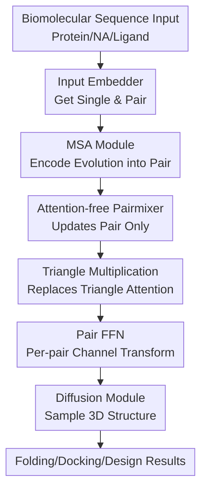

# Triangle Multiplication is All You Need for Biomolecular Structure Representations

**Conference**: ICLR2026  
**OpenReview**: [https://openreview.net/forum?id=CrXcfMLR9q](https://openreview.net/forum?id=CrXcfMLR9q)  
**Code**: https://github.com/genesistherapeutics/pairmixer  
**Area**: Computational Biology / Biomolecular Structure Representation  
**Keywords**: Biomolecular structure prediction, Pairmixer, triangle multiplication, Pairformer, protein design

## TL;DR
This paper proposes Pairmixer: an architectural simplification for AlphaFold3/Boltz-1-style co-folding models that removes expensive triangle attention and sequence updates. By retaining only triangle multiplication and FFNs on the pair representation, the model achieves structure prediction accuracy comparable to Pairformer while significantly reducing computational overhead in training, inference, and protein design.

## Background & Motivation
**Background**: The AlphaFold series has pushed protein structure prediction to high accuracy, with subsequent models like AlphaFold3, Boltz-1, and Chai-1 extending these tasks to complex biomolecular co-folding scenarios involving protein-protein, protein-ligand, antibody-antigen, protein-nucleic acid, and RNA interactions. These models typically encode input sequences, MSAs, templates, or conformations into single and pair representations, iteratively updated by a Pairformer/Evoformer-style backbone before a diffusion module samples 3D atomic coordinates.

**Limitations of Prior Work**: When applying these models to large-scale drug screening, interactome modeling, or de novo binder design, the bottleneck shifts from accuracy to inference time and VRAM usage. Boltz-1 can take over ten minutes to process a 2048-token sequence on an A100, while downstream tasks often require thousands of predictions. The $L \times L$ pair representation and the $O(L^3)$ complexity of triangle primitives in Pairformer cause long sequences and large complexes to hit a computational wall.

**Key Challenge**: Pairformer's strength lies in modeling geometric constraints of residue triplets within the pair representation. However, it employs multiple heavy modules: sequence attention with pair bias, triangle attention, triangle multiplication, and pair FFNs. The core question is whether all these modules are necessary. If triangle attention and sequence updates merely increase complexity without being the primary source of structural representation power, retaining them incurs unnecessary costs for large-scale applications.

**Goal**: The authors aim to identify a smaller, faster backbone that retains core geometric reasoning capabilities for structure prediction. Specifically, it should replace the Pairformer in Boltz-1 without modifying the diffusion module, maintain performance across benchmarks (RCSB, CASP15, ligands, antibodies, nucleic acids), and provide tangible speed and memory benefits in compute-intensive scenarios like binder design.

**Key Insight**: Modern co-folding models already compress evolutionary information into the pair representation $z_{msa}$ via shallow MSA modules, making extensive subsequent sequence updates potentially redundant. Furthermore, while triangle multiplication also has cubic complexity, it can be efficiently implemented via matrix multiplication, proving more cost-effective than triangle attention which requires repeated attention operations over rows and columns. The authors bet that the 2D pair representation itself is the essential medium for structural geometry.

**Core Idea**: Replace the Pairformer with an attention-free backbone that only updates pair representations. Triangle multiplication handles the geometric mixing of residue triplets, while FFNs handle channel transformations for each residue pair, removing the most expensive attention paths while preserving structural representation capacity.

## Method

### Overall Architecture
Pairmixer is positioned within the backbone of a Boltz-1/AlphaFold3-style pipeline. The input sequence passes through an input embedder and MSA module to produce an initial single representation $s_{init}$ and an evolutionary-enriched pair representation $z_{msa}$. Unlike Pairformer, Pairmixer does not update $s_{init}$; it applies multiple layers of triangle multiplication and FFNs solely to $z_{msa}$. Finally, the diffusion module receives the original $s_{init}$ and the updated $z_N$ to sample the all-atom 3D structure.

This framework decouples "structural geometric representation" from "expensive attention mechanisms" by reducing the backbone to a clean pair mixer that retains triplet reasoning while discarding sequence attention and triangle attention.

Each layer of Pairmixer is concise: an incoming triangle multiplication, followed by an outgoing triangle multiplication, and finally a pair FFN, all added via residual connections. Formally, with $z_0 = z_{msa}$, the $l$-th layer executes: $z_l \leftarrow z_l + \mathrm{TriMulIncoming}(z_l)$, $z_l \leftarrow z_l + \mathrm{TriMulOutgoing}(z_l)$, and $z_{l+1} \leftarrow z_l + \mathrm{FFN}(z_l)$. The final $z_N$ serves as the backbone pair feature.

### Key Designs
**1. Attention-free Pairmixer: Concentrating structural reasoning on 2D residue relationships**

While Pairformer maintains both $s$ and $z$, this work argues that the marginal value of subsequent sequence updates is low in AF3-style models because $z_{msa}$ already captures evolutionary coupling, and the diffusion module relies primarily on pair features for distances and interfaces. Pairmixer sets $s_{backbone} = s_{init}$ and concentrates the entire backbone budget on $z$. This aligns with structural intuition: 3D folding is driven by spatial contact and interface alignment between distant residues, which are naturally represented in the token-pair relationships of the 2D tensor.

**2. Triangle multiplication instead of triangle attention: Retaining triplet constraints via efficient mixing**

Both triangle attention and multiplication reason over triplets $(i, j, k)$, but their computation differs. Triangle attention performs attention over a full row of pair features with a bias from the pair representation, requiring $L$ attention operations of length $L$. Pairmixer retains only triangle multiplication, which updates each edge $z_{ij}$ via a matrix-multiplication-style aggregation:

$$
\mathrm{TriMul}(z)_{ij}=\sum_{k=1}^{L}(W_a z_{ik}) \odot (W_b z_{jk}).
$$

This formula implies that updating the relationship between $i$ and $j$ involves traversing all intermediate points $k$ and observing the features of edges $i-k$ and $j-k$. Geometric constraints are propagated via the element-wise product across channels. This maintains triplet-level reasoning without explicit attention weights, utilizing efficient `einsum` or matmul kernels.

**3. Bi-directional Triangle Mixing and Pair FFN: Minimal layer structure for diverse edge relationships**

The pair graph in biomolecular complexes is represented as a directed 2D tensor where $z_{ij}$ and $z_{ji}$ carry distinct information. Pairmixer layers use both incoming and outgoing triangle multiplications to aggregate relationships through third-party tokens $k$ from both row and column perspectives, followed by a non-linear FFN for per-pair refinement. This three-step process alternates between "cross-token geometric mixing" and "internal feature restructuring."

**4. Fixed diffusion module for fair replacement: Attributing gains to the backbone**

Pairmixer is implemented on top of Boltz-1 by replacing the Pairformer backbone and removing triangle attention from the MSA module while keeping the diffusion Transformer decoder unchanged. This ensures that any performance stability is due to the backbone's ability to provide sufficient distance and interface information to the same decoder, validated further by distogram head results showing comparable Top-1/Top-5 accuracy and contact precision.

### Loss & Training
The paper follows the Boltz-1 training schedule and diffusion objectives. Phase 1 trains for 53k iterations on PDB and OpenFold distillation data (384 tokens/3456 atoms). Phase 2 finetunes for 15k iterations on PDB with larger crops (512 tokens/4608 atoms). Inference uses 10 recycling steps and 200 sampling steps. Three configurations (small, medium, large) were tested, with the "large" configuration matching Boltz-1's 48 backbone layers and 24 diffusion layers.

## Key Experimental Results

### Main Results
Pairmixer achieves lDDT scores identical to Pairformer in the Large Phase 2 stage while reducing training costs by approximately 34% (269 vs 421 GPU-days).

| Setting | Architecture | GPU-days | lDDT | DockQ>0.23 | lDDT-PLI | RMSD<2Å |
|------|------|----------|------|------------|----------|---------|
| Small, 68 epoch | Transformer | 86 | 0.68 | 0.51 | 0.47 | 0.43 |
| Small, 68 epoch | Pairformer | 125 | 0.74 | 0.58 | 0.52 | 0.48 |
| Small, 68 epoch | Pairmixer | 98 | 0.73 | 0.59 | 0.51 | 0.45 |
| Large Phase 2 | Pairformer | 421 | 0.78 | 0.64 | 0.57 | 0.54 |
| Large Phase 2 | Pairmixer | 269 | 0.78 | 0.63 | 0.57 | 0.55 |

Inference speedup increases with sequence length. On a GH200, Pairmixer provides a 1.6× speedup for 512 tokens and scales to 4× speedup for 2048 tokens compared to Boltz-1/Pairformer.

| Scenario | Pairformer / Boltz-1 | Pairmixer | Gain |
|------|----------------------|-----------|----------|
| 512 tokens (Default) | 34s | 21s | 1.6× |
| 1024 tokens | - | - | ~2× |
| 2048 tokens | ~1000s | ~250s | ~4× |

### Ablation Study
Ablations show that while triangle attention and multiplication both contribute in short training schedules, the impact of sequence updates is minimal. Performance lost by removing triangle attention is largely recovered through longer training.

| Configuration | GPU-days | lDDT | DockQ>0.23 | lDDT-PLI | RMSD<2Å |
|------|----------|------|------------|----------|---------|
| Pairformer (Small) | 82 | 0.74 | 0.57 | 0.52 | 0.50 |
| No Seq Update | 80 | 0.73 | 0.57 | 0.54 | 0.49 |
| No Tri Att | 66 | 0.70 | 0.55 | 0.50 | 0.48 |
| No Tri Mul | 71 | 0.70 | 0.53 | 0.49 | 0.46 |

### Key Findings
- Pairmixer matches Pairformer across diverse tasks: PoseBusters (protein-ligand), antibody-antigen DockQ, and RNA lDDT.
- Sequence-only Transformers lag significantly behind, with Pairmixer outperforming it in 93.7% of cases for lDDT, highlighting the criticality of pair representations.
- Dropout analysis reveals that triangle multiplication relies on a sparse set of high-norm, often long-range interactions rather than a dense average of all triplets.
- In binder design (BindFast), Pairmixer achieves 2.0x–2.6x speedups and extends the manageable target length from ~500 to ~650 residues.

## Highlights & Insights
- The primary insight is the decoupling of the necessity of 2D representations from the necessity of heavy attention mechanisms. Pairmixer proves that $L \times L$ tensors are essential, but expensive attention over them is not.
- Triangle multiplication acts as a geometric inductive bias specifically suited for 3D structure, mimicking triplet constraints more naturally than generic token mixers.
- The utility is most evident in iterative design loops where structure prediction serves as a scoring function; 2x speedup directly expands the searchable design space.
- The sparse interaction finding suggests potential for future models using dynamic interaction pruning or sparse triangle multiplications.

## Limitations & Future Work
- **Ours** still maintains an $L \times L$ tensor and $O(L^3)$ complexity, meaning it is not a linear-time model and will still face memory bottlenecks for extremely large assemblies.
- Interface metrics (like DockQ) show slight fluctuations, suggesting triangle attention might still hold advantages for specific complex interfaces or flexible regions.
- Future work could explore sparse TriMul or dedicated training curricula to further bridge the gap during early training phases.
- Binder design validation currently relies on in silico metrics; experimental wet-lab verification would be required to confirm biological efficacy.

## Related Work & Insights
- **vs AlphaFold3 / Boltz-1 Pairformer**: Removes sequence updates and triangle attention. Gains efficiency with negligible accuracy loss on most benchmarks.
- **vs SimpleFold / Sequence-only Transformer**: Proves that while simple models exist, discarding pair representations leads to failures in ligand and interface prediction.
- **vs MiniFold**: Extends the idea of triangle multiplication simplification from monomer folding to the full spectrum of biomolecular co-folding.

## Rating
- Novelty: ⭐⭐⭐⭐☆ (Not the invention of TriMul, but a significant empirical proof of its sufficiency).
- Experimental Thoroughness: ⭐⭐⭐⭐⭐ (Broad benchmarks, runtime analysis, and design applications).
- Writing Quality: ⭐⭐⭐⭐☆ (Clear logic and convincing ablations).
- Value: ⭐⭐⭐⭐⭐ (Highly practical for large-scale structure prediction and design).

<!-- RELATED:START -->

## Related Papers

- [\[ICLR 2026\] One Protein Is All You Need](one_protein_is_all_you_need.md)
- [\[ICLR 2026\] BioMD: All-atom Generative Model for Biomolecular Dynamics Simulation](biomd_all-atom_generative_model_for_biomolecular_dynamics_simulation.md)
- [\[ICLR 2026\] Extending Sequence Length is Not All You Need: Effective Integration of Multimodal Signals for Gene Expression Prediction](extending_sequence_length_is_not_all_you_need_effective_integration_of_multimoda.md)
- [\[NeurIPS 2025\] Is Sequence Information All You Need for Bayesian Optimization of Antibodies?](../../NeurIPS2025/computational_biology/is_sequence_information_all_you_need_for_bayesian_optimization_of_antibodies.md)
- [\[ICLR 2026\] Towards All-atom Foundation Models for Biomolecular Binding Affinity Prediction](towards_all-atom_foundation_models_for_biomolecular_binding_affinity_prediction.md)

<!-- RELATED:END -->
