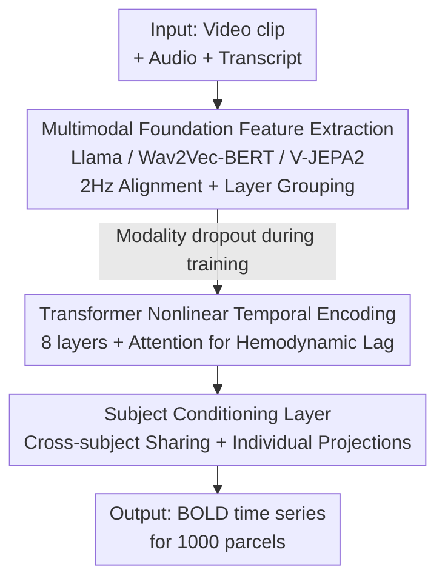

# TRIBE: Trimodal Brain Encoder for Whole-Brain fMRI Response Prediction

**Conference**: ICLR 2026  
**OpenReview**: [https://openreview.net/forum?id=biegtqdqmg](https://openreview.net/forum?id=biegtqdqmg)  
**Code**: https://github.com/facebookresearch/algonauts-2025  
**Area**: Computational Neuroscience / Brain Encoding / Multimodal  
**Keywords**: Brain Encoding, fMRI Response Prediction, Multimodal Fusion, Transformer, Cross-subject Modeling

## TL;DR
TRIBE feeds intermediate layer representations from three pre-trained foundation models (text, audio, and video) into a temporal Transformer to predict fMRI responses of 1000 brain parcels end-to-end. By integrating "nonlinear + cross-subject + multimodal" designs, it won the Algonauts 2025 Brain Encoding Competition with a significant lead among 267 teams.

## Background & Motivation

**Background**: Neuroscience has long progressed through a "divide and conquer" approach—subdividing vision into specialized areas like motion perception in V5 or face recognition in the fusiform gyrus. Brain encoding leverages partial alignment between AI and brain representations to predict brain responses to natural stimuli using neural network activations, with substantial work already done in single modalities like image, speech, and text.

**Limitations of Prior Work**: Existing brain encoding models share three common flaws. First, **linearity**: the mainstream approach uses ridge regression to linearly map AI representations to brain responses, assuming a linear equivalence that likely does not hold. Second, **subject-specificity**: due to large inter-individual differences, existing methods often train separate models for each subject, failing to utilize commonalities across brains. Third, **single modality**: most methods predict responses from a single stimulus modality, failing to capture the brain's integration of multimodal information—even in primary sensory cortices, let alone associative areas.

**Key Challenge**: Real-world movie watching involves the simultaneous influx and dynamic integration of text, sound, and visuals. Current encoding pipelines contradict this fact by remaining "linear, single-subject, and single-modal," resulting in poor performance in associative cortices where multimodal integration is most needed.

**Goal**: Establish an all-brain encoding model that is simultaneously **nonlinear, cross-subject, and multimodal** to predict BOLD time-series responses across all brain parcels while subjects watch videos.

**Key Insight**: Since text, audio, and video each have powerful pre-trained foundation models whose representations are partially aligned with the brain, one should replace linear ridge regression with a Transformer that learns to dynamically fuse trimodal representations over time and share parameters across subjects.

**Core Idea**: Replace the traditional "single-modal features + ridge regression + single-subject model" with a one-stop "trimodal foundation feature extraction + nonlinear temporal Transformer + cross-subject conditioning."

## Method

### Overall Architecture

TRIBE frames brain encoding as a regression task: the input is a video clip with corresponding audio and transcripts; the output is the BOLD signal time series for 1000 cortical parcels (split by the Schaefer atlas) recorded every TR (repetition time 1.49s). The evaluation metric is the Pearson correlation $\rho$ between predicted and actual curves across all TRs, averaged across the 1000 parcels, referred to as the "encoding score."

The pipeline follows three steps: first, three frozen foundation models (Llama-3.2-3B for text, Wav2Vec-BERT-2.0 for audio, V-JEPA 2 for video) extract temporal embeddings at 2Hz; second, these multimodal embeddings, combined with learnable positional encodings, are fed into an 8-layer Transformer encoder to exchange information across time steps and automatically select the relevant time window (corresponding to hemodynamic lag) via attention; finally, a subject conditioning layer maps the Transformer output to the 1000-dimensional parcel space using subject-specific projection matrices. Modality dropout and an ensemble of over a thousand models are used during training to enhance robustness and generalization.

### Key Designs

**1. Multimodal Foundation Feature Extraction: Aligning Heterogeneous Stimuli into Unified Temporal Embeddings**

The first challenge in multimodal brain encoding is aligning text, audio, and video—which differ in frame rates, sample rates, and information granularity—onto a single timeline. TRIBE uses SOTA generative models to extract intermediate representations: for text, each word is fed into Llama-3.2-3B with $k=1024$ prefix words to get contextual embeddings ($D_\text{text}=3072$), which are summed into 2Hz bins; for audio, 60-second chunks are fed into Wav2Vec-BERT-2.0, resampling 50Hz latent representations to 2Hz ($D_\text{audio}=1024$); for video, 64 frames (4 seconds) within each 2Hz bin are fed into V-JEPA 2 gigantic, with spatial averaging of patch tokens to yield a time series ($D_\text{video}=1408$).

To balance deep and shallow information, layers $L_m$ for each modality are divided into $L=2$ groups and averaged within groups to $[L, D_m]$. Experiments found that deeper embeddings encode better in associative cortices, specifically at relative depths of 0.5–0.75 and 0.75–1. These are concatenated, projected to $D=1024$, and LayerNormed to form the $3\times1024$ input sequence per time step for the Transformer.

**2. Transformer Nonlinear Temporal Encoding: Replacing Ridge Regression and Fixed Hemodynamic Kernels**

This is the core of TRIBE's departure from the "linearity assumption." It passes multimodal embeddings through an 8-layer, 8-head Transformer encoder to allow full information exchange between time steps. Adaptive average pooling compresses the sequence length $fT$ to $N$, where each TR corresponds to one embedding. Through grid search, $f=2$ Hz and $N=100$ were found optimal.

The handling of hemodynamic lag is particularly clever. While traditional models use convolution with a hemodynamic response function (HRF), TRIBE offsets the target by 5 seconds relative to the input and **lets the attention mechanism select the most relevant time steps**. Analysis shows attention weights peak at 5–10 seconds relative to the current moment, aligning perfectly with the expected HRF. Ablations show this Transformer is critical; removing it drops the encoding score from 0.31 to 0.23.

**3. Cross-subject Sharing + Subject Conditioning Layer: One Model for All Subjects**

Brain responses to the same stimulus vary by individual. Previously, models were trained per subject, wasting cross-subject commonalities. TRIBE shares the feature extraction and Transformer backbone across all subjects, using a **subject conditioning layer** at the end. This selects a different linear projection for each subject to map outputs to the 1000-dimensional parcel space. Ablations show that removing multi-subject training drops the encoding score from 0.31 to 0.29, validating the gains from cross-subject sharing.

**4. Modality Dropout and Ensemble of 1000 Models: Balancing Robustness and Generalization**

An ideal multimodal encoder should provide reasonable predictions even when a modality is missing (e.g., silent films). TRIBE introduces **modality dropout** during training, randomly zeroing out one or two modality tensors while ensuring at least one remains. For generalization, the authors ensemble $M=1000$ models with different initializations and hyperparameter samples. They calculate validation scores per parcel for each model and use a softmax with temperature 0.3 to derive weighted averages for each parcel.

### Loss & Training
The loss function is the MSE between predicted and actual BOLD signals, with Pearson correlation as the metric. Training uses AdamW with a batch size of 16 for up to 15 epochs, a $10^{-4}$ peak learning rate with cosine decay, and early stopping based on validation Pearson. Stochastic Weight Averaging (SWA) is applied at the end of training. TRIBE has 980M trainable parameters; training takes 24 hours on a single 32GB V100, while feature extraction takes 24 hours on 128 V100s.

## Key Experimental Results

### Main Results

TRIBE ranked 1st among 267 teams in the Algonauts 2025 competition, with a gap between 1st and 2nd place being larger than the gap between 2nd and 5th:

| Rank | Mean score | Subject 1 | Subject 2 | Subject 3 | Subject 5 |
|------|-----------|-----------|-----------|-----------|-----------|
| 1 (Ours) | 0.2146 ± 0.0312 | 0.2381 | 0.2105 | 0.2377 | 0.1720 |
| 2 | 0.2096 ± 0.0283 | 0.2353 | 0.2046 | 0.2268 | 0.1718 |
| 3 | 0.2094 ± 0.0215 | 0.2233 | 0.2072 | 0.2271 | 0.1798 |
| 5 | 0.2055 ± 0.0291 | 0.2306 | 0.2010 | 0.2240 | 0.1662 |

The mean score reflects 0.3195 in-distribution (Friends Season 7) and 0.2146 out-of-distribution (OOD). Robustness was maintained even on extreme OOD stimuli like cartoons (0.1924) and silent films (0.1686). All 1000 parcels significantly outperformed chance ($q_\text{FDR}<10^{-3}$), capturing about half of the explainable variance on average.

### Ablation Study

| Configuration | Validation Pearson | Notes |
|------|-------------------|------|
| Full (A+T+V) | 0.31 | Complete trimodal model |
| Best Bimodal (T+V) | 0.30 | Any bimodal combination significantly outperforms single modal |
| Uni-modal video | 0.25 | Highest among single modalities |
| Uni-modal audio | 0.24 | Middle |
| Uni-modal text | 0.22 | Lowest among single modalities |
| w/o Multi-subject | 0.29 | Per-subject training only, -0.02 |
| w/o Transformer | 0.23 | Removing nonlinear temporal encoding, -0.08 (largest drop) |

### Key Findings
- **Nonlinear Transformer provides the greatest gain**: Removing it causes a drop from 0.31 to 0.23, proving that breaking the linearity assumption is the primary source of improvement.
- **Multimodal benefits concentrate in associative cortices**: Improvements reaching up to 30% were seen in prefrontal and parieto-temporo-occipital areas; however, in primary visual cortex, multimodal models slightly underperformed pure visual models.
- **Modality-brain mapping aligns with neuroscience**: Audio dominates the superior temporal gyrus, video dominates the occipital lobe, and text (semantic) dominates large areas of the parietal and prefrontal lobes.
- **Scaling is not yet saturated**: Encoding scores continue to rise with the number of training sessions; a longer text context consistently improves performance, suggesting the model captures high-level semantics beyond the sentence level.

## Highlights & Insights
- **Replacing fixed HRF kernels with attention**: Instead of manual convolution with an HRF, TRIBE allows the model to learn the temporal relationship. The resulting 5–10s attention peak emerges naturally, providing an interpretable byproduct.
- **Dual-use Modality Dropout**: During training, it acts as a regularizer; during inference, it serves as an analytical tool to probe the contribution of each modality to specific brain regions.
- **Parcel-level Ensemble Weights**: Rather than a simple average, using a softmax-weighted ensemble tailored to each parcel allows different brain regions to select the models they are best suited for.
- **Cross-subject Backbone + Individual Projections**: This "commonalities in backbone, differences in projections" paradigm is highly effective for scarce brain data.

## Limitations & Future Work
- The current work operates on a coarse granularity of 1000 parcels, which may smooth out voxel-level signals. Voxel-level prediction is a key future direction.
- It is limited to fMRI, which lacks fine temporal dynamics; migration to EEG/MEG signals would be valuable.
- Generalization to unseen subjects (zero-shot) remains an open question requiring larger subject pools like HCP.
- The model is deterministic based on sensory input and cannot characterize the complex dynamics of the Default Mode Network in the absence of stimuli.
- Only perception and understanding are covered; cognitive components like behavior, memory, and decision-making are not yet integrated.

## Related Work & Insights
- **vs. Linear Ridge Encoding**: Traditional methods assume linear equivalence between AI and brain representations; TRIBE proves the nonlinearity of the relationship is a major source of gain (-0.08 drop if removed).
- **vs. Single-modal Fine-tuning**: While some works relax the linear assumption, they remain limited to single sensory modalities and miss cross-modal integration.
- **vs. Vision-Language Transformers**: Many previous multimodal Transformers only integrate static images and text. TRIBE combines the strongest specialized foundation models and uses its own Transformer for temporal fusion, avoiding the pitfall of assuming a pre-trained multimodal model's integration style matches the brain's.

## Rating
- Novelty: ⭐⭐⭐⭐ The first comprehensive nonlinear, cross-subject, trimodal whole-brain encoding pipeline.
- Experimental Thoroughness: ⭐⭐⭐⭐⭐ Competition victory, whole-brain significance tests, comprehensive ablations, and scaling law analysis.
- Writing Quality: ⭐⭐⭐⭐⭐ Clear technical reporting with good integration of neuroscience interpretations.
- Value: ⭐⭐⭐⭐⭐ Sets a strong benchmark for integrated brain-cognitive models and in silico neuroscience experiments.

<!-- RELATED:START -->

## Related Papers

- [\[ICLR 2026\] Beyond Grid-Locked Voxels: Neural Response Functions for Continuous Brain Encoding](beyond_grid-locked_voxels_neural_response_functions_for_continuous_brain_encodin.md)
- [\[ICLR 2026\] Learning Brain Representation with Hierarchical Visual Embeddings](learning_brain_representation_with_hierarchical_visual_embeddings.md)
- [\[ICLR 2026\] Riemannian High-Order Pooling for Brain Foundation Models](riemannian_high-order_pooling_for_brain_foundation_models.md)
- [\[ICLR 2026\] The Human Brain as a Dynamic Mixture of Expert Models in Video Understanding](the_human_brain_as_a_dynamic_mixture_of_expert_models_in_video_understanding.md)
- [\[ICLR 2026\] MindPilot: Closed-loop Visual Stimulation Optimization for Brain Modulation with EEG-guided Diffusion](mindpilot_closed-loop_visual_stimulation_optimization_for_brain_modulation_with_.md)

<!-- RELATED:END -->
