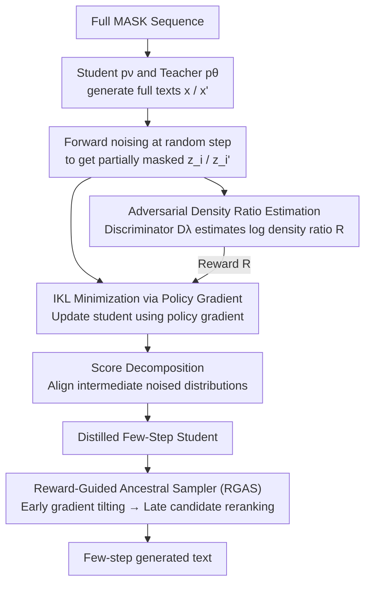

# Ultra-Fast Language Generation via Discrete Diffusion Divergence Instruct

**Conference**: ICLR 2026  
**arXiv**: [2509.25035](https://arxiv.org/abs/2509.25035)  
**Code**: [https://github.com/haoyangzheng-ai/didi-instruct](https://github.com/haoyangzheng-ai/didi-instruct)  
**Area**: LLM Efficiency  
**Keywords**: Discrete Diffusion, Distillation, Masked Diffusion Model, KL Divergence, Few-Step Generation, Policy Gradient

## TL;DR

Proposes DiDi-Instruct, a distillation framework based on Integral KL (IKL) divergence minimization, to distill pre-trained discrete Large Language Models (dLLM) into few-step student models. Through four key designs—Adversarial Density Ratio Estimation, Grouped Reward Normalization, Score Decomposition, and Reward-Guided Ancestral Sampler (RGAS)—it surpasses the PPL of a 1024-step teacher model in just 16 steps on OpenWebText, achieving up to 64× inference speedup with a training cost of only 1 GPU hour.

## Background & Motivation

**Background**: Autoregressive (AR) Large Language Models (GPT series) have achieved great success in NLP tasks but are limited by the serial bottleneck of token-by-token generation. Discrete Diffusion Large Language Models (dLLMs), drawing from image diffusion ideas, redefine text generation as an iterative denoising process, leveraging bidirectional attention for parallel generation as a powerful alternative to AR models.

**Limitations of Prior Work**:
   - **Excessive Inference Steps**: dLLMs require 256 steps on the OpenWebText benchmark to match GPT-2 quality, leaving inference efficiency suboptimal.
   - **Insufficient Distillation Methods**: SDTT (Self-Distillation) fails to match GPT-2 within 32 steps; DUO (Consistency Distillation) requires multiple training rounds and high GPU overhead (20+ GPU hours); DSDD, despite distribution matching, shows limited effectiveness in text generation.
   - **Lack of Theoretical Foundation**: Existing dLLM distillation methods are mostly heuristic and lack a unified, rigorous theoretical framework.
   - **Discrete Space Challenges**: IKL methods used in continuous diffusion models rely on differentiable sampling paths, but the discrete state space of dLLMs (non-differentiable operations like argmax) prevents direct gradient propagation from sampling paths.

**Key Challenge**: How to establish a theoretically grounded and practically efficient/stable distillation framework in discrete token spaces so that few-step student models can match or exceed the generation quality of multi-step teachers?

**Key Insight**: Transfer the Integral KL Divergence (IKL) concept from continuous diffusion to Masked Diffusion Models (MDM). Use policy gradients to bypass discrete non-differentiability and incorporate adversarial training to estimate density ratios as reward signals.

## Method

### Overall Architecture

DiDi-Instruct addresses a straightforward goal: distilling a teacher dLLM $\mathbf{p}_\theta$ (requiring thousands of denoising steps) into a student model $\mathbf{p}_\nu$ with the same architecture that achieves equal quality in few steps. The core idea is to transform "approximating student distribution to teacher distribution" into a reward maximization problem optimizable via policy gradients. Since gradients cannot propagate directly from sampling paths in discrete text space, optimization relies on methods like REINFORCE that do not require differentiable sampling.

During training: The student and teacher generate full sequences starting from full MASK sequences, followed by forward noising at random time steps to obtain partially masked intermediate states $\mathbf{z}_i$ / $\mathbf{z}_i'$. A discriminator distinguishes whether these noised samples come from the student or teacher; its output naturally represents the log density ratio, serving as the reward signal. The student uses this reward for policy gradient updates to align its distribution with the teacher. Score decomposition is applied during updates to align intermediate noised states, preventing entropy collapse. Post-distillation, the RGAS sampler utilizes the same reward signals during inference to further enhance quality.

### Key Designs

**1. IKL Minimization via Policy Gradient: Bypassing Non-differentiable Sampling Paths**

IKL distillation in continuous diffusion requires taking derivatives of the sampling path. In dLLMs, the discrete state space and operations like argmax prevent gradient flow—a primary hurdle when porting Diff-Instruct to text. This is solved via the **Score-Function Identity (Theorem 3.1)**: the gradient of the IKL objective is rewritten as the expectation of the score function, ensuring the gradient only applies to the student's log probability $\log \mathbf{p}_\nu$, completely bypassing the sampling process:

$$\nabla_\nu \mathcal{L}(\nu) = \mathbb{E}_{t,\mathbf{x},\mathbf{z}_t}\left[\frac{\omega(t)}{\pi(t)} \cdot R(\mathbf{z}_t, t) \cdot \nabla_\nu \log \mathbf{p}_\nu(\mathbf{z}_t = \mathbf{m}, t=1)\right]$$

Where the reward $R(\mathbf{z}_t, t) = \log \mathbf{q}_\nu(\mathbf{z}_t, t) - \log \mathbf{q}_\theta(\mathbf{z}_t, t)$ is the log density ratio. This translates distillation into a policy gradient problem where REINFORCE can be used directly. To handle the high variance of policy gradients, Grouped Reward Normalization is employed following the GRPO approach: normalizing rewards within a mini-batch (group of $G$ samples) using $\widetilde{R}_i = (R_i - \mu_g)/(\sigma_g + \epsilon)$, stabilizing the training curve.

**2. Adversarial Density Ratio Estimation: Turning "Uncalculable Ratios" into "Trainable Rewards"**

Policy gradients require $R = \log \mathbf{q}_\nu - \log \mathbf{q}_\theta$, but marginal densities for both student and teacher are not directly calculable. An auxiliary discriminator $D_\lambda$ is trained to distinguish noised samples from both sources using binary cross-entropy:

$$\mathcal{L}_D(\lambda) = -\frac{1}{G}\sum_{i=1}^G \left[\log D_\lambda(\mathbf{z}_i, t_i) + \log(1 - D_\lambda(\mathbf{z}_i', t_i))\right]$$

The logit output of the optimal discriminator equals the log density ratio $\log \frac{\mathbf{q}_\nu}{\mathbf{q}_\theta}$, providing continuous reward signals. The discriminator uses 131M parameters, is initialized from the teacher backbone, and uses spectral normalization for stability.

**3. Score Decomposition: Matching Intermediate Distributions to Prevent Entropy Collapse**

Allowing the student to jump from full MASK to a complete sequence in one step often leads to mode collapse and zero entropy. The solution is to decompose the score function at the intermediate state $\mathbf{z}_i$:

$$\nabla_\nu \log \mathbf{p}_\nu(\mathbf{z}_t=\mathbf{m}, t=1) \approx \nabla_\nu \log \mathcal{P}_\nu(\mathbf{z}_i | \mathbf{z}_t=\mathbf{m}) + \nabla_\nu \log \mathbf{p}_\nu(\mathbf{z}_i, t_i)$$

This forces the student to align not only the final output but also the distribution of intermediate noised states. This is the most critical component—removing it causes PPL to explode from 62 to 33584 (a 500× increase).

**4. Reward-Guided Ancestral Sampler (RGAS): Refining Quality during Inference**

During inference, RGAS policies switch based on denoising progress. In early steps ($t_n \approx 1$), gradient tilting ($h>0, M=1$) uses reward gradients to adjust logits and establish global structure. In later steps ($t_n \approx 0$), multi-candidate reranking ($h=0, M>1$) generates $M$ candidates and uses softmax-weighted sampling based on rewards to refine local details.

### Training Strategy

- **Initialization**: Both student and discriminator are initialized from the pre-trained teacher model.
- **Discriminator Warmup**: The discriminator is trained while freezing student parameters to prevent initial instability.
- **Gradient/Reward Clipping**: Prevents catastrophic updates.
- **Alternating Training**: Discriminator and student are updated sequentially in each step.
- **Efficient Training**: Approximately 10,000 iterations using AdamW (lr=1e-6), completed in ~1 hour on a single H100.
- **Mixed Precision**: Accelerated using bfloat16.

## Key Experimental Results

### Main Results: OpenWebText Generation Quality (PPL↓ / Entropy)

| Method | 8 NFEs | 16 NFEs | 32 NFEs | 64 NFEs | 128 NFEs |
|------|--------|---------|---------|---------|----------|
| GPT-2 (AR) | — | — | — | — | PPL=18.3 |
| MDLM Teacher (1024 steps) | — | — | — | — | PPL=38.5 |
| SDTT | NaN | ~100+ | ~60+ | ~40+ | ~30+ |
| DUO | ~150+ | ~80+ | ~50+ | ~35+ | ~25+ |
| **Ours (DiDi-Instruct)** | **62.2** | **38.2** | **25.0** | **21.9** | **18.4** |

- Surpasses 1024-step teacher PPL in just 16 steps.
- At 128 steps, PPL=18.4, nearly matching GPT-2 (18.3) and achieving a 24%+ reduction over the strongest baseline.
- Minimal entropy loss (~1%), preserving sample diversity.

### Ablation Study (169M Model)

| Configuration | 8 NFEs PPL | 16 NFEs PPL | 32 NFEs PPL | 64 NFEs PPL | 128 NFEs PPL |
|------|-----------|-------------|-------------|-------------|--------------|
| Baseline (No techniques) | 803.9 | 311.5 | 174.8 | 113.1 | 96.6 |
| + Score Decompose | 667.8 | 289.7 | 165.8 | 105.9 | 89.4 |
| + Coupled Time | 101.0 | 75.2 | 48.4 | 35.8 | 30.6 |
| + ω(t) Correction | 95.0 | 75.6 | 31.7 | 25.3 | 21.0 |
| + π(t) Weighting | 92.1 | 44.0 | 32.3 | 26.1 | 21.4 |
| + Regularization | 88.3 | 44.0 | 28.4 | 21.9 | 18.3 |
| + Guided Inference (Full) | **62.2** | **38.2** | **25.0** | **21.9** | **18.4** |

### Key Findings

| Metric | Value |
|------|------|
| Teacher Params | 169M (DiT, 12L/12H/768D) |
| Distillation Time | ~1 H100 GPU Hour |
| Competitor Time | 20+ GPU Hours (SDTT/DUO) |
| Inference Throughput | 2366 tokens/sec |
| Speedup vs. AR | 13.2× (matched PPL) |
| 424M Scale Results | 16-step PPL=32.79 (11.4% better than teacher) |

## Highlights & Insights

1. **Theoretical-Practical Loop**: Establishes a rigorous chain from continuous IKL → score-function identity for MDM → policy gradient → adversarial rewards. Every component is derived from a unified objective rather than being a collection of heuristic tricks.
2. **Extreme Efficiency**: 1 GPU hour vs. 20+ hours for competitors (20× cost reduction). Efficiency stems from single-stage distillation powered by adversarial training.
3. **Few-step Breakthrough**: Surpassing 1024 steps with 16 steps achieves 64× inference acceleration with virtually no quality loss, which is unprecedented in dLLM literature.
4. **Importance of Score Decomposition**: Critical for multi-step distillation; its removal causes massive PPL degradation.
5. **Cross-domain Validation**: Proved effective for protein sequence generation (pLDDT > 70 in 8-32 steps), demonstrating framework generality.
6. **RGAS Design**: The hybrid strategy (early gradient guidance + late reranking) balances global structure and local refinement effectively.

## Limitations & Future Work

1. **Limited Scale**: Experiments covered only 169M and 424M parameters. Memory overhead for maintaining teacher, student, and discriminator simultaneously is the primary scaling bottleneck.
2. **Unconditional Generation Only**: Experiments focused on unconditional text (OpenWebText). Conditional tasks like instruction following or translation remain unexplored.
3. **Adversarial Risks**: Adversarial frameworks can be unstable. While mitigation strategies were used, reliability at larger scales needs verification.
4. **Teacher Ceiling**: The student's performance is ultimately bounded by the underlying dLLM architecture. While it can exceed its teacher, the general gap between dLLMs and AR models remains.
5. **8-Step Artifacts**: Generation at 8 NFEs still shows significant repetition and higher PPL, indicating room for improvement in extreme few-step scenarios.

## Related Work

- **Masked Diffusion Models**: MDLM (Sahoo et al., 2024) and SEDD (Lou et al., 2024).
- **dLLM Acceleration**: SDTT (Deschenaux & Gulcehre 2025), DUO (Sahoo et al. 2025), and DSDD (Zhu et al. 2025).
- **Continuous Diffusion Distillation**: Diff-Instruct (Luo et al., 2023b), the theoretical foundation for this work's IKL framework.
- **Policy Gradient**: REINFORCE and GRPO (Shao et al., 2024).

## Rating

| Dimension | Score (1-10) | Description |
|------|-----------|------|
| Novelty | 8 | First successful transfer of IKL distillation to discrete diffusion using policy gradients. |
| Theoretical Depth | 9 | Rigorous derivation chain and solid proof in the appendix. |
| Experimental Thoroughness | 8 | Comprehensive ablation, scaling analysis, and cross-domain validation. |
| Value | 7 | High efficiency and speedup, though limited to unconditional generation and smaller scales. |
| Writing Quality | 8 | Clear structure and intuitive diagrams. |
| **Total Score** | **8.0** | Solid theoretical contribution with impressive dLLM acceleration results. |

<!-- RELATED:START -->

## Related Papers

- [\[ICLR 2026\] Discrete Diffusion Trajectory Alignment via Stepwise Decomposition](discrete_diffusion_trajectory_alignment_via_stepwise_decomposition.md)
- [\[ICML 2026\] TD3B: Transition-Directed Discrete Diffusion for Allosteric Binder Generation](../../ICML2026/computational_biology/td3b_transition-directed_discrete_diffusion_for_allosteric_binder_generation.md)
- [\[ICLR 2026\] MolEditRL: Structure-Preserving Molecular Editing via Discrete Diffusion and Reinforcement Learning](moleditrl_structure-preserving_molecular_editing_via_discrete_diffusion_and_rein.md)
- [\[ICLR 2026\] ProTDyn: A Foundation Protein Language Model for Thermodynamics and Dynamics Generation](protdyn_a_foundation_protein_language_model_for_thermodynamics_and_dynamics_gene.md)
- [\[ICML 2026\] Plug-and-Play Guidance for Discrete Diffusion Models via Gradient-Informed Logit Correction](../../ICML2026/computational_biology/plug-and-play_guidance_for_discrete_diffusion_models_via_gradient-informed_logit.md)

<!-- RELATED:END -->
