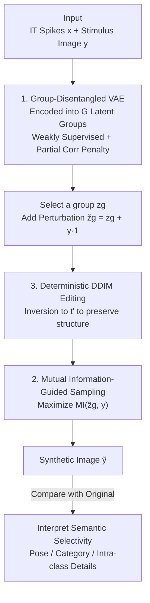

# Uncovering Semantic Selectivity of Latent Groups in Higher Visual Cortex with Mutual Information-Guided Diffusion

**Conference**: ICLR 2026  
**OpenReview**: [https://openreview.net/forum?id=pWX9PUbqPj](https://openreview.net/forum?id=pWX9PUbqPj)  
**Code**: https://github.com/BRAINML-GT/MIG-Vis  
**Area**: Computational Neuroscience / Interpretability / Diffusion Models  
**Keywords**: Higher Visual Cortex, Semantic Selectivity, Group Disentanglement, Mutual Information-Guided Diffusion, IT Cortex

## TL;DR
This paper proposes MIG-Vis: first, a "group-disentangled VAE" encodes macaque IT cortex neural spikes into multiple low-dimensional latent groups; then, "mutual information-guided deterministic DDIM editing" visualizes perturbations of each latent group as image changes, allowing researchers to **directly see** which neural clusters in the higher visual cortex are responsible for pose, category, or intra-class details.

## Background & Motivation
**Background**: "How the higher visual cortex (e.g., primate IT cortex) encodes object-centric visual information" is a core question in computational neuroscience. Mainstream approaches include: 1) "Representation alignment," which proves deep networks trained for object recognition (especially those with disentangled representations) are highly similar to IT cortex activity; 2) "Decoding" methods, which read out semantic attributes like category or viewpoint from neural activity.

**Limitations of Prior Work**: Representation alignment provides **indirect evidence**—it depends on artificial network architectures and specifically designed similarity metrics, telling you it is "similar" without clarifying how information is organized within neural populations. Decoding methods can read out semantics but **do not reveal how these semantics are arranged within the neural population**. Furthermore, individual neurons in the IT cortex naturally exhibit "mixed selectivity": the same neuron may contribute to both low-level pose (rotation) and high-level semantics (category) simultaneously (replicated in Fig. 1 using a macaque passive recognition task). Thus, **neuron-by-neuron analysis cannot cleanly isolate which neurons correspond to specific semantics**.

**Key Challenge**: While the single-neuron level is a messy tangle of mixed selectivity, the population level may contain **structured, semantically meaningful subspaces**. The problem is that existing methods neither extract interpretable neural representations from electrophysiological recordings nor map the organizational structure of neural populations to different visual attributes.

**Goal**: (1) Learn a set of **interpretable neural latent subspaces** from IT cortex spike data; (2) **Visualize** and verify the visual semantics encoded by each subspace.

**Key Insight**: The authors hypothesize that **multiple latent dimensions form a "group," and one group encodes one type of semantic** (e.g., one group for category, another for rotation). Dimensions within a group can further capture different aspects of the same semantic (shape, texture, lighting). To see what a group encodes, one can **perturb that group's latents, generate the corresponding image, and compare it with the original** to see how the semantics change.

**Core Idea**: Use a **group-disentangled VAE** to decompose mixed selectivity into structured latent groups, then use **maximization of "image ↔ perturbed latent" mutual information** to guide diffusion synthesis. This replaces traditional neural-to-image decoders or "activation magnitude/variance maximization" guidance, preventing semantic changes from being averaged into a blurry reconstruction.

## Method

### Overall Architecture
MIG-Vis aims to "see" what semantics are encoded by each group of neural latents. The pipeline consists of two stages: **first learning a structured neural latent space, then translating perturbations of each latent group into visible image changes.**

In the first stage, the input is the "neural spike vector $x \in \mathbb{R}^N$ + corresponding stimulus image $y$" for each trial. A group-disentangled VAE encodes neural activity into $z=[z_1,\dots,z_G]^\top \in \mathbb{R}^D$, partitioned into $G$ equal-dimensional latent groups ($D = G \times d_g$). The first few groups are weakly supervised using the image's rotation angle and category labels, while the remaining groups are self-learned without supervision.

The second stage is "semantic visualization": Original image $y_0$ is first inverted to an intermediate timestep $t'$ using deterministic DDIM (destroying semantics while preserving structural outlines), then denoised back to generate an image. This denoising process is pulled by a **mutual information guidance term**, making the generated image $\tilde{y}$ reflect the perturbed latent group $\tilde{z}_g$. By comparing the difference between $\tilde{y}$ and $y_0$, the semantic selectivity of the $g$-th latent group is revealed. By traversing along different $\gamma$ (perturbation intensities), the semantic dimensions corresponding to that group can be identified.

### Key Designs

**1. Group-Disentangled VAE: Decomposing mixed selectivity into "one group per semantic" subspaces**

Traditional disentangled VAEs ($\beta$-VAE, $\beta$-TCVAE) assume "one semantic factor = one independent latent dimension." However, for high-level attributes like 3D rotation or object category, a single dimension is insufficient. This paper relaxes this assumption using a **group-disentangled VAE**: it encourages statistical independence between multi-dimensional latent groups while allowing dimensions within a group to collaboratively express the same type of semantic. Since pure unsupervised learning rarely yields clean disentanglement, the authors introduce **weak supervision**—concatenating rotation angles and category IDs into a supervision vector $u \in \mathbb{R}^M$ and splitting latents into supervised groups $z^{(s)}$ and unsupervised groups $z^{(u)}$, where $z=[z^{(s)}, z^{(u)}]^\top$.

The training objective is the ELBO, containing four terms: neural reconstruction $\mathbb{E}[\log p_\xi(x|z)]$, weak label supervision $\mathbb{E}[\log p_\xi(u|z^{(s)})]$, a prior regularization KL term, and a **Partial Correlation penalty** $-\beta\, D_{KL}\big(q_\psi(z)\,\|\,\prod_{g=1}^{G} q_\psi(z_g)\big)$. The latter forces the aggregated posteriors of each group to be independent, which is key to "inter-group disentanglement." This allows mixed selectivity to be reorganized at the population level into interpretable structures like "pose groups," "category groups," or "intra-class groups." Table 1 shows that adding supervision and the PC penalty only drops neural reconstruction $R^2$ by about 1–2%, indicating minimal information loss.

**2. Mutual Information Maximization Guidance: Using "the image truly expresses latent information" instead of "the encoder recognizes it"**

To see what a latent group encodes, the simplest way is to train a neural-to-image decoder to map perturbed latents directly to images. However, decoders only learn dominant patterns and may flatten fine-grained changes into a "best reconstruction" where small perturbations show no semantic difference. Another approach in fMRI literature is to guide diffusion by "maximizing the activation magnitude or variance of a target dimension." However, since the latents here are learned, both positive and negative values carry different meaningful semantics; simply amplifying magnitude/variance does not correspond to meaningful semantic changes.

Instead, this paper **maximizes the mutual information (MI) between the synthetic image $y$ and the perturbed latent group $\tilde{z}_g$**. Under the classifier-guided diffusion framework, the conditional score is written as $\nabla_{y_t}\log p_\eta(y_t|z_g) = \nabla_{y_t}\log p_\theta(y_t) + \eta\,\nabla_{y_t}\mathrm{MI}(z_g, y_t)$, where the first term is the unconditional score and the second is MI guidance. Since MI is intractable, the density ratio $p(y|z_g)/p(y)$ is estimated via InfoNCE with a network $s_\phi(z_g, y)$. For an image $y$, the positive sample is the $z_g$ encoded from its corresponding neural signal, while negative samples come from unrelated neural signals. The noise-contrastive loss is:

$$\mathcal{L}_N(\phi) = -\,\mathbb{E}_{p(z_g,y)}\left[\log \frac{\exp\big(s_\phi(z_g^{(1)}, y)\big)}{\sum_{z_g^{(i)}\in Z_g}\exp\big(s_\phi(z_g^{(i)}, y)\big)}\right]$$

Since $\mathrm{MI}(z_g,y) \ge \log(B) - \mathcal{L}_N$, then $\nabla_{y_t}\log p_\phi(z_g|y_t) = -\nabla_{y_t}\mathcal{L}_N \approx \nabla_{y_t}\mathrm{MI}(z_g, y_t)$. Intuitively, likelihood guidance asks "does the encoder recognize this image as having $z_g$?" (unilateral, dependent on the encoder), whereas MI guidance asks "does this image truly express the information within $z_g$?" This is a stronger constraint, especially important for complex non-linear semantics like category, producing smooth and realistic transitions between categories.

**3. Deterministic DDIM Editing: Destroying semantics while preserving structure for clean attribution**

In diffusion, early noise addition mainly perturbs semantic attributes (objects, category identity) while largely preserving structural information (layout, outlines, color schemes). Since this paper focuses on "conceptual semantics encoded by neural latents," it adopts an image-editing approach (SDEdit): **the noise addition process is stopped at an intermediate timestep $t' \in (0,T)$, and reconstruction begins from there** rather than from pure noise. Otherwise, the structure would be regenerated, making it impossible to cleanly attribute changes to neural semantics. Specifically, the process involves two deterministic steps: **deterministic DDIM inversion** of the original $y_0$ to $t'$ (calibrated to erase semantics but keep structure), followed by **deterministic DDIM sampling** with classifier guidance from $t'$ back to 0, using the MI objective. Deterministic DDIM is used to eliminate sampling noise, ensuring that scientific interpretations of image changes are reliably attributed only to latent perturbations. In practice, $T=150$ and $t'=135$.

### Loss & Training
- **VAE Stage**: Optimize the ELBO in Eq. (2), including neural reconstruction + weak label supervision + prior KL + PC penalty (coefficient $\beta$ controls inter-group disentanglement).
- **MI Guidance Stage**: Train the density ratio network $s_\phi$ (a three-layer CNN) using the InfoNCE loss $\mathcal{L}_N$. During sampling, $\hat{y}_0=(y_t-\sqrt{1-\alpha_t}\,\epsilon_\theta)/\sqrt{\alpha_t}$ is estimated at each step and fed into $s_\phi$.
- **Configuration**: VAE encoder/decoder are two-layer MLPs, $D=24$, $G=4$, group dimension $d_g=6$. Group 1 is supervised by 3D rotation, Group 2 by 8-class one-hot IDs, Groups 3/4 are unsupervised. Images use DINO (ViT-B/16) embeddings; diffusion uses U-Net at $128\times128$ resolution.

## Key Experimental Results

Dataset: IT cortex unit spikes from two macaques (M1 / M2) during a passive object recognition task, recording 58 and 110 IT channels respectively. 5760 grayscale images across 8 categories; stimulus presented for 100 ms; neural responses taken from a 70–170 ms window. The paper primarily uses **qualitative visualization of synthetic images**, supplemented by quantitative neural reconstruction comparisons.

### Main Results: Semantic Selectivity of Latent Groups (Qualitative)
Traversing latent groups $\gamma \in \{-10,-5,5,10\}$ using Face, Car, Strawberry, and Table as original images:

| Latent Group | Supervision | Discovered Semantic Role |
|--------------|-------------|-------------------------|
| Group 1 | Rotation Angle | **Pose**: Modulates rotation of faces/cars while identity remains constant (pose-content separation). |
| Group 2 | Category ID | **Cross-category Semantics**: Learned cross-category attributes (e.g., Face → Strawberry) despite only category supervision. |
| Group 3 | Unsupervised | **Intra-class Details**: Mainly modifies appearance for faces/strawberries, little effect on cars. |
| Group 4 | Unsupervised | **Intra-class Details**: Significantly modifies cars/tables, minimal effect on faces. |

Key observation: Groups 3/4 picking specific categories suggests that the neural latent manifold is **locally structured, anisotropic, and curved**—different objects occupy different regions and change along different directions, with intra-class variations organized into their own local tangent directions rather than a globally shared axis.

### Ablation Study
Comparing three baselines focused on "neural guidance" using Face as the original image:

| Method | Group 1 (Pose) | Group 2 (Cross-category) |
|--------|----------------|--------------------------|
| SLT (Decoder Latent Traversal) | Rotation present but noisy | Category unchanged (decoder limitation) |
| AP-CFG (BrainACTIV-style + CFG) | Fair rotation capture | Cross-category change messy |
| Ours w/o MI (Likelihood $\nabla\log p(z_g\|y)$) | Moderate rotation capture | Inconsistent/unrealistic transitions |
| **MIG-Vis (MI Guidance)** | **Cleanest rotation** | **Smooth, realistic cross-category transitions** |

### Key Experimental Results (Quantitative, Table 1, $R^2$%)

| Subject | Method | $R^2$(%) ↑ |
|---------|--------|-----------|
| M1 | Standard VAE | 78.62 (±0.58) |
| M1 | Ours w/o Sup. | 76.90 (±0.53) |
| M1 | Ours w/o PC. | 77.30 (±0.62) |
| M1 | **Ours** | 76.58 (±0.64) |
| M2 | Standard VAE | 83.72 (±0.47) |
| M2 | **Ours** | 81.86 (±0.51) |

### Key Findings
- **MI vs. Likelihood Guidance is the decisive factor**: For low-dimensional semantics like rotation, likelihood guidance (just needing the encoder to recognize it) suffices. However, cross-category semantics are complex and non-linear; the unilateral nature of likelihood is too weak and averages semantics. Only MI's bidirectional constraint ("the image must express the latent information") yields clean transitions.
- **Weak supervision only "rotates" the subspace without hurting reconstruction**: Adding supervision and PC penalty only drops $R^2$ by 1–2%, indicating that reconstruction information is preserved. Supervision merely aligns the latent subspace to an interpretable direction.
- **Different semantics correspond to different geometries**: Group 1 (Pose) is consistent across objects (the same axis always controls rotation, leading to a **torus manifold hypothesis**). Groups 3/4 (Intra-class) are highly curved and anisotropic; the same latent direction modifies gaze in faces but texture/lighting in strawberries—meaning semantics are **locally** interpretable.

## Highlights & Insights
- **Turning "Mixed Selectivity" from a bug into a decomposable structure**: Single-neuron mixed selectivity has long been a hurdle for interpretation. MIG-Vis uses a group-disentangled VAE to rearrange this into "pose/category/intra-class" groups at the population level, moving toward interpretable neural representations directly from spikes.
- **MI Guidance as a correction to fMRI-style "Magnitude Maximization"**: When latents carry meaningful semantics in both positive and negative directions, maximizing magnitude is meaningless. Switching to "Image ↔ Latent MI" captures full statistical dependence, an insight transferable to any bidirectional semantic task.
- **Visualization as a Hypothesis Generator**: By observing rotation consistency across objects, the authors infer a torus manifold hypothesis—MIG-Vis is not just for viewing images but for proposing testable scientific hypotheses about neural subspace geometry.
- **Deterministic DDIM + Partial Inversion for Causal Attribution**: Using a $t'$ cutoff and deterministic sampling eliminates stochastic noise, ensuring that "image change = latent change," which is a necessary level of rigor when using generative models for scientific explanation.

## Limitations & Future Work
- **Qualitative Visualization Focus**: Core evidence relies on human interpretation of synthetic images (rotation, category change), lacking large-scale quantitative metrics for "semantic selectivity."
- **Dependency on Weak Supervision**: The interpretability of Groups 1/2 relies on existing labels. Whether clean disentanglement can emerge purely unsupervised remains an open question (referencing Locatello et al.).
- **Manifold Geometry remains a Hypothesis**: The torus and curved manifold ideas are qualitative inferences; formal characterization of neural subspace geometry is left for future work.
- **Limited Data Scope**: Only two macaques, 8 categories, grayscale images, and passive recognition. Generalization to more complex cortex areas, natural stimuli, or active tasks is unverified.

## Related Work & Insights
- **vs. Representation Alignment**: Alignment shows "DNNs are like the cortex" but is indirect. Ours extracts interpretable latent groups directly from neurons and visualizes them, providing direct evidence of population encoding.
- **vs. Decoding Methods (e.g., Chang & Tsao)**: Decoding reads out semantics but doesn't show how they are organized. MIG-Vis maps organized structures to visual attributes.
- **vs. fMRI + Pre-trained Diffusion (e.g., BrainACTIV)**: Those works use fMRI to manipulate activations via magnitude or CFG to verify regional preference. This work addresses "bidirectional semantics" in spike latents using MI guidance and group disentanglement.

## Rating
- Novelty: ⭐⭐⭐⭐⭐ First to extract interpretable neural latent groups from electrophysiology and visualize them via MI-guided diffusion.
- Experimental Thoroughness: ⭐⭐⭐⭐ Rich visualizations, solid baselines/ablations, though core evidence is qualitative and data scope is narrow.
- Writing Quality: ⭐⭐⭐⭐⭐ Logical flow, clear intuition on MI vs. Likelihood, and insightful discussions on manifold geometry.
- Value: ⭐⭐⭐⭐⭐ Provides a direct, interpretable new tool for understanding the compositional multi-dimensional encoding of the higher visual cortex.

<!-- RELATED:START -->

## Related Papers

- [\[ICLR 2026\] PepTri: Physical, Evolutionary, and Mutual Information Tri-guided All-atom Diffusion Peptide Design](peptri_tri-guided_all-atom_diffusion_for_peptide_design_via_physics_evolution_an.md)
- [\[ICLR 2026\] A tale of two tails: Preferred and anti-preferred natural stimuli in visual cortex](a_tale_of_two_tails_preferred_and_anti-preferred_natural_stimuli_in_visual_corte.md)
- [\[ICLR 2026\] MindPilot: Closed-loop Visual Stimulation Optimization for Brain Modulation with EEG-guided Diffusion](mindpilot_closed-loop_visual_stimulation_optimization_for_brain_modulation_with_.md)
- [\[ICLR 2026\] Model-Guided Microstimulation Steers Primate Visual Behavior](model-guided_microstimulation_steers_primate_visual_behavior.md)
- [\[ICML 2026\] Neural Estimation of Pairwise Mutual Information in Masked Discrete Sequence Models](../../ICML2026/computational_biology/neural_estimation_of_pairwise_mutual_information_in_masked_discrete_sequence_mod.md)

<!-- RELATED:END -->
## Related Papers

- [\[ICLR 2026\] Model-Guided Microstimulation Steers Primate Visual Behavior](model-guided_microstimulation_steers_primate_visual_behavior.md)
- [\[ICLR 2026\] MindPilot: Closed-loop Visual Stimulation Optimization for Brain Modulation with EEG-guided Diffusion](mindpilot_closed-loop_visual_stimulation_optimization_for_brain_modulation_with_.md)
- [\[ICML 2026\] Neural Estimation of Pairwise Mutual Information in Masked Discrete Sequence Models](../../ICML2026/computational_biology/neural_estimation_of_pairwise_mutual_information_in_masked_discrete_sequence_mod.md)
- [\[ICLR 2026\] Clustering by Denoising: Latent Plug-and-Play Diffusion for Single-Cell Embeddings](clustering_by_denoising_latent_plug-and-play_diffusion_for_single-cell_embedding.md)
- [\[ICLR 2026\] Learning Brain Representation with Hierarchical Visual Embeddings](learning_brain_representation_with_hierarchical_visual_embeddings.md)

<!-- RELATED:END -->
